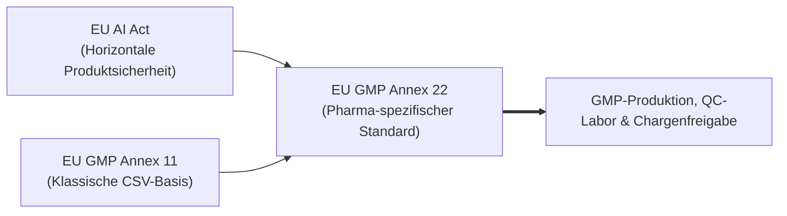
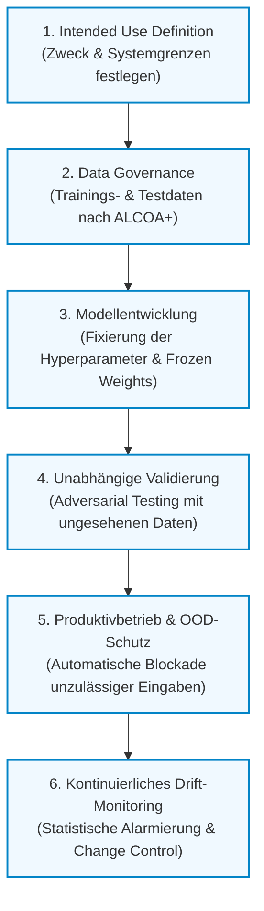

# EU GMP Annex 22: Leitfaden & Gesamtübersicht

> **Executive Summary:**  
> Dieses Dokument dient als zentrale Einführung und thematische Orientierungslandkarte. Es vermittelt das übergeordnete Verständnis für den **Draft EU GMP Annex 22** („Artificial Intelligence and Machine Learning in GxP Environments“) und führt zielgerichtet in die vertiefenden Fachmodule.

---

## 1. Was ist Annex 22 und warum ist er ein Wendepunkt?

Für Jahrzehnte stützte sich die pharmazeutische Industrie bei computergestützten Systemen auf **EU GMP Annex 11** (deterministische Software: *gleicher Input führt immer zum gleichen Output*). Moderne KI- und Machine-Learning-Systeme lernen jedoch emergent aus Daten und können im Betrieb schleichend degradieren (*Silent Drift*).

Mit dem im Juli 2025 von der Europäischen Kommission (EMA / PIC/S) vorgelegten **Draft Annex 22** entsteht der weltweit erste verbindliche regulatorische Rahmen, der den Einsatz von KI in der pharmazeutischen Produktion regelt.

### Die 3 Kernbotschaften:
1. **Annex 22 ersetzt Annex 11 nicht:** Annex 11 bleibt das Fundament (IQ/OQ, physische Kontrollen, Audit Trails). Annex 22 ergänzt spezifische Anforderungen für lernende Algorithmen.
2. **Statisch vor Dynamisch:** Im kritischen GMP-Betrieb sind nur **statische Modelle (eingefrorene Modellgewichte)** zulässig. Sich selbst im laufenden Betrieb weitertrainierende Modelle sind für Freigabeentscheidungen ausgeschlossen.
3. **Mensch vor Maschine (Human-in-the-Loop):** Die finale Verantwortung für Produktqualität und Patientensicherheit verbleibt ausnahmslos beim qualifizierten pharmazeutischen Personal (z.B. Qualified Person).

---

## 2. Die Gesamtprozess-Landkarte (AI Lifecycle)

Der Lebenszyklus eines GxP-konformen KI-Systems gliedert sich in sechs klar definierte Meilensteine:

---

## 3. Die 4 Themensäulen & Modul-Wegweiser

Alle Details, Praxisfälle, mathematischen Fehlermodi und Checklisten sind in den jeweiligen Fachmodulen ausgearbeitet:

### 🏛️ Säule 1: Grundlagen, Einordnung & Scope
*Welche Systeme fallen unter Annex 22 und wie grenzen wir uns sauber ab?*
- **[Modul 01: Introduction to AI in GxP Environments](module_01_introduction_ai_gxp.md)**  
  *Warum klassische CSV versagt, reale Pharma-Fallstudien und die 6 Säulen für Trustworthy AI.*
- **[Modul 02: Overview of Annex 22](module_02_overview_annex_22.md)**  
  *Das Zusammenspiel mit Annex 11, Schutz vor Automation Bias und die 5-stufige Roadmap.*
- **[Modul 03: Scope and Applicability of AI Systems](module_03_scope_applicability.md)**  
  *Der 5-Stufen-Entscheidungstrichter (Decision Funnel), die 4 Risikostufen und das AI-Inventar.*

---

### ⚖️ Säule 2: Risikobasierter Ansatz & Spezifikation
*Wie tief müssen wir validieren und wo ziehen wir die unverrückbaren Grenzen?*
- **[Modul 04: Risk Based Approach to AI](module_04_risk_based_approach.md)**  
  *Proportionalitätsgebot, Silent Degradation, die 5 KI-Fehlermodi und HITL vs. HOTL.*
- **[Modul 05: Intended Use and Model Definition](module_05_intended_use_model_definition.md)**  
  *Das vertragliche Herzstück: Die Zaun-Metapher, Scope Creep und technische Model Lineage.*

---

### 🔬 Säule 3: Daten, Entwicklung & Validierung
*Wie stellen wir sicher, dass das Modell robust und nachvollziehbar arbeitet?*
- **[Modul 06: Data Governance and Data Quality](module_06_data_governance_quality.md)**  
  *ALCOA+ für Trainingsdaten, Data Lineage und strikte Trennung von Testdatensätzen.*
- **[Modul 07: AI Model Development and Training](module_07_model_development_training.md)**  
  *Algorithmenauswahl, Feature Engineering und unveränderliche Modellversionierung.*
- **[Modul 08: Validation and Performance Testing](module_08_validation_performance_testing.md)**  
  *Adversarial Testing, Performance-Metriken (Precision, Recall) und GAMP-Mapping.*
- **[Modul 09: Explainability and Transparency](module_09_explainability_transparency.md)**  
  *Explainable AI (XAI), Vermeidung von Black-Boxes und inspektionsfeste Transparenz.*

---

### 🛡️ Säule 4: Menschliche Aufsicht, Betrieb & Inspektion
*Wie bleibt das System über Jahre hinweg im validierten Zustand?*
- **[Modul 10: Human Oversight / Human in the Loop](module_10_human_oversight_hitl.md)**  
  *Aktives Challenge-Design, Übersteuerungsbefugnis (Override) und Qualifikation von Personal & QP.*
- **[Modul 11: Lifecycle Management and Continuous Monitoring](module_11_lifecycle_continuous_monitoring.md)**  
  *Früherkennung von Data- & Concept-Drift, Alarmschwellen und kontrolliertes Retraining.*
- **[Modul 12: Audit and Inspection Readiness](module_12_audit_inspection_readiness.md)**  
  *Inspektionssimulationen, Verteidigung vor Behörden (EMA/FDA) und typische Rote Flaggen.*

---

## 4. Die goldenen Regeln für die Praxis (Executive Rules)

| # | Grundsatz | Konkrete Bedeutung für das Projekt |
| :-: | :--- | :--- |
| **1** | **Keine Black-Box ohne Zaun** | Jedes KI-System benötigt vor Beginn eine genehmigte *Intended Use Specification* mit festen Out-of-Scope-Bedingungen. |
| **2** | **Kein stummes Weiterlernen** | Nur statische Modelle mit *Frozen Weights* dürfen für kritische GMP-Entscheidungen herangezogen werden. |
| **3** | **Daten wie Rohstoffe behandeln** | Trainingsdaten unterliegen denselben ALCOA+-Standards wie pharmazeutische Wirkstoffe. |
| **4** | **Echtes Hinterfragen (Active Challenge)** | Menschliche Prüfer müssen unabhängig einstufen können, um unkritisches Abnicken (*Automation Bias*) auszuschließen. |
| **5** | **Instrumentierung gegen Silent Drift** | Ein KI-System muss ab Tag 1 über ein statistisches Monitoring verfügen, das Leistungsabfälle sofort meldet. |
