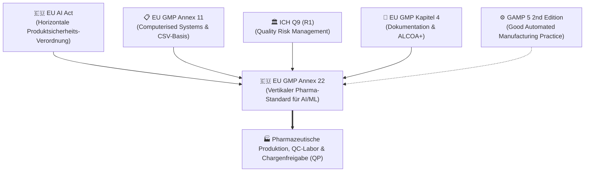
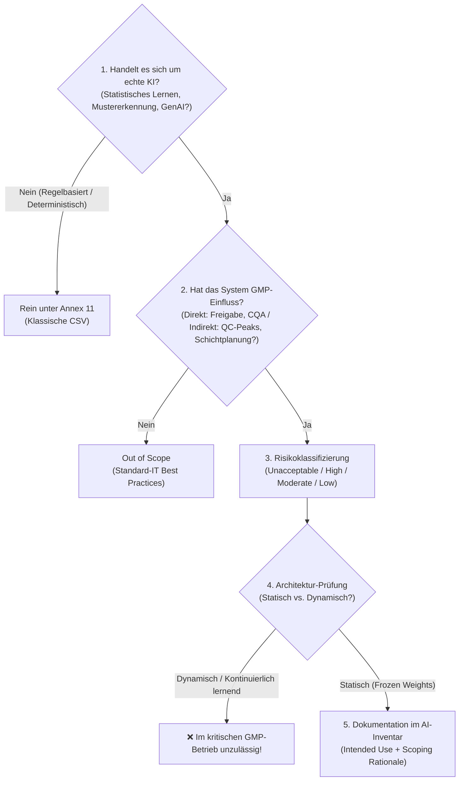
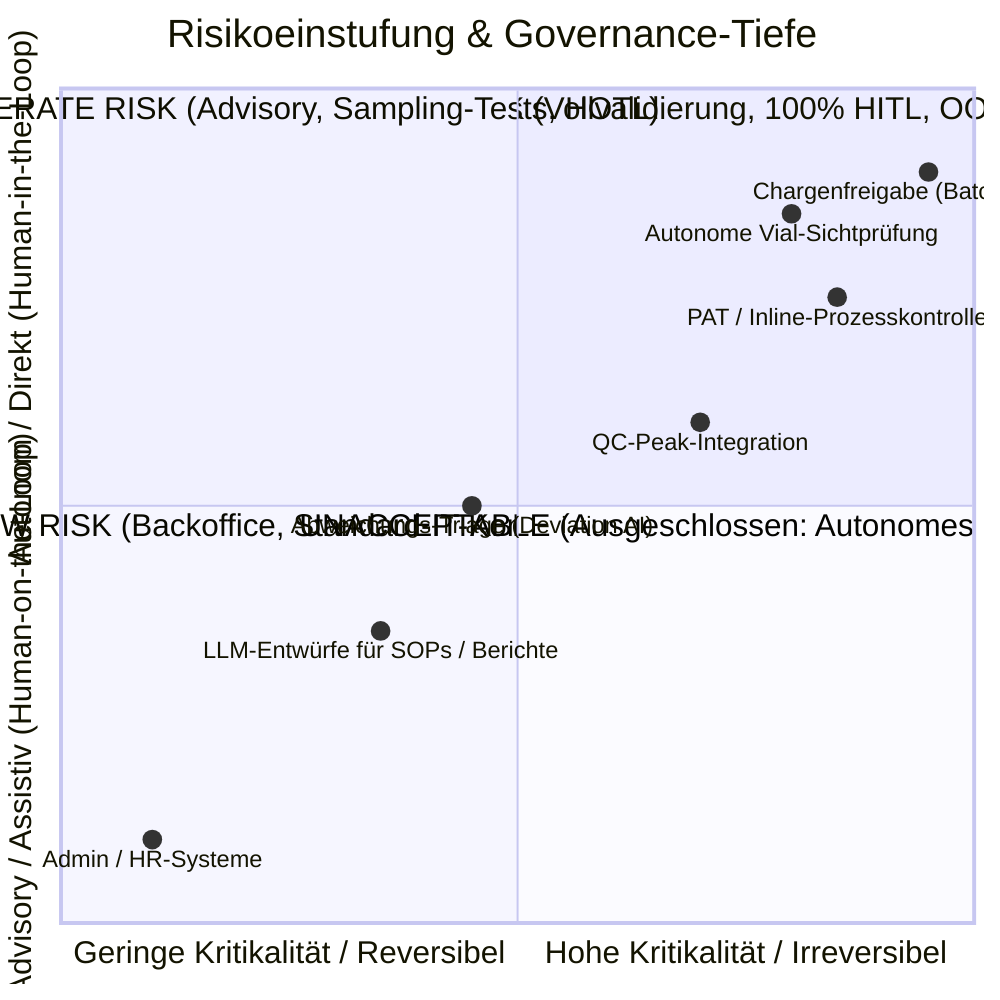
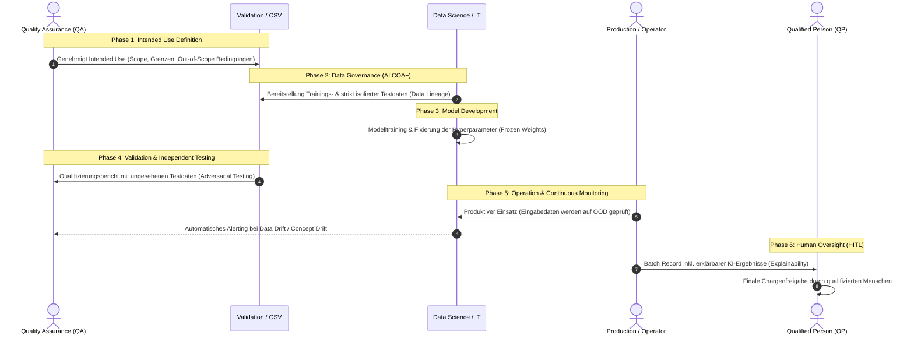
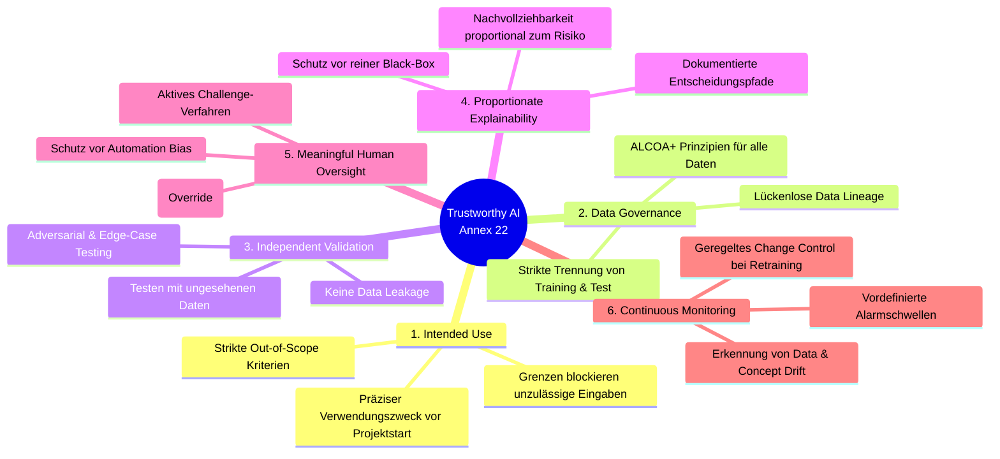
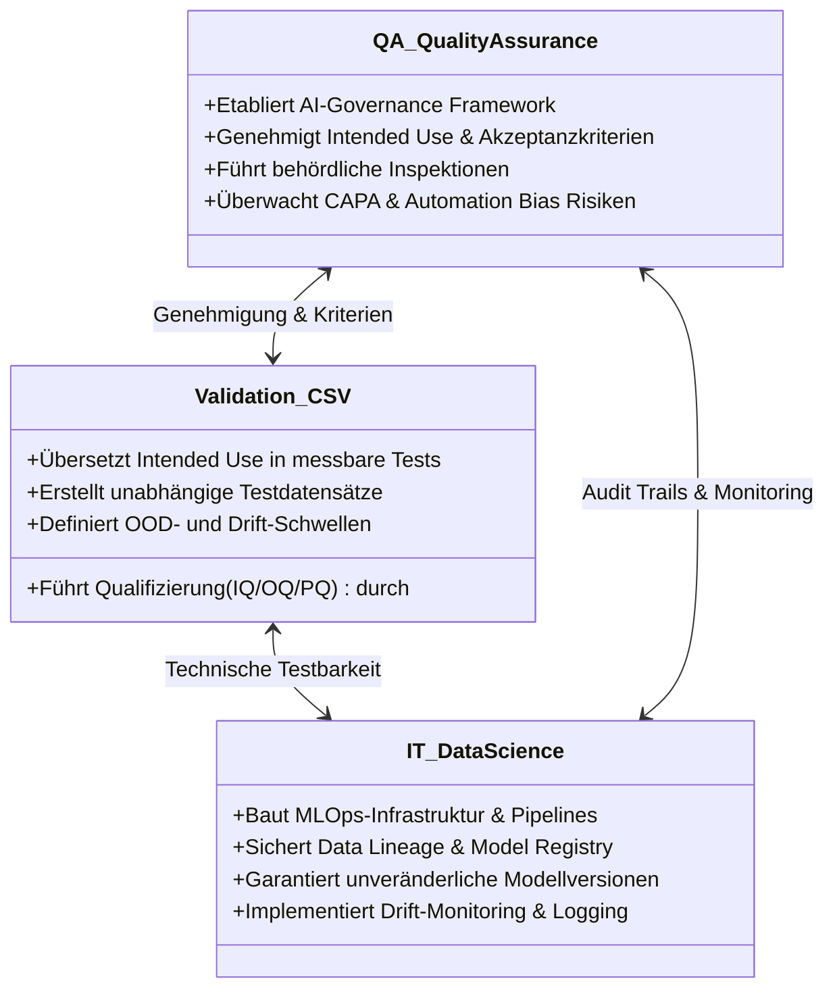

# Master-Übersicht & Regulatorisches Framework: EU GMP Annex 22

> **Dokumentstatus:** Zentrale Wissens- und Referenzlandkarte für das gesamte Annex 22 Lernprojekt.  
> **Geltungsbereich:** Artificial Intelligence (AI) and Machine Learning (ML) in GxP/pharmazeutischen Umgebungen (Draft Juli 2025, European Commission / EMA / PIC/S).

---

## 🧭 Schnellzugriff & Modul-Navigation

| Grundlagen & Scope | Risikomanagement & Spezifikation | Daten, Modell & Validierung | Überwachung & Audits |
| :--- | :--- | :--- | :--- |
| • [Modul 01: Intro to AI in GxP](module_01_introduction_ai_gxp.md) • [Modul 02: Overview Annex 22](module_02_overview_annex_22.md) • [Modul 03: Scope & Applicability](module_03_scope_applicability.md) | • [Modul 04: Risk-Based Approach](module_04_risk_based_approach.md) • [Modul 05: Intended Use & Model Def](module_05_intended_use_model_definition.md) | • [Modul 06: Data Governance](module_06_data_governance_quality.md) • [Modul 07: Model Development](module_07_model_development_training.md) • [Modul 08: Validation & Testing](module_08_validation_performance_testing.md) • [Modul 09: Explainability](module_09_explainability_transparency.md) | • [Modul 10: Human Oversight (HITL)](module_10_human_oversight_hitl.md) • [Modul 11: Continuous Monitoring](module_11_lifecycle_continuous_monitoring.md) • [Modul 12: Audit Readiness](module_12_audit_inspection_readiness.md) |

---

## 1. Einordnung in das regulatorische Gefüge

Annex 22 existiert nicht isoliert, sondern schlägt die Brücke zwischen horizontalem EU-Recht und den spezifischen pharmazeutischen Qualitätsstandards. Details zu den Grundlagen findest du in **[Modul 01](module_01_introduction_ai_gxp.md)** und **[Modul 02](module_02_overview_annex_22.md)**.

### Die Rollenteilung der Regularien
| Regelwerk | Regelungsbereich | Rolle im Verhältnis zu Annex 22 |
| :--- | :--- | :--- |
| **EU AI Act** | Gesamtwirtschaftlich (horizontal), risikobasiert (Minimal, Hochrisiko, Verboten). | Übergeordneter Rechtsrahmen für KI-Sicherheit, Grundrechte und Transparenz. |
| **EU GMP Annex 11** | Alle computergestützten Systeme (CSV). | **Fundament bleibt bestehen:** IQ/OQ, physische Zugriffskontrolle, Audit Trails, klassische Infrastruktur. |
| **EU GMP Annex 22** | Spezifisch für lernende Algorithmen (statistische Modelle, neuronale Netze, GenAI). | **Zusatzanforderungen:** Modell-Lebenszyklus, drift-monitoring, Intended Use Grenzen, Daten-Governance. |
| **ICH Q9 (R1)** | Qualitätsrisikomanagement. | Methodik für die risikoproportionale Validierung (FMEA mit KI-Fehlermodi). |

---

## 2. Der 5-Stufen-Entscheidungstrichter (*Decision Funnel*)
*Ausführliche Details, Fallstricke und Praxisfälle siehe ➔ **[Modul 03: Scope and Applicability of AI Systems](module_03_scope_applicability.md)**.*

Bevor ein System entwickelt oder validiert wird, muss es den standardisierten Scoping-Filter durchlaufen:

---

## 3. Die 4-stufige Risikomatrix nach Annex 22
*Ausführliche Details zur FMEA-Methodik und den 5 KI-Fehlermodi siehe ➔ **[Modul 04: Risk Based Approach to AI](module_04_risk_based_approach.md)**.*

Annex 22 erzwingt ein striktes **Proportionalitätsgebot** (*Proportionality Mandate*): Die Tiefe von Validierung, Überwachung und Kontrolle skaliert linear mit dem Risiko.

### Die Risikostufen im Detail
1. **Unacceptable Risk (Nicht zulässig):**
   - Autonom online-lernende Modelle, die operative GMP-Entscheidungen ohne feste Validierungsbasis fällen.
2. **High Risk (Volle Validierung + 100% HITL):**
   - Direkte Steuerung von Critical Quality Attributes (CQA), Critical Process Parameters (CPP), In-Line-PAT oder autonome Gut/Schlecht-Aussortierung.
   - *Anforderung:* Tiefgehende Adversarial-Tests, Randfall-Prüfungen, Echtzeit-Drift-Monitoring, zwingende Out-of-Distribution (OOD) Erkennung.
3. **Moderate Risk (Entscheidungsunterstützung / Advisory):**
   - Systeme zur Vorab-Klassifikation oder Priorisierung (z.B. Abweichungstriage), deren Ergebnisse vor Wirksamkeit von geschultem Personal freigegeben werden.
   - *Anforderung:* Validierung mit repräsentativen Datensätzen, periodisches Monitoring, Maßnahmen gegen *Automation Bias*.
4. **Low Risk (Assistiv / Backoffice):**
   - Reine Textunterstützung, Zusammenfassungen, nicht-GMP-relevante administrative Planungen.

---

## 4. Der End-to-End AI Lifecycle unter Annex 22

Der Lebenszyklus eines KI-Systems umfasst 6 Phasen, die alle lückenlos dokumentiert und qualifiziert sein müssen:

---

## 5. Die 6 Grundprinzipien für „Trustworthy AI“

---

## 6. Die 5 KI-spezifischen Fehlermodi (FMEA-Erweiterung)

Klassische IT-Fehlerkriterien greifen bei KI zu kurz, da Modelle **nicht mit Fehlermeldung abstürzen, sondern still degradieren (*Silent Degradation*)**:

1. **Systematic Bias:** Die Trainingsdaten spiegeln seltene Realzustände nicht wider; die KI entscheidet reproduzierbar fehlerhaft bei Randgruppen/Extremen.
2. **Distribution Shift:** Der reale Produktionsprozess verändert sich schleichend gegenüber dem historischen Trainingszeitraum (*Data Drift*).
3. **Adversarial / Edge Inputs:** Ungewöhnliche Kombinationen von Messwerten überfordern die Modelllogik.
4. **Confidence Miscalibration:** Die KI liefert eine falsche Prognose, weist dieser aber intern eine extrem hohe Wahrscheinlichkeit (z.B. 99,8%) zu.
5. **Spurious Correlations:** Scheinzusammenhänge in den Daten (z.B. Beleuchtungswechsel oder Bediener-Kürzel) werden fälschlich als kausale Steuergröße gelernt.

---

## 7. Rollenverteilung: Das „Three-Legged Stool“-Modell

---

## 8. Inspektions-Readiness & Rote Flaggen für Auditoren

### 🚩 Typische „Red Flags“ bei Inspektionen
* **Vage Intended Use Aussagen:** Formulierungen wie *„unterstützt Qualitätsentscheidungen“* laden Auditoren zum tiefen Nachbohren ein.
* **Flache Governance (*Compliance Theater*):** Alle KI-Systeme mit denselben Standard-IT-Formularen ohne Beachtung von Drift oder Bias behandelt.
* **Informeller *Scope Creep*:** Anwender nutzen das System an der Linie für Produkte oder Packmittel, die nie validiert wurden.
* **Passives Abnicken (*Perfunctory Review*):** Reviewer bestätigen KI-Vorschläge in Sekunden ohne nachweisbare inhaltliche Auseinandersetzung.
* **SaaS-Blackbox ohne Kontrolle:** Einbindung von Cloud-KI, deren Vendor-Updates nicht per Change Control gesteuert werden.

### 🛡️ Robuste Audit-Verteidigung (*Audit Defensibility*)
* Lückenlos gepflegtes, lebendes **AI-Inventar** mit Scoping-Begründungen.
* Nachweis harter technischer Barrieren (**Out-of-Distribution Detection**), die unzulässige Eingaben an der Linie stoppen.
* Nachweis aktiver **manueller Notfallübungen (*Fallback Drills*)**, um Operator-Kompetenzen aufrechtzuerhalten.
