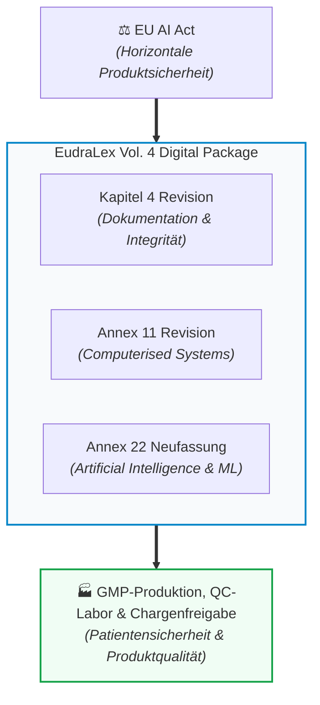
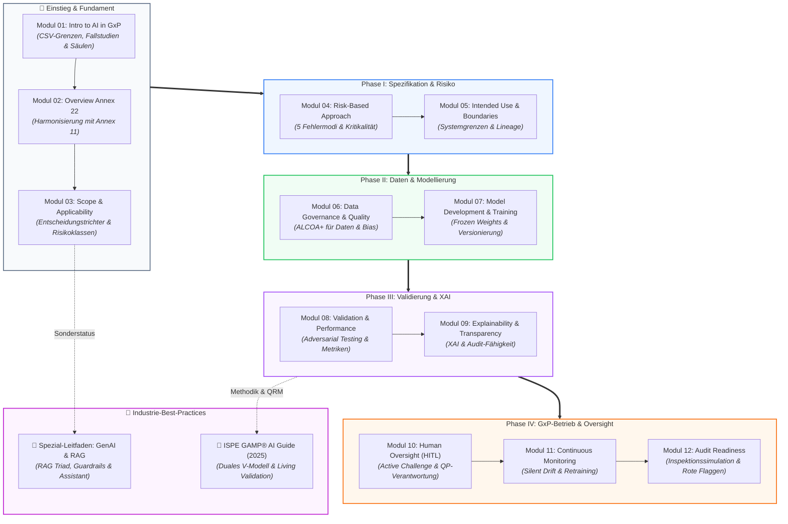

# EU GMP Annex 22: Leitfaden & Gesamtübersicht

🌐 **[Switch to English Version](../en/00_overview.md)**

> **Executive Summary:**  
> Dieses Dokument dient als zentrale Einführung und thematische Orientierungslandkarte. Es vermittelt das übergeordnete Verständnis für den **Draft EU GMP Annex 22** („Artificial Intelligence and Machine Learning in GxP Environments“) und führt zielgerichtet in die vertiefenden Fachmodule.

---

## 1. Was ist Annex 22 und warum ist er ein Wendepunkt?

Für Jahrzehnte stützte sich die pharmazeutische Industrie bei computergestützten Systemen auf **EU GMP Annex 11** (deterministische Software: *gleicher Input führt immer zum gleichen Output*). Moderne KI- und Machine-Learning-Systeme lernen jedoch emergent aus Daten und können im Betrieb schleichend degradieren (*Silent Drift*).

Mit dem im Juli 2025 von der Europäischen Kommission (EMA / PIC/S) vorgelegten **Draft Annex 22** entsteht der weltweit erste spezifische regulatorische Rahmen für den Einsatz von KI in der pharmazeutischen Produktion.

### Rechtlicher Status & Verbindlichkeit:
* **Aktueller Status (Stand 2026):** Der Annex 22 ist derzeit ein **Draft (Konsultationsentwurf)** der Europäischen Kommission / EMA und PIC/S. Die öffentliche Konsultationsphase endete am **7. Oktober 2025**. Auf dem anschließenden *EMA Multi-Stakeholder Workshop* (30. Juni / 1. Juli 2026) wurden Rückmeldungen und Weiterentwicklungen erörtert; eine Neubewertung einzelner Restriktionen (z. B. GenAI-Ausschluss) ist Gegenstand laufender Prüfungen durch die Inspektorengruppen, ein förmlicher Änderungsbeschluss liegt jedoch noch nicht vor. Die finale Veröffentlichung wird für **Ende 2026 / Anfang 2027** erwartet.
* **Faktische Relevanz in der Praxis ([Auslegung]):** Obwohl formell noch im Entwurfsstadium (Konsultationsentwurf), wird in der Industrie- und Inspektionspraxis erwartet, dass sich Audits und Validierungsstrategien bereits heute an den im Draft formulierten Grundprinzipien als maßgeblichem Stand von Wissenschaft und Technik (*State of the Art*) orientieren.
* **Das EudraLex Digital Package:** Annex 22 steht nicht isoliert, sondern bildet zusammen mit der Revision von **Annex 11** (Computerised Systems) und **Kapitel 4** (Dokumentation) das modernisierte regulatorische Digitalpaket der europäischen Arzneimittelproduktion.

### Die 3 Kernbotschaften:
1. **Annex 22 ergänzt Annex 11 ([Draft §1]):** Der Draft versteht sich explizit als ergänzende Leitlinie (*additional guidance*) zu EU GMP Annex 11 (Computerised Systems). Annex 11 bleibt das Fundament (IQ/OQ, physische Kontrollen, Audit Trails, Cloud-Sicherheit). Annex 22 regelt die spezifischen Anforderungen lernender Algorithmen.
2. **Geltungsbereich: Statische Modelle und deterministischer Output ([Draft §1]):** Der Draft gilt ausschließlich für statische Modelle und Modelle mit deterministischem Output in kritischen GMP-Prozessen. Dynamische Modelle (kontinuierliches Online-Retraining) und Modelle mit probabilistischem Output werden vom Draft nicht abgedeckt und sollen in kritischen GMP-Anwendungen nicht verwendet werden (*„should not be used“*).
3. **Gesamtverantwortung & Human Oversight ([Draft §2.2, §3.3, §10.5]):** Der regulierte pharmazeutische Unternehmer muss Dokumentationen für Tätigkeiten externer Dienstleister und Lieferanten anfordern und prüfen ([Draft §2.2]); die arzneimittelrechtliche Gesamtverantwortung für Produktqualität, Patientensicherheit und Datenintegrität verbleibt stets beim Hersteller. Menschliche Aufsicht ist verbindlich geregelt, insbesondere wenn Testaufwände durch Modellassistenz reduziert wurden ([Draft §3.3, §10.5]).

### 🏷️ Kennzeichnungskonvention im Projekt (Attribution & Evidenzstufen)
Zur eindeutigen Trennung zwischen behördlichen Vorgaben und Industriepraxis gilt in allen Modulen:
* **`[Draft §X.Y]`**: Konkrete regulatorische Anforderung oder Aussage aus dem offiziellen Konsultationsentwurf EU GMP Annex 22 (Juli 2025) mit exakter Fundstelle.
* **`[Best Practice: Quelle]`**: Anerkannte Methoden und Industriestandards mit benannter Quelle (z. B. `[Best Practice: ISPE GAMP AI Guide]`, `[Best Practice: ICH Q9 (R1)]` oder `[Best Practice: ML-Praxis]`).
* **`[Didaktik]`**: Didaktische Modelle, Strukturierungshilfen, Analogien (z. B. „Zaun-Metapher“) und illustrative Fallbeispiele dieses Lernprojekts.
* **`[Auslegung]`**: Fachliche Interpretation und regulatorische Einordnung abgeleiteter Sachverhalte.

---

## 2. Gesamtprozess-Landkarte & Modul-Wegweiser

Die folgende Landkarte verbindet das regulatorische Fundament direkt mit den operativen Phasen des AI/ML Lifecycles und dient als zentraler Navigator durch alle 12 Fachmodule:

---

### Direkte Navigation durch die Lifecycle-Phasen

#### 🧭 Einstieg & Regulatorisches Fundament
*Welche Systeme fallen unter Annex 22 und wie grenzen wir uns sauber ab?*
- **[Modul 01: Introduction to AI in GxP Environments](module_01_introduction_ai_gxp.md)**  
  *Warum klassische CSV für KI versagt, reale Pharma-Fallstudien und die 6 Säulen für Trustworthy AI.*
- **[Modul 02: Overview of Annex 22](module_02_overview_annex_22.md)**  
  *Das Zusammenspiel mit Annex 11, Schutz vor Automation Bias und die 5-stufige Umsetzungs-Roadmap.*
- **[Modul 03: Scope and Applicability of AI Systems](module_03_scope_applicability.md)**  
  *Der 5-Stufen-Entscheidungstrichter (Decision Funnel), die 4 Risikostufen und das verbindliche AI-Inventar.*

#### ⚖️ Phase I: Spezifikation & Risikobewertung
*Wie tief müssen wir validieren und wo ziehen wir die unverrückbaren Systemgrenzen?*
- **[Modul 04: Risk Based Approach to AI](module_04_risk_based_approach.md)**  
  *Proportionalitätsgebot, Silent Degradation, die 5 KI-spezifischen Fehlermodi und HITL vs. HOTL.*
- **[Modul 05: Intended Use and Model Definition](module_05_intended_use_model_definition.md)**  
  *Das vertragliche Herzstück: Die Zaun-Metapher, Scope Creep und technische Model Lineage.*

#### 🔬 Phase II: Daten-Governance & Modellentwicklung
*Wie stellen wir sicher, dass Daten und Algorithmus von Grund auf GxP-konform sind?*
- **[Modul 06: Data Governance and Data Quality](module_06_data_governance_quality.md)**  
  *ALCOA+ für Trainingsdaten, Data Lineage und strikte Trennung von Testdatensätzen (Split-Integrität).*
- **[Modul 07: AI Model Development and Training](module_07_model_development_training.md)**  
  *Algorithmenauswahl, Feature Engineering, Cloud-Oversight und unveränderliche Modellversionierung (Frozen Weights).*

#### 🧪 Phase III: Validierung & Erklärbarkeit
*Wie beweisen wir Robustheit gegen unerwartete Eingaben und machen Entscheidungen transparent?*
- **[Modul 08: Validation and Performance Testing](module_08_validation_performance_testing.md)**  
  *Adversarial Testing, Performance-Metriken (Metric Quad), personelle Unabhängigkeit (Staff Independence) und GAMP-Mapping.*
- **[Modul 09: Explainability and Transparency](module_09_explainability_transparency.md)**  
  *Explainable AI (XAI), Vermeidung von Black-Boxes und inspektionsfeste Transparenz für Auditoren.*

#### 🛡️ Phase IV: GxP-Betrieb, Human Oversight & Überwachung
*Wie bleibt das System über Jahre hinweg im validierten Zustand und inspections-ready?*
- **[Modul 10: Human Oversight / Human in the Loop](module_10_human_oversight_hitl.md)**  
  *Aktives Challenge-Design, Übersteuerungsbefugnis (Override) und Qualifikation von Personal & QP.*
- **[Modul 11: Lifecycle Management and Continuous Monitoring](module_11_lifecycle_continuous_monitoring.md)**  
  *Früherkennung von Data- & Concept-Drift, Alarmschwellen und kontrolliertes Retraining via Change Control.*
- **[Modul 12: Audit and Inspection Readiness](module_12_audit_inspection_readiness.md)**  
  *Inspektionssimulationen, Verteidigung vor Behörden (EMA/FDA) und typische Rote Flaggen.*

#### 📖 Spezial-Dossiers & Etablierte Industrie-Standards (Anhänge)
*Vertiefende Best Practices für moderne Automatisierungen und Lebenszyklus-Methodik:*
- 🤖 **[Leitfaden: Generative KI (GenAI), LLMs & RAG im GxP-Umfeld](appendix_genai_rag_gxp.md)**  
  *Sonderstatus unter Annex 22, RAG-Architektur, ALCOA+-Zitierpflicht, das Metrik-Trio der „RAG Triad“ (Groundedness, Context Relevance, Answer Relevance), Prompt Governance als Code und deterministische Guardrails.*
- 📘 **[Leitfaden: ISPE GAMP® AI Guide & Etablierte Industrie-Best-Practices](appendix_ispe_gamp_ai_best_practices.md)**  
  *Das duale Lebenszyklus-Modell (Software- vs. Daten-Zyklus), GAMP-Kategorisierung für KI (Cat 1 bis Cat 5), Quality Risk Management nach ICH Q9 (R1), Cloud/Supplier Oversight und Living Validation.*

---

## 3. Die goldenen Regeln für die Praxis (Executive Rules)

| # | Grundsatz | Konkrete Bedeutung für das Projekt |
| :-: | :--- | :--- |
| **1** | **Keine Black-Box ohne Zaun** | Jedes KI-System benötigt vor Beginn eine genehmigte *Intended Use Specification* mit festen Out-of-Scope-Bedingungen. |
| **2** | **Kein unkontrolliertes Weiterlernen ([Draft §1])** | Dynamische Modelle (Online-Lernen) und probabilistische Ausgaben sollen in kritischen GMP-Anwendungen nicht verwendet werden; für kritische Prozesse gelten nur statische Modelle mit Frozen Weights ([Draft §1]). |
| **3** | **Daten wie Rohstoffe behandeln** | Trainingsdaten unterliegen denselben ALCOA+-Standards wie pharmazeutische Wirkstoffe. |
| **4** | **Echtes Hinterfragen (Active Challenge)** | Menschliche Prüfer müssen unabhängig einstufen können, um unkritisches Abnicken (*Automation Bias*) auszuschließen. |
| **5** | **Instrumentierung gegen Silent Drift** | Ein KI-System muss ab Tag 1 über ein statistisches Monitoring verfügen, das Leistungsabfälle sofort meldet. |

---

## 4. Spezial-Leitfäden & Industrie-Best-Practices (Anhänge)

Zur Schließung spezifischer technischer Lücken und für moderne Automatisierungsarchitekturen stehen zwei vertiefende Spezial-Dossiers bereit:

* 🤖 **[Leitfaden: Generative KI (GenAI), LLMs & RAG im GxP-Umfeld](appendix_genai_rag_gxp.md)**  
  *Sonderstatus unter Annex 22, RAG-Architektur, ALCOA+-Zitierpflicht, das Metrik-Trio der „RAG Triad“ (Groundedness, Context Relevance, Answer Relevance), Prompt Governance als Code und deterministische Guardrails.*
* 📘 **[Leitfaden: ISPE GAMP® AI Guide & Etablierte Industrie-Best-Practices](appendix_ispe_gamp_ai_best_practices.md)**  
  *Das duale Lebenszyklus-Modell (Software- vs. Daten-Zyklus), GAMP-Kategorisierung für KI (Cat 1 bis Cat 5), Quality Risk Management nach ICH Q9 (R1), Lieferanten- & Cloud-Oversight sowie das Konzept der „Living Validation“.*

---

## 5. Zentrales Quellen- & Referenzverzeichnis (Primary Regulatory Sources)

Dieses Lernrepositorium stützt sich auf folgende Primärquellen und Referenzwerke (Stand / Abrufdatum: 28. September 2026):

| Ref | Herausgeber / Dokument | Relevanz & Fundstelle | Abrufdatum |
| :---: | :--- | :--- | :---: |
| **Q1** | **Europäische Kommission / EMA / PIC/S:** [Annex 22: Artificial Intelligence (consultation draft)](https://health.ec.europa.eu/document/download/5f38a92d-bb8e-4264-8898-ea076e926db6_en?filename=mp_vol4_chap4_annex22_consultation_guideline_en.pdf) | **Verbindliche Primärquelle:** Offizieller Konsultationsentwurf (6 Seiten; Konsultationsfrist endete am 7. Oktober 2025). | 2026-09-28 |
| **Q2** | **European Medicines Agency (EMA):** [GMP Multi-Stakeholder Workshop on AI Guidance Development (Annex 22)](https://www.ema.europa.eu/en/events/good-manufacturing-practice-multistakeholder-workshop-expert-contributions-artificial-intelligence-guidance-development-annex-22) | **Fachdialog (30. Juni / 1. Juli 2026):** Diskussion von Expertenbeiträgen; Neubewertung einzelner Vorgaben ist Gegenstand laufender Prüfungen (kein förmlicher Beschluss). | 2026-09-28 |
| **Q3** | **Europäische Union:** Verordnung (EU) 2024/1689 (*EU AI Act*) | Horizontales Unionsrecht; Definition von „AI system“ in Art. 3(1) VO 2024/1689 wurde in das Glossar des Annex-22-Drafts übernommen. | 2026-09-28 |
| **Q4** | **Europäische Kommission:** EudraLex Vol. 4, *Annex 11: Computerised Systems* | Regulatorisches Fundament; Annex 22 gilt explizit als ergänzende Leitlinie (*additional guidance* nach Draft §1). | 2026-09-28 |
| **Q5** | **Europäische Kommission:** EudraLex Vol. 4, *Chapter 4: Documentation* | Grundanforderungen an Datenintegrität, Revisionssicherheit und Protokollierung im EudraLex Digital Package. | 2026-09-28 |
| **Q6** | **Europäische Union:** Richtlinie 2001/83/EG (Gemeinschaftskodex für Humanarzneimittel) | Arzneimittelrechtlicher Rahmen für Herstellerverantwortung, Chargenzertifizierung durch die Qualified Person (Art. 51) und Mängelverfahren (Art. 111(7)). | 2026-09-28 |
| **Q7** | **Europäische Kommission / EMA:** *Compilation of Union Procedures on Inspections and Exchange of Information* | Offizielle EU-Mängelkategorien bei GMP-Inspektionen: *Critical*, *Major*, *Other Deficiency*. | 2026-09-28 |
| **Q8** | **ISPE:** *GAMP® 5: A Risk-Based Approach to Compliant GxP Computerized Systems (Second Edition, 2022)* | Globaler Industriestandard für risikobasierte Softwarequalifizierung (Softwarekategorien 1, 3, 4, 5). | 2026-09-28 |
| **Q9** | **ISPE:** *GAMP® Guide: Enabling Artificial Intelligence and Machine Learning in GxP Environments (Juli 2025)* | Etablierte Industriepraxis für das duale Lebenszyklusmodell, Living Validation und Machine Learning Governance ([Best Practice: ISPE GAMP]). | 2026-09-28 |
| **Q10** | **US FDA (CDER):** [Artificial Intelligence in Drug Manufacturing; Notice of Request for Information and Comments (Docket No. FDA-2023-N-0487, März 2023)](https://www.federalregister.gov/documents/2023/03/01/2023-04221/artificial-intelligence-in-drug-manufacturing-notice-of-request-for-information-and-comments) | US-Diskussionspapier und FRAME-Initiative zu AI/ML in der pharmazeutischen Produktion; separater US-Kontext, kein europäischer Rechtsgrund. | 2026-09-28 |
