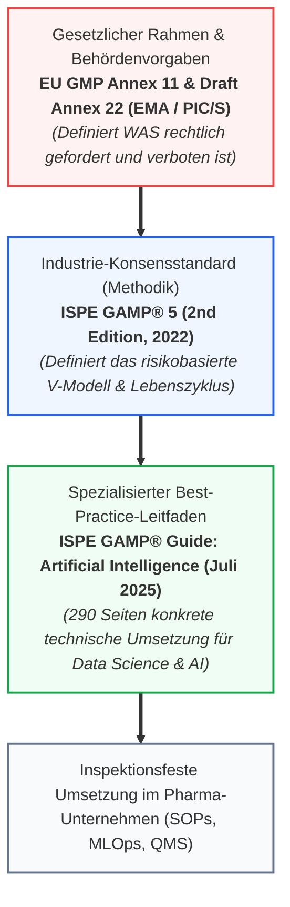
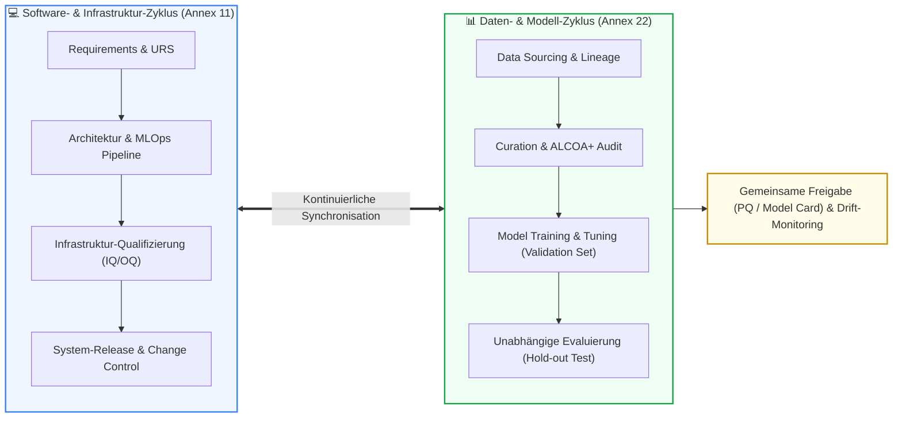
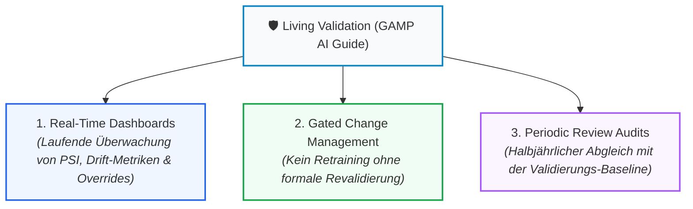

# Leitfaden: ISPE GAMP® AI Guide & Etablierte Industrie-Best-Practices

🌐 **[English Version](../en/appendix_ispe_gamp_ai_best_practices.md)** &nbsp;|&nbsp; **[🏠 Zurück zur Gesamtübersicht](00_overview.md) &nbsp;|&nbsp; [⬅ GenAI & RAG Leitfaden](appendix_genai_rag_gxp.md) &nbsp;|&nbsp; [Modul 08: Validation & Testing](module_08_validation_performance_testing.md)**

---

> **Executive Summary:**  
> Während die Regulierungsbehörden (EMA, FDA, PIC/S) in Leitlinien wie dem **Draft EU GMP Annex 22** verbindliche gesetzliche Anforderungen und Verbote festlegen, liefert die Industrie mit dem im **Juli 2025 veröffentlichten ISPE GAMP® Guide: Artificial Intelligence** die konkrete technische Anleitung zur Umsetzung. Dieser Leitfaden fasst die Kernprinzipien des 290-seitigen GAMP-AI-Standards zusammen und zeigt, wie Pharma-Unternehmen agile MLOps mit den etablierten GAMP-5-Validierungsmodellen harmonisieren.

---

## 1. Einordnung: Annex 22 vs. GAMP® 5 vs. ISPE GAMP AI Guide

Um Missverständnisse in Projekten zu vermeiden, muss die Hierarchie zwischen Regulatorik und Industrie-Leitfäden glasklar sein:

* **Annex 22** ist die *Regulierung* (Inspektionsmaßstab der Behörden).
* **GAMP 5** ist der *Rahmen* für risikobasierte Computersystem-Validierung (CSV/CSA).
* Der **ISPE GAMP AI Guide (2025)** ist das *Kochbuch*, das Data-Science-Teams und QA-Abteilungen die konkreten Workflows an die Hand gibt.

---

## 2. Das duale Lebenszyklus-Modell (Dual Lifecycle Model)

Die größte methodische Neuerung im ISPE GAMP AI Guide ist das **duale Lebenszyklus-Modell**. Klassische Software hat einen einzigen Code-Lebenszyklus. Ein KI-System besteht jedoch aus zwei parallel laufenden, eng verzahnten Zyklen:

1. **Der Software-Zyklus:** Folgt dem klassischen GAMP-Lebenszyklus (Spezifikation, Build, IQ/OQ der Pipeline-Infrastruktur, Container-Sicherheit).
2. **Der Daten-Zyklus:** Durchläuft Datensammlung, Bereinigung, Labeling, Feature Engineering und Training.
3. **Der Schnittpunkt:** Erst wenn die Software-Infrastruktur qualifiziert ist **und** die Daten nachweislich ALCOA+-konform sind, darf das resultierende Modell (Frozen Weights) für die Performance Qualification (PQ) freigegeben werden.

---

## 3. Erweiterung der GAMP-Softwarekategorien für KI

GAMP 5 teilt Software traditionell in 4 Kategorien ein (Kategorie 1, 3, 4, 5). Der ISPE AI Guide ordnet KI-Systeme differenziert ein:

| GAMP-Kategorie | Klassische Definition | KI-Spezifische Ausprägung nach ISPE GAMP AI Guide | Validierungsaufwand |
| :---: | :--- | :--- | :---: |
| **Kategorie 1** | Infrastruktur-Software | Cloud-Plattformen, Container-Engines (Docker, Kubernetes), GPU-Treiber | Standard-Qualifizierung (IQ) |
| **Kategorie 3** | Nicht-konfigurierte Standard-Software | Kommerzielle COTS-Modelle mit festen Gewichten, die unverändert genutzt werden (z.B. Standard-OCR) | Lieferanten-Audit, Verifikation der Eignung für den *Context of Use* |
| **Kategorie 4** | Konfigurierte Software | Vortrainierte Basismodelle (Transfer Learning), konfigurierte Hyperparameter, RAG mit Firmen-Dokumenten | Umfangreich: Validierung von Konfiguration, Prompts, RAG-Pipeline und Testdaten |
| **Kategorie 5** | Kundenspezifische Software (Custom Build) | Von Grund auf selbst entwickelte neuronale Netze, proprietäre Algorithmen | **Maximaler Aufwand:** Lückenlose Data Lineage, mathematische Rationale, Adversarial Testing, vollständige MLOps-Validierung |

---

## 4. Quality Risk Management (QRM) nach ICH Q9 (R1) für KI

Der GAMP AI Guide fordert, Risiken nicht abstrakt, sondern streng entlang der Kriterien von **ICH Q9 (R1)** zu quantifizieren:
* **Severity (Schweregrad):** Was passiert mit dem Patienten, wenn die KI eine falsche Vorhersage trifft?
* **Probability of Occurrence (Wahrscheinlichkeit):** Wie anfällig ist das Modell für Fehlklassifikationen, Rauschen oder OOD-Daten?
* **Detectability (Entdeckungswahrscheinlichkeit):** Kann ein menschlicher Bediener an der Linie einen KI-Fehler erkennen (*Human Oversight*), oder handelt es sich um eine stumme Fehlentscheidung (*Silent Degradation*)?

> [!IMPORTANT]
> **Das GAMP-Prinzip der Proportionalität:**  
> Nicht jedes KI-System benötigt denselben gigantischen Dokumentationsberg. Systeme mit niedriger Kritikalität (z.B. KI-gestützte Schichtplanung im Reinraum) erfordern schlanke Kontrollen. Systeme mit hoher Kritikalität (z.B. Echtzeit-Freigabeprüfung bei der Sterilabfüllung) fordern das Maximum an formaler Evidenz und unabhängiger Testung.

---

## 5. Lieferanten- und Cloud-Governance (Supplier Management)

Da fast alle Pharmaunternehmen heute externe Cloud-Dienste (AWS, Microsoft Azure, Google Cloud) oder spezialisierte KI-Softwareanbieter (COTS) einsetzen, widmet der ISPE GAMP AI Guide der Lieferantenüberwachung ein eigenes Kapitel:

### Die 4 Pflichtbausteine des AI-Supplier-Managements:
1. **Supplier Assessment & Audit:**  
   Die Qualitätssicherung (QA) muss den Entwicklungsprozess des Anbieters auditieren. Besitzt der Anbieter dokumentierte Prozesse für Data Governance, Bias-Prüfung und Code-Reviews?
2. **Quality Service Level Agreement (Quality Agreement):**  
   Vertragliche Zusicherung, dass der Anbieter:
   - Keine unangekündigten Modell- oder Algorithmen-Updates durchführt.
   - Eine Vorankündigungsfrist (z.B. 90 Tage) bei Änderungen an APIs oder Rechenkernen einhält.
   - Daten nicht für das Training eigener öffentlicher Modelle zweckentfremdet.
3. **Escrow & Model Lineage Zugriff:**  
   Sicherstellung, dass bei Insolvenz oder Kündigung des Dienstleisters alle Modellgewichte, Trainings-Metadaten und Inferenz-Logs an den Pharmahersteller übergeben werden.
4. **Verbleibende Verantwortung:**  
   GAMP betont unmissverständlich: **Die Verantwortung für die GxP-Konformität kann niemals auf den Anbieter abgewälzt werden** (*Regulated User Accountability*).

---

## 6. „Living Validation“: Der kontinuierliche Betriebszustand

Einer der wichtigsten Kernsätze von GAMP 5 Second Edition lautet: **Validierung ist kein Zustand, der mit dem Go-Live abgeschlossen wird, sondern eine kontinuierliche Aktivität.**

### Die 3 Säulen der Living Validation:

* **Automatisierte Drift-Alarmierung:** Überschreitet der *Population Stability Index (PSI)* den Wert von $0,2$, wird vollautomatisch ein Ticket im Abweichungswesen (QMS) ausgelöst.
* **Gated Release:** Ein neues Modell-Release kann erst dann in Produktion gehen, wenn ein automatisierter Revalidierungsbericht vom Qualitätsbeauftragten elektronisch signiert wurde.

---

## 📋 Zusammenfassung: Die 10 Gebote des ISPE GAMP AI Guides

1. **Context of Use:** Bestimme vor jeder Zeile Code das Risiko für Patient, Produkt und Datenintegrität.
2. **Data is Code:** Behandle Trainingsdaten mit derselben Strenge wie regulierten Programmcode.
3. **Separate Cycles:** Führe den Datenlebenszyklus parallel zum Softwarelebenszyklus.
4. **No Free Learning:** Betreibe im GxP-Kern nur statische Modelle mit gefrorenen Parametern.
5. **Staff Independence:** Trenne Entwicklungsteams personell von den Validierungstestern.
6. **Multi-Metric Evaluation:** Verlasse dich niemals auf eine einzelne Trefferquote (Metric Quad).
7. **Supplier Oversight:** Auditiere Cloud- und Softwareanbieter auf ihre KI-Governance.
8. **Explainability by Design:** Wähle das einfachste Modell, das die Aufgabe sicher löst.
9. **Active Oversight:** Verhindere *Automation Bias* durch gezieltes Workflow-Design.
10. **Continuous Vigilance:** Überwache Drift und Modellgüte permanent über die gesamte Lebensdauer.

---

🌐 **[English Version](../en/appendix_ispe_gamp_ai_best_practices.md)** &nbsp;|&nbsp; **[🏠 Zurück zur Gesamtübersicht](00_overview.md) &nbsp;|&nbsp; [⬅ GenAI & RAG Leitfaden](appendix_genai_rag_gxp.md) &nbsp;|&nbsp; [Modul 08: Validation & Testing](module_08_validation_performance_testing.md)**

