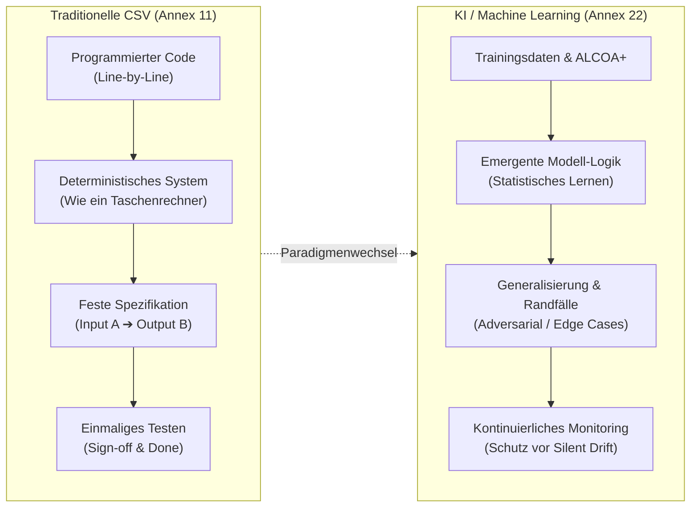

# Modul 01: Introduction to AI in GxP Environments

🌐 **[English Version](../en/module_01_introduction_ai_gxp.md)** &nbsp;|&nbsp; **[🏠 Inhaltsverzeichnis](00_overview.md)** &nbsp;|&nbsp; **[Modul 02: Overview of Annex 22 ➔](module_02_overview_annex_22.md)**

---

## 🧭 Kernkonzept im Überblick: Der Paradigmenwechsel

---

## 🎯 Lernziele & Leitfragen
1. **Was unterscheidet KI-Systeme unter Annex 22 von traditionellen computergestützten Systemen (Annex 11)?**
2. **Warum scheitert traditionelle CSV (Computer System Validation) bei KI/ML-Modellen?**
3. **Was sind die 6 Kernprinzipien für „Trustworthy AI“ nach Annex 22?**
4. **Wie verteilen sich die Rollen zwischen QA, Validierung und Data Science / IT?**

---

## 📌 Fachliche Zusammenfassung (Key Takeaways)

### 1. Die Definition von KI in GxP
- **Ergänzung zu Annex 11 ([Draft §1]):** Der Annex 22 versteht sich explizit als ergänzende Leitlinie (*additional guidance*) zu EU GMP Annex 11 für den Einsatz in kritischen GMP-Prozessen der Arzneimittelherstellung.
- **Abgrenzung zu traditioneller Software:** Herkömmliche, rein regelbasierte oder deterministische Algorithmen fallen weiterhin rein unter Annex 11, selbst wenn Anbieter sie marketingseitig als „KI“ bezeichnen.
- **Static vs. Dynamic Models:**
  - **Static Models (Geltungsbereich nach [Draft §1]):** Der Draft gilt ausschließlich für statische Modelle und Modelle mit deterministischem Output. Die Modellarchitektur und Gewichte sind nach der Qualifizierung eingefroren (*„frozen weights“*; [Draft Glossar]). Das System liefert für denselben Input stets denselben Output. Änderungen erfordern formalen Change Control ([Draft §10.1]).
  - **Dynamic / Continual Learning Models:** Passen ihre Modellparameter im laufenden Betrieb kontinuierlich an. Sie werden vom Draft **nicht abgedeckt und sollen in kritischen GMP-Anwendungen nicht verwendet werden** (*„should not be used“*, [Draft §1]), da ein dauerhaft validierter Zustand (*validated state*) unter kontinuierlicher Selbstveränderung nicht gewährleistet werden kann.

### 2. Warum die klassische Validierung (CSV) versagt
- **Klassische CSV (Annex 11):** Verhält sich wie ein Taschenrechner. Deterministisch: *Gleiche Eingabe führt immer zur gleichen Ausgabe*. Einmaliges Testen gegen Spezifikationen reicht meist aus.
- **KI-Validierung:** Die Programmlogik wird nicht Zeile für Zeile von Programmierern geschrieben, sondern entsteht **emergent aus den Trainingsdaten**.
- **Bias:** Systematische Fehler in den Trainingsdaten führen dazu, dass seltene Randfälle (*Edge Cases*) im Realbetrieb katastrophal fehlschlagen.
- **Silent Drift:** Datenverteilungen im Betrieb weichen schleichend von den Trainingsdaten ab (*Data Drift*, *Concept Drift*). Das System stürzt nicht ab, sondern verliert leise an Genauigkeit – ohne Fehlermeldung!

### 3. Reale Fallbeispiele für KI-Fehler im Pharma-Umfeld
1. **Visuelle Partikelinspektion bei Injektionspräparaten:** Ein neuer Partikeltyp tauchte auf der Linie auf, der nicht in den Trainingsdaten war. Die KI klassifizierte ihn fälschlicherweise als normale Fluktuation $\rightarrow$ Rückruf und Stilllegung des Systems.
2. **NLP zur Abweichungstriagierung (Deviations):** Systematische Herabstufung kritischer Vorfälle, da nicht-muttersprachliche englische Formulierungen oder Kürzel das Modell verzerrten.
3. **Predictive Maintenance bei Bioreaktoren:** Ein unbemerkter Lieferantenwechsel bei Sensoren führte zu Sensor-Drift $\rightarrow$ Modell verpasste den Ausfall der Sonden komplett.

### 4. Die 6 Säulen für „Trustworthy AI“ (Annex 22 Playbook)
1. **Intended Use Definition:** Präzise Festlegung des Verwendungszwecks vor Beginn der technischen Entwicklung.
2. **Data Governance:** Trainingsdaten müssen mit der gleichen Strenge behandelt werden wie kritische pharmazeutische Rohstoffe (*Critical Raw Materials*).
3. **Independent Test Sets:** Validierung ausschließlich mit Daten, die das Modell im Training niemals gesehen hat.
4. **Proportionate Explainability:** Erklärbarkeit und Nachvollziehbarkeit müssen proportional zur Kritikalität der Entscheidung sein (Schutz vor unkontrollierbaren „Black-Box“-Modellen).
5. **Meaningful Human Oversight (HITL):** Echte, qualifizierte menschliche Kontrolle – kein reines formales „Checkbox-Abnicken“.
6. **Continuous Monitoring:** Permanente Überwachung auf Drift, Anomalien und Performance-Abfall über den gesamten Lebenszyklus bis zur Außerbetriebnahme.

### 5. Das „Three-Legged Stool“-Governance-Modell
- **QA (Quality Assurance):** Etabliert das Governance-Framework, genehmigt Akzeptanzkriterien und verteidigt das System bei Inspektionen.
- **Validation Specialists:** Übersetzen den *Intended Use* in messbare Spezifikationen, designen unabhängige Testdatensätze und führen die Modellqualifizierung durch.
- **IT / Data Science:** Betreiben die MLOps-Infrastruktur, sichern Daten-Pipelines und tragen die technische Systemverantwortung.

> **Kulturelle Kluft schließen:** Data Scientists optimieren historisch auf maximale *Predictive Performance* (Accuracy, F1-Score). GMP fordert jedoch vorrangig **Trustworthiness, Reproducibility und Audit Defensibility**.

---

## 💡 Zentrale Fachbegriffe & Konzepte (Glossar)

| Begriff | Definition & Annex-22-Bedeutung |
| :--- | :--- |
| **Static Model** | Modell mit fest fixierten Parametern nach der Validierung ([Draft Glossar]). Liefert für gleiche Eingaben reproduzierbar gleiche Ergebnisse. |
| **Dynamic Model** | Modell, das im Produktionsbetrieb online weiterlernt. Vom Geltungsbereich des Drafts nicht abgedeckt; soll in kritischen GMP-Anwendungen nicht eingesetzt werden ([Draft §1]). |
| **Silent Drift** | Schleichende Verschlechterung der Modellvorhersage durch veränderte Realbedingungen ohne Fehlermeldung des Systems. |
| **Edge Cases** | Seltene oder unvorhergesehene Betriebsszenarien, die in den Trainingsdaten unterrepräsentiert sind. |
| **Black-Box AI** | Modelle (z.B. tiefe neuronale Netze), deren interne Entscheidungsfindung für menschliche Prüfer nicht unmittelbar transparent ist. |
| **Audit Defensibility** | Die Fähigkeit, vor einem GMP-Inspektor schlüssig zu begründen und zu belegen, warum eine KI-Entscheidung getroffen wurde. |

---

## 📋 GxP-Compliance Checklist & Kontrollfragen

- [ ] Ist der **Intended Use** des KI-Systems schriftlich fixiert und abgegrenzt?
- [ ] Handelt es sich um ein **statisches Modell** mit eingefrorenen Gewichten?
- [ ] Wurde das Modell mit einem **unabhängigen Test-Set** validiert (keine Data Leakage)?
- [ ] Ist ein **Human-in-the-Loop (HITL)**-Verfahren definiert, das echtes fachliches Eingreifen verlangt?
- [ ] Gibt es ein automatisiertes **Monitoring auf Data Drift & Concept Drift**?
- [ ] Existiert ein interdisziplinäres Team aus QA, Validierung und IT/Data Science?

---

🌐 **[English Version](../en/module_01_introduction_ai_gxp.md)** &nbsp;|&nbsp; **[🏠 Inhaltsverzeichnis](00_overview.md)** &nbsp;|&nbsp; **[Modul 02: Overview of Annex 22 ➔](module_02_overview_annex_22.md)**

