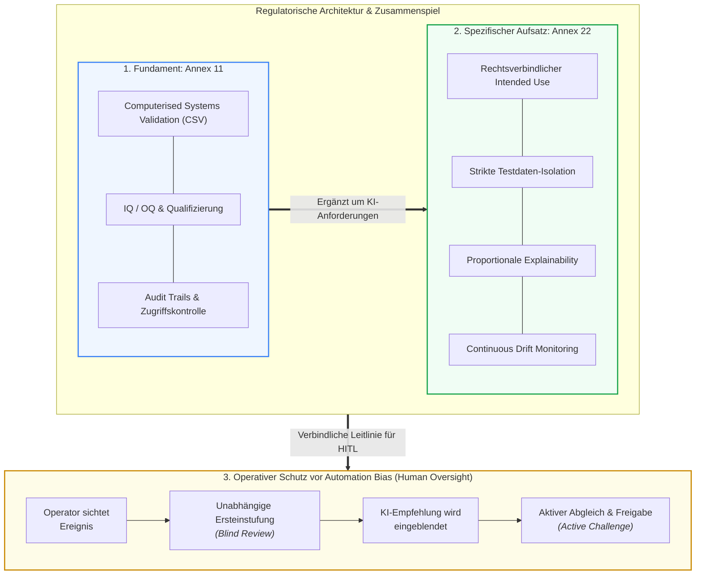

# Modul 02: Overview of Annex 22

🌐 **[English Version](../en/module_02_overview_annex_22.md)** &nbsp;|&nbsp; **[⬅ Modul 01: Intro to AI in GxP](module_01_introduction_ai_gxp.md)** &nbsp;|&nbsp; **[🏠 Inhaltsverzeichnis](00_overview.md)** &nbsp;|&nbsp; **[Modul 03: Scope and Applicability ➔](module_03_scope_applicability.md)**

---

## 🧭 Kernkonzept im Überblick: Koexistenz & Automation Bias Schutz

---

## 🎯 Lernziele & Leitfragen
1. **Warum wurde Annex 22 geschaffen und wie verhält er sich zu Annex 11?**
2. **Wie grenzt Annex 22 den GxP-Scope ab (direkte vs. indirekte Entscheidungen)?**
3. **Welche regulatorische Haltung nimmt Annex 22 gegenüber Static AI, Dynamic AI und Generative AI ein?**
4. **Was ist Automation Bias und wie muss Human Oversight gestaltet sein?**
5. **Wie sieht die 5-stufige Implementierungs-Roadmap für pharmazeutische Betriebe aus?**

---

## 📌 Fachliche Zusammenfassung (Key Takeaways)

### 1. Entstehung, EudraLex Digital Package & Rechtsstatus
- **Das EudraLex Vol. 4 Digital Package:** Annex 22 wurde nicht isoliert veröffentlicht, sondern bildet ein zusammenhängendes Modernisierungspaket für computergestützte Systeme zusammen mit der **Revision von Annex 11** (Cloud, agile Methoden, Datenintegrität) und der **Revision von Kapitel 4** (Dokumentation).
- **Aktueller Rechtsstatus:** Der Text ist aktuell ein **Draft (Konsultationsentwurf)** von Europäischer Kommission, EMA und PIC/S (die öffentliche Konsultationsfrist endete am **7. Oktober 2025**; eine finale Verabschiedung wird für Ende 2026/Anfang 2027 erwartet). Auf dem EMA-Multi-Stakeholder-Workshop (Juni/Juli 2026) wurden Branchenrückmeldungen diskutiert; eine etwaige Neubewertung von Vorgaben ist Gegenstand laufender fachlicher Prüfungen (kein förmlicher Beschluss). In der Fach- und Inspektionspraxis wird erwartet, dass die im Draft formulierten Grundprinzipien zunehmend als relevanter Stand von Wissenschaft und Technik (*State of the Art*) bei der Beurteilung computergestützter Systeme herangezogen werden ([Auslegung]).
- **Bezug zum EU AI Act:** Das Glossar des Drafts übernimmt die Definition von „AI system“ aus dem **EU AI Act** (Art. 3(1) VO 2024/1689).

### 2. Annex 11 vs. Annex 22 (Koexistenz statt Ersatz)
- **Annex 22 ersetzt Annex 11 NICHT ([Draft §1]):** Der Draft versteht sich explizit als ergänzende Leitlinie (*additional guidance*) zu Annex 11.
- **Annex 11 bleibt das Fundament:** IQ/OQ-Strukturen, Audit Trails, Zugriffskontrollen, Cloud-Sicherheit und deterministische Basisvalidierung bleiben unverändert unter Annex 11.
- **Annex 22 setzt oben auf:** Für lernende Algorithmen verlangt Annex 22 zwingend zusätzliche Disziplinen:
  - Verbindliche *Intended Use Specification* unter Einbindung von Fach-SMEs ([Draft §3.1]),
  - Strikt isolierte, unabhängige Testdatensätze (*Independent Test Sets*) mit Zugriffskontrollen und personeller Unabhängigkeit (*Staff Independence*, [Draft §6.2, §6.5]),
  - Risikoproportionale *Explainability* im Rahmen des Testings ([Draft §8.1, §8.2]),
  - Kontinuierliches Lebenszyklus-Monitoring von Performance und Input-Verteilung ([Draft §10.3, §10.4]),
  - **Prüfung der Lieferantendokumentation durch den Betreiber ([Draft §2.2]):** Werden Aktivitäten von externen Lieferanten durchgeführt, muss die Dokumentation vom regulierten Anwender beschafft und überprüft werden ([Draft §2.2]). Die uneingeschränkte pharmazeutische und rechtliche Gesamtverantwortung verbleibt nach EU-Arzneimittelrecht stets beim pharmazeutischen Unternehmer.

### 3. Was ist „In Scope“ und was ist „Out of Scope“?
- **In Scope (Reguliert nach [Draft §1]):**
  - Kritische Anwendungen mit direktem oder indirektem Einfluss auf Patientensicherheit, Produktqualität oder Datenintegrität in der Arzneimittelherstellung.
  - Direkte GMP-Entscheidungen: Automatische Chargenfreigabe (*Batch Release*), Inline-Prozesskontrolle (PAT).
  - Indirekte GMP-Entscheidungen: KI-gestützte Peak-Integration im Qualitätskontrolllabor (QC), Abweichungstriagierung (*Deviation Triage*), KI-Bedarfs- oder Haltbarkeitsprognosen.
- **Out of Scope (Nicht unter Annex 22):**
  - Reine Grundlagenforschung (*Discovery/Early Research* ohne GMP-Bezug),
  - Administrative HR-Systeme (z. B. Bewerbermanagement),
  - Konventionelle, rein regelbasierte Algorithmen (bleiben rein unter Annex 11).

### 4. Das Modell-Trio: Static, Dynamic und Generative AI
- **Static AI (Geltungsbereich des Drafts, [Draft §1, Glossar]):**
  - Modellgewichte werden nach der Qualifizierung eingefroren (*Frozen Weights*).
  - Deterministisches, reproduzierbares Verhalten über die gesamte Laufzeit. Änderungen nur über formales Change Control ([Draft §10.1]).
- **Dynamic AI (Vom Draft nicht abgedeckt, [Draft §1]):**
  - Modelle, die im laufenden Betrieb kontinuierlich online weiterlernen.
  - *Regulatorische Vorgabe:* Dynamische Modelle werden vom Geltungsbereich nicht erfasst und sollen in kritischen GMP-Anwendungen nicht verwendet werden (*„should not be used“*, [Draft §1]), da ein dauerhaft validierter Zustand (*validated state*) nicht sichergestellt werden kann.
- **Generative AI & LLMs (Vom Draft für kritische Prozesse nicht abgedeckt, [Draft §1]):**
  - Anfällig für stochastische Variabilität und Halluzinationen.
  - *Regulatorische Vorgabe:* Der Draft gilt nicht für generative KI / LLMs in kritischen Prozessen. In nicht-kritischen Anwendungen ist qualifizierte menschliche Aufsicht (*Human Oversight*) vorgeschrieben ([Draft §1]).
  - *Zulässiger Einsatzkorridor in der Praxis ([Didaktik]):* Assistive Hilfstätigkeiten (z. B. Rohentwürfe für Berichte), sofern jede Ausgabe nachweisbar qualifiziert geprüft wird. Siehe Details im ➔ **[Leitfaden: Generative KI (GenAI), LLMs & RAG im GxP-Umfeld](appendix_genai_rag_gxp.md)**.

### 5. Das Phänomen „Automation Bias“ & Human Oversight
- **Illustratives Praxisszenario (didaktisches Fallbeispiel, nicht belegt):** Ein QA-Team nutzte NLP zur Abweichungstriagierung. Prüfer klickten Vorschläge der KI nach kurzer Zeit nur noch blind ab (*Perfunctory Review* / Rubber-Stamping).
- **Lösung ([Didaktik]):** Neugestaltung des Workflows! Der Mensch stuft die Abweichung **zuerst unabhängig ein**, bevor die KI-Empfehlung eingeblendet wird (*Active Challenge*).

### 6. Die 5-stufige Implementierungs-Roadmap ([Didaktik])
1. **Stage 1 (Governance):** Etablierung eines KI-Governance-Frameworks im bestehenden QMS (inkl. Cloud & Supplier Oversight).
2. **Stage 2 (Inventory):** Aufbau eines lebenden KI-Inventars mit Kritikalitätsklassifizierung.
3. **Stage 3 (Gap Triage):** Identifikation und Behebung von Validierungslücken bei Hochrisikosystemen.
4. **Stage 4 (Cross-Functional Literacy):** Abbau von Silos zwischen IT, Data Science und QA.
5. **Stage 5 (Lifecycle Discipline):** Verankerung von kontinuierlichem Drift-Monitoring und Change Control (Orientierung an ➔ **[ISPE GAMP AI Guide & Best Practices](appendix_ispe_gamp_ai_best_practices.md)**).

---

## 💡 Zentrale Fachbegriffe & Konzepte (Glossar)

| Begriff | Definition & Annex-22-Bedeutung |
| :--- | :--- |
| **Automation Bias** | Die menschliche Neigung, automatisierte Systemvorschläge unkritisch zu akzeptieren und manuelle Prüfungen zu vernachlässigen. |
| **Independent Test Data** | Validierungsdaten, die strikt vom Training isoliert waren (keine Data Leakage), um echte Generalisierbarkeit zu belegen. |
| **Model Drift** | Die langsame Entfremdung der Modellperformance von der ursprünglichen Validierungsgrundlage durch veränderte Realbedingungen. |
| **Perfunctory Review** | Oberflächliches „Checkbox-Abnicken“ von KI-Vorschlägen ohne inhaltliche Prüfung – aus Auditsicht nicht defensibel. |
| **AI Inventory** | Zentrales, audit-relevantes Verzeichnis aller im Unternehmen eingesetzten KI-Systeme inkl. Scope, Risikostufe und Status. |

---

## 📋 GxP-Compliance Checklist & Kontrollfragen

- [ ] Wurde geklärt, welche Systeme unter **Annex 11** (deterministisch) und welche zusätzlich unter **Annex 22** (lernend) fallen?
- [ ] Werden indirekte Einflüsse auf GMP-Aufzeichnungen (z.B. QC-Peak-Integration) im Scope berücksichtigt?
- [ ] Sind alle kritischen Produktionsmodelle als **statische Modelle (frozen weights)** aufgesetzt?
- [ ] Ist der Einsatz von **LLMs/GenAI** auf assistive, unkritische Aufgaben beschränkt?
- [ ] Verhindern die Arbeitsabläufe aktiv einen **Automation Bias** bei den Reviewern?
- [ ] Existiert ein offizielles, gepflegtes **AI-Inventar** für Audits?

---

🌐 **[English Version](../en/module_02_overview_annex_22.md)** &nbsp;|&nbsp; **[⬅ Modul 01: Intro to AI in GxP](module_01_introduction_ai_gxp.md)** &nbsp;|&nbsp; **[🏠 Inhaltsverzeichnis](00_overview.md)** &nbsp;|&nbsp; **[Modul 03: Scope and Applicability ➔](module_03_scope_applicability.md)**

