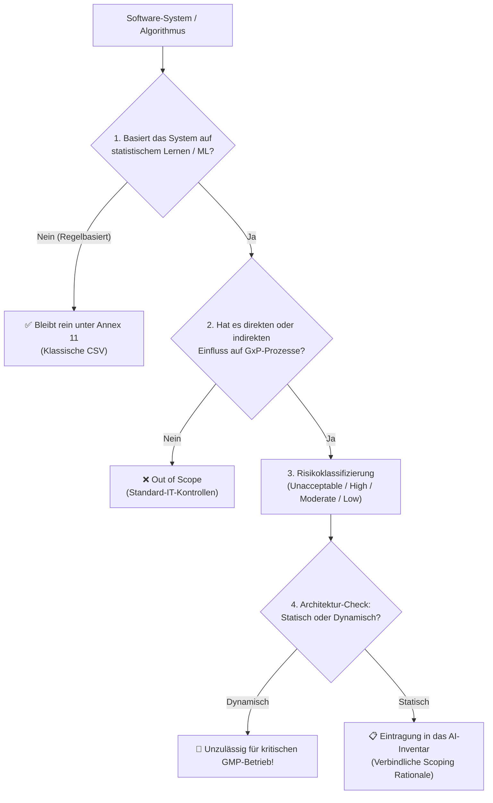

# Modul 03: Scope and Applicability of AI Systems

**[⬅ Modul 02: Overview of Annex 22](module_02_overview_annex_22.md)** &nbsp;|&nbsp; **[🏠 Inhaltsverzeichnis](00_overview.md)** &nbsp;|&nbsp; **[Modul 04: Risk Based Approach to AI ➔](module_04_risk_based_approach.md)**

---

## 🧭 Kernkonzept im Überblick: Der Scoping-Entscheidungstrichter

---

## 🎯 Lernziele & Leitfragen
1. **Was sind die Gefahren von „Over-Claiming“ und „Under-Claiming“ beim KI-Scoping?**
2. **Wie funktioniert der 5-Stufen-Entscheidungstrichter (*Decision Funnel*)?**
3. **Wie ist die 4-stufige Risikomatrix nach Annex 22 aufgebaut?**
4. **Welche Lehren ziehen wir aus den Grenzfällen (Sichtprüfung, LLM-Berichte, Cloud-SaaS)?**
5. **Welche Pflichtelemente gehören in ein audit-festes *AI Inventory*?**

---

## 📌 Fachliche Zusammenfassung (Key Takeaways)

### 1. Das Dilemma beim Scoping: Over-Claiming vs. Under-Claiming
- **Over-Claiming (Überregulierung):** Jedes noch so einfache Stück Standardsoftware aus Angst als „KI unter Annex 22“ deklarieren. **Folge:** Das Validierungsteam wird mit unnötigem Aufwand gelähmt.
- **Under-Claiming (Unterregulierung):** Ein echtes KI-System im GMP-Bereich übersehen oder herunterspielen. **Folge:** Vorprogrammierter schwerer Mangel (*Audit Finding*) bei der nächsten Behördeninspektion.
- **Ziel:** Ein disziplinierter, methodischer Mittelweg mit nachvollziehbarer Begründung (*Scoping Rationale*).

### 2. Der 5-Stufen-Entscheidungstrichter (*Decision Funnel*)
Jede Software und jeder Algorithmus durchläuft diese fünf Stufen:
1. **Ist es wirklich KI?** Nur Systeme mit statistischem Lernen, Mustererkennung oder generativer KI fallen unter Annex 22. Reine regelbasierte Logik, Expertensysteme und deterministische Algorithmen bleiben rein unter **Annex 11**.
2. **Besteht ein GMP-Einfluss?** Betrifft es direkte Prozessschritte (z.B. Chargenfreigabe, Spezifikationen) oder **indirekte Faktoren** (z.B. KI-Personalschichtplanung für Reinräume, KI-Schulungstracking für Operator-Qualifikation)?
3. **Risikostufe zuordnen:** Zuordnung in das vierstufige Risikoraster (Unacceptable, High, Moderate, Low).
4. **Architektur bewerten:** Ist das Modell statisch (*Frozen Weights*) oder dynamisch (*Online Learning*)?
5. **Dokumentation:** Eintragung in das verbindliche *AI Inventory* mit schriftlicher Scoping-Begründung.

### 3. Die 4 Risikostufen unter Annex 22

| Risikostufe | Definition & Beispiele | Regulatorische Konsequenz |
| :--- | :--- | :--- |
| **Unacceptable** | Kontinuierlich online lernende Modelle, die autonome Freigabeentscheidungen treffen. | **Strikter Ausschluss** unter Annex 22. Nicht zulässig. |
| **High Risk** | Statische KI, die PAT-Messungen steuert, CQA-Relevanz hat oder autonome Gut-/Schlecht-Sortierung durchführt. | Vollumfängliche Validierung, Worst-Case-Tests, kontinuierliches Drift-Monitoring, 100% HITL. |
| **Moderate Risk** | KI als Entscheidungshilfe (*Decision Support* / Advisory), z.B. Triage von Abweichungen. | Schlankere Test-Sets, aktive menschliche Überprüfung vor Wirksamkeit. |
| **Low Risk** | Administrative Backoffice-Anwendungen ohne jeden Einfluss auf Produktqualität oder Patientensicherheit. | Standardmäßige IT-Good-Practices ausreichend. |

### 4. Drei kritische Grenzfälle aus der Praxis

#### Fall 1: Deep-Learning-Sichtprüfung von Vials (Fläschchen)
- *Situation:* KI sortiert Vials autonom in „Gut“ und „Schlecht“. Nur unsichere Grenzfälle werden einem Menschen zur Nachkontrolle vorgelegt.
- *Fehlschluss:* Die Firma stufte das System als „Moderate Risk“ ein, weil ja ein Mensch Grenzfälle prüft.
- *Annex-22-Realität:* **High Risk!** Die autonome Entscheidungsrate für 95%+ der Vials bestimmt das Risiko. Partielle menschliche Kontrolle senkt die Risikoklasse nicht magisch ab. Zwingend: Drift-Monitoring und definierter Fallback auf manuelle Inspektion.

#### Fall 2: Der Sonderstatus von Generativer KI (GenAI & LLMs)
- *Regulatorische Ausgangslage:* Im **Draft Annex 22** schließt die Europäische Kommission LLMs und generative Modelle für autonome, entscheidungsrelevante GMP-Tätigkeiten explizit aus. Grund sind das stochastische Antwortverhalten und das Risiko von **Halluzinationen** (überzeugend klingende, aber frei erfundene pharmazeutische Aussagen).
- *Der zulässige GxP-Korridor:* LLMs dürfen unter strengen Auflagen als **assistierende Werkzeuge („Drafting Assistants“)** eingesetzt werden (z.B. Erstellung eines ersten Roh-Entwurfs für einen Abweichungsbericht oder Zusammenfassung von Labor-Rohdaten).
- *Architektur-Vorgabe:* Direkte freie Prompts sind unzulässig. Zwingend gefordert ist eine **RAG-Architektur (Retrieval-Augmented Generation)**, die das Modell strikt auf freigegebene Firmen-SOPs begrenzt und jeden Satz mit auditierbaren ALCOA+-Zitaten belegt.
- *Detail-Leitfaden:* Eine vollständige Ausarbeitung von RAG-Validierungsmetriken (Groundedness, Context Relevance), Prompt Governance und Guardrails findest du im separaten Dossier:  
  ➔ **[Vertiefender Leitfaden: Generative KI (GenAI), LLMs & RAG im GxP-Umfeld](appendix_genai_rag_gxp.md)**

#### Fall 3: Cloud-SaaS-KI von Drittanbietern (Black-Box über API)
- *Leitsatz:* **„You cannot outsource your GMP accountability.“**
- *Problem:* Wenn der Cloud-Anbieter im Hintergrund kontinuierliche Updates einspielt oder Bibliotheken ändert, ist das System für den Pharmahersteller nicht validierbar (*Uncontrolled Environment Drift*).
- *Lösung:* Cloud-KI darf ausschließlich auf Basis formaler *Quality Agreements* und Service Level Agreements (SLAs) betrieben werden, die unangekündigte Modelländerungen vertraglich ausschließen. Primäre Freigabeberechnungen müssen auf intern validierten Systemen gegengeprüft werden. Siehe auch ➔ **[ISPE GAMP AI Guide & Etablierte Industrie-Best-Practices](appendix_ispe_gamp_ai_best_practices.md)**.

### 5. Das audit-feste „AI Inventory“
Das Master-Verzeichnis für Inspektoren muss für jedes System zwingend enthalten:
1. Eindeutige Kennung (*System Identifier*),
2. Präziser Verwendungszweck (*Intended Use*),
3. Zugewiesene Risikostufe (*Risk Tier*),
4. System Owner & Fachverantwortlicher,
5. Validierungsstatus & Version,
6. Direkte Verlinkung zur schriftlichen Scoping-Begründung (*Documented Scoping Rationale*).

---

## 💡 Zentrale Fachbegriffe & Konzepte (Glossar)

| Begriff | Definition & Annex-22-Bedeutung |
| :--- | :--- |
| **Decision Funnel** | Strukturierter 5-stufiger Filterprozess zur fehlerfreien regulatorischen Einordnung von Software unter Annex 22. |
| **Autonomous Decision Rate** | Der prozentuale Anteil an Entscheidungen, die eine KI ohne menschliche Zwischenprüfung eigenständig fällt. |
| **Cognitive Framing** | Die psychologische Beeinflussung menschlicher Problemlösung durch vorformulierte KI-Narrative (Gefahr falscher CAPAs). |
| **Scoping Rationale** | Schriftliche, nachvollziehbare Begründung, warum ein System einer bestimmten Risikoklasse zugeordnet wurde. |
| **SaaS Compliance Trap** | Die regulatorische Falle, Cloud-KI-Dienste zu nutzen, deren Modelländerungen man weder kontrollieren noch validieren kann. |

---

## 📋 GxP-Compliance Checklist & Kontrollfragen

- [ ] Wurde jedes System durch den 5-Stufen-Entscheidungstrichter geprüft?
- [ ] Wurden indirekte Einflüsse auf Personal, Schulung oder QMS-Prozesse analysiert?
- [ ] Wurde bei teilautomatisierter Sichtprüfung die autonome Entscheidungsrate zur Risikoeinstufung herangezogen?
- [ ] Werden bei GenAI-Einsatz Metriken über Textänderungen durch Reviewer erhoben?
- [ ] Sind Cloud-/Drittanbieter-KIs strikt auf advisory/sekundäre Rollen beschränkt?
- [ ] Ist das AI-Inventar vollständig und spiegelt es die aktuelle Systemlandschaft wider?

---

**[⬅ Modul 02: Overview of Annex 22](module_02_overview_annex_22.md)** &nbsp;|&nbsp; **[🏠 Inhaltsverzeichnis](00_overview.md)** &nbsp;|&nbsp; **[Modul 04: Risk Based Approach to AI ➔](module_04_risk_based_approach.md)**

