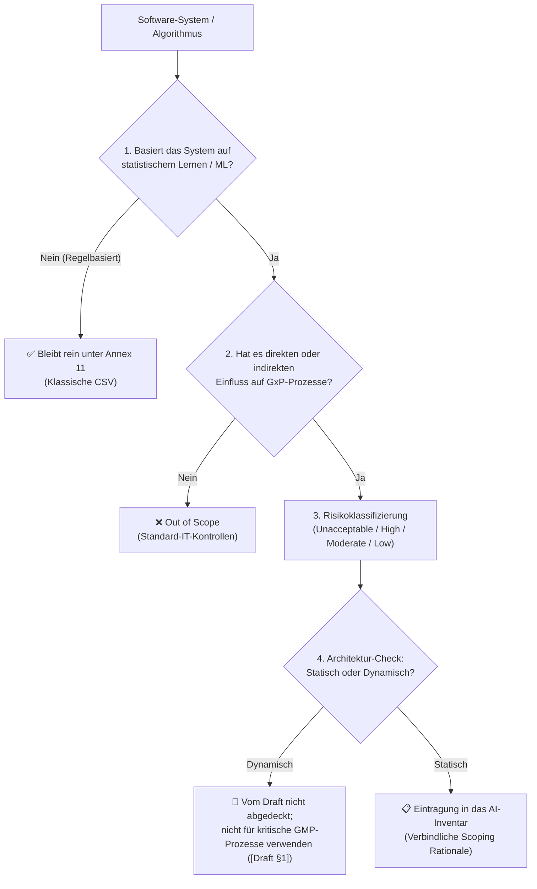

# Modul 03: Scope and Applicability of AI Systems

🌐 **[English Version](../en/module_03_scope_applicability.md)** &nbsp;|&nbsp; **[⬅ Modul 02: Overview of Annex 22](module_02_overview_annex_22.md)** &nbsp;|&nbsp; **[🏠 Inhaltsverzeichnis](00_overview.md)** &nbsp;|&nbsp; **[Modul 04: Risk Based Approach to AI ➔](module_04_risk_based_approach.md)**

---

## 🧭 Kernkonzept im Überblick: Der Scoping-Entscheidungstrichter

---

## 🎯 Lernziele & Leitfragen
1. **Was sind die Gefahren von „Over-Claiming“ und „Under-Claiming“ beim KI-Scoping?**
2. **Wie funktioniert der 5-Stufen-Entscheidungstrichter (*Decision Funnel*)?**
3. **Wie ist das didaktische Risikoraster aufgebaut ([Didaktik])?**
4. **Welche Lehren ziehen wir aus den Grenzfällen (Sichtprüfung, LLM-Berichte, Cloud-SaaS)?**
5. **Welche Pflichtelemente gehören in ein audit-festes *AI Inventory*?**

---

## 📌 Fachliche Zusammenfassung (Key Takeaways)

### 1. Das Dilemma beim Scoping: Over-Claiming vs. Under-Claiming
- **Over-Claiming (Überregulierung):** Jedes noch so einfache Stück Standardsoftware aus Angst als „KI unter Annex 22“ deklarieren. **Folge:** Das Validierungsteam wird mit unnötigem Aufwand gelähmt.
- **Under-Claiming (Unterregulierung):** Ein echtes KI-System im GMP-Bereich übersehen oder herunterspielen. **Folge:** Vorprogrammierter schwerer Mangel (*Audit Finding*) bei der nächsten Behördeninspektion.
- **Ziel:** Ein disziplinierter, methodischer Mittelweg mit nachvollziehbarer Begründung (*Scoping Rationale*).

### 2. Der 5-Stufen-Entscheidungstrichter (*Decision Funnel*)
Jede Software und jeder Algorithmus durchläuft diese fünf Stufen:
1. **Ist es wirklich KI?** Nur Systeme mit statistischem Lernen, Mustererkennung oder generativer KI fallen unter den AI-Begriff. Reine regelbasierte Logik, Expertensysteme und deterministische Algorithmen bleiben rein unter **Annex 11** ([Draft §1]).
2. **Besteht ein GMP-Einfluss?** Betrifft es kritische Prozesse der Arzneimittelherstellung mit direktem oder indirektem Einfluss auf Patientensicherheit, Produktqualität oder Datenintegrität ([Draft §1])?
3. **Risikostufe zuordnen ([Didaktik]):** Zuordnung in das vierstufige Risikoraster (Unacceptable, High, Moderate, Low).
4. **Architektur bewerten:** Ist das Modell statisch mit deterministischem Output ([Draft §1, Glossar]) oder dynamisch/probabilistisch?
5. **Dokumentation:** Eintragung in das verbindliche *AI Inventory* mit schriftlicher Scoping-Begründung.

### 3. Didaktisches Risikoraster für KI-Systeme ([Didaktik])

> *Hinweis zur Einordnung:* Der Draft unterscheidet im Kern zwischen kritischen GMP-Prozessen (Geltungsbereich für statische Modelle) und nicht abgedeckten Systemen (§1). Die folgende 4-stufige Staffelung ist ein etabliertes Industriemodell ([Didaktik] in Anlehnung an EU AI Act / GAMP):

| Risikostufe | Definition & Beispiele | Regulatorische Konsequenz |
| :--- | :--- | :--- |
| **Vom Draft nicht abgedeckt** | Kontinuierlich online lernende Modelle oder probabilistische Ausgaben in kritischen Prozessen. | Sollen in kritischen GMP-Anwendungen nicht verwendet werden (*„should not be used“*, [Draft §1]). |
| **High Risk** | Statische KI in kritischen GMP-Prozessen (PAT-Steuerung, CQA-Einfluss, automatisierte Freigaben). | Vollumfängliche Qualifizierung, Worst-Case-Tests, kontinuierliches Monitoring ([Draft §1, §4, §10]). |
| **Moderate Risk** | KI als assistive Entscheidungshilfe (*Decision Support*), z. B. Triage von Abweichungen. | Risikoproportionale Qualifizierung, definierte Operator-Verantwortung im Intended Use ([Draft §3.3]). |
| **Low Risk** | Administrative Anwendungen ohne Einfluss auf Produktqualität, Patientensicherheit oder Datenintegrität. | Vom Scope des Drafts ausgenommen ([Draft §1]); Standard-IT-Kontrollen ausreichend. |

### 4. Drei kritische Grenzfälle aus der Praxis

#### Fall 1: Deep-Learning-Sichtprüfung von Vials (Fläschchen)
- *Situation:* KI sortiert Vials autonom in „Gut“ und „Schlecht“. Nur unsichere Grenzfälle werden einem Menschen zur Nachkontrolle vorgelegt.
- *Fehlschluss:* Die Firma stufte das System als „Moderate Risk“ ein, weil ja ein Mensch Grenzfälle prüft.
- *Annex-22-Realität:* **Kritischer Prozess!** Die autonome Sortierung betrifft direkt die Produktqualität. Eine bloße menschliche Prüfung von Grenzfällen hebt die Kritikalität des Gesamtsystems nicht auf. Zwingend: Vollständige Modellqualifizierung, Drift-Monitoring und definierter Fallback auf manuelle Inspektion ([Draft §1, §4.3, §10.3]).

#### Fall 2: Der Status von Generativer KI (GenAI & LLMs)
- *Regulatorische Ausgangslage:* Nach [Draft §1] ist der Leitfaden **nicht anwendbar auf generative KI / Large Language Models (LLMs) in kritischen Prozessen**. Generative KI in nicht-kritischen Anwendungen erfordert qualifizierte menschliche Aufsicht (*Human Oversight*, [Draft §1]). Grund sind das stochastische Antwortverhalten und das Risiko von Halluzinationen.
- *Workshop-Status:* Auf dem EMA-Multi-Stakeholder-Workshop (Juni/Juli 2026) wurden Branchenbeiträge diskutiert; eine Neubewertung ist Gegenstand laufender Prüfungen, ein Beschluss liegt jedoch noch nicht vor.
- *Der zulässige GxP-Korridor in der Praxis ([Didaktik]):* LLMs werden in der pharmazeutischen Praxis als assistierende Werkzeuge (*„Drafting Assistants“*) genutzt (z. B. Rohentwürfe für Abweichungsberichte), sofern jede Ausgabe nachweisbar von qualifiziertem Personal geprüft und gezeichnet wird.
- *Architektur-Best-Practice ([Best Practice: ML-Praxis]):* RAG-Architektur (Retrieval-Augmented Generation) zur Begrenzung auf geprüfte SOPs mit ALCOA+-Zitaten. Details siehe ➔ **[Leitfaden: Generative KI (GenAI), LLMs & RAG im GxP-Umfeld](appendix_genai_rag_gxp.md)**.

#### Fall 3: Cloud-SaaS-KI von Drittanbietern (Black-Box über API)
- *Lieferantendokumentation & Verantwortung ([Draft §2.2]):* Dokumentationen für Aktivitäten von Dritten oder externen Lieferanten müssen vom regulierten Betreiber beschafft und formell geprüft werden ([Draft §2.2]); die rechtliche Gesamtverantwortung für Produktqualität und Datenintegrität verbleibt nach EU-Arzneimittelrecht uneingeschränkt beim pharmazeutischen Hersteller.
- *Problem:* Wenn der Cloud-Anbieter im Hintergrund kontinuierliche Updates einspielt oder Bibliotheken ändert, ist das System für den Pharmahersteller nicht kontrollierbar (*Uncontrolled Environment Drift*).
- *Lösung:* Cloud-KI erfordert strenge *Quality Agreements* und Service Level Agreements (SLAs), die das Beschaffen und Prüfen aller relevanten Dokumentationen ([Draft §2.2]) sowie eine strikte Konfigurationskontrolle des getesteten Modells ([Draft §10.2]) zur Erkennung unautorisierter Änderungen vertraglich und technisch absichern. Primäre Freigabeberechnungen müssen auf intern validierten Systemen gegengeprüft werden. Siehe auch ➔ **[ISPE GAMP AI Guide & Etablierte Industrie-Best-Practices](appendix_ispe_gamp_ai_best_practices.md)**.

### 5. Das audit-feste „AI Inventory“
Das Master-Verzeichnis für Inspektoren muss für jedes System zwingend enthalten:
1. Eindeutige Kennung (*System Identifier*),
2. Präziser Verwendungszweck (*Intended Use*),
3. Zugewiesene Risikostufe (*Risk Tier*),
4. System Owner & Fachverantwortlicher,
5. Validierungsstatus & Version,
6. Direkte Verlinkung zur schriftlichen Scoping-Begründung (*Documented Scoping Rationale*).

---

## 💡 Zentrale Fachbegriffe & Konzepte (Glossar)

| Begriff | Definition & Annex-22-Bedeutung |
| :--- | :--- |
| **Decision Funnel** | Strukturierter 5-stufiger Filterprozess zur fehlerfreien regulatorischen Einordnung von Software unter Annex 22. |
| **Autonomous Decision Rate** | Der prozentuale Anteil an Entscheidungen, die eine KI ohne menschliche Zwischenprüfung eigenständig fällt. |
| **Cognitive Framing** | Die psychologische Beeinflussung menschlicher Problemlösung durch vorformulierte KI-Narrative (Gefahr falscher CAPAs). |
| **Scoping Rationale** | Schriftliche, nachvollziehbare Begründung, warum ein System einer bestimmten Risikoklasse zugeordnet wurde. |
| **SaaS Compliance Trap** | Die regulatorische Falle, Cloud-KI-Dienste zu nutzen, deren Modelländerungen man weder kontrollieren noch validieren kann. |

---

## 📋 GxP-Compliance Checklist & Kontrollfragen

- [ ] Wurde jedes System durch den 5-Stufen-Entscheidungstrichter geprüft?
- [ ] Wurden indirekte Einflüsse auf Personal, Schulung oder QMS-Prozesse analysiert?
- [ ] Wurde bei teilautomatisierter Sichtprüfung die autonome Entscheidungsrate zur Risikoeinstufung herangezogen?
- [ ] Werden bei GenAI-Einsatz Metriken über Textänderungen durch Reviewer erhoben?
- [ ] Sind Cloud-/Drittanbieter-KIs strikt auf advisory/sekundäre Rollen beschränkt?
- [ ] Ist das AI-Inventar vollständig und spiegelt es die aktuelle Systemlandschaft wider?

---

🌐 **[English Version](../en/module_03_scope_applicability.md)** &nbsp;|&nbsp; **[⬅ Modul 02: Overview of Annex 22](module_02_overview_annex_22.md)** &nbsp;|&nbsp; **[🏠 Inhaltsverzeichnis](00_overview.md)** &nbsp;|&nbsp; **[Modul 04: Risk Based Approach to AI ➔](module_04_risk_based_approach.md)**

