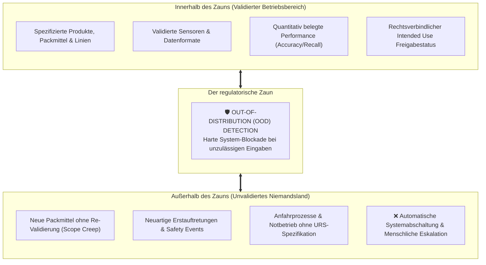

# Modul 05: Intended Use and Model Definition

🌐 **[English Version](../en/module_05_intended_use_model_definition.md)** &nbsp;|&nbsp; **[⬅ Modul 04: Risk Based Approach to AI](module_04_risk_based_approach.md)** &nbsp;|&nbsp; **[🏠 Inhaltsverzeichnis](00_overview.md)** &nbsp;|&nbsp; **[Modul 06: Data Governance and Data Quality ➔](module_06_data_governance_quality.md)**

---

## 🧭 Kernkonzept im Überblick: Die Zaun-Metapher & Scope-Schutz

---

## 🎯 Lernziele & Leitfragen
1. **Warum ist die *Intended Use Specification* das „vertragliche Herzstück“ eines KI-Systems unter Annex 22?**
2. **Aus welchen Pflichtkomponenten besteht die Anatomie einer wasserdichten *Intended Use Specification*?**
3. **Wie ergänzt die technische Modell-Definition (*Model Definition*) die betriebliche Zweckbestimmung?**
4. **Was passiert bei schleichender Ausweitung der Nutzung (*Scope Creep*) in der Praxis?**
5. **Wie reagieren Inspektoren auf vage Absichtserklärungen im Vergleich zu präzisen Abgrenzungen?**

---

## 📌 Fachliche Zusammenfassung (Key Takeaways)

### 1. Das vertragliche Herzstück (*The Contractual Heart*)
- **Kein Marketingtext:** Der *Intended Use* ist kein unverbindliches Projektdokument, sondern eine **rechtlich bindende regulatorische Verpflichtung**.
- **Die Metapher des Zauns:** Der *Intended Use* bildet einen eng gesteckten Zaun.
  - *Innerhalb des Zauns:* Validierter, sicherer, behördlich autorisierter Betriebsbereich.
  - *Außerhalb des Zauns:* Nicht validiertes Niemandsland, in dem das Modell keinesfalls Entscheidungen treffen darf.
- **Konsequenz für das Audit:** Was ein Inspektor als erstes sehen will, ist diese Spezifikation. Jede spätere Validierungsmetrik und Teststrategie hängt direkt davon ab.

### 2. Die Anatomie einer wasserdichten *Intended Use Specification*
Eine vage Sprache ist der größte Feind bei Audits. Eine vollständige Spezifikation nach Annex 22 muss zwingend folgende 6 Elemente enthalten:

1. **Decision Scope (Entscheidungsumfang):** Welche exakte Entscheidung oder Empfehlung darf die KI aussprechen (z.B. Einstufung einer Abweichung in *Minor* vs. *Major*)?
2. **Operational Context (Betriebskontext):** Genaue Zuordnung zu Produktionslinie, Anlagennummer, Produktfamilie und Darreichungsform.
3. **Input Data Sources:** Exakte Definition aller Sensoren, Datenformate, Auflösungen und Schnittstellen, die das System speisen.
4. **Output & Downstream Use:** Wohin fließt die Ausgabe und wer verarbeitet sie weiter?
5. **Quantitative Performance Expectations:** Harte, messbare Zielwerte für Genauigkeit, Sensitivität, Spezifität (*Precision / Recall*).
6. **Out-of-Scope Conditions (Ausschlusskriterien):** Präzise Definition jener Bedingungen, bei denen die KI **sofort stoppen und die Entscheidung verweigern muss**.

> **Praxisbeispiel für Out-of-Scope-Grenzen:**
> - Eine Abweichungs-KI darf Routine-Abweichungen triagieren, schließt aber personelle Sicherheitsvorfälle (*Safety Events*) oder neuartige Erstauftretungen (*First-of-Kind Issues*) kategorisch aus. Taucht ein solches Ereignis auf, verweigert die KI die Klassifikation und schaltet auf manuelle Bearbeitung um.

### 3. Die technische Modell-Definition (*Model Definition*)
Während der *Intended Use* den operativen Rahmen definiert, legt die *Model Definition* das exakte technische Artefakt fest (Kernaufgabe der IT / Data Science):
- **Algorithmenklasse:** Welcher Typ wird eingesetzt (z.B. Random Forest, CNN, Gradient Boosting)?
- **Data Lineage:** Lückenlose Rückverfolgbarkeit aller Trainings-, Validierungs- und Testdaten (ALCOA+).
- **Hyperparameter-Lock:** Feste Fixierung aller Trainings- und Modellparameter (*Frozen Weights*).
- **Eindeutige Modellversion:** Eine unveränderliche (*immutable*) Versionskennung (z.B. Git-Commit-Hash + Model Registry ID).
  - *Audit-Anforderung:* Ein Betrieb muss in der Lage sein, eine vor drei Jahren getroffene Chargenentscheidung mit genau diesem damaligen Modellzustand exakt zu reproduzieren!

### 4. Reale Katastrophenszenarien: Die Gefahr von *Scope Creep*
- **Der Fall der Stabilitätsfotos:** Ein Labor validierte ein KI-Bildanalysesystem für Stabilitätsprüfungen an einer spezifischen Blisterart. Mit der Zeit nutzten Labormitarbeiter die KI „auf gut Glück“ auch für andere Packmitteltypen, weil es ja augenscheinlich funktionierte (*Scope Creep*).
  - *Ergebnis bei Inspektion:* Schwerer Mangel (*Major Finding*), Stilllegung des Systems und Zwang zur Neubewertung aller historischen Studien!
- **Wiederanlauf nach Stromausfall:** Eine Predictive-Maintenance-KI versagte nach einem Werksstillstand am Wochenende, weil der Anfahrprozess nicht im *Intended Use* definiert und validiert war $\rightarrow$ Ausfall kritischer Sonden.
- **Multi-Site-Diskrepanz:** Gleiche Software an zwei Standorten mit unterschiedlichen betrieblichen Einsatzgrenzen führte zu systemischen Abweichungen im Qualitätsnetzwerk.

### 5. Die Inspektorenperspektive
- **Vage Formulierungen als Einladung zum Graben:** Phrasen wie *„unterstützt Qualitätsentscheidungen“* oder *„optimiert den Prozess“* signalisieren dem Inspektor sofort mangelnde Beherrschung.
- **Die Schere zwischen Papier und Realität:** Inspektoren suchen gezielt nach der Lücke zwischen dem, was im Dokument steht, und dem, was Bediener an der Linie tatsächlich tun.
- **Sicherheitsanker:** Ein technisch implementierter Algorithmus zur Erkennung von Grenzüberschreitungen (*Out-of-Distribution Detection*), der unzulässige Eingaben hart blockiert, ist der beste Beweis für Reife.

---

## 💡 Zentrale Fachbegriffe & Konzepte (Glossar)

| Begriff | Definition & Annex-22-Bedeutung |
| :--- | :--- |
| **Intended Use** | Rechtsverbindliche Spezifikation des zugelassenen Zwecks und der Einsatzgrenzen eines KI-Systems. |
| **Scope Creep** | Die unkontrollierte, informelle Ausweitung des Systembetriebs über die validierten Grenzen hinaus. |
| **Out-of-Scope Conditions** | Explizit spezifizierte Betriebszustände, bei denen die KI zwingend abschalten bzw. an Menschen übergeben muss. |
| **Data Lineage** | Der lückenlose Herkunftsnachweis von Trainings- und Testdaten von der Quelle bis zum fertigen Modell. |
| **Immutable Version** | Ein unveränderlich archivierter Modellstand, der forensische Reproduzierbarkeit über Jahre garantiert. |

---

## 📋 GxP-Compliance Checklist & Kontrollfragen

- [ ] Liegt eine schriftlich genehmigte *Intended Use Specification* vor Beginn des technischen Rollouts vor?
- [ ] Enthält die Spezifikation klare, quantitative Akzeptanzkriterien (Genauigkeit/Sensitivität)?
- [ ] Sind die *Out-of-Scope Conditions* eindeutig beschrieben (z.B. Randbedingungen, bei denen die KI abschaltet)?
- [ ] Blockiert das System Eingabedaten, die außerhalb des validierten Rahmens liegen, automatisch?
- [ ] Ist die Modellversion unveränderlich in einer Model Registry mit Trainingsdaten-Lineage archiviert?
- [ ] Wurde das Bedienpersonal geschult, das System niemals außerhalb des definierten Scopes einzusetzen?

---

🌐 **[English Version](../en/module_05_intended_use_model_definition.md)** &nbsp;|&nbsp; **[⬅ Modul 04: Risk Based Approach to AI](module_04_risk_based_approach.md)** &nbsp;|&nbsp; **[🏠 Inhaltsverzeichnis](00_overview.md)** &nbsp;|&nbsp; **[Modul 06: Data Governance and Data Quality ➔](module_06_data_governance_quality.md)**

