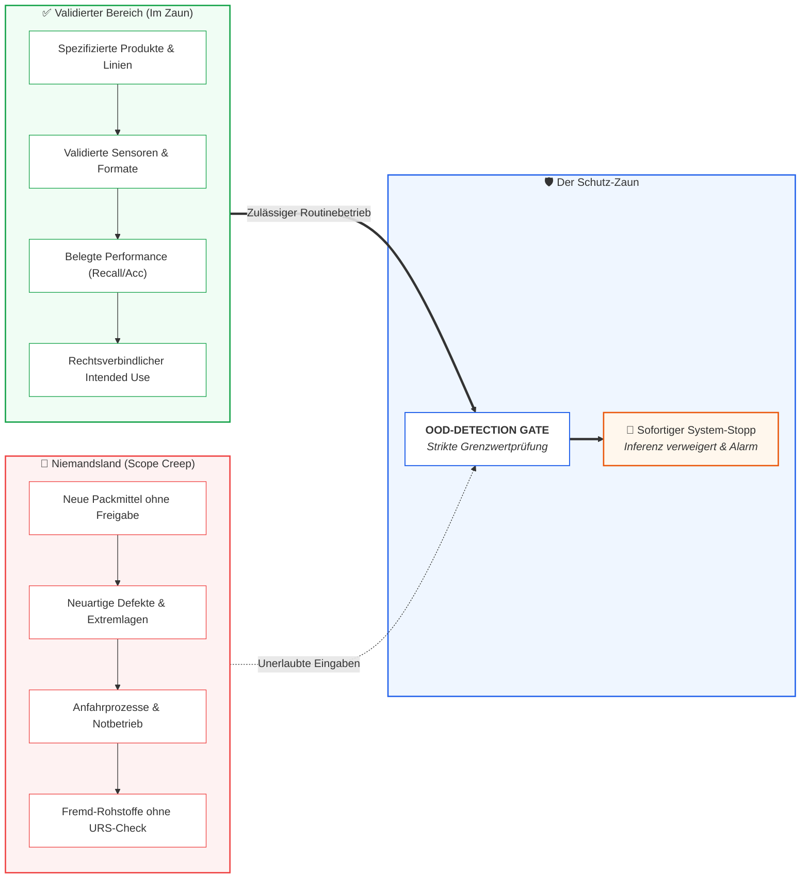

# Modul 05: Intended Use and Model Definition

🌐 **[English Version](../en/module_05_intended_use_model_definition.md)** &nbsp;|&nbsp; **[⬅ Modul 04: Risk Based Approach to AI](module_04_risk_based_approach.md)** &nbsp;|&nbsp; **[🏠 Inhaltsverzeichnis](00_overview.md)** &nbsp;|&nbsp; **[Modul 06: Data Governance and Data Quality ➔](module_06_data_governance_quality.md)**

---

## 🧭 Kernkonzept im Überblick: Die Zaun-Metapher & Scope-Schutz

---

## 🎯 Lernziele & Leitfragen
1. **Warum ist die *Intended Use Specification* das „vertragliche Herzstück“ eines KI-Systems unter Annex 22?**
2. **Aus welchen Pflichtkomponenten besteht die Anatomie einer wasserdichten *Intended Use Specification*?**
3. **Wie ergänzt die technische Modell-Definition (*Model Definition*) die betriebliche Zweckbestimmung?**
4. **Was passiert bei schleichender Ausweitung der Nutzung (*Scope Creep*) in der Praxis?**
5. **Wie reagieren Inspektoren auf vage Absichtserklärungen im Vergleich zu präzisen Abgrenzungen?**

---

## 📌 Fachliche Zusammenfassung (Key Takeaways)

### 1. Das regulatorische Herzstück: Intended Use & SME-Verantwortung ([Draft §3.1])
- **Regulatorische Vorgabe ([Draft §3.1]):** Der Verwendungszweck (*Intended Use*) des KI-Systems muss klar definiert und formal dokumentiert sein.
- **Aktive Einbindung von Prozess-SMEs ([Draft §3.1]):** Fachlich zuständige Prozess- und Domänenexperten (*Process Subject Matter Experts - SMEs*) müssen aktiv in die Definition des Intended Use eingebunden werden. Die Festlegung darf nicht isoliert der IT oder Data Science überlassen werden.
- **Die Metapher des Zauns ([Didaktik]):** Der *Intended Use* bildet einen eng gesteckten Zaun:
  - *Innerhalb des Zauns:* Qualifizierter, sicherer, behördlich autorisierter Betriebsbereich.
  - *Außerhalb des Zauns:* Nicht qualifiziertes Niemandsland, in dem das Modell keinesfalls Entscheidungen treffen darf.
- **Konsequenz für das Audit:** Der *Intended Use* ist das allererste Prüfdokument im Audit; alle nachfolgenden Akzeptanzkriterien ([Draft §4.2]) leiten sich direkt daraus ab.

### 2. Die Anatomie einer vollständigen *Intended Use Specification*
Eine präzise Spezifikation nach dem Draft Annex 22 umfasst folgende Kernbestandteile:

1. **Entscheidungsumfang & Rolle des Bedieners ([Draft §3.1, §3.3]):** Welche Entscheidung unterstützt oder trifft die KI? Liefert das System lediglich Input zu einer menschlichen Entscheidung und wurde der Testaufwand reduziert, gehört die genaue Rolle und Verantwortung des Bedieners zwingend in den Intended Use ([Draft §3.3]).
2. **Relevante Subgruppen & Populationen ([Draft §3.2]):** Relevante Teilgruppen von Daten, Produkten, Packmitteln oder Betriebsbedingungen, für die das System vorgesehen ist, müssen explizit identifiziert und beschrieben sein.
3. **Betriebskontext & Datenquellen:** Genaue Zuordnung zu Produktionslinien, Messstellen, Sensoren und Datenformaten.
4. **Output & Downstream Use:** Wohin fließen Vorhersagen, Alarme oder Klassifikationen und wie werden sie im QMS verarbeitet?
5. **Akzeptanzkriterien vor Testbeginn ([Draft §4.2]):** Vorab durch Prozess-SMEs genehmigte Zielwerte für die Modellleistung.
6. **Out-of-Scope Conditions ([Didaktik]):** Eindeutige Kriterien, bei denen das System den Betrieb verweigern und an qualifiziertes Personal übergeben muss (*Safe State*).

### 3. Die technische Modell-Definition (*Model Definition*)
Während der *Intended Use* den fachlichen Rahmen steckt, definiert die technische Modell-Definition das kontrollierte Artefakt:
- **Algorithmenklasse:** Angewandte statistische oder ML-Methoden.
- **Data Lineage:** Nachvollziehbarkeit aller Trainings- und Testkorpora.
- **Statisches Modell ([Draft Glossar]):** Eingefrorene Modellgewichte (*Frozen Weights*) nach Freigabe.
- **Konfigurationskontrolle ([Draft §10.2]):** Getestetes Modell unter Konfigurationskontrolle zur Erkennung unautorisierter Änderungen; Hyperparameter und Grenzwerte als Best Practice ([Best Practice: ML-Praxis]).

### 4. Reale Katastrophenszenarien: Die Gefahr von *Scope Creep*

> [!CAUTION]
> **Illustratives Praxisszenario (didaktisches Fallbeispiel, nicht belegt):** Ein Labor qualifizierte ein KI-Bildanalysesystem für Stabilitätsprüfungen an einer spezifischen Blisterart. Mit der Zeit nutzten Labormitarbeiter die KI auch für andere Packmitteltypen, weil es augenscheinlich funktionierte (*Scope Creep*). Ergebnis bei Inspektion: Schwerwiegender Mangel (*Major Deficiency*), Stilllegung des Systems und Zwang zur retrospektiven Neubewertung aller betroffenen Studien.

### 5. Die Inspektorenperspektive
- **Vage Formulierungen vermeiden:** Floskeln wie *„unterstützt Qualitätsentscheidungen“* laden Inspektoren zum tieferen Nachbohren ein.
- **Soll-Ist-Abgleich an der Linie:** Inspektoren prüfen, ob die praktische Bedienung an der Linie exakt den Vorgaben des genehmigten Intended Use entspricht.
- **Schutz vor Bereichsüberschreitung:** Technisch implementierte Sperren gegen unzulässige Eingaben (*Out-of-Distribution Detection*, [Best Practice: ML-Praxis]) belegen gelebte Risikobeherrschung.

---

## 💡 Zentrale Fachbegriffe & Konzepte (Glossar)

| Begriff | Definition & Annex-22-Bedeutung |
| :--- | :--- |
| **Intended Use** | Rechtsverbindliche Spezifikation des zugelassenen Zwecks und der Einsatzgrenzen eines KI-Systems. |
| **Scope Creep** | Die unkontrollierte, informelle Ausweitung des Systembetriebs über die validierten Grenzen hinaus. |
| **Out-of-Scope Conditions** | Explizit spezifizierte Betriebszustände, bei denen die KI zwingend abschalten bzw. an Menschen übergeben muss. |
| **Data Lineage** | Der lückenlose Herkunftsnachweis von Trainings- und Testdaten von der Quelle bis zum fertigen Modell. |
| **Immutable Version** | Ein unveränderlich archivierter Modellstand, der forensische Reproduzierbarkeit über Jahre garantiert. |

---

## 📋 GxP-Compliance Checklist & Kontrollfragen

- [ ] Liegt eine schriftlich genehmigte *Intended Use Specification* vor Beginn des technischen Rollouts vor?
- [ ] Enthält die Spezifikation klare, quantitative Akzeptanzkriterien (Genauigkeit/Sensitivität)?
- [ ] Sind die *Out-of-Scope Conditions* eindeutig beschrieben (z.B. Randbedingungen, bei denen die KI abschaltet)?
- [ ] Blockiert das System Eingabedaten, die außerhalb des validierten Rahmens liegen, automatisch?
- [ ] Ist die Modellversion unveränderlich in einer Model Registry mit Trainingsdaten-Lineage archiviert?
- [ ] Wurde das Bedienpersonal geschult, das System niemals außerhalb des definierten Scopes einzusetzen?

---

🌐 **[English Version](../en/module_05_intended_use_model_definition.md)** &nbsp;|&nbsp; **[⬅ Modul 04: Risk Based Approach to AI](module_04_risk_based_approach.md)** &nbsp;|&nbsp; **[🏠 Inhaltsverzeichnis](00_overview.md)** &nbsp;|&nbsp; **[Modul 06: Data Governance and Data Quality ➔](module_06_data_governance_quality.md)**

