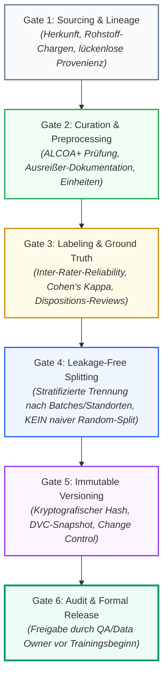

# Modul 06: Data Governance and Data Quality

**[⬅ Modul 05: Intended Use and Model Definition](module_05_intended_use_model_definition.md) &nbsp;|&nbsp; [🏠 Inhaltsverzeichnis](00_overview.md) &nbsp;|&nbsp; [Modul 07: AI Model Development and Training ➔](module_07_model_development_training.md)**

---

## 🎯 Lernziele & Leitfragen
1. **Das Substrat-Prinzip:** Warum sind Daten im Annex 22 kein passives Speicherartefakt, sondern der eigentliche „aktive pharmazeutische Wirkstoff (API)“ des Modells?
2. **ALCOA+ im KI-Kontext:** Welche erweiterten Kriterien (Completeness, Consistency, Enduring, Availability) fordert Annex 22 für Terabyte-große Trainingskorpora?
3. **Data Lineage & Bias:** Wie wird die Kette der Datenherkunft lückenlos nachgewiesen und welche 4 statistischen Biases gefährden Freigabeentscheidungen?
4. **Testdaten-Isolation:** Warum führen naive 80/20-Splits in Pharma-Daten fast immer zu Datenleckagen (*Data Leakage*) und Scheinvalidierungen?
5. **Operational Data Governance:** Warum sind Produktiv-Inferenzdaten vollwertige GMP-Aufzeichnungen und wie verhindert man gefährliche Feedback-Schleifen (*Model Collapse*)?

---

## 🧭 Visualisierung: Die 6 Quality Gates der AI-Datenpipeline

---

## 📌 Fachliche Zusammenfassung (Key Takeaways)

### 1. Die Kern-These: Daten sind das Substrat der KI
Im klassischen Software-Engineering (Annex 11) diktiert der programmierte Code die Logik. In Machine-Learning-Systemen hingegen **entsteht das Systemverhalten emergent aus den Trainingsdaten**. 
* **Analogie:** Daten sind nicht bloß Treibstoff, sondern das *Substrat* – der aktive Wirkstoff (API) der KI.
* **Konsequenz:** Ist das Substrat durch selektives Weglassen, unsaubere Transformationen oder Label-Fehler kontaminiert, ist der Output der KI unweigerlich toxisch (*Garbage In, Toxic Output Out*). Datenaufbereitung ist daher unter Annex 22 eine **hochgradig regulierte pharmazeutische Kerntätigkeit**.

### 2. ALCOA+ für KI-Systeme (Die Annex-22-Evolution)
Die klassischen Datenintegritätsprinzipien (Attributable, Legible, Contemporaneous, Original, Accurate) bleiben bestehen, werden aber für AI-Modelle um zwingende Dimensionen erweitert:

| ALCOA+ Attribut | Klassische CSV-Bedeutung | Spezifische Annex-22-Anforderung für KI |
| :--- | :--- | :--- |
| **Complete (Vollständig)** | Dokumente ohne fehlende Seiten | **Keine selektive Selektion:** Verwerfen von Prozessausreißern, fehlerhaften Batches oder Randwerten ohne formale Dokumentation und statistische Begründung ist strikt unzulässig. |
| **Consistent (Konsistent)** | Einheitliche Datums- & Namenskonventionen | **Metadaten-Harmonisierung:** Einheitliche Zeitstempel-Frequenzen, Messwertauflösungen und Einheiten über verschiedene Sensoren, Batches und Jahre hinweg. |
| **Enduring (Dauerhaft)** | Revisionssichere Archivierung | **Lebenszyklus-Archivierung:** Der exakte Trainings- und Testkorpus muss über die gesamte Lebensdauer des Modells plus die Aufbewahrungsfrist der damit freigegebenen Arzneimittelchargen revisionssicher aufbewahrt werden. |
| **Available (Verfügbar)** | Einsichtnahme bei Inspektionen | **Instant Retrieval trotz Datenvolumen:** Auch Multiterabyte-Trainingsdaten müssen für Inspektoren innerhalb realistischer Fristen auditierbar vorgelegt werden können. |

### 3. Data Lineage & Die 4 statistischen Biases
Wenn Auditoren nach der Herkunft der Trainingsdaten fragen, darf keine Rekonstruktionslücke existieren. 

> [!CAUTION]
> **Praxisfall:** Ein Pharmahersteller nutzte historische Daten aus 2 Jahren für ein KI-Chargenbewertungssystem. Bei einer behördlichen Inspektion konnte die exakte Zuordnung einzelner Messpunkte zu den Ursprungs-Batches und Vorverarbeitungsschritten nicht nachgewiesen werden. Die Folge: Schwerwiegende Mängelrüge (*Major Finding*), temporäre Aussetzung des Systems und 6 Monate aufwendige Sanierungsarbeiten (*Remediation*).

Eine lückenlose **Data Lineage** (z.B. implementiert über Tools wie Apache Atlas oder DataHub) ist das einzige Mittel, um die **vier großen statistischen Biases** aufzudecken:
1. **Sampling Bias:** Der Datensatz spiegelt nicht die tatsächliche Prozessvarianz der Routineproduktion wider (z.B. nur Gut-Chargen im Training).
2. **Time Bias:** Daten wurden während atypischer Zeiträume erhoben (z.B. kurz nach einem Rohstofflieferanten-Wechsel, saisonale Schwankungen oder Wartungszyklen).
3. **Site Bias:** Übergewichtung von Daten aus modernen Leuchtturm-Werken. Kleinere Produktionsstätten mit älteren Anlagen werden überfahren und produzieren im Feld Fehlalarme oder unbemerkte Qualitätsmängel.
4. **Operator Bias:** Daten stammen ausschließlich von hochqualifizierten Senior-Operatoren. Wenn Schicht-Neulinge an der Linie arbeiten, versagt das Modell.

### 4. Testdaten-Unabhängigkeit & Data Leakage
Ein zentraler Validierungsfehler in Data-Science-Teams ist der unbedarfte **naive Random-Split (z.B. zufälliges 80/20-Verhältnis)**.

* **Die Falle:** In pharmazeutischen Datensätzen hängen Datenpunkte stark zusammen (z.B. Zeitreihen aus derselben Charge oder NLP-Abweichungsberichte zu demselben Vorfall).
* **Data Leakage:** Werden Messungen derselben Charge zufällig auf Trainings- und Testdaten verteilt, „kennt“ das Modell die Eigenschaften der Charge bereits. Die Validierungsmetriken (Precision, Recall) sind künstlich überhöht (*Scheinvalidierung*).
* **Annex-22-Vorgabe:** Strikte **Hold-Out-Isolation**. Testdatensätze müssen auf Batch-Ebene oder Standort-Ebene stratifiziert werden und dürfen vom Modell vor der finalen OQ/PQ-Validierung niemals berührt worden sein (*Unseen Data*).
* **Label-Integrität:** Historische Batch-Freigaben oder manuelle Sichtprüfungen enthalten oft menschliche Fehlerraten (z.B. 15% Uneinigkeit bei Grenzfällen). Die KI lernt diese Inkonsistenz ungeprüft als Ground Truth. Labels müssen daher quantifiziert und überprüft werden (z.B. via *Cohen’s Kappa* / Inter-Rater Reliability).

### 5. Operational Data Governance & Feedback Loops
Der Datenintegritätsfokus endet nicht mit dem Go-Live:
* **GMP Record Status:** Jeder Inferenzaufruf in der Produktion (Inputdaten, errechnete Vorhersage, Konfidenzscore, Zeitstempel, Operator-ID) ist ein **offizieller GMP-Datensatz** nach Annex 11 / Annex 22.
* **Gefahr von Model Collapse (Feedback Loops):** Wenn Modellvorhersagen später unmarkiert in historische Datenbanken zurückfließen und für das nächste Retraining verwendet werden, trainiert die KI auf ihren eigenen Hypothesen. Die statistische Varianz bricht zusammen, Fehler verstärken sich selbstverstärkend (*Echo-Chamber-Effekt*).

---

## 💡 Zentrale Fachbegriffe & Konzepte (Glossar)

- **Substrate of AI:** Das fundamentale Datenkorpus, aus dem das Modellverhalten statistisch hervorgeht; analog zum pharmazeutischen Wirkstoff.
- **Data Lineage:** Die lückenlose, rückverfolgbare Kette aller Bearbeitungsschritte eines Datensatzes von der Rohquelle (Sensor, LIMS, MES) über Bereinigung und Transformation bis ins Trainingsmodell.
- **Data Leakage:** Das versehentliche Einfließen von Informationen aus dem Test-/Validierungsdatensatz in den Trainingsprozess, was zu trügerisch perfekten Testergebnissen führt.
- **Inter-Rater Reliability (Cohen's Kappa):** Statistisches Maß für die Übereinstimmung unabhängiger menschlicher Experten bei der Annotation von Trainingsdaten.
- **Hold-Out Test Set:** Ein streng isolierter Datensatz, der ausschließlich für die finale Performance-Bewertung genutzt und während des gesamten Trainings und der Hyperparameter-Optimierung weggesperrt wird.
- **Operational Feedback Loop:** Degenerativer Prozess, bei dem KI-Outputs unkontrolliert als Trainingsdaten für Folgegenerationen des Modells dienen (*Model Autophagy*).

---

## 📋 GxP-Compliance Checklist: Data Governance

### Absolute Must-Haves:
- [ ] Existiert für alle genutzten Datenquellen eine lückenlos dokumentierte **Data Lineage** von der Rohdatenquelle bis zum Trainings-Snapshot?
- [ ] Wurde vor Trainingsbeginn eine strukturierte **Bias-Bewertung** (Sampling, Time, Site, Operator Bias) durchgeführt und schriftlich bewertet?
- [ ] Werden Trainings-, Validierungs- und Testdatensätze über unveränderliche kryptografische Prüfsummen (Hashes) und Tools (z.B. DVC) versioniert?
- [ ] Wurde das Testdaten-Splitting so aufgesetzt, dass Charge- oder Event-Cluster strikt getrennt sind (*Leakage-Free Grouped Splitting*)?
- [ ] Wurde die Güte und Konsistenz der Annotationen/Labels (Ground Truth) durch Inter-Rater-Analysen verifiziert?
- [ ] Werden alle operativen Inferenz-Inputs, Modell-Outputs und Konfidenzscores im laufenden Betrieb audit-trail-konform archiviert?

### Rote Flaggen bei Inspektionen (Red Flags):
- ❌ Trainingsdaten liegen als unversionierte CSV- oder Excel-Dateien auf Netzlaufwerken ohne Zugriffsschutz.
- ❌ Zufälliger 80/20-Train/Test-Split bei Zeitreihen- oder Batch-Daten ohne Nachweis der Leckagefreiheit.
- ❌ Historische Fehlchargen wurden kommentarlos aus dem Trainingsset gelöscht, um die Modellgenauigkeit zu schönen (*Selective Omission*).
- ❌ Keine Protokollierung der Modell-Inputs während des Produktivbetriebs („Nur der finale Batch-Status wird gespeichert“).

---

**[⬅ Modul 05: Intended Use and Model Definition](module_05_intended_use_model_definition.md) &nbsp;|&nbsp; [🏠 Inhaltsverzeichnis](00_overview.md) &nbsp;|&nbsp; [Modul 07: AI Model Development and Training ➔](module_07_model_development_training.md)**

