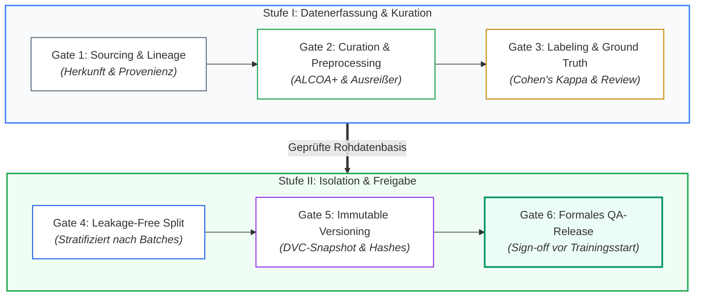

# Modul 06: Data Governance and Data Quality

🌐 **[English Version](../en/module_06_data_governance_quality.md)** &nbsp;|&nbsp; **[⬅ Modul 05: Intended Use and Model Definition](module_05_intended_use_model_definition.md) &nbsp;|&nbsp; [🏠 Inhaltsverzeichnis](00_overview.md) &nbsp;|&nbsp; [Modul 07: AI Model Development and Training ➔](module_07_model_development_training.md)**

---

## 🎯 Lernziele & Leitfragen
1. **Das Substrat-Prinzip:** Warum sind Daten im Annex 22 kein passives Speicherartefakt, sondern der eigentliche „aktive pharmazeutische Wirkstoff (API)“ des Modells?
2. **ALCOA+ im KI-Kontext:** Welche erweiterten Kriterien (Completeness, Consistency, Enduring, Availability) fordert Annex 22 für Terabyte-große Trainingskorpora?
3. **Data Lineage & Bias:** Wie wird die Kette der Datenherkunft lückenlos nachgewiesen und welche 4 statistischen Biases gefährden Freigabeentscheidungen?
4. **Testdaten-Isolation:** Warum führen naive 80/20-Splits in Pharma-Daten fast immer zu Datenleckagen (*Data Leakage*) und Scheinvalidierungen?
5. **Operational Data Governance:** Warum sind Produktiv-Inferenzdaten vollwertige GMP-Aufzeichnungen und wie verhindert man gefährliche Feedback-Schleifen (*Model Collapse*)?

---

## 🧭 Visualisierung: Die 6 Quality Gates der AI-Datenpipeline

---

## 📌 Fachliche Zusammenfassung (Key Takeaways)

### 1. Die Kern-These: Daten sind das Substrat der KI
Im klassischen Software-Engineering (Annex 11) diktiert der programmierte Code die Logik. In Machine-Learning-Systemen hingegen **entsteht das Systemverhalten emergent aus den Trainingsdaten**. 
* **Analogie:** Daten sind nicht bloß Treibstoff, sondern das *Substrat* – der aktive Wirkstoff (API) der KI.
* **Konsequenz:** Ist das Substrat durch selektives Weglassen, unsaubere Transformationen oder Label-Fehler kontaminiert, ist der Output der KI unweigerlich toxisch (*Garbage In, Toxic Output Out*). Datenaufbereitung ist daher unter Annex 22 eine **hochgradig regulierte pharmazeutische Kerntätigkeit**.

### 2. ALCOA+ für Trainingsdaten ([Best Practice: ISPE GAMP / GxP-Praxis])
*Hinweis zum Draft-Umfang: Der Draft EU GMP Annex 22 fokussiert primär auf Testdaten (§5.1–§5.6 und §6). Die Übertragung der ALCOA+-Kriterien auf vorgelagerte Trainingsdaten ist eine anerkannte Industrie-Best-Practice ([Best Practice]):*

| ALCOA+ Attribut | Klassische CSV-Bedeutung | Spezifische AI-Bedeutung ([Best Practice]) |
| :--- | :--- | :--- |
| **Complete (Vollständig)** | Dokumente ohne fehlende Seiten | **Keine unbegründete Selektion:** Verwerfen von Prozessausreißern, fehlerhaften Batches oder Randwerten ohne formale Dokumentation und Begründung ist unzulässig ([Draft §5.5 analog für Testdaten]). |
| **Consistent (Konsistent)** | Einheitliche Datums- & Namenskonventionen | **Metadaten-Harmonisierung:** Einheitliche Zeitstempel-Frequenzen, Messwertauflösungen und Einheiten über verschiedene Sensoren, Batches und Jahre hinweg. |
| **Enduring (Dauerhaft)** | Revisionssichere Archivierung | **Lebenszyklus-Archivierung ([Best Practice: GxP-Praxis]):** Entsprechend der Aufbewahrungsanforderung für Testdokumentation ähnlich anderer GMP-Dokumentation ([Draft §7.4]) müssen Datenkorpora über die Betriebslebensdauer des Systems plus produktbezogene Archivfristen aufbewahrt werden. |
| **Available (Verfügbar)** | Einsichtnahme bei Inspektionen | **Auditierbare Verfügbarkeit:** Trainings- und Testdaten müssen für Inspektoren innerhalb angemessener Fristen vorlegbar und nachvollziehbar sein. |

### 3. Data Lineage & Die 4 statistischen Biases ([Didaktik])
Wenn Auditoren nach der Herkunft der Trainingsdaten fragen, darf keine Rekonstruktionslücke existieren. 

> [!CAUTION]
> **Illustratives Praxisszenario (didaktisches Fallbeispiel, nicht belegt):** Ein Pharmahersteller nutzte historische Daten aus 2 Jahren für ein KI-Chargenbewertungssystem. Bei einer behördlichen Inspektion konnte die exakte Zuordnung einzelner Messpunkte zu den Ursprungs-Batches und Vorverarbeitungsschritten nicht nachgewiesen werden. Die Folge: Schwerwiegende Mängelrüge (*Major Finding*), temporäre Aussetzung des Systems und 6 Monate aufwendige Sanierungsarbeiten (*Remediation*).

Eine nachvollziehbare **Data Lineage** ist der Schlüssel, um statistische Biases zu identifizieren:
1. **Sampling Bias:** Der Datensatz spiegelt nicht die tatsächliche Prozessvarianz der Routineproduktion wider (z.B. nur Gut-Chargen im Training; vgl. Untergruppen nach [Draft §3.2]).
2. **Time Bias:** Daten wurden während atypischer Zeiträume erhoben (z.B. kurz nach einem Rohstofflieferanten-Wechsel, saisonale Schwankungen oder Wartungszyklen).
3. **Site Bias:** Übergewichtung von Daten aus modernen Werken; ältere Anlagen mit höherem Rauschen werden nicht abgebildet.
4. **Operator Bias:** Daten stammen nur von wenigen Bedienern; andere Schichtabläufe führen zu Modellunsicherheiten.

### 4. Synthetische Daten & Labels ([Draft §5.6])
- **Regulatorische Vorgabe ([Draft §5.6]):** Die Erzeugung von Testdaten oder Labels (z. B. durch generative KI) **wird nicht empfohlen** (*„Generation of test data or labels, e.g. by means of generative AI, is not recommended“*).
- **Strikte Begründungspflicht ([Draft §5.6]):** Jede Verwendung hierfür erzeugter Testdaten oder Labels muss vollumfänglich und belastbar begründet werden (*„any use hereof should be fully justified“*).
- **GxP-Auswirkung:** Der Draft beschränkt diese strikte Empfehlung explizit auf **Testdaten und Labels** (nicht generell auf Trainingsdaten, für die jedoch branchenübliche Begründungen und Bias-Analysen gelten [Best Practice]). In der Validierung muss für das finale Testen vorrangig auf reale, experimentell oder historisch belegte Produktionsdaten zurückgegriffen werden.

### 5. Regulatorische Vorgaben für Testdaten ([Draft §5.1–§5.6, §3.2])
Während der Draft keine detaillierten Vorgaben für Trainingsdaten formuliert, stellt er für **Testdatensätze** extrem strenge und präzise Anforderungen auf:
* **Auswahl & Repräsentativität ([Draft §5.1]):** Testdaten müssen repräsentativ für den gesamten Stichprobenraum (*full sample space*) des Intended Use sein und diesen erweitern. Sie müssen stratifiziert sein, alle Subgruppen einbinden und die Grenzen, die Komplexität sowie alle häufigen und seltenen Variationen innerhalb des Intended Use abbilden. Kriterien und Begründung für die Auswahl der Testdaten müssen dokumentiert werden.
* **Ausreichende Datensatzgröße ([Draft §5.2]):** Der Testdatensatz und jede seiner Subgruppen müssen eine ausreichende Größe aufweisen (*sufficient in size*), um die definierten Testmetriken mit angemessener statistischer Konfidenz zu berechnen.
* **Label-Verifikation mit hoher Korrektheit ([Draft §5.3]):** Die Kennzeichnung/Labeling der Testdaten muss nach einem Prozess verifiziert werden, der einen sehr hohen Grad an Korrektheit sicherstellt. Dies kann die unabhängige Verifikation durch mehrere Experten, validierte Messgeräte oder Labortests umfassen.
* **Vorab festgelegte Vorverarbeitung ([Draft §5.4]):** Jede Vorverarbeitung der Testdaten (z. B. Transformation, Normalisierung oder Standardisierung) muss vorab festgelegt sein (*pre-specified*). Es muss begründet werden, dass sie die realen Bedingungen des Intended Use repräsentiert.
* **Dokumentierte Bereinigung & Daten-Ausschluss ([Draft §5.5]):** Jede Bereinigung (*Cleaning*) oder jeder Ausschluss von Testdaten muss vollständig dokumentiert und stichhaltig begründet werden.
* **Erzeugung von Testdaten oder Labels ([Draft §5.6]):** Die Erzeugung von Testdaten oder Labels (z. B. mittels generativer KI) wird nicht empfohlen und jede Nutzung muss vollumfänglich begründet werden.
* **Relevante Subgruppen berücksichtigen ([Draft §3.2]):** Relevante Teilgruppen von Daten oder Populationen, für die das System vorgesehen ist, müssen im Intended Use identifiziert und in den Testdaten adäquat abgebildet sein.
* **Testdaten-Isolation & Data Leakage ([Draft §6.1, §6.2]):** Strikte Hold-Out-Isolation; Entwickler dürfen keine Testdaten für das Training oder Hyperparameter-Tuning einsehen.

### 6. Operational Data Governance & Feedback Loops
Der Datenintegritätsfokus endet nicht mit dem Go-Live:
* **GMP Record Status:** Jeder Inferenzaufruf in der Produktion (Inputdaten, errechnete Vorhersage, Konfidenzscore, Zeitstempel, Operator-ID) ist ein **offizieller GMP-Datensatz** nach Annex 11 / Annex 22.
* **Gefahr von Model Collapse (Feedback Loops):** Wenn Modellvorhersagen später unmarkiert in historische Datenbanken zurückfließen und für das nächste Retraining verwendet werden, trainiert die KI auf ihren eigenen Hypothesen. Die statistische Varianz bricht zusammen, Fehler verstärken sich selbstverstärkend (*Echo-Chamber-Effekt*).

---

## 💡 Zentrale Fachbegriffe & Konzepte (Glossar)

- **Substrate of AI:** Das fundamentale Datenkorpus, aus dem das Modellverhalten statistisch hervorgeht; analog zum pharmazeutischen Wirkstoff.
- **Data Lineage:** Die lückenlose, rückverfolgbare Kette aller Bearbeitungsschritte eines Datensatzes von der Rohquelle (Sensor, LIMS, MES) über Bereinigung und Transformation bis ins Trainingsmodell.
- **Data Leakage:** Das versehentliche Einfließen von Informationen aus dem Test-/Validierungsdatensatz in den Trainingsprozess, was zu trügerisch perfekten Testergebnissen führt.
- **Inter-Rater Reliability (Cohen's Kappa):** Statistisches Maß für die Übereinstimmung unabhängiger menschlicher Experten bei der Annotation von Trainingsdaten.
- **Hold-Out Test Set:** Ein streng isolierter Datensatz, der ausschließlich für die finale Performance-Bewertung genutzt und während des gesamten Trainings und der Hyperparameter-Optimierung weggesperrt wird.
- **Operational Feedback Loop:** Degenerativer Prozess, bei dem KI-Outputs unkontrolliert als Trainingsdaten für Folgegenerationen des Modells dienen (*Model Autophagy*).

---

## 📋 GxP-Compliance Checklist: Data Governance

### Absolute Must-Haves:
- [ ] Existiert für alle genutzten Datenquellen eine lückenlos dokumentierte **Data Lineage** von der Rohdatenquelle bis zum Trainings-Snapshot?
- [ ] Wurde vor Trainingsbeginn eine strukturierte **Bias-Bewertung** (Sampling, Time, Site, Operator Bias) durchgeführt und schriftlich bewertet?
- [ ] Werden Trainings-, Validierungs- und Testdatensätze über unveränderliche kryptografische Prüfsummen (Hashes) und Tools (z.B. DVC) versioniert?
- [ ] Wurde das Testdaten-Splitting so aufgesetzt, dass Charge- oder Event-Cluster strikt getrennt sind (*Leakage-Free Grouped Splitting*)?
- [ ] Wurde die Güte und Konsistenz der Annotationen/Labels (Ground Truth) durch Inter-Rater-Analysen verifiziert?
- [ ] Werden alle operativen Inferenz-Inputs, Modell-Outputs und Konfidenzscores im laufenden Betrieb audit-trail-konform archiviert?

### Rote Flaggen bei Inspektionen (Red Flags):
- ❌ Trainingsdaten liegen als unversionierte CSV- oder Excel-Dateien auf Netzlaufwerken ohne Zugriffsschutz.
- ❌ Zufälliger 80/20-Train/Test-Split bei Zeitreihen- oder Batch-Daten ohne Nachweis der Leckagefreiheit.
- ❌ Historische Fehlchargen wurden kommentarlos aus dem Trainingsset gelöscht, um die Modellgenauigkeit zu schönen (*Selective Omission*).
- ❌ Keine Protokollierung der Modell-Inputs während des Produktivbetriebs („Nur der finale Batch-Status wird gespeichert“).

---

🌐 **[English Version](../en/module_06_data_governance_quality.md)** &nbsp;|&nbsp; **[⬅ Modul 05: Intended Use and Model Definition](module_05_intended_use_model_definition.md) &nbsp;|&nbsp; [🏠 Inhaltsverzeichnis](00_overview.md) &nbsp;|&nbsp; [Modul 07: AI Model Development and Training ➔](module_07_model_development_training.md)**

