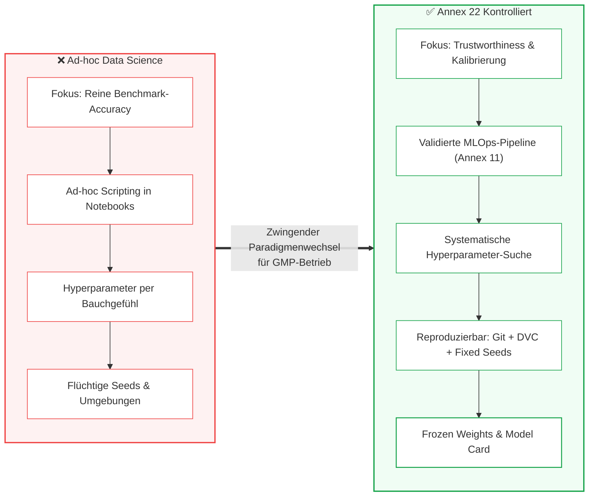

# Modul 07: AI Model Development and Training

🌐 **[English Version](../en/module_07_model_development_training.md)** &nbsp;|&nbsp; **[⬅ Modul 06: Data Governance and Data Quality](module_06_data_governance_quality.md) &nbsp;|&nbsp; [🏠 Inhaltsverzeichnis](00_overview.md) &nbsp;|&nbsp; [Modul 08: Validation and Performance Testing ➔](module_08_validation_performance_testing.md)**

---

## 🎯 Lernziele & Leitfragen
1. **Der Paradigmenwechsel:** Wie wandelt sich experimentelle Data Science (Geschwindigkeit, Benchmark-Jagd) in regulatorisch kontrolliertes GMP-Engineering?
2. **Die Reproduzierbarkeits-Pflicht:** Was bedeutet deterministische Rekonstruierbarkeit in stochastischen Lernverfahren und warum müssen Random Seeds und Library-Snapshots archiviert werden?
3. **MLOps als GxP-Infrastruktur:** Warum unterliegen Plattformen wie MLflow, SageMaker, Azure ML oder DVC der Validierungspflicht nach **EU GMP Annex 11**?
4. **Hyperparameter-Disziplin:** Warum ist das Bauchgefühl von Entwicklern kein Audit-Nachweis und weshalb dürfen Hyperparameter niemals auf dem Testdatensatz getunt werden?
5. **Model Calibration & Model Cards:** Warum führt eine unkalibrierte KI zu gefährlichem *Automation Bias* und wie standardisieren *Model Cards* den Inspektionsnachweis?

---

## 🧭 Visualisierung: Vom Ad-hoc-Experiment zum GxP-Modell

---

## 📌 Fachliche Zusammenfassung (Key Takeaways)

### 1. Der Paradigmenwechsel: Engineering Trust vs. Benchmark Speed
In der akademischen und kommerziellen Datenwissenschaft steht die maximale Vorhersagegenauigkeit (*Predictive Accuracy*) bei schneller Experimentiergeschwindigkeit im Vordergrund. 

Unter **EU GMP Annex 22** kollidiert dieser Ansatz frontal mit den pharmazeutischen Qualitätsprinzipien:
* **Entwicklungsdisziplin bestimmt Modellverhalten:** Nachgelagerte Validierungs- oder Monitoring-Mechanismen können ein Modell nicht heilen, das ohne saubere Ingenieursdisziplin trainiert wurde.
* **Zielgröße:** Optimiert wird nicht auf einen einmaligen Benchmark-Rekord, sondern auf **langfristige Zuverlässigkeit (Trustworthiness), Robustheit an Entscheidungsgrenzen und Audit-Fähigkeit**.
* Ein nachträgliches „Drüberstülpen“ von GxP-Disziplin über explorativen Entwicklungs-Code ist extrem teuer und scheitert in Inspektionen fast ausnahmslos.

### 2. Das statische Modell & Konfigurationskontrolle ([Draft Glossar, §10.2])
Die fundamentale Säule für den Einsatz in kritischen Prozessen ist das **statische Modell mit eingefrorenen Parametern** ([Draft Glossar: Static model]):
* **Definition nach [Draft Glossar]:** Ein statisches Modell verändert seine Parameter (Gewichte) nach Abschluss des Qualifizierungs- und Freigabeprozesses im Produktivbetrieb nicht mehr. Für denselben Input liefert es deterministisch denselben Output ([Draft §1]).
* **Konfigurationskontrolle ([Draft §10.2]):** Das getestete Modell muss vor dem Produktiveinsatz unter formale Konfigurationskontrolle gestellt werden, und es müssen wirksame Maßnahmen zur Erkennung unautorisierter Änderungen genutzt werden ([Draft §10.2]). Hyperparameter, Vorverarbeitungsschritte und Umgebungsfaktoren werden nach guter Praxis mitgeführt ([Best Practice: ISPE GAMP AI Guide]).
* **Archivierung von Artefakt & Inferenzumgebung ([Best Practice: ISPE GAMP AI Guide] [Auslegung]):**
  - In der modernen ML-Praxis (insb. bei Deep Learning auf GPU-Clustern) ist ein bitgenaues Neu-Trainieren von Grund auf über Jahre hinweg oft durch Fließkomma-Nichtdeterminismen erschwert.
  - Die regulatorisch belastbarste Lösung besteht daher darin, das **fertig trainierte und qualifizierte Modell-Artefakt** (binäre Gewichtsdateien, Checkpoints mit kryptografischem Hash) zusammen mit der **vollständigen Inferenz-Laufzeitumgebung** (Container-Image, fixe Library-Versionen) revisionssicher zu archivieren ([Best Practice: ISPE GAMP AI Guide]).
  - Ergänzend werden Code (Git-Commit-Hash), Daten-Snapshots und Random Seeds versioniert, um maximale Nachvollziehbarkeit sicherzustellen.

> [!CAUTION]
> **Illustratives Praxisszenario (didaktisches Fallbeispiel, nicht belegt):** Ein Unternehmen konnte im Rahmen einer Reklamationsuntersuchung die Entscheidung eines Modells für eine bestimmte Charge nicht aufklären, da Software-Bibliotheken zwischenzeitlich aktualisiert worden waren und weder das Modell-Artefakt noch die Umgebung fixiert waren. Die Unfähigkeit zur Rekonstruktion führte zu einer schweren behördlichen Mängelrüge (*Major Inspection Finding*).

### 3. MLOps & Cloud-Plattformen als validierungspflichtige GxP-Infrastruktur ([Draft §2.2, Annex 11])
Data-Science-Teams nutzen heute standardmäßig Cloud- und MLOps-Plattformen wie MLflow, Weights & Biases, DVC, AWS SageMaker oder Azure ML.
* **Regulatorische Konsequenz:** Werden diese Tools zur Entwicklung, Protokollierung oder Versionierung von Modellen genutzt, die pharmazeutische Entscheidungen beeinflussen, gelten sie als **Computerised Systems**.
* Sie unterliegen damit der Qualifizierungs- und Validierungspflicht nach **EU GMP Annex 11** (Zugriffskontrollen, Audit Trails, Datensicherheit, Disaster Recovery).
* **Lieferantenüberwachung ([Draft §2.2]):**
  * Eine einfache SOC-2- oder ISO-27001-Zertifizierung des Cloud-Anbieters reicht für GxP **nicht** aus.
  * Der regulierte pharmazeutische Anwender muss Dokumentationen für Aktivitäten externer Dienstleister beschaffen und formal überprüfen ([Draft §2.2]); die übergeordnete arzneimittelrechtliche Verantwortung verbleibt stets beim Hersteller. Über SLAs und Quality Agreements muss sichergestellt sein, dass Plattformänderungen nicht unkontrolliert ablaufen.

### 4. Hyperparameter-Tuning & Die goldene Validierungsregel
Hyperparameter (z.B. Lernrate, Baumtiefe, Epochenanzahl) steuern die mathematische Konvergenz:
* **Change Control Status:** Das qualifizierte Modell steht unter Konfigurationskontrolle ([Draft §10.2]). Nachträgliches Ändern von Parametern ohne formalen Change Control und Re-Testing-Bewertung ist unzulässig ([Draft §10.1]).
* **Die goldene Regel:** Hyperparameter dürfen **ausschließlich auf dem Validierungsdatensatz** optimiert werden – **niemals auf dem finalen Testdatensatz (Hold-out Test Set)**! Andernfalls entsteht *Data Leakage*, was zu Scheinvalidierungen führt.
* **Dokumentierte Suchmethodik:** Die gewählten Suchintervalle und Abbruchkriterien müssen nachvollziehbar begründet werden.

### 5. Modellkalibrierung & Model Cards ([Didaktik] / [ML-Praxis])
* **Calibration vs. Accuracy:** Ein Modell kann zu 85% akkurat sein, aber bei Vorhersagen eine Konfidenz von 99,9% ausgeben. Diese **Überkonfidenz (Overconfidence)** verleitet Bediener zu unkritischem Akzeptieren (*Automation Bias*). Modelle sollten daher auf Verlässlichkeit ihrer Konfidenzscores kalibriert werden.
* **Model Cards ([Didaktik] / [ML-Praxis]):** Zur strukturierten Dokumentation empfiehlt die ML-Praxis den Einsatz von **Model Cards** (analog zu einem technischen Datenblatt):
  - *Intended Use* und autorisierte Einsatzgrenzen ([Draft §3.1]),
  - Trainings- und Testdaten-Zusammensetzung und Version,
  - Performance- und Kalibrierungsmetriken,
  - Bekannte Limitierungen, systematische Schwächen und Out-of-Scope-Bedingungen.

---

## 💡 Zentrale Fachbegriffe & Konzepte (Glossar)

- **Reproducibility (Reproduzierbarkeit):** Die mathematische Fähigkeit, ein Modell unter identischen Eingangsbedingungen (Daten, Code, Seeds, Libraries) exakt identisch neu zu erschaffen.
- **Frozen Weights (Statische Modellgewichte):** Der nach Abschluss des Trainings eingefrorene Zustand der Modellparameter, der im GMP-Betrieb strikt unveränderlich bleibt.
- **Random Seed:** Ein numerischer Startwert für Pseudozufallszahlengeneratoren, der stochastische Berechnungen (z.B. Gewichtsinitialisierung, Mini-Batch-Shuffling) exakt wiederholbar macht.
- **Model Card:** Ein standardisiertes Dokumentationsartefakt (analog zu einem technischen Datenblatt), das Zweck, Leistung, Grenzen und Risiken eines KI-Modells für Inspektoren transparent macht.
- **Model Calibration (Modellkalibrierung):** Der Abgleich zwischen vorhergesagter Wahrscheinlichkeit (Konfidenz) und tatsächlicher Trefferquote (z.B. muss ein Ereignis mit 80% Konfidenz in 8 von 10 Fällen zutreffen).
- **Hyperparameter Optimization (HPO):** Systematischer, dokumentierter Prozess (z.B. Bayesian Optimization) zur Bestimmung der optimalen Modellkonfiguration ohne Verunreinigung des Testdatensatzes.

---

## 📋 GxP-Compliance Checklist: Model Development

### Absolute Must-Haves:
- [ ] Werden Code, Daten (Hash), Umgebung (Container) und **Random Seeds** für jeden Trainingslauf lückenlos versioniert?
- [ ] Sind genutzte MLOps-Plattformen (MLflow, Cloud ML Pipelines) als computergestützte Systeme nach **Annex 11 validiert**?
- [ ] Wurde das Hyperparameter-Tuning nachweislich strikt auf Validierungsdaten beschränkt und der Testdatensatz unberührt gelassen?
- [ ] Existiert ein schriftlicher Rationale-Bericht für den Suchraum und die Auswahl der finalen Hyperparameter?
- [ ] Wurde die statistische **Kalibrierung (Calibration Curve)** der Konfidenzscores verifiziert, um Overconfidence zu verhindern?
- [ ] Liegt für das Modell eine genehmigte, vollständige **Model Card** vor der Übernahme in die Validierungsphase vor?

### Rote Flaggen bei Inspektionen (Red Flags):
- ❌ Modellgewichte wurden in interaktiven Jupyter Notebooks erzeugt, ohne dass ein automatisierter, versionierter Pipeline-Lauf existiert.
- ❌ Keine Angabe oder Protokollierung von Random Seeds im Code („Ergebnis variiert bei jedem erneuten Ausführen minimal“).
- ❌ Hyperparameter wurden auf Basis des finalen Testdatensatzes angepasst, um die Kennzahlen für die Validierung zu schönen.
- ❌ Bibliotheken wurden ohne Versionsfixierung installiert (`pip install tensorflow` statt `tensorflow==2.15.0`).

---

🌐 **[English Version](../en/module_07_model_development_training.md)** &nbsp;|&nbsp; **[⬅ Modul 06: Data Governance and Data Quality](module_06_data_governance_quality.md) &nbsp;|&nbsp; [🏠 Inhaltsverzeichnis](00_overview.md) &nbsp;|&nbsp; [Modul 08: Validation and Performance Testing ➔](module_08_validation_performance_testing.md)**

