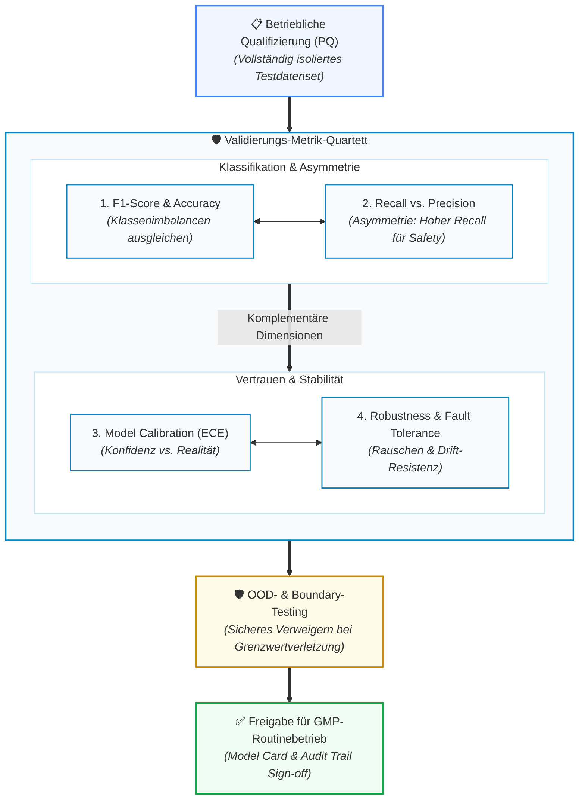

# Modul 08: Validation and Performance Testing

🌐 **[English Version](../en/module_08_validation_performance_testing.md)** &nbsp;|&nbsp; **[⬅ Modul 07: AI Model Development and Training](module_07_model_development_training.md) &nbsp;|&nbsp; [🏠 Inhaltsverzeichnis](00_overview.md) &nbsp;|&nbsp; [Modul 09: Explainability and Transparency ➔](module_09_explainability_transparency.md)**

---

## 🎯 Lernziele & Leitfragen
1. **Der CSV-Validierungsshift:** Warum greifen klassische deterministische Pass/Fail-Testskripte bei lernenden Modellen zu kurz und wie sieht statistische KI-Validierung aus?
2. **Das „Validation Metric Quad“:** Warum führt ein einzelner „Accuracy“-Wert zum Durchfallen bei Inspektionen und welche 4 Metriken fordert Annex 22 zwingend?
3. **Asymmetrische Fehlerkosten:** Warum priorisiert die pharmazeutische Industrie im Zweifelsfall immer *Recall* (Sensitivität) vor *Precision*?
4. **Boundary Condition & OOD Testing:** Wie wird das Modellverhalten bei Grenzwertverletzungen (*Edge Cases*) und Out-of-Distribution-Zuständen in der Performance Qualification (PQ) getestet?
5. **Inspektionsfeste Traceability:** Wie muss der Prüfbericht strukturiert sein, damit Auditoren jede Kennzahl bis zum einzelnen Test-Datenpunkt durchbohren können?

---

## 🧭 Visualisierung: Das Annex 22 „Validation Metric Quad“

---

## 📌 Fachliche Zusammenfassung (Key Takeaways)

### 1. Der Paradigmenwechsel: Von deterministischen Skripten zu statistischer Validierung
In der klassischen **Computer System Validation (CSV nach Annex 11)** genügte ein deterministisches Testskript: 
$$\text{Input } X \longrightarrow \text{Erwarteter Output } Y \quad (\text{Pass / Fail})$$

KI-Systeme verarbeiten jedoch multivariat und stochastisch:
* Die Frage lautet nicht mehr nur: *„Macht das System genau das, was programmiert wurde?“*, sondern: **„Verhält sich das Modell über alle repräsentativen und extremen Betriebszustände hinweg statistisch stabil und zuverlässig?“**
* **Lebenszyklus-Pflicht:** Validierung unter Annex 22 ist kein einmaliges Zertifikat vor dem Go-Live, sondern ein Zustand, der kontinuierlich gegen Leistungsabfall verteidigt werden muss. Jede Anpassung von Datenquellen, Vorverarbeitungsschritten oder Parametern triggert eine Revalidierungspflicht.

### 2. Das Validierungs-Metrik-Quartett (The Metric Quad) ([Didaktik])
Ein Inspektionsbericht, der lediglich eine globale Trefferquote (*Accuracy = 95%*) ausweist, gilt im GxP-Umfeld als **unzulänglich**. Bei unbalancierten pharmazeutischen Daten (z.B. 99,8% Gut-Chargen und 0,2% Defekt-Chargen) hätte ein Modell, das stur immer „Gut“ rät, eine Trefferquote von 99,8% – wäre aber für die Patientensicherheit fatal.

Das didaktische Metrik-Quartett ([Didaktik]) empfiehlt vier komplementäre Dimensionen:
1. **F1-Score / Balanced Accuracy:** Harmonisches Mittel aus Precision und Recall, das Klassen-Ungleichgewichte neutralisiert.
2. **Recall (Sensitivität) vs. Precision:**
   - **Asymmetrische Fehlerkosten:** Im Pharmabereich ist ein *False Negative* (eine kontaminierte Charge wird fälschlich als „Gut“ freigegeben) potenziell lebensbedrohlich. Ein *False Positive* kostet manuelle Nachprüfzeit.
   - Schwellenwerte (*Decision Thresholds*) werden primär auf **hohen Recall** ausgelegt, um Sicherheitsvorfälle zuverlässig abzufangen.
3. **Modell-Kalibrierung (Expected Calibration Error - ECE, [Best Practice]):**
   - Gibt an, ob der ausgegebene Konfidenzscore der tatsächlichen Eintrittswahrscheinlichkeit entspricht.
   - Ein unkalibriertes Modell, das bei Fehlentscheidungen 99% Konfidenz ausgibt, wiegt Personal in falscher Sicherheit (*Automation Bias*).
4. **Robustheit (Robustness):**
   - Überprüfung des Modellverhaltens bei Sensorrauschen, Messwertlücken und Signalschwankungen.

### 3. Akzeptanzkriterien & Kein Rückschritt gegenüber dem ersetzten Prozess ([Draft §4.2, §4.3])
* **Vorabgenehmigung durch Prozess-SME ([Draft §4.2]):** Alle Akzeptanzkriterien für die definierten Testmetriken müssen vor Testbeginn festgelegt und von fachlich zuständigen Prozess-SMEs genehmigt sein. Anhand dieser Kriterien wird entschieden, ob das Modell für den Intended Use geeignet ist.
* **Kein Kriterien-Rückschritt gegenüber dem ersetzten Prozess ([Draft §4.3]):** Die Akzeptanzkriterien eines Modells müssen mindestens so hoch angesetzt werden wie die Leistungsfähigkeit des Prozesses, den das Modell ersetzt. Dies setzt voraus, dass die Performance des zu ersetzenden Prozesses quantitativ bekannt ist (vgl. Annex 11, Ziffer 2.7).

### 4. Personelle Unabhängigkeit & Testdaten-Sicherung ([Draft §6.1–§6.5])
Der Schutz der Testdaten vor Verfälschung oder unbewusster Überanpassung ist ein zentraler Prüfschwerpunkt:
* **Unabhängige Testdaten ([Draft §6.1]):** Das Testen des Modells muss zwingend mit Daten erfolgen, die unabhängig sind, d. h. die nicht während der Entwicklung, des Trainings oder der modellinternen Validierung (*validation dataset*) verwendet wurden.
* **Zugriffsbeschränkung für Entwickler ([Draft §6.2]):** Wurden Testdaten vor dem Training aus einem Gesamtdatenpool abgetrennt (*Data Split*), dürfen Mitarbeiter, die an Entwicklung und Training beteiligt sind, zu keinem Zeitpunkt Zugriff auf die Testdaten gehabt haben.
* **Zugriffskontrollen, Audit Trail & Kopierschutz ([Draft §6.2]):** Testdaten müssen durch technische und/oder organisatorische Zugriffskontrollen sowie Audit Trails geschützt werden. Es dürfen keine Kopien der Testdaten außerhalb des gesicherten Repositories existieren.
* **Protokollierung der Testdatennutzung ([Draft §6.3]):** Es muss genau aufgezeichnet werden, welche Daten für Tests verwendet wurden, wann und wie oft.
* **Testdaten aus physischen Objekten ([Draft §6.4]):** Stammen Testdaten von physischen Objekten (z. B. Probenflaschen, Vials, Tabletten), muss sichergestellt sein, dass die für den finalen Test genutzten Objekte nicht zuvor zum Trainieren oder Validieren des Modells verwendet wurden, es sei denn, die gemessenen Merkmale sind voneinander unabhängig.
* **Personelle Unabhängigkeit & Vier-Augen-Prinzip ([Draft §6.5]):** Es müssen wirksame Kontrollen implementiert sein, um zu verhindern, dass Mitarbeiter mit Testdatenzugriff am Training oder an der Validierung desselben Modells mitwirken.
  - *Ausnahme bei kleineren Organisationen ([Draft §6.5]):* Ist eine vollständige personelle Trennung organisatorisch unmöglich, darf ein Mitarbeiter mit Testdatenzugriff nur dann an Training/Validierung mitwirken, wenn er im Paar mit einem Kollegen zusammenarbeitet, der keinen Testdatenzugriff hatte (Vier-Augen-Prinzip / 4-Eyes Principle). Die formale Etablierung vollständig getrennter Teams gilt als didaktisch empfohlene Organisationsstruktur ([Didaktik]).

### 5. Testausführung & Testdokumentation ([Draft §7.1–§7.4])
* **Eignung für den Intended Use & Generalisierung ([Draft §7.1]):** Der Test muss sicherstellen, dass das Modell für den Verwendungszweck geeignet ist und gut generalisiert (*„generalising well“*), d. h. eine zufriedenstellende Leistung bei neuen Daten aus dem Intended Use erbringt. Dies schließt die Erkennung von möglichem Overfitting oder Underfitting auf die Trainingsdaten ein.
* **Freigegebener Testplan unter SME-Einbindung ([Draft §7.2]):** Vor Testbeginn muss ein formaler Testplan erstellt und genehmigt werden. Er enthält eine Zusammenfassung des Intended Use, die vordefinierten Metriken und Akzeptanzkriterien, Referenzen auf die Testdaten, ein Testskript mit allen erforderlichen Durchführungsschritten sowie die Berechnungsmethode für die Metriken. Fachlich zuständige Prozess-SMEs müssen aktiv in die Planerstellung eingebunden sein.
* **Abweichungsmanagement & Auslassungen ([Draft §7.3]):** Jede Abweichung vom Testplan, jedes Verfehlen von Akzeptanzkriterien und jede Nichtverwendung geplanter Testdaten muss formal dokumentiert, untersucht und vollständig begründet werden.
* **Aufbewahrung der Testdokumentation ([Draft §7.4]):** Sämtliche Testdokumentationen müssen zusammen mit der Beschreibung des Intended Use, der Testdaten-Charakterisierung, den eigentlichen Testdaten und ggf. physischen Testobjekten aufbewahrt werden. Dokumentationen zu Zugriffskontrollen und Audit-Trail-Aufzeichnungen sind ähnlich wie andere GMP-Dokumentation aufzubewahren.
* *Code-Repositories & Traceability ([Best Practice: ISPE GAMP AI Guide]):* Die Führung des gesamten Modell- und Validierungscodes unter Versionskontrolle in gesicherten Repositories sowie die Bewertung von Drittanbieter-Bibliotheken sind etablierte Best Practices, werden im Draft selbst jedoch nicht gesondert geregelt.

### 6. Konfidenz-Logging & Schwellenwerte ([Draft §9.1, §9.2])
* **Logging des Confidence-Scores beim Testen ([Draft §9.1]):** Beim Testen eines Modells zur Vorhersage oder Klassifikation von Daten muss das System, wo anwendbar, den Konfidenz-Score (*Confidence Score*) des Modells für jedes Vorhersage- oder Klassifikationsergebnis aufzeichnen und protokollieren.
* **Angemessene Schwellenwerte & Kennzeichnung als 'undecided' ([Draft §9.2]):** Modelle zur Prädiktion oder Klassifikation müssen eine angemessene Schwellenwerteinstellung (*Threshold Setting*) aufweisen, um sicherzustellen, dass Vorhersagen oder Klassifikationen nur dann getroffen werden, wenn dies geeignet ist. Ist der Konfidenz-Score sehr niedrig, sollte in Betracht gezogen werden, dass das Modell das Ergebnis als unentschieden (*'undecided'*) kennzeichnet, anstatt potenziell unzuverlässige Vorhersagen oder Klassifikationen zu treffen.
* *Operator-Training zu Grenzen und Overrides ([Draft §3.3] / [Best Practice]):* Wurde der Testaufwand unter Verweis auf menschliche Aufsicht reduziert, muss das Personal in den Grenzen und Fehlermodi des Modells geschult und überwacht werden ([Draft §3.3]). Das gezielte Schulen von Überstimmungen (*Override Training*) stellt eine bewährte Branchenpraxis dar ([Best Practice / GxP-Praxis]).

### 7. Boundary Condition Testing & Out-of-Distribution (OOD) Protection
Eine Qualifizierung darf sich nicht auf „Schönwetter-Szenarien“ (*Sunny Day Testing*) beschränken:
* **Fault Injection Testing:** Während der Performance Qualification (PQ) werden gezielt defekte Eingangsdaten, verfälschte Sensorwerte und Signalabbrüche simuliert.
* **OOD-Erkennungslogik:** Das Modell muss nachweislich in der Lage sein, zu erkennen, wenn ein Datenpunkt außerhalb des spezifizierten *Intended Use* liegt (*Out-of-Distribution*).
* **Graceful Degradation:** Statt im unbekannten Raum blind weiterzuraten, muss das System die Vorhersage sicher verweigern (*Safe State*) und die Kontrolle mit einer Alarmmeldung an den qualifizierten Menschen übergeben.

### 8. Evidenz-Rückverfolgbarkeit (Drill-Down Capability)
Für Behördeninspektoren (EMA, FDA) ist die formale Struktur der Validierungsdokumentation entscheidend:
* Ein Auditor muss in der Lage sein, ausgehend von einer Metrik im Executive Summary über die Konfusionsmatrix bis hin zu den **konkreten Rohdatenpunkten des Testsets** durchzudringen (*Drill-Down*).
* Fehlt dieser lückenlose Nachweis oder basiert die Validierung auf undokumentierten Skripten, gilt der gesamte Validierungsnachweis als kontaminiert.

---

## 💡 Zentrale Fachbegriffe & Konzepte (Glossar)

- **Statistical AI Validation:** Validierungskonzept, das Modelle über multivariate, statistische Testverfahren auf ungesehenen Daten qualifiziert, anstatt starre Einzelschritt-Skripte abzuarbeiten.
- **Staff Independence (Personelle Unabhängigkeit):** Die organisatorische Trennung zwischen dem Entwicklerteam des Modells und den Testern, die den formalen Validierungs- und OQ/PQ-Test planen und bewerten.
- **Recall (Sensitivität):** Anteil der tatsächlich fehlerhaften Einheiten, die das Modell korrekt als solche erkennt ($\frac{TP}{TP + FN}$).
- **Precision (Genauigkeit der Positivmeldung):** Anteil der vom Modell als fehlerhaft gemeldeten Einheiten, die tatsächlich defekt sind ($\frac{TP}{TP + FP}$).
- **Expected Calibration Error (ECE):** Statistisches Maß für die Differenz zwischen der vom Modell gemeldeten Vorhersagesicherheit (Konfidenz) und der tatsächlichen Fehlerhäufigkeit.
- **Fault Injection Testing:** Gezieltes Einschleusen künstlicher Fehler (z.B. Sensorrauschen, Nullwerte, extreme Spikes), um das Sicherheitsverhalten der Gesamtanlage zu qualifizieren.
- **Graceful Degradation:** Das kontrollierte, sichere Herunterstufen der Systemfunktion bei Fehlern oder OOD-Eingaben ohne abrupten Absturz oder unbemerkte Fehlleistung.

---

## 📋 GxP-Compliance Checklist: Validation & Testing

### Absolute Must-Haves:
- [ ] Wurden quantitative Akzeptanzkriterien für das gesamte **Metric Quad** (F1, Recall, Precision, ECE) vor dem Testlauf verbindlich genehmigt?
- [ ] Wurde das Modell ausschließlich auf einem echten, bisher **ungesehenen Hold-out Test Set** validiert?
- [ ] Wurde die formale Validierung von **organisatorisch unabhängigem Personal (Staff Independence)** durchgeführt?
- [ ] Wurde die OOD-Logik (*Out-of-Distribution Detection*) mit echten Grenzwert- und Stördaten qualifiziert?
- [ ] Wurden Fault-Injection-Tests durchgeführt, um das sichere Übergabeverhalten (*Graceful Degradation*) an den Menschen zu beweisen?
- [ ] Ist der Validierungsbericht lückenlos rückverfolgbar (vom KPI im Fließtext bis zur Rohdaten-Zeile des Testsets)?
- [ ] Liegt ein formal genehmigter Revalidierungsplan für den Fall von Drift oder Datenänderungen vor?

### Rote Flaggen bei Inspektionen (Red Flags):
- ❌ Vorlage eines Validierungsberichts, der sich ausschließlich auf eine globale „Accuracy“-Zahl stützt.
- ❌ Akzeptanzkriterien wurden erst formuliert oder nachträglich gesenkt, nachdem die Testergebnisse vorlagen.
- ❌ Das Modell gibt bei Grenzwertüberschreitungen unreflektiert Vorhersagen mit hoher Konfidenz aus.
- ❌ Testdaten wurden mehrfach während des Entwicklungsprozesses zur Modelloptimierung herangezogen (*Data Leakage*).

---

🌐 **[English Version](../en/module_08_validation_performance_testing.md)** &nbsp;|&nbsp; **[⬅ Modul 07: AI Model Development and Training](module_07_model_development_training.md) &nbsp;|&nbsp; [🏠 Inhaltsverzeichnis](00_overview.md) &nbsp;|&nbsp; [Modul 09: Explainability and Transparency ➔](module_09_explainability_transparency.md)**

