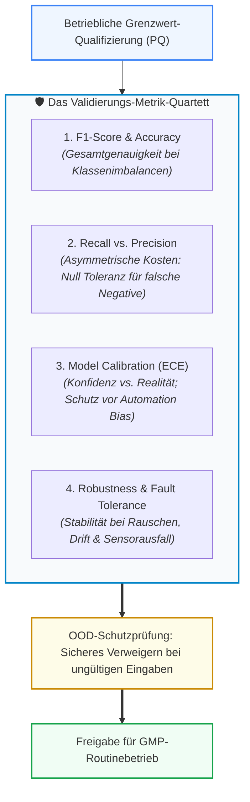

# Modul 08: Validation and Performance Testing

🌐 **[English Version](../en/module_08_validation_performance_testing.md)** &nbsp;|&nbsp; **[⬅ Modul 07: AI Model Development and Training](module_07_model_development_training.md) &nbsp;|&nbsp; [🏠 Inhaltsverzeichnis](00_overview.md) &nbsp;|&nbsp; [Modul 09: Explainability and Transparency ➔](module_09_explainability_transparency.md)**

---

## 🎯 Lernziele & Leitfragen
1. **Der CSV-Validierungsshift:** Warum greifen klassische deterministische Pass/Fail-Testskripte bei lernenden Modellen zu kurz und wie sieht statistische KI-Validierung aus?
2. **Das „Validation Metric Quad“:** Warum führt ein einzelner „Accuracy“-Wert zum Durchfallen bei Inspektionen und welche 4 Metriken fordert Annex 22 zwingend?
3. **Asymmetrische Fehlerkosten:** Warum priorisiert die pharmazeutische Industrie im Zweifelsfall immer *Recall* (Sensitivität) vor *Precision*?
4. **Boundary Condition & OOD Testing:** Wie wird das Modellverhalten bei Grenzwertverletzungen (*Edge Cases*) und Out-of-Distribution-Zuständen in der Performance Qualification (PQ) getestet?
5. **Inspektionsfeste Traceability:** Wie muss der Prüfbericht strukturiert sein, damit Auditoren jede Kennzahl bis zum einzelnen Test-Datenpunkt durchbohren können?

---

## 🧭 Visualisierung: Das Annex 22 „Validation Metric Quad“

---

## 📌 Fachliche Zusammenfassung (Key Takeaways)

### 1. Der Paradigmenwechsel: Von deterministischen Skripten zu statistischer Validierung
In der klassischen **Computer System Validation (CSV nach Annex 11)** genügte ein deterministisches Testskript: 
$$\text{Input } X \longrightarrow \text{Erwarteter Output } Y \quad (\text{Pass / Fail})$$

KI-Systeme verarbeiten jedoch multivariat und stochastisch:
* Die Frage lautet nicht mehr nur: *„Macht das System genau das, was programmiert wurde?“*, sondern: **„Verhält sich das Modell über alle repräsentativen und extremen Betriebszustände hinweg statistisch stabil und zuverlässig?“**
* **Lebenszyklus-Pflicht:** Validierung unter Annex 22 ist kein einmaliges Zertifikat vor dem Go-Live, sondern ein Zustand, der kontinuierlich gegen Leistungsabfall verteidigt werden muss. Jede Anpassung von Datenquellen, Vorverarbeitungsschritten oder Parametern triggert eine Revalidierungspflicht.

### 2. Das Validierungs-Metrik-Quartett (The Metric Quad)
Ein Inspektionsbericht, der lediglich eine globale Trefferquote (*Accuracy = 95%*) ausweist, gilt im GxP-Umfeld als **unzulänglich und nicht audit-fest**. Bei unbalancierten pharmazeutischen Daten (z.B. 99,8% Gut-Chargen und 0,2% Defekt-Chargen) hätte ein Modell, das stur immer „Gut“ rät, eine Genauigkeit von 99,8% – wäre aber für die Patientensicherheit fatal.

Annex 22 verlangt daher vier komplementäre Dimensionen:
1. **F1-Score / Balanced Accuracy:** Harmonisches Mittel aus Precision und Recall, das Klassen-Ungleichgewichte mathematisch neutralisiert.
2. **Recall (Sensitivität) vs. Precision:**
   - **Asymmetrische Fehlerkosten:** Im Pharmabereich ist ein *False Negative* (eine kontaminierte oder defekte Charge wird als „Gut“ freigegeben) potenziell lebensbedrohlich. Ein *False Positive* (eine gute Charge wird fälschlich als verdächtig markiert) kostet lediglich zusätzliche manuelle Laborprüfzeit.
   - **Pharma-Regel:** Schwellenwerte (*Decision Thresholds*) werden primär auf **maximalen Recall** ausgelegt, um Sicherheitsvorfälle garantiert abzufangen.
3. **Modell-Kalibrierung (Expected Calibration Error - ECE):**
   - Gibt an, ob der ausgegebene Konfidenzscore der tatsächlichen Eintrittswahrscheinlichkeit entspricht.
   - *Gefahr:* Ein unkalibriertes Modell, das bei Fehlentscheidungen 99% Konfidenz vorgaukelt, wiegt das Bedienpersonal in falscher Sicherheit und provoziert grobe Fehlfreigaben (*Automation Bias*).
4. **Robustheit (Robustness):**
   - Überprüfung, wie das Modell reagiert, wenn Sensorwerte verrauscht sind, Messlücken auftreten oder Umgebungsbedingungen schwanken.

### 3. Einfrieren der Akzeptanzkriterien (Pre-Sealing Mandate)
* **Kein Verschieben der Torpfosten:** Alle quantitativen Akzeptanzkriterien (z.B. *Recall $\ge 99,5\%$, Precision $\ge 90\%$, ECE $\le 0,05$*) müssen **vor der Durchführung der Tests auf dem Testdatensatz formal im Validierungsplan genehmigt und versiegelt werden**.
* Wer Kriterien nachträglich lockert, nachdem die Testdaten ausgewertet wurden, begeht eine schwerwiegende GMP-Verletzung.

### 4. Personelle Unabhängigkeit beim Testen (Staff Independence & Blind Testing)
Ein entscheidender Punkt im **PIC/S- und Annex-22-Draft** ist die organisatorische Trennung:
* **Keine Selbstprüfung:** Es reicht nicht aus, dass Testdaten mathematisch isoliert sind. Die Personen, die den finalen Validierungstest planen, durchführen und abnehmen (Validierungsingenieure / QA), müssen **organisatorisch unabhängig** von den Data Scientists sein, die das Modell entwickelt und trainiert haben.
* **Blind Testing:** Die Entwickler dürfen die spezifischen Testdaten und Fehlerfälle des formalen Qualifizierungstests vorab nicht einsehen, um unbewusste Verzerrungen (*Confirmation Bias*) oder verdeckte Optimierungen auf das Test-Set auszuschließen.

### 5. Boundary Condition Testing & Out-of-Distribution (OOD) Protection
Eine Validierung darf sich nicht auf „Schönwetter-Szenarien“ (*Sunny Day Testing*) beschränken:
* **Fault Injection Testing:** Während der Performance Qualification (PQ) werden gezielt defekte Eingangsdaten, verfälschte Sensorwerte und Signalabbrüche simuliert.
* **OOD-Erkennungslogik:** Das Modell muss nachweislich in der Lage sein, zu erkennen, wenn ein Datenpunkt außerhalb des spezifizierten *Intended Use* liegt (*Out-of-Distribution*).
* **Graceful Degradation:** Statt im unbekannten Raum blind weiterzuraten, muss das System die Vorhersage sicher verweigern (*Safe State*) und die Kontrolle mit einer Alarmmeldung an den qualifizierten Menschen übergeben.

### 6. Evidenz-Rückverfolgbarkeit (Drill-Down Capability)
Für Behördeninspektoren (EMA, FDA) ist die formale Struktur der Validierungsdokumentation entscheidend:
* Ein Auditor muss in der Lage sein, ausgehend von einer Metrik im Executive Summary über die Konfusionsmatrix bis hin zu den **konkreten Rohdatenpunkten des Testsets** durchzudringen (*Drill-Down*).
* Fehlt dieser lückenlose Nachweis oder basiert die Validierung auf undokumentierten Skripten, gilt der gesamte Validierungsnachweis als kontaminiert.

---

## 💡 Zentrale Fachbegriffe & Konzepte (Glossar)

- **Statistical AI Validation:** Validierungskonzept, das Modelle über multivariate, statistische Testverfahren auf ungesehenen Daten qualifiziert, anstatt starre Einzelschritt-Skripte abzuarbeiten.
- **Staff Independence (Personelle Unabhängigkeit):** Die organisatorische Trennung zwischen dem Entwicklerteam des Modells und den Testern, die den formalen Validierungs- und OQ/PQ-Test planen und bewerten.
- **Recall (Sensitivität):** Anteil der tatsächlich fehlerhaften Einheiten, die das Modell korrekt als solche erkennt ($\frac{TP}{TP + FN}$).
- **Precision (Genauigkeit der Positivmeldung):** Anteil der vom Modell als fehlerhaft gemeldeten Einheiten, die tatsächlich defekt sind ($\frac{TP}{TP + FP}$).
- **Expected Calibration Error (ECE):** Statistisches Maß für die Differenz zwischen der vom Modell gemeldeten Vorhersagesicherheit (Konfidenz) und der tatsächlichen Fehlerhäufigkeit.
- **Fault Injection Testing:** Gezieltes Einschleusen künstlicher Fehler (z.B. Sensorrauschen, Nullwerte, extreme Spikes), um das Sicherheitsverhalten der Gesamtanlage zu qualifizieren.
- **Graceful Degradation:** Das kontrollierte, sichere Herunterstufen der Systemfunktion bei Fehlern oder OOD-Eingaben ohne abrupten Absturz oder unbemerkte Fehlleistung.

---

## 📋 GxP-Compliance Checklist: Validation & Testing

### Absolute Must-Haves:
- [ ] Wurden quantitative Akzeptanzkriterien für das gesamte **Metric Quad** (F1, Recall, Precision, ECE) vor dem Testlauf verbindlich genehmigt?
- [ ] Wurde das Modell ausschließlich auf einem echten, bisher **ungesehenen Hold-out Test Set** validiert?
- [ ] Wurde die formale Validierung von **organisatorisch unabhängigem Personal (Staff Independence)** durchgeführt?
- [ ] Wurde die OOD-Logik (*Out-of-Distribution Detection*) mit echten Grenzwert- und Stördaten qualifiziert?
- [ ] Wurden Fault-Injection-Tests durchgeführt, um das sichere Übergabeverhalten (*Graceful Degradation*) an den Menschen zu beweisen?
- [ ] Ist der Validierungsbericht lückenlos rückverfolgbar (vom KPI im Fließtext bis zur Rohdaten-Zeile des Testsets)?
- [ ] Liegt ein formal genehmigter Revalidierungsplan für den Fall von Drift oder Datenänderungen vor?

### Rote Flaggen bei Inspektionen (Red Flags):
- ❌ Vorlage eines Validierungsberichts, der sich ausschließlich auf eine globale „Accuracy“-Zahl stützt.
- ❌ Akzeptanzkriterien wurden erst formuliert oder nachträglich gesenkt, nachdem die Testergebnisse vorlagen.
- ❌ Das Modell gibt bei Grenzwertüberschreitungen unreflektiert Vorhersagen mit hoher Konfidenz aus.
- ❌ Testdaten wurden mehrfach während des Entwicklungsprozesses zur Modelloptimierung herangezogen (*Data Leakage*).

---

🌐 **[English Version](../en/module_08_validation_performance_testing.md)** &nbsp;|&nbsp; **[⬅ Modul 07: AI Model Development and Training](module_07_model_development_training.md) &nbsp;|&nbsp; [🏠 Inhaltsverzeichnis](00_overview.md) &nbsp;|&nbsp; [Modul 09: Explainability and Transparency ➔](module_09_explainability_transparency.md)**

