# Modul 09: Explainability and Transparency

🌐 **[English Version](../en/module_09_explainability_transparency.md)** &nbsp;|&nbsp; **[⬅ Modul 08: Validation and Performance Testing](module_08_validation_performance_testing.md) &nbsp;|&nbsp; [🏠 Inhaltsverzeichnis](00_overview.md) &nbsp;|&nbsp; [Modul 10: Human Oversight / Human in the Loop ➔](module_10_human_oversight_hitl.md)**

---

## 🎯 Lernziele & Leitfragen
1. **Das Transparenz-Gebot:** Warum reicht „Der Algorithmus hat das so berechnet“ bei Chargenfreigaben und Qualitätsentscheidungen niemals als Begründung aus?
2. **Interpretability vs. Explainability:** Was unterscheidet das globale Verständnis eines Modells von der lokalen Begründung einer einzelnen Vorhersage?
3. **Das Erklärbarkeits-Spektrum:** Wann sind einfache White-Box-Modelle regulatorisch vorzuziehen und wie vervierfachen Black-Boxes den Validierungsaufwand?
4. **Post-hoc-Erklärungsmethoden (SHAP, LIME, Counterfactuals):** Welche mathematischen Werkzeuge eignen sich für GxP und welche Risiken (Instabilität, Widersprüche) drohen?
5. **Zielgruppengerechte Kognition:** Wie müssen Erklärungen für Operatoren, Validierer und Behördeninspektoren aufbereitet sein?

---

## 🧭 Visualisierung: Das Explainability-Spektrum im GxP-Umfeld

```mermaid
graph LR
    subgraph WhiteBox["⚪ White-Box-Modelle"]
        direction TB
        W1["Lineare Regression, Decision Trees"]
        W2["Inhärent transparent & auditierbar"]
        W3["Geringer Validierungsaufwand"]
    end

    subgraph GrayBox["🔘 Gray-Box-Modelle"]
        direction TB
        G1["Random Forests, Gradient Boosting"]
        G2["Post-hoc Methoden erforderlich"]
        G3["Moderater Validierungsaufwand"]
    end

    subgraph BlackBox["⚫ Black-Box-Modelle"]
        direction TB
        B1["Deep Neural Networks, komplexe Ensembles"]
        B2["Opak: SHAP, LIME, Attention Maps"]
        B3["Deutlich erhöhter Qualifizierungsaufwand"]
    end

    WhiteBox -->|Steigende Modellkomplexität & Erklärbarkeitsanforderung| GrayBox
    GrayBox --> BlackBox

    style WhiteBox fill:#f0fdf4,stroke:#16a34a,stroke-width:2px
    style GrayBox fill:#fefce8,stroke:#ca8a04,stroke-width:2px
    style BlackBox fill:#fef2f2,stroke:#ef4444,stroke-width:2px
```

---

## 📌 Fachliche Zusammenfassung (Key Takeaways)

### 1. Erklärbarkeit beim Testen & Plausibilitäts-Review ([Draft §8.1, §8.2])
Der Draft EU GMP Annex 22 verankert Erklärbarkeit primär als **Pflichtdisziplin im Rahmen der Modellprüfung**:
* **Methoden zur Erklärbarkeit beim Testen ([Draft §8.1]):** Ist ein Modell nicht inhärent verständlich (*not inherently explainable*), müssen Methoden zur Erklärbarkeit (z. B. Feature-Attributionsmethoden wie SHAP/LIME, Ersatzmodelle oder lokale Erklärungen) beim Testen herangezogen werden, um den Entscheidungsprozess des Modells nachvollziehbar zu machen.
* **Review der Features bei der Testabnahme ([Draft §8.2]):** Die formale Abnahme der Testergebnisse muss zwingend eine Überprüfung der vom Modell genutzten Merkmale (*Features*) umfassen. Es ist nachzuweisen, dass diese biologisch, chemisch oder physikalisch plausibel und für den *Intended Use* relevant sind.
* **Erklärungen im Routinebetrieb ([Best Practice: ML-Praxis]):** Eine dauerhafte Anzeige von SHAP-Werten oder Heatmaps bei jeder einzelnen Produktionsinferenz ist eine wertvolle Industrie-Best-Practice ([Best Practice]), im Draft selbst jedoch auf die Testphase und Freigabeprüfung fokussiert.

### 2. Begriffliche Abgrenzung: Interpretierbarkeit vs. Erklärbarkeit
* **Interpretability (Global):** Die inhärente Verständlichkeit der gesamten mathematischen Modellstruktur (z.B. ein Entscheidungsbaum mit wenigen Verzweigungsregeln oder lineare Modelle).
* **Explainability (Lokal / Post-hoc):** Die Fähigkeit, für einen konkreten Fall (z. B. eine Anomalie oder Fehlchargen-Meldung) darzulegen, welche Eingangsmerkmale ausschlaggebend für die Vorhersage waren.

### 3. Modellkomplexität & regulatorische Konsequenzen
* **Inhärent erklärbare Modelle ([Draft §8.1]):** Wo einfache, transparente Modelle (z. B. logistische Regression oder flache Entscheidungsbäume) dieselbe Performance wie komplexe Black-Box-Modelle erreichen, vereinfachen sie den Qualifizierungs- und Audit-Aufwand erheblich ([Best Practice: ML-Praxis]).
* **Black-Box-Qualifizierungsaufwand:** Der Einsatz tiefer neuronaler Netze erfordert gemäß [Draft §8.1, §8.2] zusätzliche Nachweise zur Plausibilität der Merkmale und den Einsatz valider Post-hoc-Verfahren.

### 4. Post-hoc-Erklärungsmethoden & Ihre Fallstricke
Wenn komplexe Modelle unumgänglich sind, greift Annex 22 auf Post-hoc-Methoden zurück:
* **SHAP (Shapley Additive exPlanations):** Basiert auf spieltheoretischen Konzepten. Berechnet den fairen additiven Beitrag jedes Features zum Gesamtergebnis. Gilt im Pharma-Umfeld wegen seiner mathematischen Konsistenz als Goldstandard.
* **LIME (Local Interpretable Model-agnostic Explanations):** Erzeugt eine lokale lineare Annäherung um den Datenpunkt herum. 
  - *GxP-Warnung:* LIME neigt zu stochastischer Instabilität. Wenn dieselbe Abweichungsmeldung bei zwei aufeinanderfolgenden Abfragen leicht unterschiedliche Erklärungen ausgibt, kollabiert das Vertrauen der Inspektoren und Anwender sofort.
* **Counterfactual Explanations (Gegenfaktische Erklärungen):** Für Produktions-Operatoren besonders wertvoll. Sie beschreiben die kleinste notwendige Änderung, um ein anderes Ergebnis zu erzielen:  
  *„Die Tablette wurde als fehlerhaft eingestuft, weil die Presskraft bei 18,2 kN lag. Bei einer Presskraft unter 17,5 kN wäre die Freigabe erfolgt.“*
* **Attention Heatmaps (für NLP/LLMs):** Zeigen, welche Textpassagen Aufmerksamkeit erregten. Wichtig: *Attention ist keine Kausalität* – sie zeigt Korrelation, nicht zwingend den logischen Grund.

> [!CAUTION]
> **Illustratives Praxisszenario (didaktisches Fallbeispiel, nicht belegt):** Ein Pharmaunternehmen nutzte globale Feature Importances für ein Predictive-Maintenance-System. Bei jedem automatischen Re-Training veränderten sich die wichtigsten Einflussfaktoren drastisch (montags war es die Temperatur, dienstags der Druck bei identischem Maschinenzustand). Das Bedienpersonal verweigerte die Nutzung des Systems vollständig wegen wahrgenommener Beliebigkeit. Das System musste auf stabilere Permutation Importance umgestellt und neu qualifiziert werden.

### 5. Zielgruppenorientierte Bereitstellung (Cognitive Load Management)
Erklärungen müssen für drei distincte Zielgruppen aufbereitet sein:
1. **Operator / Werker an der Linie:** Minimale kognitive Belastung, unmittelbar handlungsorientiert (*Actionable Insights* – was muss an der Maschine korrigiert werden?).
2. **Validierungsingenieur / QA:** Statistische Detailtiefe, Sensitivitätsanalysen, Nachweis der numerischen Stabilität der Erklärungsmethode.
3. **Behördeninspektor (EMA/FDA):** Methodische Rechtfertigung, Nachweis der Drift-Freiheit der Erklärungen und Speicherung der Erklärungen im Audit Trail.

---

## 💡 Zentrale Fachbegriffe & Konzepte (Glossar)

- **Explainability (Erklärbarkeit):** Die methodische Fähigkeit, einer fachkundigen Person die ausschlaggebenden Faktoren für eine spezifische KI-Vorhersage verständlich darzulegen.
- **Interpretability (Interpretierbarkeit):** Das Maß, in dem ein Mensch die interne Funktionsweise und Entscheidungslogik des Gesamtmodells a priori nachvollziehen kann.
- **SHAP (Shapley Additive exPlanations):** Ein spieltheoretischer Ansatz zur konsistenten Quantifizierung des Beitrags einzelner Eingabemerkmale zu einer Modellvorhersage.
- **LIME:** Eine perturbationsbasierte Methode zur lokalen Approximation von Modellentscheidungen, die wegen Instabilitätsrisiken im GMP-Umfeld streng kontrolliert werden muss.
- **Counterfactual Explanation:** Eine Erklärung, die angibt, wie Eingabedaten minimal hätten verändert werden müssen, um eine alternative Modellentscheidung herbeizuführen.
- **Black-Box Penalty:** Der massive Mehraufwand an Dokumentation, Verifikation und kontinuierlicher Überwachung, der entsteht, wenn opake Algorithmen in GxP-kritischen Prozessen eingesetzt werden.

---

## 📋 GxP-Compliance Checklist: Explainability

### Absolute Must-Haves:
- [ ] Ist die gewählte Modellkomplexität (White vs. Gray vs. Black Box) proportional zur Kritikalität des Prozesses schriftlich begründet?
- [ ] Werden zu jeder GxP-relevanten Inferenz-Entscheidung verständliche, lokale Erklärungsdaten im Audit Trail protokolliert?
- [ ] Wurde die verwendete Erklärungsmethode (z.B. SHAP-Pipeline) auf numerische Stabilität und Reproduzierbarkeit hin validiert?
- [ ] Sind die Erklärungen auf den Bildschirmen der Operatoren klar handlungsorientiert und frei von unverständlichem Data-Science-Jargon?
- [ ] Wurden Gegenproben (*Negative Testing*) durchgeführt, um sicherzustellen, dass die Erklärungswerkzeuge nicht über tatsächliche Modellschwächen hinwegtäuschen?
- [ ] Gibt es für das Bedienpersonal ein Schulungskonzept zur korrekten Interpretation von KI-Erklärungen und Konfidenzwerten?

### Rote Flaggen bei Inspektionen (Red Flags):
- ❌ Einsatz eines tiefen neuronalen Netzes für Freigabeentscheidungen ohne implementierte lokale Erklärbarkeitskomponente.
- ❌ Erklärungsmethoden liefern für identische Testfälle bei wiederholter Abfrage unterschiedliche Feature-Rankings (*Instabilität*).
- ❌ Die Dokumentation für Inspektoren enthält lediglich rohe Code-Ausschnitte ohne fachliche Kausalitätserklärung.
- ❌ Operatoren können nicht erklären, warum das System eine Warnung ausgegeben hat („Die KI schlägt das eben vor“).

---

🌐 **[English Version](../en/module_09_explainability_transparency.md)** &nbsp;|&nbsp; **[⬅ Modul 08: Validation and Performance Testing](module_08_validation_performance_testing.md) &nbsp;|&nbsp; [🏠 Inhaltsverzeichnis](00_overview.md) &nbsp;|&nbsp; [Modul 10: Human Oversight / Human in the Loop ➔](module_10_human_oversight_hitl.md)**

