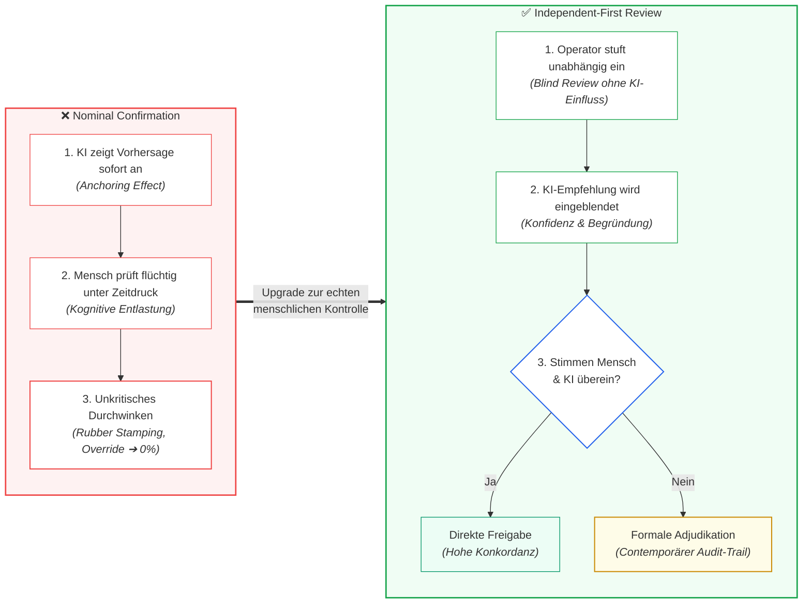

# Modul 10: Human Oversight / Human in the Loop

🌐 **[English Version](../en/module_10_human_oversight_hitl.md)** &nbsp;|&nbsp; **[⬅ Modul 09: Explainability and Transparency](module_09_explainability_transparency.md) &nbsp;|&nbsp; [🏠 Inhaltsverzeichnis](00_overview.md) &nbsp;|&nbsp; [Modul 11: Lifecycle Management and Continuous Monitoring ➔](module_11_lifecycle_continuous_monitoring.md)**

---

## 🎯 Lernziele & Leitfragen
1. **Das Autonomie-Paradoxon:** Warum führt mehr KI-Einsatz im GMP-Bereich nicht zu weniger menschlicher Verantwortung, sondern verstärkt die Notwendigkeit aktiver menschlicher Urteilskraft?
2. **Die 3 Oversight-Stufen (HITL, HOTL, HOOL):** Wann ist Human-in-the-Loop rechtlich zwingend und warum ist Human-out-of-the-Loop für Chargenfreigaben ausgeschlossen?
3. **Die Automation-Bias-Falle:** Warum sinkt die menschliche Widerspruchsrate (*Override Rate*) über Zeit schleichend ab und warum werten Inspektoren eine Widerspruchsrate von 0% als Systemversagen?
4. **Workflow-Design gegen Scheinvalidierung:** Was unterscheidet den fehleranfälligen Bestätigungs-Workflow (*Nominal Confirmation*) vom **Independent-First-Pattern**?
5. **Inspektionsanforderungen an die Aufsicht:** Welche KPIs (Verweildauer, Override-Statistiken, modellspezifische Qualifikation) verlangen Behörden zum Nachweis echter menschlicher Kontrolle?

---

## 🧭 Visualisierung: Nominal Confirmation vs. Independent-First Review

---

## 📌 Fachliche Zusammenfassung (Key Takeaways)

### 1. Das Kernprinzip: Menschliche Verantwortung & Entscheidungsbegleitung
Unter EU GMP Annex 22 gilt das Grundprinzip: **KI-Systeme besitzen keine eigenständige Rechtsverantwortung** (die Gesamtverantwortung für Freigaben und GMP-Compliance verbleibt nach EU-Arzneimittelrecht stets beim regulierten pharmazeutischen Unternehmer; nach [Draft §2.2] muss der Anwender Dokumentationen auch bei Drittanbietern eigenverantwortlich beschaffen und überprüfen).
* **Keine pauschale HITL-Pflicht für voll qualifizierte Modelle:** Der Draft verlangt für umfassend getestete Modelle keine pauschale HITL (Auslegung von §1, §3.3, §10.5 [Auslegung]). Ein voll qualifiziertes System (z. B. automatisierte Gut-/Schlecht-Aussortierung in der Sichtprüfung) darf innerhalb seines qualifizierten Rahmens automatisiert agieren.
* **Reduzierter Testaufwand bedingt strikte Operator-Pflichten ([Draft §3.3]):** Wenn das KI-System lediglich Input zu einer menschlichen Entscheidung liefert und der formale Testaufwand des Modells aufgrund dieser menschlichen Letztentscheidung reduziert wurde, muss die Rolle und Verantwortung des Bedieners (*Human Operator*) explizit im *Intended Use* festgelegt werden ([Draft §3.3]).
* **Überwachung wie bei manuellen Prozessen ([Draft §3.3]):** Schulung und Arbeitsleistung des Bedieners müssen in diesem Fall genauso überwacht werden wie bei einem rein manuellen Prozess ([Draft §3.3]). Das Personal muss in den Grenzen des Systems und im Erkennen von Fehlern geschult sein ([Draft §3.3] / [Best Practice]).
* **Konfidenzschwellen & 'Undecided'-Routing ([Draft §9.1, §9.2]):** Prädiktive oder klassifizierende Modelle müssen geeignete Schwellenwerte besitzen; bei sehr niedrigem Konfidenzscore sollte das Modell ein Ergebnis als 'undecided' kennzeichnen ([Draft §9.2]). In diesem Fall greift unmittelbar der menschliche Reviewer, um eine verlässliche Entscheidung herbeizuführen.
* **Review-Aufzeichnungen & Ausgabeprüfung ([Draft §10.5]):** Aufzeichnungen über die Überprüfung von Systemausgaben durch Operatoren müssen aufbewahrt werden. Abhängig von der Kritikalität der Anwendung und der Tiefe der Modelltests kann dies die schriftlich geregelte Prüfung jeder einzelnen Ausgabe erfordern.
* **Entflechtung zum allgemeinen Arzneimittelrecht:** Die Gesamtverantwortung des Herstellers und der Sachkundigen Person (Qualified Person) ergibt sich aus dem allgemeinen EU-Arzneimittelrecht; der Annex-22-Draft ergänzt dies um die spezifischen Anforderungen an die Verlässlichkeit der KI-Unterstützung.

### 2. Die drei Aufsichts-Stufen (Oversight Tiers) ([Didaktik])

> *Hinweis zur Systematik:* Die Unterteilung in HITL, HOTL und HOOL ist ein etabliertes Industriemodell ([Didaktik]), das hilft, den geforderten Kontrollgrad greifbar zu machen. Der Draft selbst regelt die Aufsicht funktional über §1, §3.3 und §10.5:

| Stufe ([Didaktik]) | Bezeichnung | Typischer Kontext | Funktionsweise | GMP-Einordnung |
| :---: | :--- | :--- | :--- | :--- |
| **HITL** | **Human-in-the-Loop** | Reduzierte Modell-Testtiefe ([Draft §3.3, §10.5]) oder GenAI ([Draft §1]) | Der Mensch prüft und zeichnet die Ausgabe, bevor eine physische oder datentechnische Aktion wirksam wird. | Erforderlich, wenn der Testaufwand des Modells reduziert wurde oder bei unkritischer GenAI. |
| **HOTL** | **Human-on-the-Loop** | Voll qualifizierte Prozessautomatisierung | Das Modell steuert Prozesse innerhalb vorvalidierter Parameter. Der Mensch überwacht Trends und greift bei Abweichungen ein. | Zulässig für qualifizierte Inline-Regelungen (z. B. PAT), sofern Grenzen und Monitoring validiert sind. |
| **HOOL** | **Human-out-of-the-Loop** | Autonome Systeme ohne menschliche Kontrollmöglichkeit | Vollautomatisches System ohne Überwachungsmöglichkeit. | Für kritische GMP-Prozesse unvereinbar mit den Grundsätzen von Annex 11 und Annex 22 ([Draft §1; EudraLex-Gesamtverantwortung]). |

### 3. Die Automation-Bias-Falle (Creeping Decay of Oversight)
Die größte praktische Gefahr bei Systemen mit menschlicher Letztentscheidung ist die kognitive Gewöhnung:
* Wenn ein System im Alltag zuverlässig funktioniert, gewöhnen sich Prüfer daran, dass die KI „fast immer recht hat“.
* Die kognitive Wachsamkeit lässt nach (*Cognitive Complacency*), und Prüfer überfliegen Warnungen nur noch oberflächlich (*Perfunctory Review*).

> [!CAUTION]
> **Illustratives Praxisszenario (didaktisches Fallbeispiel, nicht belegt):** Ein Pharmawerk führte ein KI-System zur Klassifizierung von Abweichungsberichten (*Deviation Triage*) ein. 
> - *Monat 1:* Prüfer überstimmten die KI in **12% der Fälle** (*Healthy Challenge*).
> - *Monat 3:* Die Widerspruchsrate sank auf 5%.
> - *Monat 6:* Die Widerspruchsrate fiel auf **1,5%**.
> Eine interne Sonderprüfung deckte auf: Die KI war keineswegs besser geworden; die Prüfer hatten lediglich aufgehört, Berichte gründlich selbst zu lesen. Mehrere schwerwiegende Abweichungen waren fälschlich als „geringfügig“ eingestuft worden und erforderten nachträgliche CAPA-Verfahren.

**Überwachung der Widerspruchsrate ([Draft §10.5] / [Didaktik]):**
In hochgradig präzisen und stabilen Prozessen kann eine niedrige Override-Rate normal sein. Ein dauerhaftes Verharren bei 0% sollte jedoch Anlass für eine risikobasierte Überprüfung sein, um sicherzustellen, dass kein unkritisches Durchwinken (*Automation Bias*) vorliegt. Gemäß [Draft §10.5] müssen Aufzeichnungen über den Review geführt und ausgewertet werden.

### 4. Workflow-Architektur gegen Automation Bias: Das Independent-First-Pattern ([Didaktik])
Um menschliche Prüfer wach und unabhängig zu halten, kann das Interaktionsdesign aktiv unterstützen:
* **Anti-Pattern (Nominal Confirmation):** Das System zeigt die KI-Empfehlung („Batch freigeben, Konfidenz 98%“) dominant an. Der Prüfer neigt unbewusst zum bloßen Bestätigen.
* **Best Practice (Independent-First Pattern, [Didaktik]):** Der Prüfer analysiert den Sachverhalt und erfasst **seine eigene Bewertung, bevor die KI-Empfehlung eingeblendet wird**.
  - Stimmen beide überein: Schneller Durchlauf.
  - Weichen beide ab: Das System fordert eine dokumentierte Begründung (*Adjudication*).
* **Konfidenzbasierte Eskalation:** Fällt der Konfidenzscore der KI unter einen vorvalidierten Schwellenwert, wird der Fall automatisch zur vertieften Überprüfung an erfahrenes Fachpersonal geleitet.

### 5. Was Behördeninspektoren sehen wollen
Bei Inspektionen prüfen Auditoren gezielt die Qualität der menschlichen Aufsicht:
1. **Plausibilität der Review-Dauer:** Werden umfangreiche Chargenprotokolle in Sekundenschnelle freigegeben, ist die Aufsicht unglaubwürdig. Durchsatz-KPIs dürfen Prüfer nicht für gründliches Nachprüfen bestrafen.
2. **Qualifikation und Training ([Draft §3.3] / [Best Practice]):** Schulungsnachweise müssen belegen, dass das Personal die spezifischen Grenzen und Fehlermodi des KI-Modells versteht sowie weiß, wie und wann das System fachlich zu hinterfragen und zu überstimmen ist (*Override*).
3. **Audit-Trail für Overrides ([Draft §10.5]):** Aufzeichnungen über Korrekturen und Überstimmungen müssen auffindbar und begründet sein.

---

## 💡 Zentrale Fachbegriffe & Konzepte (Glossar)

- **Human-in-the-Loop (HITL) ([Didaktik]):** Aufsichtsmodell, bei dem jede KI-generierte Ausgabe vor Wirksamkeit von einem Menschen geprüft und genehmigt wird (nach [Draft §3.3] zwingend, wenn Modell-Testaufwand dadurch reduziert wurde; nach [Draft §1] bei nicht-kritischer GenAI).
- **Human-on-the-Loop (HOTL) ([Didaktik]):** Aufsichtsmodell, bei dem Prozesse innerhalb validierter Grenzen automatisiert ablaufen und der Mensch überwacht sowie intervenieren kann.
- **Automation Bias:** Die unbewusste Neigung, automatisierten Systemvorschlägen unkritisch zu vertrauen und manuelle Prüfungen zu vernachlässigen.
- **Independent-First Pattern ([Didaktik]):** Interaktionsdesign, bei dem die menschliche Bewertung vor der Einblendung des KI-Ergebnisses erfolgt, um unvoreingenommene Urteile zu fördern.
- **Override Rate ([Didaktik]):** Häufigkeit, mit der menschliche Prüfer Modellvorschläge korrigieren; dient als risikobasierter Indikator für die Wachsamkeit des Personals.
- **Adjudication ([Didaktik]):** Dokumentierte Begründung im Falle einer Diskrepanz zwischen menschlicher Ersteinschätzung und Modellvorhersage.

---

## 📋 GxP-Compliance Checklist: Human Oversight

### Absolute Must-Haves:
- [ ] Wurde bei Modellen mit reduzierter Testtiefe die Operator-Verantwortung explizit im *Intended Use* verankert ([Draft §3.3])?
- [ ] Werden Schulung und Arbeitsleistung der Bediener wie bei manuellen Prozessen überwacht ([Draft §3.3])?
- [ ] Wurde das Personal geschult, wie und wann das KI-System zu überstimmen ist (*Override*, [Best Practice: GxP-Praxis])?
- [ ] Werden Aufzeichnungen über die Überprüfung der Systemausgaben durch Operatoren geführt und aufbewahrt ([Draft §10.5])?
- [ ] Schützt das Workflow-Design wirksam vor unkritischem Durchklicken (*Automation Bias*)?
- [ ] Werden Overrides und Abweichungen im Audit Trail nachvollziehbar dokumentiert ([Draft §10.5])?

### Rote Flaggen bei Inspektionen (Red Flags):
- ❌ Der Testaufwand des Modells wurde mit Verweis auf menschliche Kontrolle reduziert, aber es existieren weder Operator-SOPs noch Schulungsnachweise ([Draft §3.3]).
- ❌ Das Personal kann die Frage des Inspektors: *„Welche typischen Fehler macht diese KI und wie erkennen Sie diese?“* nicht beantworten ([Draft §3.3]).
- ❌ Eine Override-Rate von dauerhaft 0% in komplexen Beurteilungsprozessen wird ohne jede Plausibilitätsprüfung hingenommen.
- ❌ Zeitdruck oder Durchsatz-KPIs zwingen Bediener zu oberflächlichen Bestätigungen in Sekundenschnelle.

---

🌐 **[English Version](../en/module_10_human_oversight_hitl.md)** &nbsp;|&nbsp; **[⬅ Modul 09: Explainability and Transparency](module_09_explainability_transparency.md) &nbsp;|&nbsp; [🏠 Inhaltsverzeichnis](00_overview.md) &nbsp;|&nbsp; [Modul 11: Lifecycle Management and Continuous Monitoring ➔](module_11_lifecycle_continuous_monitoring.md)**

