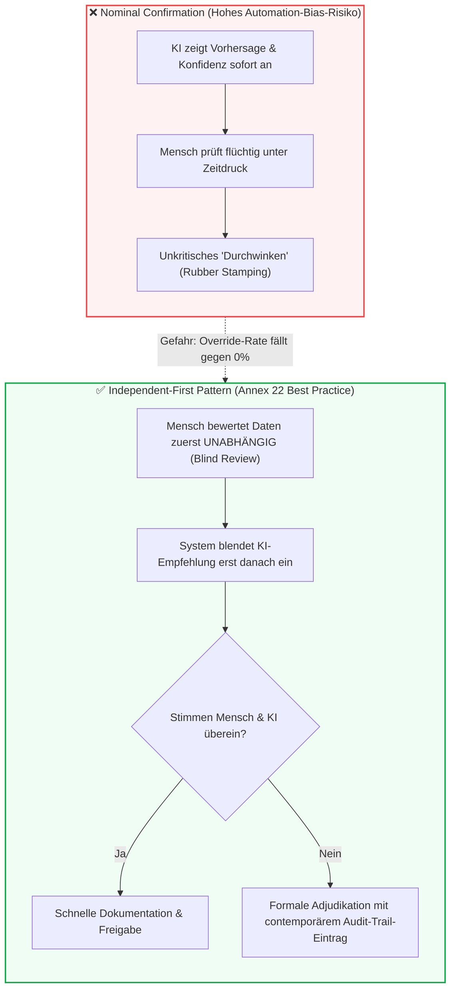

# Modul 10: Human Oversight / Human in the Loop

🌐 **[English Version](../en/module_10_human_oversight_hitl.md)** &nbsp;|&nbsp; **[⬅ Modul 09: Explainability and Transparency](module_09_explainability_transparency.md) &nbsp;|&nbsp; [🏠 Inhaltsverzeichnis](00_overview.md) &nbsp;|&nbsp; [Modul 11: Lifecycle Management and Continuous Monitoring ➔](module_11_lifecycle_continuous_monitoring.md)**

---

## 🎯 Lernziele & Leitfragen
1. **Das Autonomie-Paradoxon:** Warum führt mehr KI-Einsatz im GMP-Bereich nicht zu weniger menschlicher Verantwortung, sondern verstärkt die Notwendigkeit aktiver menschlicher Urteilskraft?
2. **Die 3 Oversight-Stufen (HITL, HOTL, HOOL):** Wann ist Human-in-the-Loop rechtlich zwingend und warum ist Human-out-of-the-Loop für Chargenfreigaben ausgeschlossen?
3. **Die Automation-Bias-Falle:** Warum sinkt die menschliche Widerspruchsrate (*Override Rate*) über Zeit schleichend ab und warum werten Inspektoren eine Widerspruchsrate von 0% als Systemversagen?
4. **Workflow-Design gegen Scheinvalidierung:** Was unterscheidet den fehleranfälligen Bestätigungs-Workflow (*Nominal Confirmation*) vom **Independent-First-Pattern**?
5. **Inspektionsanforderungen an die Aufsicht:** Welche KPIs (Verweildauer, Override-Statistiken, modellspezifische Qualifikation) verlangen Behörden zum Nachweis echter menschlicher Kontrolle?

---

## 🧭 Visualisierung: Nominal Confirmation vs. Independent-First Review

---

## 📌 Fachliche Zusammenfassung (Key Takeaways)

### 1. Das Kernprinzip: Keine Autonomie bei kritischen GMP-Entscheidungen
Unter EU GMP Annex 22 gilt unmissverständlich: **KI-Systeme besitzen keine eigenständige pharmazeutische Rechtsverantwortung.**
* Die gesetzliche Verantwortung für Produktqualität und Patientensicherheit verbleibt zu 100% beim qualifizierten pharmazeutischen Personal (z.B. Qualified Person nach Art. 51 Richtlinie 2001/83/EG).
* **Perfunctory Oversight (Schein-Aufsicht):** Wenn ein hochqualifizierter Fachexperte lediglich vor dem Monitor sitzt und vorschlagsgemäß auf „Genehmigen“ klickt, liegt keine echte menschliche Aufsicht vor. Auditoren stufen dies als schwerwiegenden Compliance-Mangel ein.

### 2. Die drei Aufsichts-Stufen (Oversight Tiers)

| Stufe | Bezeichnung | Risikoklasse | Funktionsweise | GMP-Zulässigkeit |
| :---: | :--- | :--- | :--- | :--- |
| **HITL** | **Human-in-the-Loop** | **Hoch (Critical)** | Der Mensch muss **jeden einzelnen KI-Output prüfen und genehmigen**, bevor eine physische oder datentechnische Aktion ausgeführt wird. | **Zwingender Standard** für Chargenfreigaben, Deviation-Triage und OOS-Untersuchungen. |
| **HOTL** | **Human-on-the-Loop** | **Mittel (Moderate)** | Das Modell steuert Prozesse innerhalb enger, vorvalidierter Leitplanken autonom. Der Mensch überwacht die Leitwarte und kann jederzeit per Not-Aus (*Override*) eingreifen. | Zulässig für adaptive Prozessregelung (z.B. Bioreaktor-Temperatur), sofern Guardrails validiert sind. |
| **HOOL** | **Human-out-of-the-Loop** | **Niedrig (Low / Non-GxP)** | Vollautomatisches System ohne menschliche Überprüfung. | **Strikt unzulässig** für alle Tätigkeiten mit direktem Einfluss auf Produktqualität oder Patientensicherheit. |

### 3. Die Automation-Bias-Falle (Creeping Decay of Oversight)
Die größte praktische Gefahr im Routinebetrieb ist die menschliche Psychologie:
* Wenn ein System monatelang zuverlässig funktioniert, gewöhnen sich Prüfer daran, dass die KI „fast immer recht hat“.
* Die kognitive Wachsamkeit lässt nach (*Cognitive Complacency*), und Prüfer überfliegen Warnungen nur noch oberflächlich.

> [!CAUTION]
> **Praxisfall:** Ein Pharmawerk führte ein KI-System zur Klassifizierung von Abweichungsberichten (*Deviation Triage*) ein. 
> - *Monat 1:* Prüfer überstimmten die KI in **12% der Fälle** (*Healthy Challenge*).
> - *Monat 3:* Die Widerspruchsrate sank auf 5%.
> - *Monat 6:* Die Widerspruchsrate fiel auf **1,5%**.
> Eine interne Sonderprüfung deckte auf: Die KI war keineswegs besser geworden; die Prüfer hatten lediglich aufgehört, Berichte gründlich selbst zu lesen. Mehrere schwerwiegende Abweichungen waren fälschlich als „geringfügig“ eingestuft worden und erforderten nachträgliche CAPA-Verfahren.

**Die goldene Inspektoren-Regel:** Eine **Widerspruchsrate (*Override Rate*), die gegen 0% tendiert**, ist kein Beweis für ein perfektes Modell, sondern ein **Alarmsignal für kollabierte menschliche Aufsicht**.

### 4. Workflow-Architektur gegen Automation Bias: Das Independent-First-Pattern
Um menschliche Prüfer wach und unabhängig zu halten, muss die Benutzeroberfläche (*UI/UX-Design*) aktiv gegen Bias schützen:
* **Anti-Pattern (Nominal Confirmation):** Das System zeigt die KI-Empfehlung („Batch freigeben, Konfidenz 98%“) fett markiert an. Der Prüfer klickt unbewusst nur noch auf „Bestätigen“.
* **Best Practice (Independent-First Pattern):** Der Prüfer analysiert das Dossier und muss **seine eigene Entscheidung erfassen, bevor die KI-Bewertung sichtbar wird**.
  - Stimmen beide überein: Schneller Durchlauf.
  - Weichen beide ab: Das System zwingt den Prüfer zu einer schriftlichen, zeitnahen Begründung im Audit Trail (*Documented Adjudication*).
* **Konfidenzbasierte Eskalation:** Fällt der Konfidenzscore der KI unter einen vorvalidierten Schwellenwert (z.B. < 95%), verweigert das System jede Routineabarbeitung und leitet den Fall automatisch mit detaillierter Fehlerursache an einen Senior-Reviewer weiter.

### 5. Was Behördeninspektoren sehen wollen
Bei Inspektionen prüfen Auditoren gezielt die Tiefe der menschlichen Kontrolle:
1. **Verweildauer pro Review (Dwell Time):** Werden 50-seitige Batch-Protokolle innerhalb von 4 Sekunden freigegeben, ist die Aufsicht eine Farce. Durchsatz-KPIs dürfen Prüfer nicht für gründliches Nachprüfen bestrafen!
2. **Modellspezifische Qualifikationsnachweise:** Schulungszertifikate dürfen nicht nur allgemeine „KI-Grundlagen“ bescheinigen, sondern müssen nachweisen, dass der Prüfer die **spezifischen Fehlermodi und Grenzen genau dieses Modells** kennt.
3. **Audit-Trail für Overrides:** Jeder Fall, in dem der Mensch die KI überstimmt hat (oder der KI gefolgt ist, obwohl sie niedrige Konfidenz hatte), muss lückenlos begründet und auffindbar sein.

---

## 💡 Zentrale Fachbegriffe & Konzepte (Glossar)

- **Human-in-the-Loop (HITL):** Aufsichtsmodell, bei dem jede KI-generierte Entscheidung vor ihrer Wirksamkeit der aktiven, bewussten Prüfung und Bestätigung durch einen Menschen bedarf.
- **Human-on-the-Loop (HOTL):** Aufsichtsmodell, bei dem Prozesse innerhalb validierter Grenzen automatisiert ablaufen, der Mensch jedoch die Prozessführung überwacht und intervenieren kann.
- **Automation Bias:** Die unbewusste menschliche Neigung, automatisierten Systemvorschlägen blind zu vertrauen und widersprechende reale Indikatoren zu ignorieren.
- **Independent-First Pattern:** Ein Interaktions-Design, bei dem der menschliche Prüfer seine Bewertung vornimmt, bevor er den Vorschlag der KI sieht, um unbeeinflusste Urteile sicherzustellen.
- **Override Rate:** Die statistische Häufigkeit, mit der menschliche Prüfer eine Empfehlung des KI-Systems korrigieren oder ablehnen; dient als zentraler Vitalitäts-KPI für die Aufsicht.
- **Adjudication (Schiedsentscheidung):** Der formal dokumentierte Entscheidungs- und Begründungsprozess im Falle einer Diskrepanz zwischen menschlicher Ersteinschätzung und KI-Vorhersage.

---

## 📋 GxP-Compliance Checklist: Human Oversight

### Absolute Must-Haves:
- [ ] Ist für alle risikobehafteten GxP-Funktionen ein verbindliches **Human-in-the-Loop (HITL)**-Verfahren implementiert?
- [ ] Besitzen die menschlichen Prüfer die uneingeschränkte, technisch gesicherte Befugnis, KI-Vorhersagen jederzeit zu überstimmen (*Override Authority*)?
- [ ] Wird die **Override-Rate monatlich überwacht**, um ein Einschlafen der Aufmerksamkeit (*Automation Bias*) frühzeitig zu erkennen?
- [ ] Schützt das UI-Design durch Blind-Review-Mechanismen (*Independent-First*) oder Schwellenwert-Eskalationen vor passivem Durchklicken?
- [ ] Liegen modellspezifische Schulungsnachweise vor, die belegen, dass Prüfer über die typischen Fehlermodi dieses Modells geschult wurden?
- [ ] Erfasst das Audit-Trail-System die Prüfdauer (*Dwell Time*) und schriftliche Begründungen bei Abweichungen zeitnah?

### Rote Flaggen bei Inspektionen (Red Flags):
- ❌ Das KI-System führt bei kritischen Chargen- oder Laborprüfungen vollautomatische Freigaben ohne menschliche Signatur durch (*HOOL*).
- ❌ Die monatliche Widerspruchsrate liegt dauerhaft bei 0% und wird von der Leitung fälschlich als „Perfektion“ gefeiert.
- ❌ Arbeitsanweisungen (SOPs) belohnen Prüfer nach reiner Klickanzahl / Durchlaufzeit ohne Qualitätskontrolle der Reviews.
- ❌ Prüfer können die Frage des Inspektors: *„Welche typischen Fehler macht diese KI und woran erkennen Sie diese?“* nicht beantworten.

---

🌐 **[English Version](../en/module_10_human_oversight_hitl.md)** &nbsp;|&nbsp; **[⬅ Modul 09: Explainability and Transparency](module_09_explainability_transparency.md) &nbsp;|&nbsp; [🏠 Inhaltsverzeichnis](00_overview.md) &nbsp;|&nbsp; [Modul 11: Lifecycle Management and Continuous Monitoring ➔](module_11_lifecycle_continuous_monitoring.md)**

