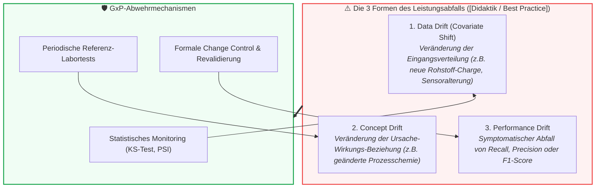

# Modul 11: Lifecycle Management and Continuous Monitoring

🌐 **[English Version](../en/module_11_lifecycle_continuous_monitoring.md)** &nbsp;|&nbsp; **[⬅ Modul 10: Human Oversight / Human in the Loop](module_10_human_oversight_hitl.md) &nbsp;|&nbsp; [🏠 Inhaltsverzeichnis](00_overview.md) &nbsp;|&nbsp; [Modul 12: Audit and Inspection Readiness ➔](module_12_audit_inspection_readiness.md)**

---

## 🎯 Lernziele & Leitfragen
1. **Die Illusion permanenter Validierung:** Warum ist der Go-Live bei KI-Systemen nicht das Ende, sondern erst der Beginn der eigentlichen Validierungsarbeit?
2. **Die 3 Drift-Typen ([Didaktik / Best Practice]):** Wie unterscheiden sich *Data Drift*, *Concept Drift* und *Performance Drift* und warum ist Concept Drift für pharmazeutische Prozesse am gefährlichsten?
3. **Change Control & Re-Training:** Warum führt das Einspielen neuer Modellgewichte ohne formale Revalidierung zum sofortigen Verlust des GMP-Status?
4. **Configuration Drift:** Warum stellt das formlose Nachjustieren von Alarmschwellenwerten an der Linie eine unzulässige Systemänderung dar?
5. **Periodic Review & Außerbetriebnahme:** Welche Makro-Analysen verlangt Annex 22 in regelmäßigen Audits und wie sieht ein kontrolliertes Decommissioning aus?

---

## 🧭 Visualisierung: Die 3 Dimensionen des AI-Drifts

---

## 📌 Fachliche Zusammenfassung (Key Takeaways)

### 1. Die Illusion permanenter Validierung
In der traditionellen CSV (Annex 11) galt: Ein qualifiziertes System verharrt im validierten Zustand, solange Code und Hardware nicht angetastet werden.
* **Das KI-Dilemma:** Bei KI-Systemen altert das Modell relativ zu seiner Umwelt (*The environment evolves, the model stays frozen in the past*).
* Sensorabnutzung, neue Zulieferer, veränderte Rohstoffqualitäten oder saisonale Klimaschwankungen im Reinraum führen zu einer schleichenden Entkopplung zwischen Trainingsdaten und Produktionsrealität (*Silent Degradation*).
* Validierung unter Annex 22 ist daher ein **dynamischer, kontinuierlicher Prozess**, der eng mit dem betrieblichen Abweichungs- (Deviation) und CAPA-System verzahnt sein muss.

### 2. Lebenszyklus-Monitoring im Draft: Performance- & Input-Drift ([Draft §10.3, §10.4])
Der Draft EU GMP Annex 22 unterscheidet im operativen Betrieb primär zwei verbindliche Überwachungsstränge:

| Überwachungsstrang | Regulatorische Fundstelle | Fokus & Pharma-Beispiel | Typische Methode |
| :--- | :--- | :--- | :--- |
| **Input-Drift (Input Sample Space)** | **[Draft §10.4]** | Überwachung der Eingangsdatenverteilung. Bsp.: Ein Sensor driftet um 0,3°C; ein neuer Hilfsstofflieferant verändert die Partikelgrößenverteilung. | Univariate statistische Tests pro Merkmal (z. B. Kolmogorov-Smirnov-Test, Population Stability Index - PSI; PSI > 0,2 als Faustregel für signifikanten Shift [Best Practice: ML-Praxis]) oder multivariate Abstandsmaße. |
| **Performance-Monitoring** | **[Draft §10.3]** | Kontinuierliche Überwachung der Modellgüte. Bsp.: Anstieg der Fehlerrate bei der Tabletteninspektion; Auswertung von Bediener-Reviews ([Draft §10.5]). | Laufende Verfolgung von Trefferquoten, Konfusionsmatrizen und qualifizierten Stichprobenkontrollen. |
| **Concept Drift ([Best Practice: ML-Praxis])** | *Industrie-Erweiterung ([Best Practice])* | Verschiebung der Kausalbeziehung zwischen Input und Zielgröße ($P(Y \mid X)$). Bsp.: Neue Rührwerkgeometrie verändert die Reaktionskinetik bei gleichen Prozesswerten. | Periodischer Abgleich mit verlässlichen Referenzanalysen (Offline-Laboranalytik, Ground Truth Sampling). |

> [!CAUTION]
> **Illustratives Praxisszenario (didaktisches Fallbeispiel, nicht belegt):** Ein Pharmahersteller nutzte ein KI-System zur vorausschauenden Wartung von Bioreaktor-Sonden. In Monat 1 wechselte der Rohstofflieferant für das Nährmedium. Das Medium verhielt sich mikrobiologisch minimal anders, was zu einem schleichenden Drift führte. In Monat 4 fielen zwei Sonden während laufender Produktionschargen unbemerkt aus, weil die Alarmschwellen nicht passten. Der Schaden: Zwei verworfene Chargen und eine behördliche Mängelrüge.

### 3. Change Control & Der Re-Training-Zyklus ([Draft §10.1])
Das wiederholte Anlernen (*Retraining*) eines Modells mit frischen Daten ist keine rein technische Wartung, sondern ein formaler **Change Control Prozess ([Draft §10.1])**:
* **Die 4 Phasen des GxP-Retrainings:**
  1. **Trigger:** Erreichen eines risikobasierten Intervalls oder statistischer Drift-Alarm ([Draft §10.3, §10.4]).
  2. **Retraining:** Modelltraining in der kontrollierten Entwicklungsumgebung.
  3. **Formale Re-Qualifizierung:** Vollständige statistische Überprüfung auf einem neuen, unabhängigen Testdatensatz gegen die genehmigten Akzeptanzkriterien ([Draft §4.2, §4.3, §6]).
  4. **Deployment & Release:** Freigabe durch QA und kontrollierter Austausch des Modellartefakts im Produktivbetrieb.
* **Verbot unkontrollierter Änderungen ([Draft §10.1]):** Das Einspielen neu trainierter Parameter ohne formales Change Control und Freigabeprotokoll stellt einen schwerwiegenden GMP-Verstoß dar.

### 4. Configuration Control: Schutz vor informellen Justierungen ([Draft §10.2])
Häufig versuchen Betriebsteams, Fehlalarme an Maschinen durch manuelles Nachstellen von Parametern zu dämpfen:
* **Regulatorische Vorgabe ([Draft §10.2]):** Ein getestetes Modell muss vor dem Produktiveinsatz unter **Konfigurationskontrolle** gestellt werden, und es müssen wirksame Maßnahmen genutzt werden, um unautorisierte Änderungen zu erkennen ([Draft §10.2]). Das Einbinden von Hyperparametern und Schwellenwerten folgt anerkannter Praxis ([Best Practice: ML-Praxis]).
* Jeder numerische Schwellenwert ist Bestandteil des qualifizierten Zustands. Unautorisierte Änderungen verletzen die Konfigurationsintegrität.

### 5. Periodische Überprüfung (Periodic Review) & Außerbetriebnahme
* **Periodic Review ([Best Practice: ISPE GAMP]):** Der Zeitabstand für periodische Systemüberprüfungen sollte **risikobasiert festgelegt** werden (z. B. halbjährlich oder jährlich als bewährte Industriepraxis). Dabei wird die kumulierte Modellperformance mit der ursprünglichen Baseline verglichen.
* **Validierte Monitoring-Pipelines ([Best Practice: ISPE GAMP]):** Die Software-Pipelines zur automatisierten Drift-Berechnung und Alarmierung sollten nach Annex 11 qualifiziert sein, um Fehlalarme oder unbemerkte Ausfälle der Überwachung auszuschließen.
* **Außerbetriebnahme (Retirement, [Best Practice: GxP-Praxis]):** Bei Stilllegung sind historische Testdokumentationen, Testdaten und Prüfprotokolle wie andere GMP-Dokumentation aufzubewahren ([Draft §7.4]); die darüber hinausgehende Archivierung von Code-Repositories über den gesamten Systemlebenszyklus folgt etablierter GxP-Praxis ([Best Practice]).

---

## 💡 Zentrale Fachbegriffe & Konzepte (Glossar)

- **Data Drift (Covariate Shift):** Statistische Veränderung der Verteilung der Eingangsmerkmale ($P(X)$) über die Zeit bei gleichbleibendem Zusammenhang zur Zielgröße.
- **Concept Drift:** Die zeitliche Verschiebung der statistischen Beziehung zwischen Features und Zielgrößen ($P(Y \mid X)$), oft ausgelöst durch veränderte Prozessbedingungen.
- **Performance Drift:** Die graduelle Verschlechterung der Vorhersagegenauigkeit oder Sensitivität des Modells im Routinebetrieb.
- **Population Stability Index (PSI):** Eine statistische Kennzahl zur Quantifizierung, wie stark sich eine aktuelle Datenverteilung von der ursprünglichen Referenz-Trainingsverteilung unterscheidet.
- **Configuration Drift:** Die schleichende, unautorisierte Veränderung von Systemeinstellungen, Schwellenwerten oder Filterregeln außerhalb des formalen Änderungsmanagements.
- **Decommissioning / Retirement:** Der formal geregelte Prozess der Stilllegung eines KI-Systems inklusive Datenarchivierung und retrospektiver Risikobewertung.

---

## 📋 GxP-Compliance Checklist: Lifecycle & Monitoring

### Absolute Must-Haves:
- [ ] Existiert ein kontinuierliches, automatisiertes **Drift-Monitoring** für Eingangsdaten (Data Drift) und Modellgüte (Performance Drift)?
- [ ] Sind statistische Alarmschwellenwerte formal definiert und direkt an das betriebliche **Abweichungswesen (Deviations/CAPA)** angebunden?
- [ ] Ist die Überwachungs- und Alarmierungssoftware selbst als Computersystem nach **Annex 11 validiert**?
- [ ] Ist geregelt, dass jedes Modell-Retraining zwingend ein **formales Revalidierungsverfahren** durchlaufen muss?
- [ ] Werden Entscheidungsschwellenwerte (*Thresholds*) unter strikter **Change Control** verwaltet?
- [ ] Finden regelmäßige **Periodic Reviews** (z.B. halbjährlich) statt, die den aktuellen Zustand mit der Validierungs-Baseline abgleichen?

### Rote Flaggen bei Inspektionen (Red Flags):
- ❌ IT spielt im Routinebetrieb regelmäßig „frisch trainierte Modell-Updates“ ohne Beteiligung von QA und ohne Revalidierungsbericht ein.
- ❌ Drift-Alarme werden auf isolierten Data-Science-Dashboards angezeigt, fließen aber nicht in das betriebliche Qualitätsmanagementsystem (QMS) ein.
- ❌ Operatoren verstellen Entscheidungsgrenzen an Maschinenanzeigen manuell, um die Anzahl der Alarmmeldungen zu reduzieren.
- ❌ Es existiert keine Strategie zur Erkennung von *Concept Drift* (z.B. fehlende periodische Gegenprüfung mit realen Labormesswerten).

---

🌐 **[English Version](../en/module_11_lifecycle_continuous_monitoring.md)** &nbsp;|&nbsp; **[⬅ Modul 10: Human Oversight / Human in the Loop](module_10_human_oversight_hitl.md) &nbsp;|&nbsp; [🏠 Inhaltsverzeichnis](00_overview.md) &nbsp;|&nbsp; [Modul 12: Audit and Inspection Readiness ➔](module_12_audit_inspection_readiness.md)**

