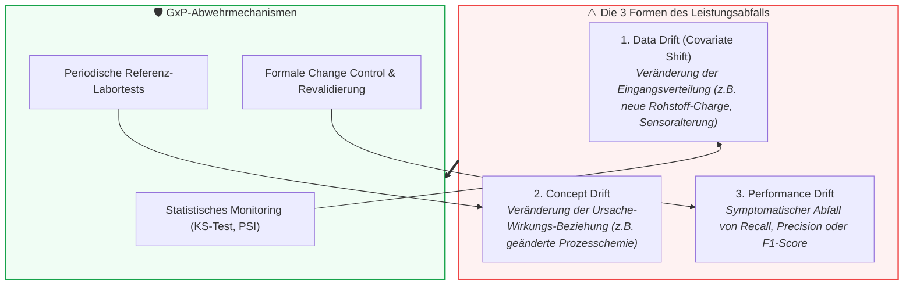

# Modul 11: Lifecycle Management and Continuous Monitoring

**[⬅ Modul 10: Human Oversight / Human in the Loop](module_10_human_oversight_hitl.md) &nbsp;|&nbsp; [🏠 Inhaltsverzeichnis](00_overview.md) &nbsp;|&nbsp; [Modul 12: Audit and Inspection Readiness ➔](module_12_audit_inspection_readiness.md)**

---

## 🎯 Lernziele & Leitfragen
1. **Die Illusion permanenter Validierung:** Warum ist der Go-Live bei KI-Systemen nicht das Ende, sondern erst der Beginn der eigentlichen Validierungsarbeit?
2. **Die 3 Drift-Typen:** Wie unterscheiden sich *Data Drift*, *Concept Drift* und *Performance Drift* und warum ist Concept Drift für pharmazeutische Prozesse am gefährlichsten?
3. **Change Control & Re-Training:** Warum führt das Einspielen neuer Modellgewichte ohne formale Revalidierung zum sofortigen Verlust des GMP-Status?
4. **Configuration Drift:** Warum stellt das formlose Nachjustieren von Alarmschwellenwerten an der Linie eine unzulässige Systemänderung dar?
5. **Periodic Review & Außerbetriebnahme:** Welche Makro-Analysen verlangt Annex 22 in regelmäßigen Audits und wie sieht ein kontrolliertes Decommissioning aus?

---

## 🧭 Visualisierung: Die 3 Dimensionen des AI-Drifts

---

## 📌 Fachliche Zusammenfassung (Key Takeaways)

### 1. Die Illusion permanenter Validierung
In der traditionellen CSV (Annex 11) galt: Ein qualifiziertes System verharrt im validierten Zustand, solange Code und Hardware nicht angetastet werden.
* **Das KI-Dilemma:** Bei KI-Systemen altert das Modell relativ zu seiner Umwelt (*The environment evolves, the model stays frozen in the past*).
* Sensorabnutzung, neue Zulieferer, veränderte Rohstoffqualitäten oder saisonale Klimaschwankungen im Reinraum führen zu einer schleichenden Entkopplung zwischen Trainingsdaten und Produktionsrealität (*Silent Degradation*).
* Validierung unter Annex 22 ist daher ein **dynamischer, kontinuierlicher Prozess**, der eng mit dem betrieblichen Abweichungs- (Deviation) und CAPA-System verzahnt sein muss.

### 2. Die drei Dimensionen des KI-Drifts
Annex 22 unterscheidet drei spezifische Bedrohungen für den validierten Zustand:

| Drift-Kategorie | Definition | Pharma-Beispiel | Erkennungsmethode |
| :--- | :--- | :--- | :--- |
| **Data Drift (Covariate Shift)** | Die statistische Verteilung der Eingangsparameter ($P(X)$) verschiebt sich, die Beziehung zum Output bleibt gleich. | Ein Temperatursensor wird neu kalibriert und misst systematisch 0,3°C höher; ein neuer Lieferant liefert Hilfsstoff mit abweichender Korngrößenverteilung. | Multivariate statistische Tests (z.B. Kolmogorov-Smirnov-Test, Population Stability Index - PSI). |
| **Concept Drift** | Die fundamentale Beziehung zwischen Eingaben und Zielgröße ($P(Y \mid X)$) ändert sich. Dieselben Eingangswerte bedeuten nun ein anderes Qualitätsergebnis. | Veränderung der chemischen Reaktionskinetik nach Modifikation des Rührwerks. Das Modell meldet „Prozess optimal“, obwohl die Viskosität unbemerkt absinkt. | **Gefährlichster Drift:** Nur durch regelmäßigen Abgleich mit verlässlichen Referenz-Laboranalysen (*Ground Truth Sampling*) erkennbar. |
| **Performance Drift** | Der messbare Rückgang der Modellgüte (z.B. Sinken des Recalls von 99,5% auf 96%). | Erhöhte Fehlerrate bei der visuellen Tablettenprüfung; gehäufte manuelle Korrekturen durch Bediener. | Laufende Auswertung von Konfusionsmatrizen und Widerspruchsraten (*Override Rates*). |

> [!CAUTION]
> **Praxisfall:** Ein Pharmahersteller nutzte ein KI-System zur vorausschauenden Wartung von Bioreaktor-Sonden. In Monat 1 wechselte der Rohstofflieferant für das Nährmedium. Das Medium verhielt sich mikrobiologisch minimal anders, was zu einem schleichenden Concept Drift führte. In Monat 4 fielen zwei Sonden während laufender Produktionschargen unbemerkt aus, weil die zu grob eingestellten Alarmschwellen nicht ansprangen. Der Schaden: Zwei verworfene Chargen und eine massive behördliche Mängelrüge.

### 3. Change Control & Der Re-Training-Zyklus
Das wiederholte Anlernen (*Retraining*) eines Modells mit frischen Betriebsdaten ist keine routinemäßige IT-Wartung, sondern ein **schwerwiegendes pharmazeutisches Qualitätsereignis**:
* **Die 4 Phasen des GxP-Retrainings:**
  1. **Trigger:** Erreichen eines definierten Zeitintervalls oder statistischer Drift-Alarm.
  2. **Retraining:** Modelltraining in der isolierten Entwicklungsumgebung unter kontrollierten Bedingungen.
  3. **Formale Revalidierung:** Vollständige statistische Überprüfung auf einem neuen, unabhängigen Hold-out-Testdatensatz nach dem *Metric Quad* (F1, Recall, Calibration, Robustness).
  4. **Deployment & Release:** Freigabe durch QA und kontrollierter Austausch des Modells im Produktivbetrieb.
* **Das Verbot unkontrollierter Patches:** Ein Einspielen neu trainierter Gewichte ohne vorherigen Revalidierungsbericht führt zum **sofortigen Erlöschen der GMP-Betriebserlaubnis**.

### 4. Configuration Drift: Die Gefahr informeller Justierungen
Häufig versuchen Betriebsteams, lästige Fehlalarme an Maschinen durch manuelles Verstellen von Schwellenwerten (*Thresholds*) oder Konfidenzgrenzen zu unterbinden:
* Jeder numerische Entscheidungsschwellenwert ist **Bestandteil des validierten Zustands**.
* Jede Änderung ohne formales Änderungsverfahren (*Change Control*) stellt einen illegalen Betriebszustand dar (*Operating an Unvalidated System*).

### 5. Periodische Überprüfung (Periodic Review) & Außerbetriebnahme (Retirement)
* **Periodic Review:** Für kritische GxP-Systeme müssen mindestens halbjährlich oder jährlich übergeordnete Makro-Reviews stattfinden. Dabei wird die aktuelle Modellperformance mit der ursprünglichen Validierungs-Baseline verglichen, um kumulative schleichende Trends aufzudecken.
* **Validierte Monitoring-Pipelines:** Die Software-Pipelines, die den Drift berechnen und Alarme auslösen, müssen selbst nach **Annex 11 als GxP-System qualifiziert** sein. Eine unvalidierte Überwachung ist rechtlich wertlos.
* **Safe Retirement:** Bei Außerbetriebnahme müssen historische Modellversionen, Trainingsdaten und Inferenz-Logs revisionssicher archiviert werden. Zudem muss geprüft werden, ob historische Chargenentscheidungen im Lichte des neuen Nachfolgemodells retrospektiv neu bewertet werden müssen.

---

## 💡 Zentrale Fachbegriffe & Konzepte (Glossar)

- **Data Drift (Covariate Shift):** Statistische Veränderung der Verteilung der Eingangsmerkmale ($P(X)$) über die Zeit bei gleichbleibendem Zusammenhang zur Zielgröße.
- **Concept Drift:** Die zeitliche Verschiebung der statistischen Beziehung zwischen Features und Zielgrößen ($P(Y \mid X)$), oft ausgelöst durch veränderte Prozessbedingungen.
- **Performance Drift:** Die graduelle Verschlechterung der Vorhersagegenauigkeit oder Sensitivität des Modells im Routinebetrieb.
- **Population Stability Index (PSI):** Eine statistische Kennzahl zur Quantifizierung, wie stark sich eine aktuelle Datenverteilung von der ursprünglichen Referenz-Trainingsverteilung unterscheidet.
- **Configuration Drift:** Die schleichende, unautorisierte Veränderung von Systemeinstellungen, Schwellenwerten oder Filterregeln außerhalb des formalen Änderungsmanagements.
- **Decommissioning / Retirement:** Der formal geregelte Prozess der Stilllegung eines KI-Systems inklusive Datenarchivierung und retrospektiver Risikobewertung.

---

## 📋 GxP-Compliance Checklist: Lifecycle & Monitoring

### Absolute Must-Haves:
- [ ] Existiert ein kontinuierliches, automatisiertes **Drift-Monitoring** für Eingangsdaten (Data Drift) und Modellgüte (Performance Drift)?
- [ ] Sind statistische Alarmschwellenwerte formal definiert und direkt an das betriebliche **Abweichungswesen (Deviations/CAPA)** angebunden?
- [ ] Ist die Überwachungs- und Alarmierungssoftware selbst als Computersystem nach **Annex 11 validiert**?
- [ ] Ist geregelt, dass jedes Modell-Retraining zwingend ein **formales Revalidierungsverfahren** durchlaufen muss?
- [ ] Werden Entscheidungsschwellenwerte (*Thresholds*) unter strikter **Change Control** verwaltet?
- [ ] Finden regelmäßige **Periodic Reviews** (z.B. halbjährlich) statt, die den aktuellen Zustand mit der Validierungs-Baseline abgleichen?

### Rote Flaggen bei Inspektionen (Red Flags):
- ❌ IT spielt im Routinebetrieb regelmäßig „frisch trainierte Modell-Updates“ ohne Beteiligung von QA und ohne Revalidierungsbericht ein.
- ❌ Drift-Alarme werden auf isolierten Data-Science-Dashboards angezeigt, fließen aber nicht in das betriebliche Qualitätsmanagementsystem (QMS) ein.
- ❌ Operatoren verstellen Entscheidungsgrenzen an Maschinenanzeigen manuell, um die Anzahl der Alarmmeldungen zu reduzieren.
- ❌ Es existiert keine Strategie zur Erkennung von *Concept Drift* (z.B. fehlende periodische Gegenprüfung mit realen Labormesswerten).

---

**[⬅ Modul 10: Human Oversight / Human in the Loop](module_10_human_oversight_hitl.md) &nbsp;|&nbsp; [🏠 Inhaltsverzeichnis](00_overview.md) &nbsp;|&nbsp; [Modul 12: Audit and Inspection Readiness ➔](module_12_audit_inspection_readiness.md)**

