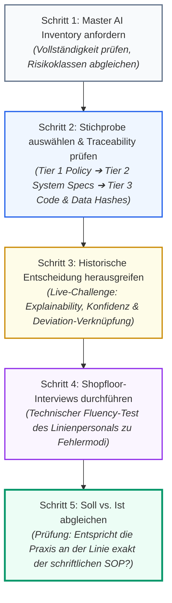

# Modul 12: Audit and Inspection Readiness

🌐 **[English Version](../en/module_12_audit_inspection_readiness.md)** &nbsp;|&nbsp; **[⬅ Modul 11: Lifecycle Management and Continuous Monitoring](module_11_lifecycle_continuous_monitoring.md) &nbsp;|&nbsp; [🏠 Inhaltsverzeichnis](00_overview.md)**

---

## 🎯 Lernziele & Leitfragen
1. **Das Disziplin-Postulat:** Warum kann man für eine KI-Behördeninspektion nicht „auf den letzten Drücker büffeln“ (*No Last-Minute Scramble*)?
2. **Der 5-Stufen-Inspektionspfad:** Nach welcher exakten, methodischen Reihenfolge durchleuchten Inspektoren von EMA und FDA pharmazeutische KI-Systeme?
3. **Das Master AI Inventory:** Warum ist das Inventar die allererste Verteidigungslinie und weshalb führt „Schatten-KI“ (*Shadow AI*) zur sofortigen Stilllegung?
4. **Verhalten im Audit-Raum:** Wie verteidigt man eine konkrete historische Modellvorhersage professionell und warum ist ehrliches Nicht-Wissen besser als Improvisieren?
5. **Cross-funktionale Einheit:** Wie verhindert man, dass sich Data Science, IT und QA vor dem Inspektor gegenseitig widersprechen?

---

## 🧭 Visualisierung: Der 5-Stufen-Inspektionspfad der Behörden

---

## 📌 Fachliche Zusammenfassung (Key Takeaways)

### 1. Das Grundgesetz: Inspection Readiness ist tägliche Routine
Für eine Annex-22-Inspektion kann man nicht zwei Wochen vor dem Termin hektisch Akten ordnen. 
* Wer versucht, Datenherkunft, Random Seeds, Bias-Analysen und Drift-Metriken erst kurz vor dem Audit zusammenzutragen, wird scheitern.
* Echte Inspektionssicherheit basiert auf **gelebter täglicher Ingenieurs- und QMS-Disziplin** über den gesamten Lebenszyklus des Systems hinweg.

### 2. Die Schweregrade von Mängeln im EU-GMP-Umfeld (Severity Grading)
Im europäischen Inspektionswesen (*Compilation of Community Procedures on Inspections*) werden Mängel in drei offizielle Kategorien eingeteilt:
* **Critical Deficiency (Kritischer Mangel):** Ein Mangel, der zu einem Arzneimittel geführt hat oder führen kann, das ein signifikantes Risiko für die Patientengesundheit darstellt, oder eine Kombination mehrerer schwerwiegender Mängel (z. B. unkontrolliertes, dynamisch online lernendes Modell in der finalen Chargenfreigabe). *Rechtsfolgen:* Ausstellung eines **Statement of Non-Compliance with GMP** (Art. 111(7) Richtlinie 2001/83/EG), Ruhen oder Entzug der Herstellungserlaubnis bzw. des GMP-Zertifikats sowie behördlich angeordnete Chargenrückrufe.
* **Major Deficiency (Schwerwiegender Mangel):** Eine erhebliche Abweichung von den GMP-Leitlinien (z. B. Schatten-KI im Einsatz, Retraining ohne formales Change Control und Re-Qualifizierung, unzureichende Testdaten-Isolation). *Behördliche Maßnahme:* Verpflichtung zur Vorlage eines detaillierten Sanierungsplans (CAPA) innerhalb einer Frist von meist 15 bis 30 Tagen; bei FDA-Inspektionen ggf. Ausstellung eines US-spezifischen *Warning Letters*.
* **Other Deficiency (Sonstiger Mangel – *nicht als 'Minor' bezeichnet*):** Eine Abweichung von GMP-Grundsätzen, die weder als kritisch noch als schwerwiegend eingestuft werden kann (z. B. vereinzelte redaktionelle Dokumentationsschwächen); Abarbeitung über das reguläre betriebliche CAPA-System.

### 3. Die Dokumentationshierarchie (Die 3 Tiers) ([Didaktik])
Behörden arbeiten sich strukturiert von der Makro- zur Mikroebene vor:
* **Tier 1 (Organisatorische Vorgaben):** Übergreifende AI-Governance-Policy, Data-Ethics-Richtlinien, SOPs für Modellqualifizierung und Change Control.
* **Tier 2 (Systemspezifische Dokumente):** *Master AI Inventory*, Intended Use Specification (Systemgrenzen nach [Draft §3.1]), User Requirements (URS), Qualifizierungsplan und -bericht (mit Akzeptanzkriterien nach [Draft §4.2]), Model Cards.
* **Tier 3 (Granulare technische Evidenz):** Trainings- und Testdaten-Hashes, Code-Repositories ([Draft §7.1, §7.4]), Konfigurations-Logs ([Draft §10.2]), Random Seeds, Konfusionsmatrizen und Inferenz-Audit-Trails.

### 4. Das Master AI Inventory als QMS-Erwartung ([Best Practice: QMS-Standard])
Die systematische Erfassung aller Algorithmen in einem zentralen **Master AI Inventory** ist eine elementare Erwartung an ein zeitgemäßes pharmazeutisches Qualitätsmanagementsystem (QMS):
Jeder Eintrag sollte zwingend enthalten:
1. Eindeutige System-ID und Versionsnummer
2. Prägnante Zusammenfassung des *Intended Use* ([Draft §3.1])
3. Risikoklassifizierung (Kritikalität nach Annex 22 / Annex 11)
4. Verantwortlicher Business & Technical Owner (QA / IT)
5. Aktueller Qualifizierungs- und Monitoring-Status ([Draft §10.3, §10.4])

> [!CAUTION]
> **Illustratives Praxisszenario (didaktisches Fallbeispiel, nicht belegt) – Der Schatten-KI-Kollaps:** Ein Team startete ein Pilotprojekt zur automatischen Vor-Sortierung von Packungsbeilagen. Weil das Tool funktionierte, nutzte das Schichtpersonal es monatelang im Produktivbetrieb – ohne Wissen der QA. Während einer Routineinspektion erwähnte ein Operator das Tool beiläufig. Da das System nicht im *Master AI Inventory* gelistet war, konnten weder Qualifizierungsdokumente noch Change-Control-Nachweise vorgelegt werden. Das Ergebnis: Eine schwerwiegende Mängelrüge (*Major Deficiency*) wegen Führungs- und Kontrollversagens und sofortiger Nutzungsstopp.

### 5. Verhalten im Audit-Raum (Surviving the Audit Room)
Wenn Auditoren eine konkrete historische Modellentscheidung herausgreifen:
* **Keine Spekulationen:** Niemals Antworten improvisieren, nur um kompetent zu wirken. Der Satz: *„Das ist ein spezifischer technischer Parameter, den ich anhand des Audit-Trails sofort verifiziere und Ihnen vorlege“* zeugt von professioneller Governance. Erfundenes Halbwissen, das widerlegt wird, zerstört die Glaubwürdigkeit des gesamten Standorts.
* **Umgang mit Fehlentscheidungen:** Auch ein validiertes KI-Modell macht Fehler. Hat das Modell in einem Fall falsch klassifiziert, ist das **kein Mangel**, sofern das Unternehmen nachweisen kann:
  1. Dass der Fehler durch das *Human-in-the-Loop*-System rechtzeitig abgefangen wurde.
  2. Dass der Vorfall als Abweichung (*Deviation*) erfasst wurde.
  3. Dass die CAPA-Maßnahme wirksam gegriffen hat.
* **Gemeinsames Vokabular (United Front):** Data Science, CSV-Validierung, IT und QA müssen vorab in gemeinsamen **Mock Inspections (Inspektionssimulationen)** trainiert werden. Widersprechen sich Data Scientist und QA-Leiter vor dem Inspektor bei technischen Definitionen, eskaliert die Prüfung sofort.

---

## 💡 Zentrale Fachbegriffe & Konzepte (Glossar)

- **Inspection Readiness:** Der permanente Zustand operativer und dokumentarischer Vorbereitung, der es erlaubt, behördlichen Prüfern jederzeit lückenlose GxP-Nachweise vorzulegen.
- **Master AI Inventory:** Das zentrale, verbindliche Verzeichnis aller im Unternehmen eingesetzten oder erprobten KI-Systeme inklusive Kritikalität und Validierungsstatus.
- **Shadow AI (Schatten-KI):** Der informelle, unautorisierte Einsatz von KI-Tools oder Piloten im GMP-Betrieb ohne Einbindung der QA und ohne Eintrag im Master Inventory.
- **Mock Inspection:** Eine realistische behördliche Prüfungssimulation mit externen oder internen Auditoren unter Zeitdruck zur Feststellung von Dokumentations- und Kommunikationslücken.
- **Drill-Down Capability:** Die Fähigkeit der Teams und Softwaresysteme, ausgehend von übergeordneten Kennzahlen unmittelbar auf die darunterliegenden Rohdaten und Skripte zuzugreifen.
- **Portfolio-wide CAPA:** Der Ansatz, gefundene Schwachstellen an einem KI-Modell sofort proaktiv auf alle weiteren im Unternehmen betriebenen Modelle zu übertragen und dort abzustellen.

---

## 📋 GxP-Compliance Checklist: Inspection Readiness

### Absolute Must-Haves:
- [ ] Liegt ein vollständig gepflegtes, aktuelles **Master AI Inventory** aller aktiven und erprobten KI-Systeme vor?
- [ ] Existiert für jedes produktive Modell eine standardisierte, genehmigte **Model Card**?
- [ ] Können technische Nachweise (Git-Commit, DVC-Hash, Docker-Container, Random Seeds) innerhalb von Minuten vorgelegt werden (*Fast Retrieval*)?
- [ ] Werden regelmäßig **Mock Inspections** mit Beteiligung von Data Science, IT und QA unter Realbedingungen durchgeführt?
- [ ] Wurden die Mitarbeiter an der Produktionslinie zu den systemspezifischen Fehlergrenzen der genutzten KI geschult (*Shopfloor Fluency*)?
- [ ] Sind alle historischen Fehlentscheidungen der KI lückenlos mit entsprechenden Abweichungsberichten (*Deviations*) und CAPAs verknüpft?

### Rote Flaggen bei Inspektionen (Red Flags):
- ❌ Auffinden von „Schatten-KI“ (Piloten oder lokale Tools), die in der Produktion genutzt werden, aber im Inventar fehlen.
- ❌ Dokumente und SOPs spiegeln veraltete Systemzustände wider (*Documentation Drift*).
- ❌ IT/Data Science und QA widersprechen sich im Audit-Gespräch über Rollen, Grenzwerte oder Validierungsansätze.
- ❌ Das Team kann auf Nachfrage des Prüfers die Rohdaten oder Trainings-Hashes für ein aktives Modell nicht lokalisieren.

---

🌐 **[English Version](../en/module_12_audit_inspection_readiness.md)** &nbsp;|&nbsp; **[⬅ Modul 11: Lifecycle Management and Continuous Monitoring](module_11_lifecycle_continuous_monitoring.md) &nbsp;|&nbsp; [🏠 Inhaltsverzeichnis](00_overview.md)**

