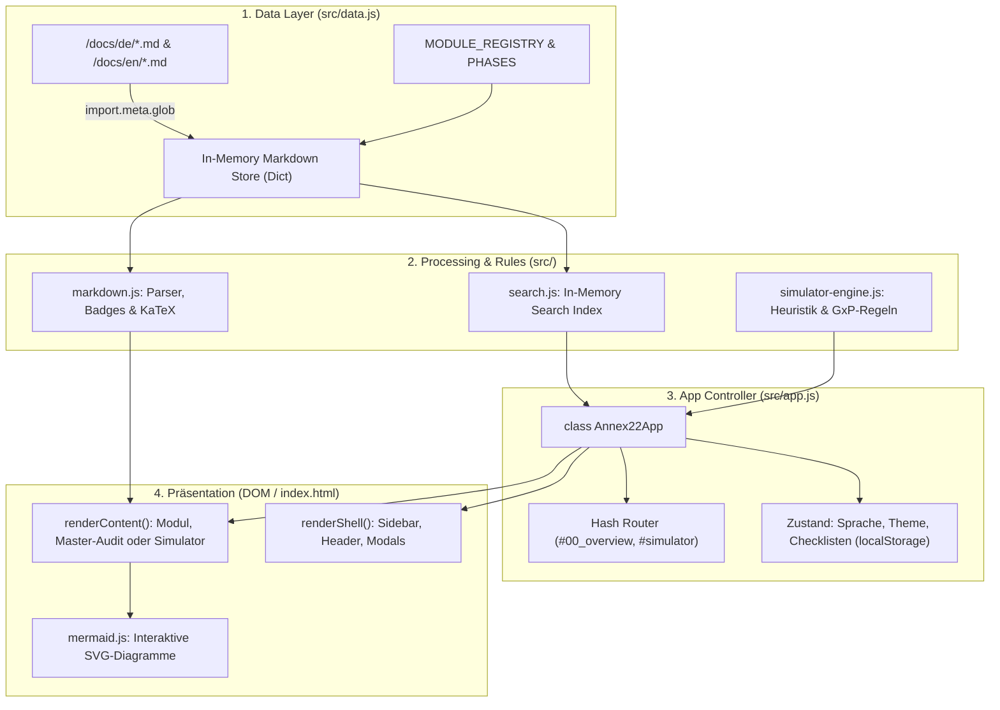

# 🏛️ Technische App-Architektur & Design (Für Python-Entwickler)
# Annex 22 Compliance Hub & 22Annex.ai Simulator

Dieses Dokument erklärt den technischen Aufbau der Web-Applikation im Ordner `src/` aus der Perspektive eines **Python-Entwicklers**.

---

## 1. 🧠 Schnelle Übersetzung: JavaScript vs. Python

Wenn du Python (z. B. FastAPI, Flask, Streamlit oder Standard-OOP) kennst, lässt sich die Applikation 1:1 auf vertraute Konzepte abbilden:

| Frontend-Konzept (JavaScript) | Python-Äquivalent / Mental Model | Funktion im Projekt |
| :--- | :--- | :--- |
| **Vite Dev Server** (`package.json`) | `uvicorn main:app --reload` | Schneller lokaler Server mit automatischem Neuladen bei Dateiänderungen. |
| **ES Modules (`import / export`)** | Python Modules (`import foo`, `from bar import baz`) | Modulare Aufteilung des Codes in `data.js`, `search.js` etc. |
| **`class Annex22App` (`src/app.js`)** | `class Annex22App:` mit `__init__(self)` | Der Haupt-Controller, der den Gesamtzustand verwaltet. (In JS heißt `self` einfach `this`). |
| **Template Strings (`` `<div>${x}</div>` ``)** | Python f-strings: `f"<div>{x}</div>"` | Generierung von HTML-Bausteinen direkt im Code ohne externes Template-Framework. |
| **`import.meta.glob('/docs/**/*.md')`** | `glob.glob('docs/**/*.md')` + Datei-Read | Lädt alle Markdown-Dateien zur Build-Zeit in ein Dictionary `{dateipfad: inhalt}`. |
| **`localStorage`** | Lokale `sqlite3`-DB oder `json.dump('session.json')` | Persistenter Speicher im Browser des Nutzers (z. B. Checklisten-Status, Sprache, Theme). |
| **`addEventListener('click', ...)`** | GUI/Streamlit Callbacks (`on_click=handler`) | Reagiert auf Benutzeraktionen (Klicks, Tastendruck wie `Cmd+K`). |
| **Marked.js / KaTeX** | `python-markdown` + Plugins für LaTeX | Wandelt Markdown in HTML um und rendert Formeln. |
| **Node Test Runner (`node --test`)** | `pytest` | Führt automatisierte Unit- und Benchmark-Tests für die Simulator-Engine aus. |

---

## 2. 🏗️ Gesamtarchitektur & Datenfluss

Die App ist eine **Single-Page Application (SPA)** in **Vanilla JavaScript** (ohne schweres React- oder Vue-Framework). Sie läuft vollständig im Browser des Nutzers:



---

## 3. 📂 Die Module im Detail

### 3.1 `src/data.js` — Die Datenquelle (Data Registry)
* **Python-Vergleich:** Wie ein Repository- oder ORM-Modul, das Dataclasses und Dictionaries bereitstellt.
* **Was passiert hier?**
  * `import.meta.glob('/docs/**/*.md', { eager: true })`: Lädt alle 30 Markdown-Dateien (15x Deutsch, 15x Englisch) beim Start in ein Dictionary.
  * `MODULE_REGISTRY`: Eine Liste von Dictionaries, die jedes Modul beschreibt (`id`, `number`, `title`, `phase`, `icon`, `file`).
  * `PHASES`: Gruppiert die Module in die 5 Stufen des AI-Lebenszyklus.
  * `getDocContent(moduleId, lang)`: Sucht den passenden Markdown-String heraus (wie `dict.get()`).

---

### 3.2 `src/markdown.js` — Die Rendering-Pipeline
* **Python-Vergleich:** Ein Markdown-Compiler wie `markdown` oder `mistune` mit benutzerdefinierten Erweiterungen.
* **Funktionsweise:**
  1. **Formeln (`renderMath`):** Sucht nach `$$...$$` und `$..$` und kompiliert sie mit **KaTeX** zu HTML.
  2. **Badges (`renderBadges`):** Erkennt regulatorische Tags wie `[Draft §3.1]`, `[ALCOA+]` oder `[Didaktik]` und wandelt sie in farbige Pill-Badges um.
  3. **Checklisten:** Erkennt Standard-Markdown-Kästchen (`- [ ]`) und baut interaktive HTML-Checkboxen mit IDs ein (`data-chk-id="01-1"`).
  4. **GitHub-Alerts:** Wandelt `> [!NOTE]`, `> [!WARNING]` etc. in gestylte Callout-Boxen um.
  5. **Mermaid-Diagramme:** Fängt ````mermaid````-Blöcke ab und bereitet sie für das interaktive Rendern und das Zoom-Modal vor.

---

### 3.3 `src/search.js` — Die Client-seitige Suchmaschine
* **Python-Vergleich:** Eine leichtgewichtige In-Memory-Volltextsuche (wie Whoosh oder eine Python-Klasse mit Tokenizer und Scoring).
* **Funktionsweise:**
  * Zerlegt beim Laden jedes Markdown-Dokument an den Überschriften (`##`) in handliche Textabschnitte.
  * Baut einen Suchindex mit `cleanText` (lowercase) auf.
  * Bei einer Suche (über `Cmd + K`) vergibt der Algorithmus Relevanzpunkte:
    * Treffer im Modultitel: **+50 Punkte**
    * Treffer in der Sektions-Überschrift: **+40 Punkte**
    * Treffer im Fließtext: **+2 Punkte pro Vorkommen**
  * Liefert die Top-Ergebnisse inklusive markiertem Snippet (`<mark>`) zurück.

---

### 3.4 `src/simulator-engine.js` — Die GxP-Regel-Engine
* **Python-Vergleich:** Reine Geschäftslogik / Domain Service (ohne UI-Code). Kann komplett isoliert getestet werden (wie `pytest tests/`).
* **Kernfunktionen:**
  * `extractParametersHeuristically(text)`: Durchsucht Freitext-Eingaben per Regex nach pharmazeutischen Signalwörtern (z. B. *"Bioreaktor"*, *"Sichtprüfung"*, *"Continual Learning"*, *"Human-in-the-Loop"*).
  * `calculateLiveScore(state)`: Das normative Scoring. Startet bei 100 Punkten und zieht bei regulatorischen Verstößen Punkte ab (z. B. -35 für unkontrolliertes Online-Learning gemäß Draft §1, -30 für HOOL-Vollautonomie).
  * `buildCoAuditorPrompt(state)`: Baut die System- und Kontext-Prompts für das Gemini-LLM zusammen.
  * `generateExpertBlueprint(state)`: Generiert den finalen Validierungs- und Gap-Report (Dossier).

---

### 3.5 `src/app.js` — Der Controller & State Manager
* **Python-Vergleich:** Die Hauptanwendung (wie eine FastAPI-App oder eine Tkinter/Qt/Streamlit-Steuerklasse).
* **Aufgaben:**
  * **Routing:** Liest die URL-Hash (`#module_01...`, `#simulator`, `#checklist_master`) und entscheidet, welche Ansicht angezeigt wird.
  * **State Management:** Verwaltet die aktuelle Sprache (`de`/`en`), das Farbschema (`neutral`, `blue`, `emerald`, `amber`) und die Checklisten-Häkchen.
  * **DOM-Rendering:** Baut das HTML zusammen und schreibt es in `<div id="app"></div>`.
  * **Interaktion:** Hört auf Klicks (Checklisten abhaken, Sprache wechseln, Diagramm-Zoom im Modal).

---

## 4. 🔄 Der Lebenszyklus: Was passiert beim Klick auf ein Modul?

```text
Nutzer klickt auf Modul 04 ("Risk-Based Approach")
                  │
                  ▼
1. Hash ändert sich auf '#module_04_risk_based_approach'
                  │
                  ▼
2. app.js: Router fängt Event ab -> ruft navigate('module_04_risk_based_approach') auf
                  │
                  ▼
3. data.js: getDocContent('module_04_risk_based_approach', 'de') liefert Markdown-Text
                  │
                  ▼
4. markdown.js: parseModuleMarkdown() führt Regex & Parser aus
   - KaTeX rendert FMEA-Formeln ($$RPN = S \times O \times D$$)
   - Mermaid bereitet Diagramme vor
   - Checkboxen werden mit aktuellem Status aus localStorage verknüpft
                  │
                  ▼
5. app.js: Schreibt das fertige HTML in den Main-Bereich und ruft 'mermaid.run()' auf
                  │
                  ▼
6. Browser rendert Seite blitzschnell (Client-Side, ohne Server-Roundtrip!)
```

---

## 5. 🧪 Testing & Qualitätssicherung

Die Simulator-Engine besitzt automatisierte Tests, die wie `pytest` ausgeführt werden:

```bash
# Entspricht 'pytest tests/'
npm test
```
*Ausgeführt über Node.js mit `tests/evaluation_scenarios.test.js`.*

---

## 6. 📦 Container & Sandbox Setup (Minimal macOS Footprint)

Um das lokale macOS-System sauber zu halten, existiert eine vollständige **Docker / OrbStack-Sandbox** (`Dockerfile` & `docker-compose.yml`), die Node.js 20 und Python 3 kapselt:

### 6.1 Web-App im isolierten Container starten:
```bash
docker compose up
# ➔ App läuft unter http://localhost:5173 mit Live Hot-Reloading!
```

### 6.2 Tests & Skripte im Container ausführen:
```bash
# Tests ausführen (ohne lokales Node.js)
docker compose run --rm app npm test

# Dokumenten-Synchronisation prüfen (ohne lokales Python)
docker compose run --rm app python3 scripts/check_doc_sync.py

# Produktions-Bundle bauen
docker compose run --rm app npm run build
```

### 6.3 Dev Container (VS Code / Antigravity IDE):
Das Repository enthält eine `.devcontainer/devcontainer.json`. Beim Öffnen in der IDE kann die gesamte Arbeitsumgebung mit einem Klick („In Container öffnen“) gestartet werden.

