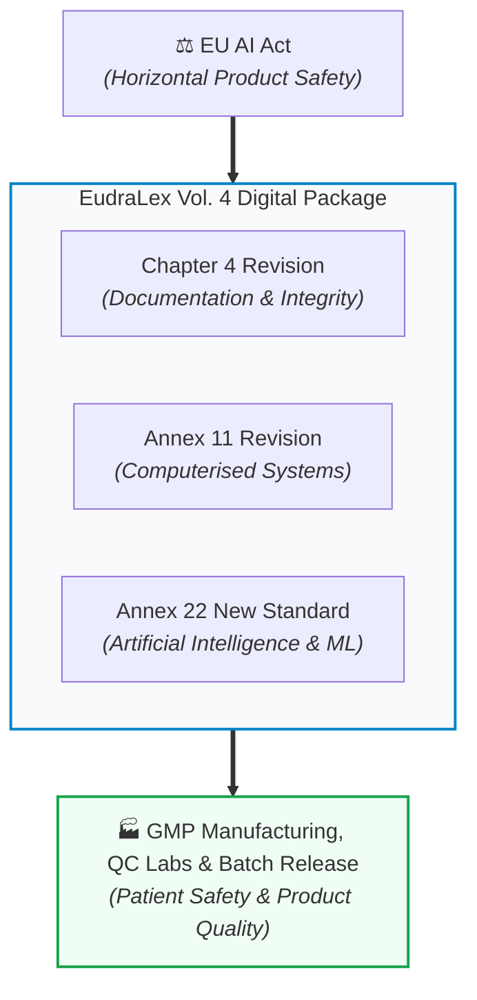
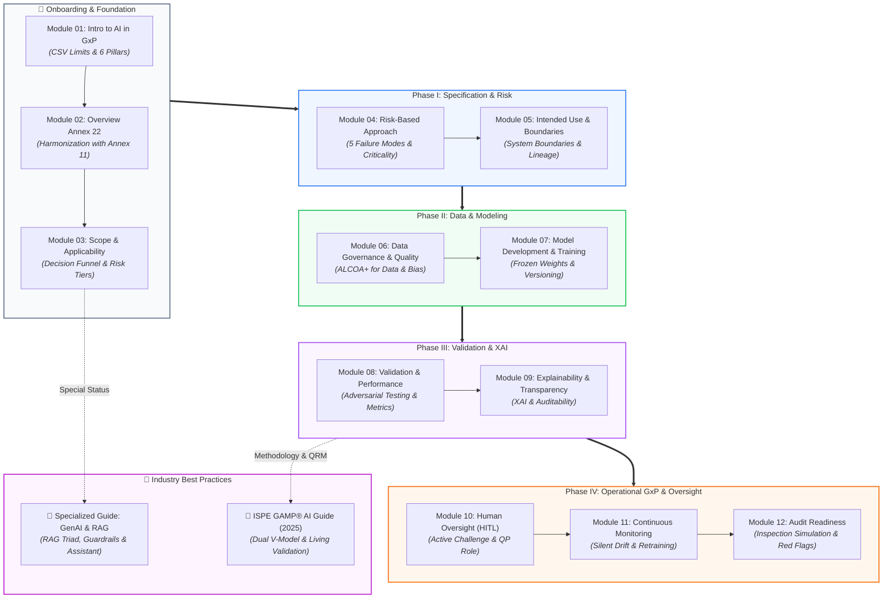

<!-- metadata
source_file: docs/de/00_overview.md
source_commit: 8fed97a
sync_date: 2026-09-29
language: en
-->

# EU GMP Annex 22: Framework & Master Overview

🌐 **[Zur deutschen Version wechseln](../de/00_overview.md)**

> **Executive Summary:**  
> This document serves as the master entry point and architectural orientation map for the **Draft EU GMP Annex 22** ("Artificial Intelligence and Machine Learning in GxP Environments"). It provides executive understanding and guides teams through all 12 deep-dive modules and specialized appendices.

---

## 1. What is Annex 22 and Why is it a Paradigm Shift?

For decades, the pharmaceutical industry relied on **EU GMP Annex 11** for computerized systems (deterministic software: *the same input always produces the exact same output*). Modern AI and machine learning systems learn emergently from data and can silently degrade during routine operations (*Silent Drift*).

With the publication of the **Draft Annex 22** by the European Commission, the EMA, and PIC/S in July 2025, regulators created the world’s first binding framework tailored specifically to AI in pharmaceutical production.

### Regulatory Status & Legal Applicability:
* **Current Status (as of 2026):** Annex 22 is currently a **Consultation Draft** issued by the European Commission, the EMA, and PIC/S. The public consultation closed on **October 7, 2025**. At the subsequent *EMA Multi-Stakeholder Workshop* (June 30 / July 1, 2026), stakeholder feedback and potential policy developments were discussed; re-evaluation of specific constraints (such as the exclusion of Generative AI from critical processes) is currently under review by inspectorate working groups, with no formal decision taken yet. Final publication and enforcement are expected in **late 2026 / early 2027**.
* **Factual Relevance in Practice ([Interpretation]):** Although formally in draft stage (consultation draft), industry and regulatory practice expects audits and validation strategies to align with the core principles formulated in the draft as the authoritative "State of the Art" benchmark.
* **The EudraLex Digital Package:** Annex 22 does not stand alone; it forms a modernized digital tripartite framework alongside the revisions to **Annex 11** (Computerised Systems) and **Chapter 4** (Documentation).

### The 3 Core Tenets:
1. **Annex 22 Supplements Annex 11 ([Draft §1]):** The draft explicitly positions itself as *additional guidance* to EU GMP Annex 11 (Computerised Systems). Annex 11 remains the foundation (IQ/OQ, physical controls, audit trails, cloud security). Annex 22 provides specific requirements for machine learning algorithms.
2. **Scope: Static Models and Deterministic Output ([Draft §1]):** The draft strictly applies to static models and models with deterministic output supporting or executing critical processes in medicinal product manufacturing. Dynamic models (continuous online retraining) and models with probabilistic output are outside its scope and should not be used in critical GMP applications (*"should not be used"*).
3. **Regulated User Accountability & Human Oversight ([Draft §2.2, §3.3, §10.5]):** The regulated user must obtain and review documentation for activities conducted by third-party suppliers ([Draft §2.2]); ultimate pharmaceutical and legal accountability for product quality, patient safety, and data integrity remains strictly with the manufacturer under EU pharma law. Human oversight is mandatory where model testing effort was reduced based on human decision-making ([Draft §3.3, §10.5]).

### 🏷️ Project Labeling Convention (Attribution & Evidence Levels)
To ensure rigorous distinction between statutory draft requirements and industry methodologies, this repository employs standardized labels:
* **`[Draft §X.Y]`**: Specific regulatory requirement or statement directly derived from the official EU GMP Annex 22 Consultation Draft (July 2025).
* **`[Best Practice: Source]`**: Industry-standard methods and established guidance with named provenance (e.g. `[Best Practice: ISPE GAMP AI Guide]`, `[Best Practice: ICH Q9 (R1)]`, or `[Best Practice: ML Practice]`).
* **`[Didaktik]`**: Didactic frameworks, structural aids, case studies, and pedagogical metaphors (e.g. "the fence metaphor") created for this learning repository.
* **`[Interpretation]`**: Technical interpretation and regulatory classification of derived concepts.

---

## 2. Master Process Map & Module Navigator

The following process map connects the regulatory foundation with the operational stages of the AI/ML lifecycle, serving as your central navigation hub across all 12 modules and specialized guides:

---

### Direct Lifecycle Navigation

#### 🧭 Onboarding & Regulatory Foundation
*Which systems fall under Annex 22 and how do we draw proper boundaries?*
- **[Module 01: Introduction to AI in GxP Environments](module_01_introduction_ai_gxp.md)**  
  *Why traditional CSV falls short for AI, real-world pharma case studies, and the 6 pillars of trustworthy AI.*
- **[Module 02: Overview of Annex 22](module_02_overview_annex_22.md)**  
  *Coexistence with Annex 11, mitigating automation bias, and the 5-stage implementation roadmap.*
- **[Module 03: Scope and Applicability of AI Systems](module_03_scope_applicability.md)**  
  *The 5-stage decision funnel, 4 risk tiers, and building an audit-proof master AI inventory.*

#### ⚖️ Phase I: Specification & Risk Management
*How deep must validation go and where do we establish unbreakable boundaries?*
- **[Module 04: Risk-Based Approach to AI](module_04_risk_based_approach.md)**  
  *The proportionality principle, silent degradation, 5 AI-specific failure modes, and HITL vs. HOTL.*
- **[Module 05: Intended Use and Model Definition](module_05_intended_use_model_definition.md)**  
  *The contractual core: The "Fence Metaphor", scope creep prevention, and technical model lineage.*

#### 🔬 Phase II: Data Governance & Model Engineering
*How do we ensure that data and algorithms are GxP-compliant by design?*
- **[Module 06: Data Governance and Data Quality](module_06_data_governance_quality.md)**  
  *ALCOA+ for training data, data lineage, and strict test data isolation (split integrity).*
- **[Module 07: AI Model Development and Training](module_07_model_development_training.md)**  
  *Algorithm selection, hyperparameter tuning, cloud oversight, and immutable versioning (Frozen Weights).*

#### 🧪 Phase III: Verification & Explainability
*How do we prove robustness against extreme inputs and ensure transparent reasoning?*
- **[Module 08: Validation and Performance Testing](module_08_validation_performance_testing.md)**  
  *Adversarial testing, the Metric Quad (F1, Recall, Calibration, Robustness), staff independence, and GAMP mapping.*
- **[Module 09: Explainability and Transparency](module_09_explainability_transparency.md)**  
  *Explainable AI (XAI), eliminating black-box opacity, and proportionate transparency for auditors.*

#### 🛡️ Phase IV: Operational GxP, Human Oversight & Monitoring
*How do we sustain the validated state over years of routine operation?*
- **[Module 10: Human Oversight / Human in the Loop](module_10_human_oversight_hitl.md)**  
  *Active challenge workflows, override authority, and qualification of operators and QPs.*
- **[Module 11: Lifecycle Management and Continuous Monitoring](module_11_lifecycle_continuous_monitoring.md)**  
  *Early detection of data and concept drift, alarm thresholds, and gated retraining via Change Control.*
- **[Module 12: Audit and Inspection Readiness](module_12_audit_inspection_readiness.md)**  
  *Inspection simulations, defending models before the EMA/FDA, and avoiding red flags.*

#### 📖 Specialized Dossiers & Industry Standards (Appendices)
*Advanced deep-dives for modern automations and lifecycle methodologies:*
- 🤖 **[Specialized Guide: Generative AI (GenAI), LLMs & RAG in GxP](appendix_genai_rag_gxp.md)**  
  *Special status under Annex 22, RAG architecture, ALCOA+ citation rules, the RAG Triad (Groundedness, Context Relevance, Answer Relevance), prompt governance as code, and deterministic guardrails.*
- 📘 **[Specialized Guide: ISPE GAMP® AI Guide & Industry Best Practices](appendix_ispe_gamp_ai_best_practices.md)**  
  *The dual lifecycle model (software vs. data cycles), GAMP AI categories (Cat 1 to Cat 5), QRM under ICH Q9 (R1), cloud/supplier oversight, and living validation.*

---

## 3. Executive Rules for GxP Practice

| # | Principle | Operational Significance for Projects |
| :-: | :--- | :--- |
| **1** | **No Black Box Without a Fence** | Every AI system requires an approved *Intended Use Specification* with explicit out-of-scope boundaries prior to development. |
| **2** | **No Uncontrolled Retraining ([Draft §1])** | Dynamic models (continuous online retraining) and models with probabilistic outputs should not be used in critical GMP applications; critical operations are restricted to static models with frozen weights ([Draft §1]). |
| **3** | **Treat Data Like Active Ingredients** | Training and testing data are subject to the same rigorous ALCOA+ standards as active pharmaceutical ingredients (APIs). |
| **4** | **Enforce Active Human Challenge** | Human reviewers must independently assess events to eliminate complacency and *Automation Bias*. |
| **5** | **Instrument Against Silent Drift** | Every AI system must feature statistical monitoring from Day 1 to detect performance degradation immediately. |

---

## 4. Specialized Guides & Industry Best Practices (Appendices)

To close technical gaps and architect modern automated workflows, consult our two specialized dossiers:

* 🤖 **[Specialized Guide: Generative AI (GenAI), LLMs & RAG in GxP](appendix_genai_rag_gxp.md)**  
  *Architectural patterns against hallucinations, ALCOA+ citation discipline, RAG Triad metrics, prompt engineering under Change Control, and deterministic guardrails.*
* 📘 **[Specialized Guide: ISPE GAMP® AI Guide & Industry Best Practices](appendix_ispe_gamp_ai_best_practices.md)**  
  *The dual lifecycle model, GAMP software categories for AI, QRM under ICH Q9 (R1), cloud supplier oversight, and continuous living validation.*

---

## 5. Primary Regulatory Sources & Reference Directory

This learning repository is grounded in the following primary sources and reference frameworks (Status / Retrieval Date: September 28, 2026):

| Ref | Author / Document | Regulatory Significance & Citation | Retrieval Date |
| :---: | :--- | :--- | :---: |
| **Q1** | **European Commission / EMA / PIC/S:** [Annex 22: Artificial Intelligence (consultation draft)](https://health.ec.europa.eu/document/download/5f38a92d-bb8e-4264-8898-ea076e926db6_en?filename=mp_vol4_chap4_annex22_consultation_guideline_en.pdf) | **Binding Primary Source:** Official consultation draft (6 pages; public consultation ended October 7, 2025). | 2026-09-28 |
| **Q2** | **European Medicines Agency (EMA):** [GMP Multi-Stakeholder Workshop on AI Guidance Development (Annex 22)](https://www.ema.europa.eu/en/events/good-manufacturing-practice-multistakeholder-workshop-expert-contributions-artificial-intelligence-guidance-development-annex-22) | **Multi-Stakeholder Dialogue (June 30 / July 1, 2026):** Discussion of expert contributions; potential re-evaluations under review by inspectorate working groups (no formal policy decision yet). | 2026-09-28 |
| **Q3** | **European Union:** Regulation (EU) 2024/1689 (*EU AI Act*) | Horizontal EU law; the definition of "AI system" in Art. 3(1) Regulation 2024/1689 was adopted into the Annex 22 draft glossary. | 2026-09-28 |
| **Q4** | **European Commission:** EudraLex Vol. 4, *Annex 11: Computerised Systems* | Foundational baseline; Annex 22 explicitly serves as *additional guidance* ([Draft §1]). | 2026-09-28 |
| **Q5** | **European Commission:** EudraLex Vol. 4, *Chapter 4: Documentation* | Fundamental requirements for data integrity, version control, and auditable records within the EudraLex Digital Package. | 2026-09-28 |
| **Q6** | **European Union:** Directive 2001/83/EC (Community Code relating to medicinal products for human use) | Legal framework for marketing authorization holder accountability, batch certification by the Qualified Person (Art. 51), and enforcement non-compliance procedures (Art. 111(7)). | 2026-09-28 |
| **Q7** | **European Commission / EMA:** *Compilation of Union Procedures on Inspections and Exchange of Information* | Official EU deficiency categories during GMP inspections: *Critical*, *Major*, *Other Deficiency*. | 2026-09-28 |
| **Q8** | **ISPE:** *GAMP® 5: A Risk-Based Approach to Compliant GxP Computerized Systems (Second Edition, 2022)* | Global industry standard for risk-based computerized system qualification (Software Categories 1, 3, 4, 5). | 2026-09-28 |
| **Q9** | **ISPE:** *GAMP® Guide: Enabling Artificial Intelligence and Machine Learning in GxP Environments (July 2025)* | Established industry practice for dual lifecycles, living validation, and machine learning governance ([Best Practice: ISPE GAMP]). | 2026-09-28 |
| **Q10** | **US FDA (CDER):** [Artificial Intelligence in Drug Manufacturing; Notice of Request for Information and Comments (Docket No. FDA-2023-N-0487, March 2023)](https://www.federalregister.gov/documents/2023/03/01/2023-04221/artificial-intelligence-in-drug-manufacturing-notice-of-request-for-information-and-comments) | US discussion paper and FRAME initiative on AI/ML in drug manufacturing; separate US context, not an EU statutory basis. | 2026-09-28 |

