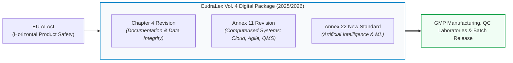
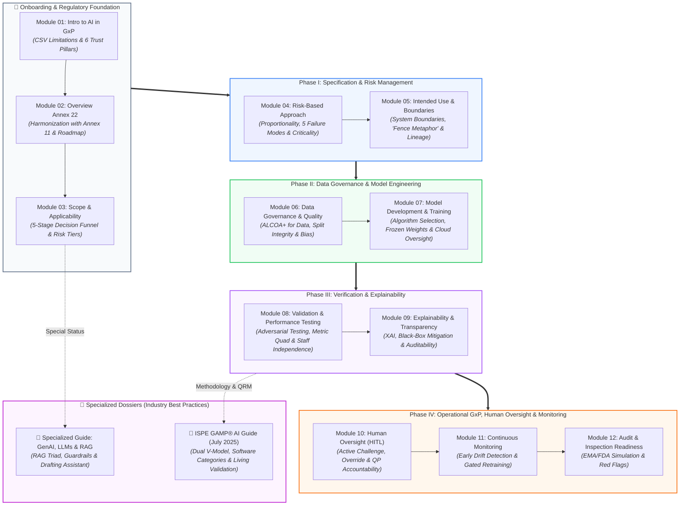

<!-- metadata
source_file: docs/de/00_overview.md
source_commit: 8fed97a
sync_date: 2026-09-28
language: en
-->

# EU GMP Annex 22: Framework & Master Overview

🌐 **[Zur deutschen Version wechseln](../de/00_overview.md)**

> **Executive Summary:**  
> This document serves as the master entry point and architectural orientation map for the **Draft EU GMP Annex 22** ("Artificial Intelligence and Machine Learning in GxP Environments"). It provides executive understanding and guides teams through all 12 deep-dive modules and specialized appendices.

---

## 1. What is Annex 22 and Why is it a Paradigm Shift?

For decades, the pharmaceutical industry relied on **EU GMP Annex 11** for computerized systems (deterministic software: *the same input always produces the exact same output*). Modern AI and machine learning systems learn emergently from data and can silently degrade during routine operations (*Silent Drift*).

With the publication of the **Draft Annex 22** by the European Commission, the EMA, and PIC/S in July 2025, regulators created the world’s first binding framework tailored specifically to AI in pharmaceutical production.

### Regulatory Status & Legal Applicability:
* **Current Status (as of 2026):** Annex 22 is currently a **Draft under final revision** by the *EMA GMDP Inspectors Working Group* and PIC/S. The public consultation closed in October 2025; formal adoption and enforcement are expected in **late 2026 / early 2027** (with a typical transition period).
* **Factual Inspection Relevance Today:** Although not yet legally in force, regulatory authorities (EMA, FDA, national GMDP inspectors) already apply the draft’s core principles as the **"State of the Art"** benchmark during inspections under Annex 11.
* **The EudraLex Digital Package:** Annex 22 does not stand alone; it forms a modernized digital tripartite framework alongside the revisions to **Annex 11** (Computerised Systems) and **Chapter 4** (Documentation).

### The 3 Core Tenets:
1. **Annex 22 Does Not Replace Annex 11:** Annex 11 remains the foundation (IQ/OQ, physical security, audit trails, disaster recovery). Annex 22 adds specific requirements for adaptive and learning algorithms.
2. **Static Over Dynamic Models:** In critical GMP operations, only **static models (Frozen Weights)** are permitted. Continuously self-training or dynamic models are strictly prohibited for batch disposition and release decisions.
3. **Human Over Machine (Human-in-the-Loop):** Legal and ethical accountability for product quality and patient safety rests solely with qualified personnel (e.g., the Qualified Person under EU Directive 2001/83/EC).

---

## 2. Master Process Map & Module Navigator

The following process map connects the regulatory foundation with the operational stages of the AI/ML lifecycle, serving as your central navigation hub across all 12 modules and specialized guides:

---

### Direct Lifecycle Navigation

#### 🧭 Onboarding & Regulatory Foundation
*Which systems fall under Annex 22 and how do we draw proper boundaries?*
- **[Module 01: Introduction to AI in GxP Environments](module_01_introduction_ai_gxp.md)**  
  *Why traditional CSV falls short for AI, real-world pharma case studies, and the 6 pillars of trustworthy AI.*
- **[Module 02: Overview of Annex 22](module_02_overview_annex_22.md)**  
  *Coexistence with Annex 11, mitigating automation bias, and the 5-stage implementation roadmap.*
- **[Module 03: Scope and Applicability of AI Systems](module_03_scope_applicability.md)**  
  *The 5-stage decision funnel, 4 risk tiers, and building an audit-proof master AI inventory.*

#### ⚖️ Phase I: Specification & Risk Management
*How deep must validation go and where do we establish unbreakable boundaries?*
- **[Module 04: Risk-Based Approach to AI](module_04_risk_based_approach.md)**  
  *The proportionality principle, silent degradation, 5 AI-specific failure modes, and HITL vs. HOTL.*
- **[Module 05: Intended Use and Model Definition](module_05_intended_use_model_definition.md)**  
  *The contractual core: The "Fence Metaphor", scope creep prevention, and technical model lineage.*

#### 🔬 Phase II: Data Governance & Model Engineering
*How do we ensure that data and algorithms are GxP-compliant by design?*
- **[Module 06: Data Governance and Data Quality](module_06_data_governance_quality.md)**  
  *ALCOA+ for training data, data lineage, and strict test data isolation (split integrity).*
- **[Module 07: AI Model Development and Training](module_07_model_development_training.md)**  
  *Algorithm selection, hyperparameter tuning, cloud oversight, and immutable versioning (Frozen Weights).*

#### 🧪 Phase III: Verification & Explainability
*How do we prove robustness against extreme inputs and ensure transparent reasoning?*
- **[Module 08: Validation and Performance Testing](module_08_validation_performance_testing.md)**  
  *Adversarial testing, the Metric Quad (F1, Recall, Calibration, Robustness), staff independence, and GAMP mapping.*
- **[Module 09: Explainability and Transparency](module_09_explainability_transparency.md)**  
  *Explainable AI (XAI), eliminating black-box opacity, and proportionate transparency for auditors.*

#### 🛡️ Phase IV: Operational GxP, Human Oversight & Monitoring
*How do we sustain the validated state over years of routine operation?*
- **[Module 10: Human Oversight / Human in the Loop](module_10_human_oversight_hitl.md)**  
  *Active challenge workflows, override authority, and qualification of operators and QPs.*
- **[Module 11: Lifecycle Management and Continuous Monitoring](module_11_lifecycle_continuous_monitoring.md)**  
  *Early detection of data and concept drift, alarm thresholds, and gated retraining via Change Control.*
- **[Module 12: Audit and Inspection Readiness](module_12_audit_inspection_readiness.md)**  
  *Inspection simulations, defending models before the EMA/FDA, and avoiding red flags.*

#### 📖 Specialized Dossiers & Industry Standards (Appendices)
*Advanced deep-dives for modern automations and lifecycle methodologies:*
- 🤖 **[Specialized Guide: Generative AI (GenAI), LLMs & RAG in GxP](appendix_genai_rag_gxp.md)**  
  *Special status under Annex 22, RAG architecture, ALCOA+ citation rules, the RAG Triad (Groundedness, Context Relevance, Answer Relevance), prompt governance as code, and deterministic guardrails.*
- 📘 **[Specialized Guide: ISPE GAMP® AI Guide & Industry Best Practices](appendix_ispe_gamp_ai_best_practices.md)**  
  *The dual lifecycle model (software vs. data cycles), GAMP AI categories (Cat 1 to Cat 5), QRM under ICH Q9 (R1), cloud/supplier oversight, and living validation.*

---

## 3. Executive Rules for GxP Practice

| # | Principle | Operational Significance for Projects |
| :-: | :--- | :--- |
| **1** | **No Black Box Without a Fence** | Every AI system requires an approved *Intended Use Specification* with explicit out-of-scope boundaries prior to development. |
| **2** | **No Silent Online Learning** | Only static models with *Frozen Weights* may be deployed for critical GMP decision-making. |
| **3** | **Treat Data Like Active Ingredients** | Training and testing data are subject to the same rigorous ALCOA+ standards as active pharmaceutical ingredients (APIs). |
| **4** | **Enforce Active Human Challenge** | Human reviewers must independently assess events to eliminate complacency and *Automation Bias*. |
| **5** | **Instrument Against Silent Drift** | Every AI system must feature statistical monitoring from Day 1 to detect performance degradation immediately. |

---

## 4. Specialized Guides & Industry Best Practices (Appendices)

To close technical gaps and architect modern automated workflows, consult our two specialized dossiers:

* 🤖 **[Specialized Guide: Generative AI (GenAI), LLMs & RAG in GxP](appendix_genai_rag_gxp.md)**  
  *Architectural patterns against hallucinations, ALCOA+ citation discipline, RAG Triad metrics, prompt engineering under Change Control, and deterministic guardrails.*
* 📘 **[Specialized Guide: ISPE GAMP® AI Guide & Industry Best Practices](appendix_ispe_gamp_ai_best_practices.md)**  
  *The dual lifecycle model, GAMP software categories for AI, QRM under ICH Q9 (R1), cloud supplier oversight, and continuous living validation.*
