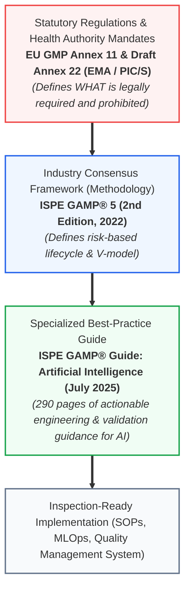
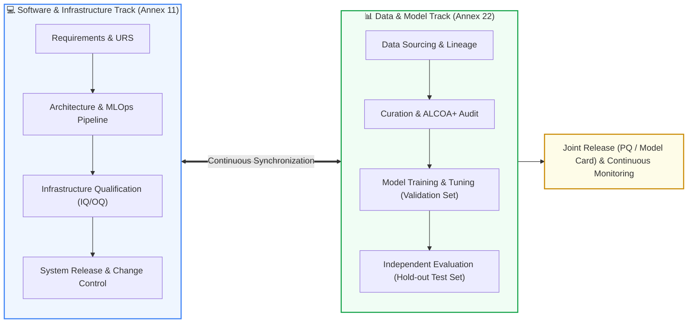
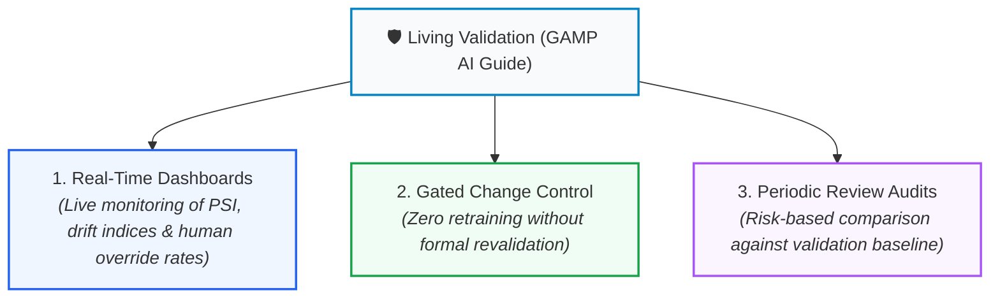

<!-- metadata source_file: docs/de/appendix_ispe_gamp_ai_best_practices.md, sync_date: 2026-09-28 -->
# Guide: ISPE GAMP® AI Guide & Established Industry Best Practices

🌐 **[Deutsche Version](../de/appendix_ispe_gamp_ai_best_practices.md)** &nbsp;|&nbsp; **[🏠 Back to Table of Contents](00_overview.md) &nbsp;|&nbsp; [⬅ GenAI & RAG Guide](appendix_genai_rag_gxp.md) &nbsp;|&nbsp; [Module 08: Validation & Testing](module_08_validation_performance_testing.md)**

---

> **Executive Summary:**  
> While regulatory authorities (EMA, FDA, PIC/S) establish statutory requirements and red lines in frameworks such as the **Draft EU GMP Annex 22**, the industry provides practical technical execution roadmaps via the **ISPE GAMP® Guide: Artificial Intelligence**, published in **July 2025**. This guide synthesizes key methodologies from the 290-page GAMP AI standard, detailing how life science organizations can harmonize agile MLOps with established GAMP 5 computer system validation paradigms.

---

## 1. Regulatory Context: Annex 22 vs. GAMP® 5 vs. ISPE GAMP AI Guide

To prevent compliance ambiguities across multidisciplinary project teams, the governance hierarchy must be precisely understood:

* **Annex 22** is the *Regulation* (the legal benchmark applied during official regulatory inspections).
* **GAMP 5** is the foundational *Framework* for risk-based Computerized Systems Validation (CSV/CSA).
* The **ISPE GAMP AI Guide (2025)** is the practical *Playbook*, arming data science, validation, and QA teams with concrete engineering workflows.

---

## 2. The Dual Lifecycle Model ([Best Practice: ISPE GAMP])

The primary methodological innovation introduced in the ISPE GAMP AI Guide is the **Dual Lifecycle Model**. Traditional software follows a single linear code lifecycle. An AI system, by contrast, comprises two concurrent, tightly synchronized tracks:

1. **The Software Track:** Conforms to classical GAMP lifecycle stages (specifications, build verification, container security, IQ/OQ of pipeline orchestration).
2. **The Data Track:** Traverses data ingestion, curating, labeling, feature engineering, and model training.
3. **The Convergence Gate:** Only when the software infrastructure is fully qualified **and** the datasets are demonstrated to be ALCOA+-compliant may the resulting model (with frozen weights) be released into Performance Qualification (PQ).

---

## 3. Extending GAMP Software Categories for AI

GAMP 5 traditionally divides software into categories (Categories 1, 3, 4, 5). The ISPE AI Guide maps artificial intelligence implementations into these categories:

| GAMP Category | Classical Definition | AI-Specific Application (ISPE GAMP AI Guide) | Validation Rigor |
| :---: | :--- | :--- | :---: |
| **Category 1** | Infrastructure Software | Cloud runtime platforms, container runtimes (Docker, Kubernetes), GPU hardware drivers | Standard Qualification (IQ) |
| **Category 3** | Non-Configured COTS Software | Off-the-shelf commercial models with immutable weights applied as-is (e.g., standard optical character recognition) | Supplier assessment, verification of suitability for *Context of Use* |
| **Category 4** | Configured Software | Fine-tuned foundational models (Transfer Learning), customized hyperparameters, RAG pipelines integrating internal SOPs | Substantial: Validation of configuration parameters, prompt templates, retrieval pipeline, and test suites |
| **Category 5** | Custom Software (Custom Build) | Ground-up proprietary neural networks, customized architectures, bespoke algorithmic pipelines | **Maximum Rigor:** Comprehensive data lineage, mathematical rationale, adversarial stress testing, full MLOps qualification |

---

## 4. Quality Risk Management (QRM) via ICH Q9 (R1) for AI

The GAMP AI Guide mandates that risk evaluations move beyond abstract categorizations to evaluate granular dimensions defined in **ICH Q9 (R1)**:
* **Severity:** What is the clinical or batch impact on the patient if the model produces an erroneous output?
* **Probability of Occurrence:** How susceptible is the algorithm to misclassification, sensor drift, or out-of-distribution inputs?
* **Detectability:** Can a qualified human operator on the line immediately detect the failure (*Active Human Oversight*), or does the defect propagate silently (*Silent Degradation*)?

> [!IMPORTANT]
> **The GAMP Proportionality Principle:**  
> Not every AI deployment warrants an exhaustive documentation binder. Low-criticality applications (e.g., AI-supported cleanroom shift scheduling) require streamlined controls. High-criticality systems (e.g., automated batch release inspection during sterile fill-finish) require the utmost rigor, independent hold-out validation, and granular audit trails.

---

## 5. Cloud & Supplier Governance (Vendor Management)

Because pharmaceutical sponsors routinely leverage hyperscale cloud infrastructure (AWS, Microsoft Azure, Google Cloud) or specialized COTS AI solutions, supplier management is a cornerstone of the GAMP AI Guide:

### The 4 Pillars of AI Vendor Oversight:
1. **Supplier Audit & Assessment:**  
   Quality Assurance (QA) must audit the vendor’s software development lifecycle, verifying documented procedures for data governance, bias testing, and security controls.
2. **Quality Service Level Agreement (Quality Agreement):**  
   Contractual stipulations guaranteeing that the supplier:
   - Does not implement unannounced algorithmic modifications or backend weight updates.
   - Provides contractual advance notification (e.g., 90 days) prior to API deprecation or kernel upgrades.
   - Refrains from ingesting customer proprietary data for public foundation model training.
3. **Escrow & Model Lineage Retrieval:**  
   Contractual safeguards ensuring that in the event of vendor insolvency, complete model checkpoints, training scripts, and telemetry logs transfer to the pharmaceutical sponsor.
4. **Non-Delegable Responsibility:**  
   GAMP emphasizes unequivocally: **Regulatory accountability for GxP compliance cannot be outsourced to commercial vendors** (*Regulated User Accountability*).

---

## 6. "Living Validation": The Continuous Qualified State

A defining tenet of GAMP 5 Second Edition states: **Validation is not an event concluded at go-live, but an ongoing operational state.**

### The 3 Pillars of Living Validation:

* **Automated Drift Alerting:** If the *Population Stability Index (PSI)* breaches the pre-validated threshold of $0.2$, a deviation ticket is automatically raised in the Quality Management System (QMS).
* **Gated Release Protocols:** Updated model weights can only deploy to production once an automated revalidation report is approved by QA.

---

## 📋 Summary: The 10 Commandments of the ISPE GAMP AI Guide ([Best Practice: ISPE GAMP])

1. **Context of Use:** Define the patient, product, and data integrity risk before writing a single line of code.
2. **Data is Code:** Subject training datasets to the same qualification rigor as regulated software code.
3. **Separate Lifecycles:** Maintain the data track in parallel with the software infrastructure track.
4. **No Unchecked Learning:** Run only static models with frozen weights in core GMP production.
5. **Staff Independence & Test Data Control ([Draft §6.2, §6.5]):** Protect test data from developer access and separate testers from training (if constrained by organization size: Four-Eyes Principle).
6. **Multi-Metric Evaluation:** Never rely on a single accuracy metric; enforce the complete Metric Quad.
7. **Supplier Oversight:** Formally audit cloud and COTS software providers for AI governance.
8. **Explainability by Design:** Select the simplest model architecture capable of reliably fulfilling the intended use.
9. **Active Oversight:** Prevent automation bias through intentional, anti-complacency workflow designs.
10. **Continuous Vigilance:** Continuously monitor drift and predictive integrity throughout the operational lifecycle.

---

🌐 **[Deutsche Version](../de/appendix_ispe_gamp_ai_best_practices.md)** &nbsp;|&nbsp; **[🏠 Back to Table of Contents](00_overview.md) &nbsp;|&nbsp; [⬅ GenAI & RAG Guide](appendix_genai_rag_gxp.md) &nbsp;|&nbsp; [Module 08: Validation & Testing](module_08_validation_performance_testing.md)**

