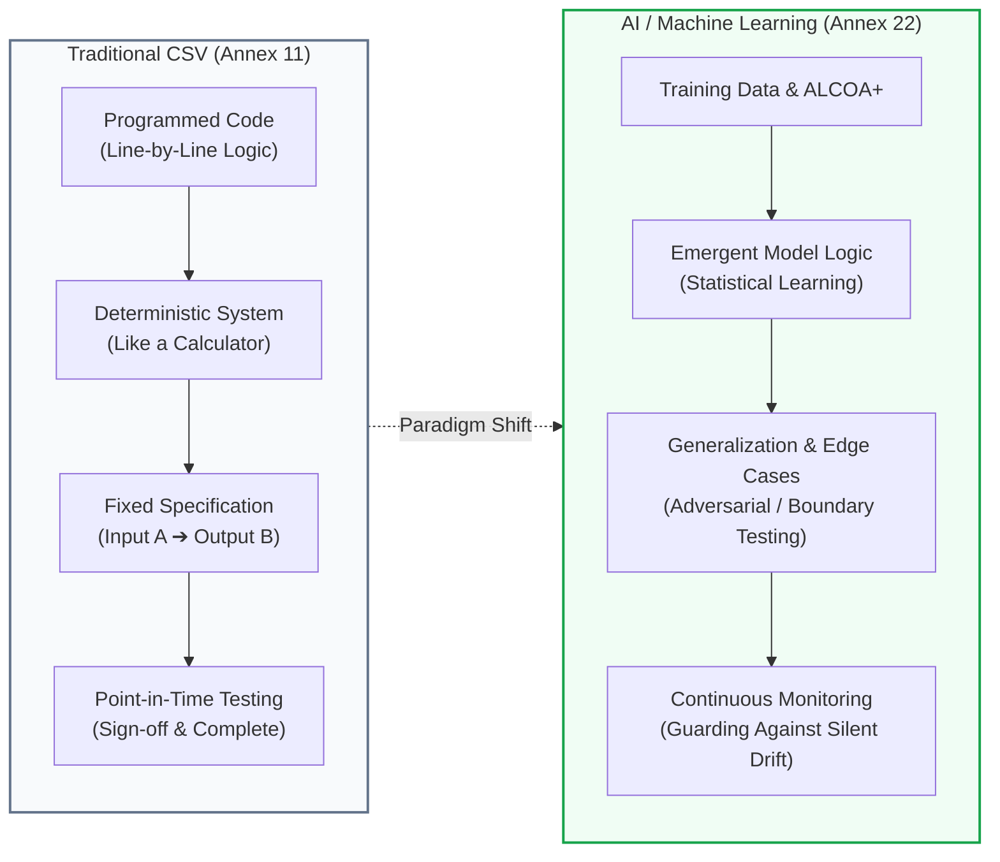
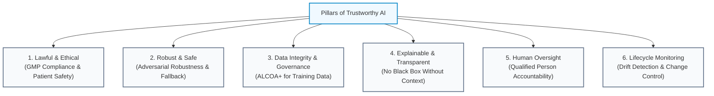

<!-- metadata
source_file: docs/de/module_01_introduction_ai_gxp.md
source_commit: 8fed97a
sync_date: 2026-09-28
language: en
-->

# Module 01: Introduction to AI in GxP Environments

🌐 **[Deutsche Version](../de/module_01_introduction_ai_gxp.md)** &nbsp;|&nbsp; **[🏠 Table of Contents](00_overview.md)** &nbsp;|&nbsp; **[Module 02: Overview of Annex 22 ➔](module_02_overview_annex_22.md)**

---

## 🧭 Core Concept: The Paradigm Shift

---

## 🎯 Learning Objectives & Guiding Questions
1. **What distinguishes AI systems under Annex 22 from traditional computerized systems under Annex 11?**
2. **Why does traditional Computer System Validation (CSV) fail for AI/ML models?**
3. **What are the 6 core pillars of "Trustworthy AI" under Annex 22?**
4. **How are roles and responsibilities distributed across QA, CSV Validation, and Data Science / IT?**

---

## 📌 Technical Summary (Key Takeaways)

### 1. Defining AI in GxP
- **Supplement to Annex 11 ([Draft §1]):** Annex 22 explicitly positions itself as *additional guidance* to EU GMP Annex 11 for systems supporting or executing critical steps in medicinal product manufacturing.
- **Demarcation from Traditional Software:** Conventional, purely rule-based or deterministic algorithms remain strictly under Annex 11, even if software suppliers label them as "AI" for marketing purposes.
- **Static vs. Dynamic Models:**
  - **Static Models (Scope under [Draft §1]):** The draft strictly applies to static models and models with deterministic output. Model architecture and parameters are locked post-qualification (*"frozen weights"*; [Draft Glossary]). The system consistently produces the identical output for identical inputs. Any modification requires formal Change Control ([Draft §10.1]).
  - **Dynamic / Continual Learning Models:** Continuously update their internal parameters in real-time operations. They are **not covered by the draft and should not be used in critical GMP applications** (*"should not be used"*, [Draft §1]), because a sustained validated state cannot currently be guaranteed under continuous autonomous self-modification.

### 2. Why Traditional CSV Fails for AI
- **Classic CSV (Annex 11):** Behaves like an electronic calculator. Purely deterministic: *the same input always leads to the exact same output*. Point-in-time testing against user requirements is usually sufficient.
- **AI Validation:** Software logic is not hand-coded line-by-line; it emerges **statistically from training data**.
- **Data Bias:** Systematic skews in training corpora cause models to fail catastrophically on rare operational edge cases.
- **Silent Drift:** Real-world process data gradually drifts from training distributions (*Data Drift*, *Concept Drift*). The model does not crash with an error code; it silently degrades in accuracy!

### 3. Illustrative Operational Scenarios for AI Failure Modes ([Didaktik])
*The following pedagogical scenarios illustrate typical failure mechanisms in industrial practice (didactic case studies, unverified):*
1. **Automated Visual Particle Inspection of Vials:** A novel foreign particulate type appeared on the packaging line that was absent from the training set. The model misclassified it as normal process fluctuation $\rightarrow$ Line shutdown and mandatory manual re-inspection.
2. **NLP for Deviation Triage:** Systematically downgraded severe incidents because non-standard abbreviations and uncurated free-text confounded model embeddings.
3. **Predictive Maintenance on Bioreactors:** Undocumented sensor replacement caused baseline drift $\rightarrow$ Model completely missed critical probe failures during live production batches.

---

## 🏛️ The 6 Pillars of Trustworthy AI ([Didaktik])

---

## 💡 Key Terminology & Concepts (Glossar)

- **Computer System Validation (CSV):** The traditional, deterministic GAMP/Annex 11 validation framework verifying software against fixed functional specifications.
- **Emergent Behavior:** Functionality that arises statistically from training datasets rather than explicit programmatic rules.
- **Static Model:** A model with permanently locked parameters post-qualification ([Draft Glossary]). Consistently delivers identical outputs for identical inputs.
- **Dynamic Model:** A model that adapts parameters continuously in real-time operations. Excluded from the scope of the draft; should not be used in critical GMP applications ([Draft §1]).
- **Silent Drift:** The undetected degradation of prediction quality over time caused by environmental or sensor changes.
- **Human-in-the-Loop (HITL):** Operating model requiring human review and approval before an AI recommendation becomes legally binding.
- **Qualified Person (QP):** Legally certified individual under EU Directive 2001/83/EC holding ultimate responsibility for batch certification and release.

---

## 📋 GxP-Compliance Checklist: Fundamentals

### Absolute Must-Haves:
- [ ] Is the AI system classified as a **static model with Frozen Weights** for all critical GMP functions?
- [ ] Is there an unambiguous distinction between deterministic software (Annex 11) and machine learning (Annex 22)?
- [ ] Does the system architecture guarantee a **safe fallback mechanism** in case of AI anomaly or OOD inputs?
- [ ] Are training data subject to ALCOA+ data integrity controls?
- [ ] Is the Qualified Person (QP) integrated into the governance structure for AI-assisted batch release?

### Red Flags for Inspectors:
- ❌ An AI model continues to update its weights dynamically in commercial production (*Self-Learning Model*).
- ❌ Testing was restricted to "sunny day" scenarios without adversarial edge-case stress testing.
- ❌ No statistical monitoring pipeline is deployed to detect silent degradation.
- ❌ Operations rely on AI recommendations without independent human verification.

---

🌐 **[Deutsche Version](../de/module_01_introduction_ai_gxp.md)** &nbsp;|&nbsp; **[🏠 Table of Contents](00_overview.md)** &nbsp;|&nbsp; **[Module 02: Overview of Annex 22 ➔](module_02_overview_annex_22.md)**

