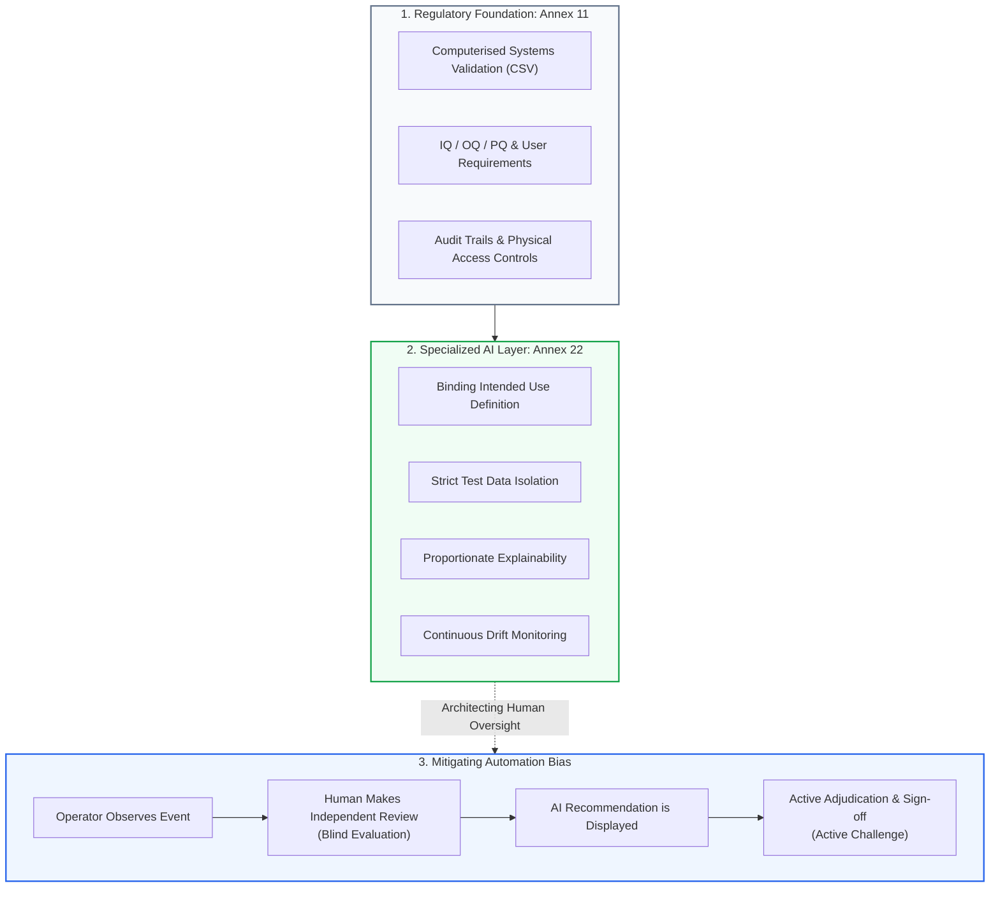

<!-- metadata
source_file: docs/de/module_02_overview_annex_22.md
source_commit: 8fed97a
sync_date: 2026-09-28
language: en
-->

# Module 02: Overview of Annex 22

🌐 **[Deutsche Version](../de/module_02_overview_annex_22.md)** &nbsp;|&nbsp; **[⬅ Module 01: Intro to AI in GxP](module_01_introduction_ai_gxp.md)** &nbsp;|&nbsp; **[🏠 Table of Contents](00_overview.md)** &nbsp;|&nbsp; **[Module 03: Scope and Applicability ➔](module_03_scope_applicability.md)**

---

## 🧭 Core Concept: Coexistence & Guarding Against Automation Bias

---

## 🎯 Learning Objectives & Guiding Questions
1. **Why was Annex 22 established and how does it interface with Annex 11?**
2. **How does Annex 22 delineate GxP scope (direct vs. indirect impacts)?**
3. **What is the regulatory stance toward Static AI, Dynamic AI, and Generative AI?**
4. **What is Automation Bias and how must Human Oversight workflows be designed?**
5. **What does the 5-stage implementation roadmap look like for regulated manufacturers?**

---

## 📌 Technical Summary (Key Takeaways)

### 1. Origins, the EudraLex Digital Package & Legal Status
- **The EudraLex Vol. 4 Digital Package:** Annex 22 was not published in isolation; it forms a coordinated modernization package together with the **Revision of Annex 11** (cloud, agile methodologies, data governance) and the **Revision of Chapter 4** (documentation and electronic records).
- **Current Legal Status:** The text is currently a **Draft** by EMA and PIC/S (consultation closed in October 2025; final adoption expected late 2026/early 2027). However, inspectors already utilize its principles as the **"State of the Art"** inspection benchmark under Annex 11.
- **Regulatory Harmonization:** Annex 22 is architected to align seamlessly with the **EU AI Act**, the **GDPR**, and the **Medical Device Regulation (MDR)** to eliminate conflicting requirements across the EU single market.

### 2. Annex 11 vs. Annex 22 (Coexistence, Not Replacement)
- **Annex 22 does NOT replace Annex 11!**
- **Annex 11 remains the foundation:** IQ/OQ structures, audit trails, user access management, cloud infrastructure qualification, and baseline deterministic validation remain governed by Annex 11.
- **Annex 22 adds an advanced layer:** For learning algorithms, Annex 22 mandates:
  - Legally binding *Intended Use Specifications*,
  - Strictly isolated hold-out test sets with *Staff Independence*,
  - Risk-proportionate *Explainability (XAI)*,
  - Continuous lifecycle monitoring against *Model Drift*,
  - Rigorous third-party and cloud supplier oversight (*Supplier Governance*).

### 3. What is In-Scope vs. Out-of-Scope?
- **In-Scope (Regulated):**
  - Direct GMP decisions: Automated batch certification, in-line process control (PAT).
  - Deviation triage and root-cause classification.
  - Indirect GMP impacts: AI-driven chromatographic peak integration in QC labs; supply-chain forecasting affecting shelf-life or sterile material availability.
- **Out-of-Scope (Unregulated by Annex 22):**
  - Early-stage drug discovery without GMP linkage,
  - General corporate HR/recruiting tools,
  - Purely rule-based, deterministic legacy software (remains under Annex 11).

### 4. The Model Triad: Static, Dynamic, and Generative AI
- **Static AI (Heavily Favored by Regulators):**
  - Model weights are frozen post-validation (*Frozen Weights*).
  - Deterministic and reproducible inference. All updates require formal Change Control.
- **Dynamic AI (Heavily Regulated / Prohibited):**
  - Models that continuously retrain on operational production data.
  - *Risk:* Successive batches could be processed by subtly altered algorithms. Prohibited for critical GMP release decisions.
- **Generative AI & LLMs (Extreme Caution):**
  - Probabilistic text and code synthesis vulnerable to "hallucinations" (*Confabulation*).
  - **Prohibited for:** Critical decisions such as batch release or specification setting.
  - **Permitted for:** Assistive drafting tasks (summarizing deviations, drafting SOP templates), provided strict human review and qualified electronic signatures are enforced.
  - See detailed guidelines in ➔ **[Specialized Guide: Generative AI & RAG in GxP](appendix_genai_rag_gxp.md)**.

### 5. Automation Bias & Active Human Oversight
- **Case Study:** A QA department utilized NLP for deviation severity triage. Over time, reviewers routinely clicked "Approve" without critically reading records (*Perfunctory Review* / Rubber-Stamping).
- **Remediation:** Redesign the review pattern! Human reviewers must perform a **blind evaluation first** before AI recommendations are revealed (*Independent-First / Active Challenge*).

### 6. The 5-Stage Implementation Roadmap
1. **Stage 1 (Governance):** Establish an AI governance framework within the corporate QMS (incorporating cloud and supplier oversight).
2. **Stage 2 (Inventory):** Build a living Master AI Inventory with risk classifications.
3. **Stage 3 (Gap Triage):** Identify and remediate validation deficits across high-risk systems.
4. **Stage 4 (Cross-Functional Literacy):** Break down silos between IT, Data Science, and QA.
5. **Stage 5 (Lifecycle Discipline):** Implement continuous drift monitoring and gated change control (aligned with the ➔ **[ISPE GAMP AI Guide & Best Practices](appendix_ispe_gamp_ai_best_practices.md)**).

---

## 💡 Key Terminology & Concepts (Glossar)

- **Coexistence Model:** The regulatory architecture where Annex 11 serves as the computerized system foundation and Annex 22 acts as the specialized standard for AI/ML.
- **Automation Bias:** The human psychological tendency to unquestioningly accept algorithmic recommendations, resulting in complacency and overlooked errors.
- **Active Challenge Workflow:** A review process designed to compel critical human evaluation (e.g., blind assessment prior to viewing AI suggestions).
- **Supplier Governance:** The contractual and technical oversight ensuring cloud providers and software vendors comply with GxP change management standards.

---

## 📋 GxP-Compliance Checklist: Annex 22 Governance

### Absolute Must-Haves:
- [ ] Is every AI system documented in a centralized **Master AI Inventory**?
- [ ] Is there an approved **Intended Use Specification** establishing explicit operational boundaries?
- [ ] Are high-risk systems subject to **Human-in-the-Loop (HITL)** controls with mandatory electronic sign-off?
- [ ] Does the UI workflow protect operators from *Automation Bias* (blind review pattern)?
- [ ] Are cloud service agreements (*Quality Agreements*) in place to prevent unannounced model or infrastructure updates?

### Red Flags for Inspectors:
- ❌ Teams claim "Annex 22 does not apply because the system is hosted as third-party SaaS in the cloud".
- ❌ High-risk models retrain dynamically on live shopfloor data.
- ❌ Human reviewers exhibit a 100% agreement rate with the AI, indicating passive rubber-stamping.
- ❌ No documented rationale exists for excluding non-GMP pilot systems from validation.

---

🌐 **[Deutsche Version](../de/module_02_overview_annex_22.md)** &nbsp;|&nbsp; **[⬅ Module 01: Intro to AI in GxP](module_01_introduction_ai_gxp.md)** &nbsp;|&nbsp; **[🏠 Table of Contents](00_overview.md)** &nbsp;|&nbsp; **[Module 03: Scope and Applicability ➔](module_03_scope_applicability.md)**

