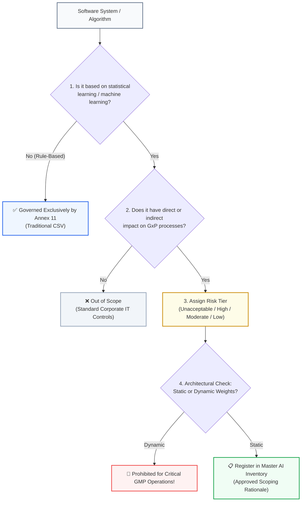

<!-- metadata
source_file: docs/de/module_03_scope_applicability.md
source_commit: 8fed97a
sync_date: 2026-09-28
language: en
-->

# Module 03: Scope and Applicability of AI Systems

🌐 **[Deutsche Version](../de/module_03_scope_applicability.md)** &nbsp;|&nbsp; **[⬅ Module 02: Overview of Annex 22](module_02_overview_annex_22.md)** &nbsp;|&nbsp; **[🏠 Table of Contents](00_overview.md)** &nbsp;|&nbsp; **[Module 04: Risk Based Approach to AI ➔](module_04_risk_based_approach.md)**

---

## 🧭 Core Concept: The Scoping Decision Funnel

---

## 🎯 Learning Objectives & Guiding Questions
1. **What are the risks of "Over-Claiming" vs. "Under-Claiming" during AI scoping?**
2. **How does the 5-stage Decision Funnel operate?**
3. **What is the 4-tier risk classification matrix under Annex 22?**
4. **What lessons emerge from critical boundary cases (automated visual inspection, LLM drafting, cloud SaaS)?**
5. **What mandatory metadata belongs in an audit-ready Master AI Inventory?**

---

## 📌 Technical Summary (Key Takeaways)

### 1. The Scoping Dilemma: Over-Claiming vs. Under-Claiming
- **Over-Claiming (Over-Regulation):** Categorizing every standard deterministic script as "AI under Annex 22" out of regulatory anxiety. **Consequence:** Validation resources are paralyzed by unnecessary bureaucracy.
- **Under-Claiming (Under-Regulation):** Overlooking an AI tool in a GMP workflow or dismissing it as "just a pilot". **Consequence:** Guaranteed Major or Critical Finding during the next inspection.
- **Goal:** A disciplined, defensible middle path backed by a formal *Documented Scoping Rationale*.

### 2. The 5-Stage Decision Funnel
Every software component and algorithm must pass through five rigorous qualification gates:
1. **Is it Truly AI/ML?** Only models employing statistical learning, pattern recognition, or generative synthesis fall under Annex 22. Deterministic, rule-based systems remain exclusively under **Annex 11**.
2. **Is There a GxP Impact?** Evaluates both direct process steps (e.g., batch release, in-process testing) and **indirect dependencies** (e.g., AI shift scheduling for cleanroom staff, AI training tracking for operator qualification).
3. **Assign Risk Tier:** Categorization into Unacceptable, High, Moderate, or Low Risk.
4. **Evaluate Model Architecture:** Is the model static (*Frozen Weights*) or dynamic (*Online Continuous Learning*)?
5. **Document & Register:** Entry into the legally binding *Master AI Inventory* with cross-functional sign-off.

### 3. The 4 Risk Tiers Under Annex 22

| Risk Tier | Definition & Operational Examples | Regulatory Consequences |
| :--- | :--- | :--- |
| **Unacceptable** | Continuously self-training online models making autonomous release decisions. | **Strictly prohibited** under Annex 22. Not permitted in GMP. |
| **High Risk** | Static AI controlling PAT measurements, impacting Critical Quality Attributes (CQAs), or performing automated defect sorting. | Comprehensive validation, adversarial testing, continuous drift monitoring, 100% HITL oversight. |
| **Moderate Risk** | AI acting as decision support (*Advisory / Triage*), e.g., deviation classification or trend analysis. | Streamlined test suites, mandatory human verification before actions take effect. |
| **Low Risk** | Administrative back-office systems with zero influence on product quality, patient safety, or data integrity. | Standard corporate IT quality procedures are sufficient. |

### 4. Critical Boundary Cases from Practice

#### Case 1: Deep Learning Visual Inspection of Vials
- *Scenario:* AI autonomously sorts glass vials into "Pass" and "Defective". Only borderline cases are escalated to human operators.
- *Common Fallacy:* The company classified the system as "Moderate Risk" because humans review border cases.
- *Annex 22 Reality:* **High Risk!** The autonomous pass/fail disposition of 95%+ of units dictates criticality. Partial human fallback does not reduce system risk. Mandatory: Continuous drift monitoring and calibrated OOD safeguards.

#### Case 2: Special Status of Generative AI (GenAI & LLMs)
- *Regulatory Baseline:* In the **Draft Annex 22**, generative models and LLMs are explicitly excluded from autonomous GMP decisions due to stochastic variability and the hazard of **hallucinations** (plausible-sounding fabricated statements).
- *Permitted GxP Envelope:* LLMs are permitted under strict controls as **assistive tools ("Drafting Assistants")** (e.g., synthesizing initial drafts for deviation summaries from raw LIMS data).
- *Architectural Mandate:* Direct open-ended prompting is non-compliant. Systems must utilize a **RAG Architecture (Retrieval-Augmented Generation)** restricted to approved company SOPs with mandatory ALCOA+ citations.
- *Detailed Guide:* Full implementation patterns (RAG Triad metrics, Prompt Governance, Guardrails) are detailed in:  
  ➔ **[Specialized Guide: Generative AI (GenAI), LLMs & RAG in GxP](appendix_genai_rag_gxp.md)**

#### Case 3: Third-Party Cloud SaaS AI (API Black-Box)
- *Core Principle:* **"You cannot outsource your GMP accountability."**
- *The Hazard:* If a cloud vendor updates underlying model weights or runtime libraries unannounced, the pharmaceutical manufacturer operates an unvalidated system (*Uncontrolled Environment Drift*).
- *Solution:* Cloud AI must be governed by binding *Quality Agreements* and SLAs prohibiting silent updates. Critical GxP calculations must have internal verification checkpoints. See also ➔ **[ISPE GAMP AI Guide & Industry Best Practices](appendix_ispe_gamp_ai_best_practices.md)**.

### 5. Mandatory Elements of the Master AI Inventory
The central inventory required by auditors must document for every system:
1. Unique System Identifier and Version,
2. Concise *Intended Use Specification*,
3. Assigned Risk Tier,
4. System Owner & Technical Owner (QA / IT),
5. Current Validation and Monitoring Status,
6. Direct reference to the approved *Documented Scoping Rationale*.

---

## 💡 Key Terminology & Concepts (Glossar)

- **Scoping Rationale:** Formal, documented justification explaining why a system is classified as GxP or non-GxP and why specific risk tiers were assigned.
- **Over-Claiming:** The excessive categorization of standard software as AI, causing resource waste.
- **Under-Claiming:** The failure to declare and validate an AI system used in GMP processes.
- **Master AI Inventory:** The single, authoritative corporate register listing all operational and pilot AI assets.
- **Critical Quality Attribute (CQA):** A physical, chemical, or microbiological property that must remain within limits to ensure product quality.

---

## 📋 GxP-Compliance Checklist: Scoping & Inventory

### Absolute Must-Haves:
- [ ] Has every digital asset passed through the **5-Stage Decision Funnel**?
- [ ] Is there an approved, written **Scoping Rationale** for every system in the inventory?
- [ ] Is the Master AI Inventory reviewed and updated at least bi-annually?
- [ ] Are autonomous visual inspection models classified as **High Risk** regardless of manual fallback?
- [ ] Are LLMs restricted to verified **Drafting Assistant** roles with mandatory RAG grounding?

### Red Flags for Inspectors:
- ❌ An AI pilot tool is used on the shopfloor but omitted from the Master AI Inventory (*Shadow AI*).
- ❌ Risk tiers were assigned based on vendor marketing materials rather than a documented ICH Q9 risk assessment.
- ❌ High-risk systems operate without a documented *Intended Use Specification*.
- ❌ Cloud APIs are used for GMP batch calculations without vendor Quality Agreements.

---

🌐 **[Deutsche Version](../de/module_03_scope_applicability.md)** &nbsp;|&nbsp; **[⬅ Module 02: Overview of Annex 22](module_02_overview_annex_22.md)** &nbsp;|&nbsp; **[🏠 Table of Contents](00_overview.md)** &nbsp;|&nbsp; **[Module 04: Risk Based Approach to AI ➔](module_04_risk_based_approach.md)**

