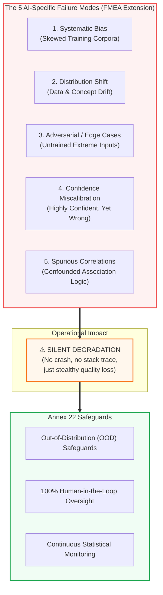

<!-- metadata
source_file: docs/de/module_04_risk_based_approach.md
source_commit: 8fed97a
sync_date: 2026-09-28
language: en
-->

# Module 04: Risk Based Approach to AI

🌐 **[Deutsche Version](../de/module_04_risk_based_approach.md)** &nbsp;|&nbsp; **[⬅ Module 03: Scope and Applicability](module_03_scope_applicability.md)** &nbsp;|&nbsp; **[🏠 Table of Contents](00_overview.md)** &nbsp;|&nbsp; **[Module 05: Intended Use and Model Definition ➔](module_05_intended_use_model_definition.md)**

---

## 🧭 Core Concept: 5 AI Failure Modes & Silent Degradation

---

## 🎯 Learning Objectives & Guiding Questions
1. **Why is a "Flat Governance" approach dangerous both operationally and regulatorily?**
2. **How does AI system failure fundamentally differ from traditional software crashes?**
3. **What 5 AI-specific failure modes must be explicitly addressed in FMEAs and risk analyses?**
4. **How do reversibility and cumulative risk exposure impact criticality scoring?**
5. **How does Human-in-the-Loop (HITL) differ from Human-on-the-Loop (HOTL)?**

---

## 📌 Technical Summary (Key Takeaways)

### 1. The Proportionality Mandate
- **The Pitfall of Flat Governance:** Attempting to validate a low-risk administrative assistant with the same bureaucratic overhead as a critical batch release model represents meaningless *Compliance Theater*.
- **Resource Allocation:** Validation and QA engineering bandwidth is finite. Annex 22 explicitly demands that validation rigor, testing volume, and oversight intensity **scale proportionally with risk to patient safety, product quality, and data integrity**.

### 2. How AI Fails: Silent Degradation Instead of System Crashes
- **Traditional Software:** Exhibits binary failure modes – the program crashes, raises an unhandled exception, or freezes execution.
- **AI Systems:** Experience **Silent Degradation**. The algorithm does not crash; it continues to emit predictions smoothly, often accompanied by deceptively high mathematical confidence scores (*Confidence Miscalibration*).

### 3. The 5 AI-Specific Failure Modes for GxP Risk Assessments
Standard IT risk templates fail under Annex 22 scrutiny. Inspectors expect explicit FMEA evaluations for:
1. **Systematic Bias:** Training data fail to capture genuine operational variability, systematically skewing predictions.
2. **Distribution Shift:** Environmental changes cause live input distributions to drift away from training parameters (*Data & Concept Drift*).
3. **Adversarial & Edge Cases:** Rare, extreme, or unexpected physical inputs trigger irrational outputs.
4. **Confidence Miscalibration:** The model outputs a 99% probability on an erroneous prediction, deceiving human operators into false trust.
5. **Spurious Correlations:** The algorithm learns irrelevant background artifacts (e.g., classifying tablet defects based on background conveyor markings rather than actual surface cracks).

### 4. Advanced Risk Dimensions: Reversibility & Cumulative Impact
Beyond severity and probability, Annex 22 introduces two critical evaluative factors:
* **Reversibility of Decision:**
  - *Reversible:* AI flags an intermediate sample for manual re-testing. If wrong, the sample is simply re-analyzed.
  - *Irreversible:* AI authorizes the injection of a sterile vial or releases an API batch into commercial distribution. Errors directly harm patients. Irreversible decisions demand the highest validation rigor.
* **Cumulative Impact:**
  - A tiny statistical error of 0.2% might seem negligible for single events, but across 10 million manufactured doses per year, it represents thousands of defective units reaching patients.

### 5. Architectural Control: HITL vs. HOTL vs. HOOL
Annex 22 links risk tiers directly to required human involvement:
* **Human-in-the-Loop (HITL):** Mandatory for high-risk operations. A human must evaluate and confirm every single prediction before downstream execution.
* **Human-on-the-Loop (HOTL):** Permitted for moderate-risk closed-loop optimization (e.g., continuous bioreactor tuning), provided hard, validated physical guardrails prevent out-of-specification excursions and allow immediate human override.
* **Human-out-of-the-Loop (HOOL):** Strictly prohibited for critical GMP batch disposition.

---

## 💡 Key Terminology & Concepts (Glossar)

- **Proportionality Mandate:** Regulatory principle requiring validation effort to align linearly with risk criticality.
- **Silent Degradation:** Undetected erosion of algorithmic accuracy over time without system interruption.
- **Confidence Miscalibration:** Discrepancy between predicted probability and actual correctness frequency.
- **Spurious Correlation:** Erroneous mathematical association between input features and target labels lacking real-world causality.
- **Reversibility:** The technical and operational feasibility of reversing an AI-influenced decision before patient harm occurs.

---

## 📋 GxP-Compliance Checklist: Risk-Based AI Evaluation

### Absolute Must-Haves:
- [ ] Does the risk assessment specifically evaluate the **5 AI Failure Modes** (Bias, Drift, Edge Cases, Miscalibration, Spurious Correlation)?
- [ ] Is high validation intensity strictly concentrated on **irreversible and high-risk decisions**?
- [ ] Are autonomous high-risk functions gated by mandatory **Human-in-the-Loop (HITL)** controls?
- [ ] Does the FMEA account for cumulative long-term error exposure across annual production volumes?
- [ ] Are automated Out-of-Distribution (OOD) safeguards validated to prevent predictions on unknown operational data?

### Red Flags for Inspectors:
- ❌ Standard IT software FMEAs used without AI-specific failure modes.
- ❌ All AI systems in the company treated with identical, generic validation protocols (*Flat Governance*).
- ❌ An irreversible batch release decision relying on autonomous AI without human sign-off.
- ❌ Teams unable to demonstrate how they detect and mitigate *Confidence Miscalibration*.

---

🌐 **[Deutsche Version](../de/module_04_risk_based_approach.md)** &nbsp;|&nbsp; **[⬅ Module 03: Scope and Applicability](module_03_scope_applicability.md)** &nbsp;|&nbsp; **[🏠 Table of Contents](00_overview.md)** &nbsp;|&nbsp; **[Module 05: Intended Use and Model Definition ➔](module_05_intended_use_model_definition.md)**

