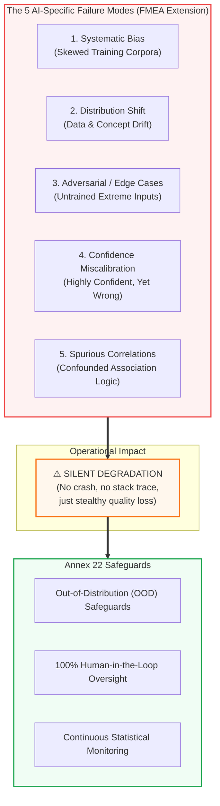

<!-- metadata
source_file: docs/de/module_04_risk_based_approach.md
source_commit: 8fed97a
sync_date: 2026-09-28
language: en
-->

# Module 04: Risk Based Approach to AI

🌐 **[Deutsche Version](../de/module_04_risk_based_approach.md)** &nbsp;|&nbsp; **[⬅ Module 03: Scope and Applicability](module_03_scope_applicability.md)** &nbsp;|&nbsp; **[🏠 Table of Contents](00_overview.md)** &nbsp;|&nbsp; **[Module 05: Intended Use and Model Definition ➔](module_05_intended_use_model_definition.md)**

---

## 🧭 Core Concept: 5 AI Failure Modes & Silent Degradation

---

## 🎯 Learning Objectives & Guiding Questions
1. **Why is a "Flat Governance" approach dangerous both operationally and regulatorily?**
2. **How does AI system failure fundamentally differ from traditional software crashes?**
3. **What 5 AI-specific failure modes must be explicitly addressed in FMEAs and risk analyses?**
4. **How do reversibility and cumulative risk exposure impact criticality scoring?**
5. **How does Human-in-the-Loop (HITL) differ from Human-on-the-Loop (HOTL)?**

---

## 📌 Technical Summary (Key Takeaways)

### 1. The Proportionality Mandate ([Draft §2.3])
- **Regulatory Requirement ([Draft §2.3]):** The extent of control measures, qualification, and validation must always be proportionate to the risk posed by the AI system to product quality, data integrity, and patient safety.
- **Resource Allocation:** Validation and QA engineering bandwidth is finite. Attempting to validate low-risk assistive tools with the same bureaucratic overhead as primary release systems represents inefficient *Compliance Theater*. Control intensity must scale in a risk-based manner.

### 2. How AI Fails: Silent Degradation Instead of System Crashes
- **Traditional Software:** Exhibits binary failure modes – the program crashes, raises an unhandled exception, or freezes execution.
- **AI Systems:** Experience **Silent Degradation**. The algorithm does not crash; it continues to emit predictions smoothly, often accompanied by deceptively high mathematical confidence scores (*Confidence Miscalibration*).

### 3. The 5 AI-Specific Failure Modes for GxP Risk Assessments
Standard IT risk templates fail under Annex 22 scrutiny. Inspectors expect explicit evaluations for:
1. **Systematic Bias:** Training data fail to capture genuine operational variability, systematically skewing predictions.
2. **Distribution Shift:** Environmental changes cause live input distributions to drift away from training parameters (*Data & Concept Drift*).
3. **Adversarial & Edge Cases:** Rare, extreme, or unexpected physical inputs trigger irrational outputs.
4. **Confidence Miscalibration:** The model outputs a 99% probability on an erroneous prediction, deceiving human operators into false trust.
5. **Spurious Correlations:** The algorithm learns irrelevant background artifacts (e.g., classifying tablet defects based on background conveyor markings rather than actual surface cracks).

### 4. Patient Impact, Reversibility & Cumulative Impact ([Didaktik])
*This structured evaluation framework provides didactic guidance for Quality Risk Management under ICH Q9 (R1) ([Didaktik]):*
* **Direct Patient Impact:** Release of out-of-specification drug products (highest criticality).
* **Cumulative Impact ([Didaktik]):** A tiny residual error rate in an individual automated decision compounds across thousands of decisions per day into an unacceptable overall patient hazard.
* **Reversibility as an Operational Lever ([Didaktik]):**
  - *In-Process:* An error in upstream processing that can be reliably intercepted and corrected by downstream controls permits leaner control mechanisms.
  - *Batch Release:* Erroneous commercial batch disposition is practically **irreversible** once the batch is distributed.
* **Out-of-Distribution (OOD) Detection ([Best Practice: ML Practice]):** An integrated safety safeguard where the AI system identifies unknown data points: *"I have not seen this distribution—refusing automated decision and escalating to human supervisor."*

### 5. Scaling Human Oversight: HITL vs. HOTL ([Didaktik])

> *Draft Wording Note:* The draft does not mandate a blanket HITL requirement for qualified models (interpretation of §1, §3.3, §10.5; confidence: Medium). However, if model testing rigor was reduced because a human makes the final decision, operator responsibility must be explicitly anchored in the Intended Use, and operator training and performance must be monitored like manual processes ([Draft §3.3]). Under [Draft §10.5], review records must be maintained; depending on criticality and test depth, this may require reviewing each individual output. Categorization into HITL/HOTL/HOOL is a didactic industry framework ([Didaktik]):

| Dimension | High-Risk System (Fully Qualified vs. Operator-Assisted) | Moderate-Risk System |
| :--- | :--- | :--- |
| **Validation** | Comprehensive adversarial stress testing, edge-case coverage, strict acceptance criteria ([Draft §4, §8]) | Representative test sets, focus on primary operational scenarios |
| **Monitoring** | Continuous monitoring of performance and input distributions ([Draft §10.3, §10.4]) | Risk-based review at defined periodic intervals |
| **Human Oversight ([Didaktik])** | **Human-in-the-Loop (HITL):** Mandatory review of every output where model test rigor was reduced ([Draft §3.3, §10.5]). For fully qualified automations (e.g. vial sorting), statistical supervisory oversight and audit sampling. | **Human-on-the-Loop (HOTL):** Human monitors aggregated trends and intervenes upon alarms or anomalies. |

### 6. Lessons from Illustrative Operational Scenarios ([Didaktik])
*The following scenarios illustrate typical risks in day-to-day operations (didactic case studies, unverified):*
- **Bioreactor pH Control (Operational Atrophy):** The manual fallback procedure existed only on paper for years. During a QA audit, operators admitted they had forgotten how to manually tune the vessel! **Remediation:** Mandatory routine fallback drills.
- **Deviation Triage (Cascading Bias):** Erroneous AI initial triage cascades down into misdirected root-cause investigations and ineffective CAPAs across the entire quality organization.
- **GenAI for Reporting (Cognitive Anchoring):** Eloquently drafted AI text tempts reviewers into uncritical acceptance of generated narratives. **Remediation:** Automated audit tracking of reviewer revisions and overrides.

---

## 💡 Key Terminology & Concepts (Glossar)

- **Proportionality Mandate:** Regulatory principle requiring validation effort to align linearly with risk criticality.
- **Silent Degradation:** Undetected erosion of algorithmic accuracy over time without system interruption.
- **Confidence Miscalibration:** Discrepancy between predicted probability and actual correctness frequency.
- **Spurious Correlation:** Erroneous mathematical association between input features and target labels lacking real-world causality.
- **Reversibility:** The technical and operational feasibility of reversing an AI-influenced decision before patient harm occurs.

---

## 📋 GxP-Compliance Checklist: Risk-Based AI Evaluation

### Absolute Must-Haves:
- [ ] Does the risk assessment specifically evaluate the **5 AI Failure Modes** (Bias, Drift, Edge Cases, Miscalibration, Spurious Correlation)?
- [ ] Is high validation intensity strictly concentrated on **irreversible and high-risk decisions**?
- [ ] Is operator responsibility defined in the Intended Use if testing rigor was reduced ([Draft §3.3])?
- [ ] Does the FMEA account for cumulative long-term error exposure across annual production volumes?
- [ ] Are automated Out-of-Distribution (OOD) safeguards validated to prevent predictions on unknown operational data?

### Red Flags for Inspectors:
- ❌ Standard IT software FMEAs used without AI-specific failure modes.
- ❌ All AI systems in the company treated with identical, generic validation protocols (*Flat Governance*).
- ❌ Reduced model testing without formally designated operator responsibility in Intended Use ([Draft §3.3]).
- ❌ Teams unable to demonstrate how they detect and mitigate *Confidence Miscalibration*.

---

🌐 **[Deutsche Version](../de/module_04_risk_based_approach.md)** &nbsp;|&nbsp; **[⬅ Module 03: Scope and Applicability](module_03_scope_applicability.md)** &nbsp;|&nbsp; **[🏠 Table of Contents](00_overview.md)** &nbsp;|&nbsp; **[Module 05: Intended Use and Model Definition ➔](module_05_intended_use_model_definition.md)**

