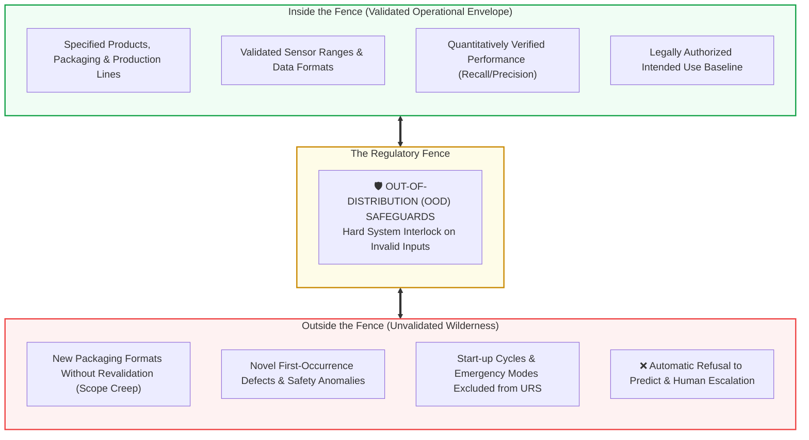

<!-- metadata
source_file: docs/de/module_05_intended_use_model_definition.md
source_commit: 8fed97a
sync_date: 2026-09-28
language: en
-->

# Module 05: Intended Use and Model Definition

🌐 **[Deutsche Version](../de/module_05_intended_use_model_definition.md)** &nbsp;|&nbsp; **[⬅ Module 04: Risk Based Approach to AI](module_04_risk_based_approach.md)** &nbsp;|&nbsp; **[🏠 Table of Contents](00_overview.md)** &nbsp;|&nbsp; **[Module 06: Data Governance and Data Quality ➔](module_06_data_governance_quality.md)**

---

## 🧭 Core Concept: The Fence Metaphor & Scope Protection

---

## 🎯 Learning Objectives & Guiding Questions
1. **Why is the *Intended Use Specification* the "Contractual Heart" of an AI system under Annex 22?**
2. **What mandatory components constitute an audit-proof *Intended Use Specification*?**
3. **How does the technical *Model Definition* complement the operational purpose?**
4. **What catastrophic consequences arise from *Scope Creep* during routine operations?**
5. **How do regulatory inspectors differentiate vague aspirational claims from precise boundary definitions?**

---

## 📌 Technical Summary (Key Takeaways)

### 1. The Contractual Heart of AI Compliance
- **Not a Marketing Narrative:** The *Intended Use* is not a generic project vision; it is a **binding regulatory commitment** to health authorities.
- **The Fence Metaphor:** The *Intended Use* erects an impassable fence:
  - *Inside the Fence:* The validated, qualified, authority-approved operational envelope.
  - *Outside the Fence:* The unvalidated wilderness where the algorithm must never execute autonomous judgments.
- **Audit Impact:** The very first document an inspector requests is this specification. All downstream test plans, acceptance criteria, and monitoring thresholds depend directly upon it.

### 2. Anatomy of an Audit-Proof Intended Use Specification
Vague language is fatal during inspections. An Annex 22 compliant specification must unambiguously detail six core dimensions:
1. **Target Operational Process:** Specific manufacturing line, batch step, or QC assay.
2. **Specific Model Objective:** Explicit classification, regression, or advisory task.
3. **Exact Scope of Application:** Permitted active substances, container closure systems, dosage forms, and operating sites.
4. **Target User Population:** Qualified operator role (e.g., Senior QA Reviewer, Qualified Person).
5. **Operational Prerequisites:** Cleanroom environmental baselines, sensor calibration tolerances, upstream data quality.
6. **Explicit Exclusions (*Out-of-Scope*):** Conditions where the model is strictly forbidden to predict (e.g., initial start-up line flushing, unvalidated secondary packaging).

### 3. The Technical Model Definition (*The Blueprint*)
While *Intended Use* defines operational boundaries, the *Model Definition* documents the technical blueprint:
* Algorithm family and architecture (e.g., Random Forest, ResNet-50, Gradient Boosted Trees),
* Feature inputs, engineering pipelines, and scaling transformations,
* Final hyperparameter configuration (learning rate, tree depth, regularization),
* Acceptance criteria thresholds (minimum Recall, Precision, calibration limits),
* Hardware dependencies and containerized runtime environments.

### 4. Real-World Case Studies: Scope Creep & Out-of-Distribution Failures

#### Case 1: Automated Packaging Inspection Scope Creep
- *Initial Validation:* An automated computer vision AI was validated exclusively for clear 10 ml glass injection vials.
- *The Incident:* The packaging team introduced amber vials without submitting a formal Change Control request or updating the *Intended Use*.
- *The Failure:* The model suffered a 40% false-pass rate because light refraction through amber glass confounded feature extraction $\rightarrow$ Defective units released; Major Inspection Finding; product recall.

#### Case 2: Out-of-Distribution (OOD) Safety Interlock Failure
- *Scenario:* A predictive batch yield model encountered severe raw material sensor anomalies during an equipment startup phase.
- *Defect:* The software lacked an automated OOD interlock. Instead of halting, it generated confident predictions based on wild extrapolations.
- *Annex 22 Mandate:* Systems must feature **automated OOD interlocks**. When inputs violate the *Intended Use* envelope, the system must automatically enter a safe state (*Graceful Degradation*) and escalate to human operators.

---

## 💡 Key Terminology & Concepts (Glossar)

- **Intended Use Specification:** Contractual document establishing the operational objectives, boundaries, and restrictions of an AI computerized system.
- **Model Definition:** Technical specification detailing algorithm structure, input features, hyperparameters, and performance baselines.
- **Scope Creep:** The unauthorized expansion of an AI system's operational deployment beyond its validated envelope without revalidation.
- **Out-of-Distribution (OOD):** Input data originating outside the statistical distribution of the validated training and testing corpora.
- **Fence Metaphor:** Regulatory concept defining the boundary between validated operations and hazardous unvalidated usage.

---

## 📋 GxP-Compliance Checklist: Intended Use & Model Definition

### Absolute Must-Haves:
- [ ] Is there an approved **Intended Use Specification** with explicit *In-Scope* and *Out-of-Scope* sections?
- [ ] Does the specification identify the specific products, production lines, and cleanroom environments permitted?
- [ ] Is there an accompanying **Model Definition** documenting algorithm architecture, features, and frozen hyperparameters?
- [ ] Is an automated **Out-of-Distribution (OOD) detection mechanism** validated to halt predictions on unknown inputs?
- [ ] Is an SOP implemented to prevent *Scope Creep* when packaging formats or process parameters change?

### Red Flags for Inspectors:
- ❌ Vague descriptions such as "AI assists in optimizing production operations".
- ❌ New container formats or products processed by the AI without updating the *Intended Use* and validation protocol.
- ❌ The model continues predicting on uncalibrated sensor signals without triggering an OOD interlock.
- ❌ Technical hyperparameters modified in production without a formal Change Control record.

---

🌐 **[Deutsche Version](../de/module_05_intended_use_model_definition.md)** &nbsp;|&nbsp; **[⬅ Module 04: Risk Based Approach to AI](module_04_risk_based_approach.md)** &nbsp;|&nbsp; **[🏠 Table of Contents](00_overview.md)** &nbsp;|&nbsp; **[Module 06: Data Governance and Data Quality ➔](module_06_data_governance_quality.md)**

