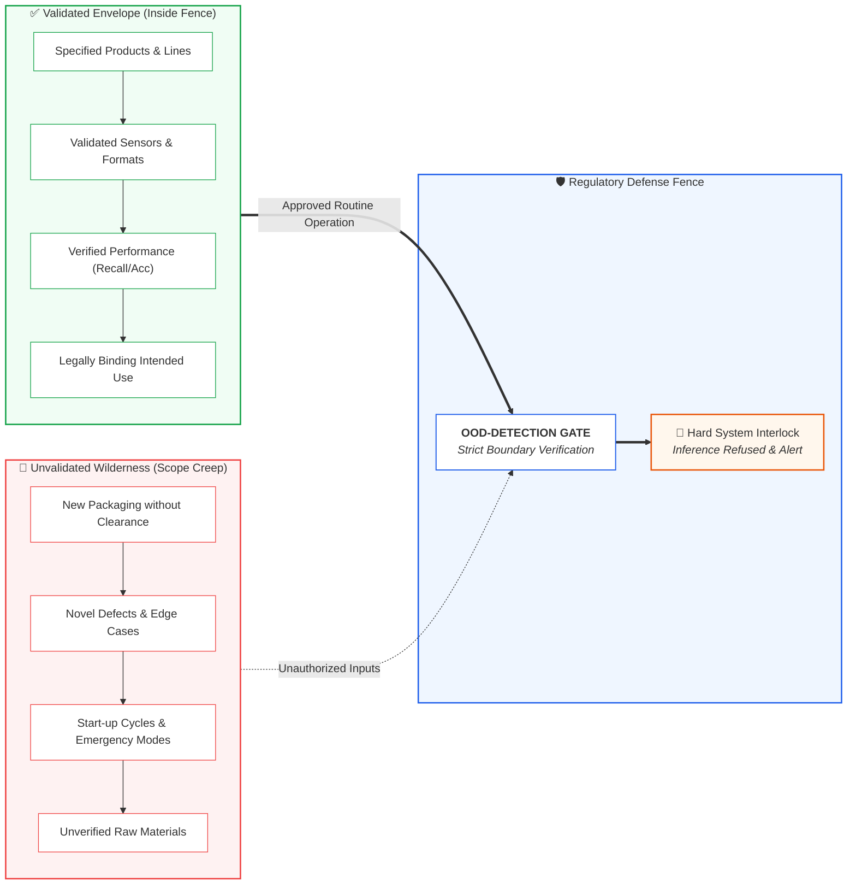

<!-- metadata
source_file: docs/de/module_05_intended_use_model_definition.md
source_commit: 8fed97a
sync_date: 2026-09-29
language: en
-->

# Module 05: Intended Use and Model Definition

🌐 **[Deutsche Version](../de/module_05_intended_use_model_definition.md)** &nbsp;|&nbsp; **[⬅ Module 04: Risk Based Approach to AI](module_04_risk_based_approach.md)** &nbsp;|&nbsp; **[🏠 Table of Contents](00_overview.md)** &nbsp;|&nbsp; **[Module 06: Data Governance and Data Quality ➔](module_06_data_governance_quality.md)**

---

## 🧭 Core Concept: The Fence Metaphor & Scope Protection

---

## 🎯 Learning Objectives & Guiding Questions
1. **Why is the *Intended Use Specification* the "Contractual Heart" of an AI system under Annex 22?**
2. **What mandatory components constitute an audit-proof *Intended Use Specification*?**
3. **How does the technical *Model Definition* complement the operational purpose?**
4. **What catastrophic consequences arise from *Scope Creep* during routine operations?**
5. **How do regulatory inspectors differentiate vague aspirational claims from precise boundary definitions?**

---

## 📌 Technical Summary (Key Takeaways)

### 1. The Regulatory Cornerstone: Intended Use & SME Ownership ([Draft §3.1])
- **Regulatory Requirement ([Draft §3.1]):** The intended use of the AI system must be clearly defined and formally documented.
- **Active Involvement of Process SMEs ([Draft §3.1]):** Qualified process and business domain experts (*Process Subject Matter Experts - SMEs*) must be actively engaged in defining the intended use. Definition must not be delegated exclusively to IT or Data Science.
- **The Fence Metaphor ([Didaktik]):** The *Intended Use* erects a tightly defined boundary fence:
  - *Inside the Fence:* The qualified, validated, authority-approved operational envelope.
  - *Outside the Fence:* Unqualified wilderness where the algorithm must never execute autonomous judgments.
- **Audit Impact:** The *Intended Use* is the foundational document inspected during an audit; all subsequent pre-approved acceptance criteria ([Draft §4.2]) derive directly from it.

### 2. Anatomy of a Comprehensive Intended Use Specification
A rigorous specification under Draft Annex 22 comprises the following core elements:

1. **Decision Scope & Operator Role ([Draft §3.1, §3.3]):** Which decision is supported or executed by the AI? If the system provides input to a human decision and model testing rigor was reduced accordingly, the exact role and responsibility of the human operator must be documented in the Intended Use ([Draft §3.3]).
2. **Relevant Subgroups & Populations ([Draft §3.2]):** Relevant sub-populations of data, products, packaging components, or operating conditions for which the system is intended must be explicitly identified and characterized.
3. **Operational Context & Data Sources:** Unambiguous assignment to manufacturing lines, measurement points, sensors, sampling protocols, and data formats.
4. **Output & Downstream Use:** Where do model predictions, alarms, or classifications flow, and how are they processed within the QMS?
5. **Pre-Approved Acceptance Criteria ([Draft §4.2]):** Performance criteria approved by Process SMEs prior to performance testing.
6. **Out-of-Scope Conditions ([Didaktik]):** Explicit boundary conditions under which the system must refuse automated execution and transition to a qualified safe state (*Safe State / Manual Fallback*).

### 3. The Technical Model Definition
While *Intended Use* defines operational and business boundaries, the technical *Model Definition* governs the controlled artifact:
- **Algorithm Class:** Applied statistical or machine learning methodologies.
- **Data Lineage:** Traceability across all training, validation, and testing corpora (ALCOA+).
- **Static Model Architecture ([Draft Glossary]):** Model weights locked post-qualification (*Frozen Weights*).
- **Configuration Control ([Draft §10.2]):** Tested model placed under configuration control to detect unauthorized changes; hyperparameters and operational decision thresholds as best practice ([Best Practice: ML Practice]).

### 4. Real-World Risk: The Hazard of Scope Creep

> [!CAUTION]
> **Illustrative Operational Scenario (didactic case study, unverified):** A QC laboratory qualified an automated computer vision system for stability testing on a specific blister packaging format. Over time, analysts began utilizing the tool on other blister types because it appeared to function correctly (*Scope Creep*). Finding during regulatory inspection: **Major Deficiency**, immediate decommissioning of the tool, and mandatory retrospective re-evaluation of all impacted stability studies.

### 5. The Inspector's Perspective
- **Avoid Vague Wording:** Nebulous claims like *"assists quality decision-making"* or *"optimizes production"* invite deep regulatory scrutiny.
- **Verification on the Shop Floor:** Inspectors verify whether operational practices on the manufacturing line strictly match the approved Intended Use.
- **Boundary Safeguards:** Automated Out-of-Distribution (OOD) safeguards ([Best Practice: ML Practice]) that intercept and block invalid inputs provide robust evidence of mature process control.

---

## 💡 Key Terminology & Concepts (Glossar)

- **Intended Use Specification:** Contractual document establishing the operational objectives, boundaries, and restrictions of an AI computerized system.
- **Model Definition:** Technical specification detailing algorithm structure, input features, hyperparameters, and performance baselines.
- **Scope Creep:** The unauthorized expansion of an AI system's operational deployment beyond its validated envelope without revalidation.
- **Out-of-Distribution (OOD):** Input data originating outside the statistical distribution of the validated training and testing corpora.
- **Fence Metaphor:** Regulatory concept defining the boundary between validated operations and hazardous unvalidated usage.

---

## 📋 GxP-Compliance Checklist: Intended Use & Model Definition

### Absolute Must-Haves:
- [ ] Is there an approved **Intended Use Specification** with explicit *In-Scope* and *Out-of-Scope* sections?
- [ ] Does the specification identify the specific products, production lines, and cleanroom environments permitted?
- [ ] Is there an accompanying **Model Definition** documenting algorithm architecture, features, and frozen hyperparameters?
- [ ] Is an automated **Out-of-Distribution (OOD) detection mechanism** validated to halt predictions on unknown inputs?
- [ ] Is an SOP implemented to prevent *Scope Creep* when packaging formats or process parameters change?

### Red Flags for Inspectors:
- ❌ Vague descriptions such as "AI assists in optimizing production operations".
- ❌ New container formats or products processed by the AI without updating the *Intended Use* and validation protocol.
- ❌ The model continues predicting on uncalibrated sensor signals without triggering an OOD interlock.
- ❌ Technical hyperparameters modified in production without a formal Change Control record.

---

🌐 **[Deutsche Version](../de/module_05_intended_use_model_definition.md)** &nbsp;|&nbsp; **[⬅ Module 04: Risk Based Approach to AI](module_04_risk_based_approach.md)** &nbsp;|&nbsp; **[🏠 Table of Contents](00_overview.md)** &nbsp;|&nbsp; **[Module 06: Data Governance and Data Quality ➔](module_06_data_governance_quality.md)**

