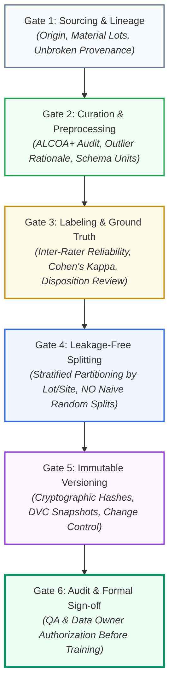

<!-- metadata
source_file: docs/de/module_06_data_governance_quality.md
source_commit: 8fed97a
sync_date: 2026-09-28
language: en
-->

# Module 06: Data Governance and Data Quality

🌐 **[Deutsche Version](../de/module_06_data_governance_quality.md)** &nbsp;|&nbsp; **[⬅ Module 05: Intended Use and Model Definition](module_05_intended_use_model_definition.md)** &nbsp;|&nbsp; **[🏠 Table of Contents](00_overview.md)** &nbsp;|&nbsp; **[Module 07: AI Model Development and Training ➔](module_07_model_development_training.md)**

---

## 🎯 Learning Objectives & Guiding Questions
1. **The Substrate Principle:** Why are data in Annex 22 not passive storage artifacts, but the actual "Active Pharmaceutical Ingredient (API)" of the model?
2. **ALCOA+ for AI:** What extended requirements (Completeness, Consistency, Enduring, Availability) does Annex 22 mandate for multi-terabyte training corpora?
3. **Data Lineage & Bias:** How is derivation lineage proven without gaps, and what 4 statistical biases threaten batch disposition?
4. **Test Data Independence:** Why do naive 80/20 random splits in pharma data almost inevitably lead to *Data Leakage* and false validation?
5. **Operational Data Governance:** Why are live inference logs formal GMP records, and how do we prevent degenerative feedback loops (*Model Collapse*)?

---

## 🧭 Core Concept: The 6 Quality Gates of the AI Data Pipeline

---

## 📌 Technical Summary (Key Takeaways)

### 1. The Core Thesis: Data is the Substrate of AI
In classical software engineering (Annex 11), programmed code dictates execution. In machine learning systems, **model behavior emerges directly from training data**.
* **Analogy:** Data are not merely fuel; they represent the *Substrate* – the Active Pharmaceutical Ingredient (API) of the algorithm.
* **Regulatory Consequence:** If the substrate is contaminated by selective data omissions, undocumented transformations, or erroneous ground-truth labels, the AI output is inherently toxic (*Garbage In, Toxic Output Out*). Under Annex 22, data preparation is a **highly regulated core pharmaceutical activity**.

### 2. ALCOA+ for AI Systems (The Annex 22 Evolution)
The foundational data integrity principles (Attributable, Legible, Contemporaneous, Original, Accurate) remain mandatory, but are augmented by AI-specific dimensions:

| ALCOA+ Attribute | Traditional CSV Definition | Annex 22 Mandate for AI Datasets |
| :--- | :--- | :--- |
| **Complete** | Documents without missing pages | **No Selective Omission:** Discarding process outliers, failed batches, or marginal runs without formal statistical rationale is strictly prohibited. |
| **Consistent** | Uniform date and naming conventions | **Metadata Harmonization:** Standardized timestamp frequencies, sensor resolutions, and physical units across heterogeneous production lines and historical years. |
| **Enduring** | Tamper-evident archiving | **Full Lifecycle Retention:** Consistent with the code and documentation retention requirements ([Draft §7.4]), training and test corpora must be archived for the operational lifespan of the system plus product-specific retention periods. |
| **Available** | Rapid access during inspections | **Auditable Availability:** Datasets must remain auditable and retrievable for inspectors within reasonable timeframes. |

### 3. Data Lineage & The 4 Major Statistical Biases ([Didaktik])
When auditors request proof of data origin, no gap in derivation is acceptable.

> [!CAUTION]
> **Illustrative Operational Scenario (didactic case study, unverified):** A pharmaceutical manufacturer deployed an AI batch quality classifier trained on two years of historical MES data. During an inspection, the team could not identify specific batch contributions or reconstruct transformation pipelines. The outcome: A **Major Deficiency**, suspension of the AI tool, and a six-month retrospective remediation program.

Unbroken **Data Lineage** is the key defense against statistical biases:
1. **Sampling Bias:** The training dataset omits genuine operational variability (e.g., training exclusively on optimal "golden runs"; see subgroup identification under [Draft §3.2]).
2. **Time Bias:** Data were collected during atypical periods (e.g., following raw material supplier transitions, seasonal plant humidity shifts, or maintenance shutdowns).
3. **Site Bias:** Heavy over-representation of modern flagship facilities. Models fail when deployed to smaller contract manufacturing sites with older equipment.
4. **Operator Bias:** Training data originate exclusively from elite senior operators. The algorithm fails when novice operators run the line.

### 4. Synthetic Data & Labels ([Draft §5.6])
- **Regulatory Position ([Draft §5.6]):** The generation of synthetic data or synthetic labels (e.g., via generative AI) for training, testing, or evaluation of AI models **is not recommended** (*"is not recommended"*).
- **Strict Justification Mandate ([Draft §5.6]):** Any utilization of synthetic data must be comprehensively and robustly justified (*"Any use of synthetic data should be fully justified"*).
- **GxP Operational Impact:** This restriction applies equally to training data, test datasets, and automated ground-truth labeling. Validation must prioritize real historical, operational, or experimentally verified production data.

### 5. Regulatory Mandates for Test Data ([Draft §5.1–§5.5, §3.2])
While the draft does not establish detailed prescriptive rules for training datasets, it imposes exceptionally rigorous requirements on **testing datasets**:
* **Representativeness of Operating Space ([Draft §5.1]):** Test data must be representative of the intended operational envelope, covering standard operating ranges and expected process variability.
* **Mandatory Inclusion of Edge Cases ([Draft §5.2]):** Test datasets must deliberately include challenging samples, edge cases, and rare operational conditions to prove model robustness empirically.
* **Curation & Exclusion Rationale ([Draft §5.3]):** Curation of test data must be fully documented, including data sources, inclusion criteria, and formal technical justifications for excluded data points.
* **Ground Truth Verification by Process SMEs ([Draft §5.4]):** All labels (*Ground Truth*) within the testing corpus must be formally verified and approved by qualified Process Subject Matter Experts.
* **Verification of Data Quality Attributes ([Draft §5.5]):** Accuracy, completeness, and data integrity of the entire test dataset must be formally verified.
* **Representation of Relevant Subgroups ([Draft §3.2]):** Relevant sub-populations of data or operating conditions identified in the Intended Use must be adequately sampled within the test data.
* **Test Data Isolation & Access Controls ([Draft §6.1, §6.2]):** Strict hold-out isolation; developers must not access test datasets during training or hyperparameter tuning.

### 6. Operational Data Governance & Feedback Loops
Data governance discipline intensifies post-deployment:
* **GMP Record Status:** Every live inference transaction (input features, raw prediction, calibrated confidence score, timestamp, operator signature) constitutes an **official GMP record** under Annex 11 / Annex 22.
* **The Hazard of Model Collapse (Feedback Loops):** If AI predictions inadvertently cycle back into historical databases without provenance tags and are ingested into future retraining runs, the model trains on its own synthetic outputs. Statistical variance collapses and biases self-amplify (*Model Collapse / Autophagy*).

---

## 💡 Key Terminology & Concepts (Glossar)

- **Substrate of AI:** The foundational data corpus from which model capabilities emerge, analogous to an active pharmaceutical ingredient.
- **Data Lineage:** The unbroken, auditable chain of custody tracing data from raw acquisition through transformation to training ingestion.
- **Data Leakage:** Accidental exposure of validation or test information during training, resulting in overly optimistic performance metrics.
- **Inter-Rater Reliability (Cohen's Kappa):** Statistical metric quantifying the level of agreement among independent human annotators.
- **Hold-Out Test Set:** A strictly isolated data partition used solely for final performance verification, sequestered from all training and tuning.
- **Operational Feedback Loop:** Degenerative cycle occurring when AI-generated outputs contaminate future training corpora (*Model Collapse*).

---

## 📋 GxP-Compliance Checklist: Data Governance & Quality

### Absolute Must-Haves:
- [ ] Is there unbroken, documented **Data Lineage** linking raw plant sources to the final training snapshot?
- [ ] Has a formal, documented **Bias Evaluation** (Sampling, Time, Site, Operator Bias) been conducted?
- [ ] Are training, validation, and test datasets versioned via immutable cryptographic hashes (e.g., DVC)?
- [ ] Does the data splitting methodology enforce **batch/site grouping** to prevent *Data Leakage*?
- [ ] Has ground-truth annotation consistency been verified using Inter-Rater Reliability metrics?
- [ ] Are live production inputs, outputs, and confidence scores recorded in compliant GxP audit trails?

### Red Flags for Inspectors:
- ❌ Training datasets stored as unversioned spreadsheets on shared network drives.
- ❌ Random 80/20 train/test split on time-series batch data without proof of leakage prevention.
- ❌ Historical out-of-specification (OOS) batches silently deleted from training sets to inflate accuracy (*Selective Omission*).
- ❌ Operational inference inputs not archived ("Only final batch release decisions are stored").

---

🌐 **[Deutsche Version](../de/module_06_data_governance_quality.md)** &nbsp;|&nbsp; **[⬅ Module 05: Intended Use and Model Definition](module_05_intended_use_model_definition.md)** &nbsp;|&nbsp; **[🏠 Table of Contents](00_overview.md)** &nbsp;|&nbsp; **[Module 07: AI Model Development and Training ➔](module_07_model_development_training.md)**

