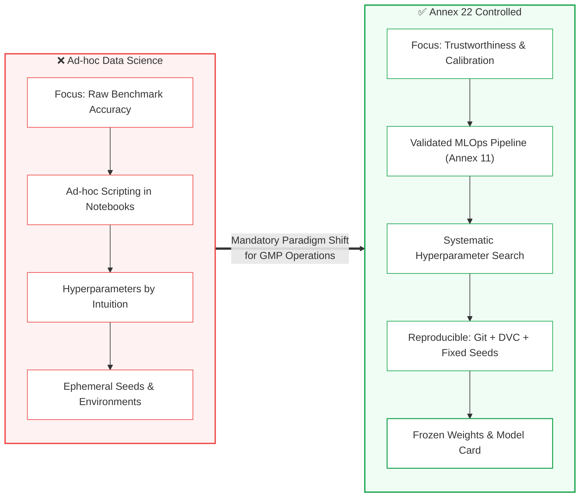

<!-- metadata
source_file: docs/de/module_07_model_development_training.md
source_commit: 8fed97a
sync_date: 2026-09-29
language: en
-->

# Module 07: AI Model Development and Training

🌐 **[Deutsche Version](../de/module_07_model_development_training.md)** &nbsp;|&nbsp; **[⬅ Module 06: Data Governance and Data Quality](module_06_data_governance_quality.md)** &nbsp;|&nbsp; **[🏠 Table of Contents](00_overview.md)** &nbsp;|&nbsp; **[Module 08: Validation and Performance Testing ➔](module_08_validation_performance_testing.md)**

---

## 🎯 Learning Objectives & Guiding Questions
1. **The Paradigm Shift:** How do we transition from experimental data science (velocity, benchmark chasing) to strictly controlled GMP engineering?
2. **The Reproducibility Mandate:** What does deterministic reproducibility mean for stochastic learning, and why must random seeds and environment snapshots be archived?
3. **MLOps as GxP Infrastructure:** Why do platforms like MLflow, SageMaker, Azure ML, and DVC require validation under **EU GMP Annex 11**?
4. **Hyperparameter Discipline:** Why is developer intuition unaccepted by auditors, and why must hyperparameters never be tuned on test data?
5. **Model Calibration & Model Cards:** Why does an uncalibrated model induce dangerous *Automation Bias*, and how do standardized *Model Cards* streamline inspections?

---

## 🧭 Core Concept: From Ad-hoc Experiment to GxP Engineering

---

## 📌 Technical Summary (Key Takeaways)

### 1. The Paradigm Shift: Engineering Trust vs. Benchmark Speed
In commercial and academic data science, predictive accuracy on static benchmarks and experimental velocity take precedence.

Under **EU GMP Annex 22**, this mentality clashes directly with pharmaceutical quality standards:
* **Development Discipline Determines Behavior:** Downstream validation or monitoring mechanisms cannot remediate a model engineered without rigorous controls from Day 1.
* **Target Objective:** Optimization targets **long-term reliability (Trustworthiness), robust decision boundaries, and audit defensibility**, not a fleeting benchmark record.
* Retrofitting GxP compliance onto exploratory, unversioned prototype code is cost-prohibitive and routinely rejected during regulatory inspections.

### 2. The Static Model & Configuration Control ([Draft Glossary, §10.2])
The foundational pillar for critical GMP applications is the **static model with frozen parameters** ([Draft Glossary: Static model]):
* **Definition under [Draft Glossary]:** A static model does not adapt its parameters (weights) in routine operation post-qualification. For the identical input, it deterministically outputs the identical prediction ([Draft §1]).
* **Configuration Control ([Draft §10.2]):** The tested model must be placed under configuration control prior to routine operational use, and effective measures to detect unauthorized changes must be employed ([Draft §10.2]). Hyperparameters, pre-processing transformations, and operating configurations are tracked as good engineering practice ([Best Practice: ISPE GAMP AI Guide]).
* **Archiving of Model Artifact & Inference Environment ([Best Practice: ISPE GAMP AI Guide] [Interpretation]):**
  - In modern machine learning practice (particularly deep learning on GPU clusters), bit-exact retraining from scratch across multi-year horizons is frequently challenged by floating-point non-determinism and hardware micro-architectures.
  - The most regulatorily defensible approach is therefore to archive the **fully trained and qualified model artifact** (binary weight files, checkpoints with cryptographic SHA-256 hashes) together with the **complete containerized inference runtime environment** (container image, pinned library dependencies) in an immutable archive ([Best Practice: ISPE GAMP AI Guide]).
  - Source code (Git commit hashes), dataset snapshots, and random seeds are archived complementarily to ensure comprehensive provenance.

> [!CAUTION]
> **Illustrative Operational Scenario (didactic case study, unverified):** A company investigating a quality complaint could not reconstruct an AI model's historical classification because dependency libraries had auto-updated and neither the exact artifact nor the runtime environment was archived. The inability to reconstruct the historical decision resulted in a **Major Deficiency**.

### 3. MLOps & Cloud Platforms as Regulated GxP Infrastructure ([Draft §2.2, Annex 11])
Modern data science relies on MLOps and cloud platforms like MLflow, Weights & Biases, DVC, AWS SageMaker, or Azure ML.
* **Regulatory Impact:** When utilized to build, log, or track models governing pharmaceutical decisions, these platforms are classified as **Computerised Systems**.
* They must be fully qualified and validated under **EU GMP Annex 11** (access controls, audit trails, data integrity, disaster recovery).
* **Supplier & Cloud Oversight ([Draft §2.2]):**
  - A SOC-2 or ISO-27001 certificate alone is **insufficient** for GxP compliance.
  - The regulated user must obtain and formally review documentation for activities performed by third-party suppliers ([Draft §2.2]); ultimate pharmaceutical accountability strictly remains with the manufacturer. Quality Agreements and SLAs must contractually guarantee that cloud providers do not deploy unannounced updates that alter pipeline behavior (*Uncontrolled Environment Drift*).

### 4. Hyperparameter Discipline & The Golden Validation Rule
Hyperparameters (learning rates, tree depths, regularization, batch sizes) govern algorithmic convergence:
* **Configuration Control Baseline:** The qualified model is under configuration control ([Draft §10.2]). Modifications of parameters without formal Change Control and re-testing assessment are unacceptable ([Draft §10.1]).
* **The Golden Rule:** Hyperparameters must be tuned **exclusively on the Validation Set – never on the Hold-Out Test Set**! Otherwise, the model is effectively exposed to the final exam questions (*Data Leakage*), invalidating the qualification.
* **Documented Search Rationale:** Whether using Grid Search, Random Search, or Bayesian Optimization, teams must document search boundaries and stopping criteria.

### 5. Model Calibration & Model Cards ([Didaktik] / [ML Practice])
* **Calibration vs. Accuracy:** A model can achieve 85% accuracy yet output 99.9% confidence scores. This **Overconfidence** induces human operators to passively rubber-stamp erroneous outputs (*Automation Bias*). Models must be statistically calibrated (e.g., via Platt Scaling or Isotonic Regression).
* **Model Cards ([Didaktik] / [ML Practice]):** To standardize audit dossiers, modern ML practice recommends **Model Cards** (analogous to a technical datasheet):
  - Authorized *Intended Use* and operational envelope ([Draft §3.1]),
  - Training and testing dataset composition, lineage, and version,
  - Performance and calibration metrics,
  - Known limitations, failure modes, and out-of-scope conditions.

---

## 💡 Key Terminology & Concepts (Glossar)

- **Reproducibility:** The capability to regenerate an identical model artifact given identical data, code, random seeds, and software dependencies.
- **Frozen Weights:** The locked, immutable parameter state of a validated model deployed into commercial GMP production.
- **Random Seed:** A deterministic numerical seed provided to pseudo-random algorithms to ensure exact mathematical repeatability.
- **Model Card:** A standardized technical datasheet summarizing intended use, performance, limitations, and operational risks for regulators.
- **Model Calibration:** The alignment between predicted confidence probability and actual empirical correctness frequency.
- **Hyperparameter Optimization (HPO):** The systematic, documented tuning process identifying optimal configuration settings without test data contamination.

---

## 📋 GxP-Compliance Checklist: Model Development & Training

### Absolute Must-Haves:
- [ ] Are code commits, data hashes (DVC), container images, and **Random Seeds** version-locked for every training run?
- [ ] Are MLOps and cloud platforms validated as computerized systems under **Annex 11**?
- [ ] Is hyperparameter tuning strictly confined to the validation partition without exposing the test set?
- [ ] Is there a documented rationale justifying the hyperparameter search methodology?
- [ ] Has **Model Calibration (Expected Calibration Error - ECE)** been evaluated to prevent overconfidence?
- [ ] Is an approved **Model Card** completed prior to entering the formal validation phase?

### Red Flags for Inspectors:
- ❌ Production model weights generated inside ad-hoc Jupyter notebooks without pipeline automation.
- ❌ No record of random seeds ("Retraining outputs slightly different weights every time").
- ❌ Hyperparameters tweaked based on hold-out test results to hit approval thresholds.
- ❌ Unpinned software dependencies (`pip install scikit-learn` instead of exact versions).

---

🌐 **[Deutsche Version](../de/module_07_model_development_training.md)** &nbsp;|&nbsp; **[⬅ Module 06: Data Governance and Data Quality](module_06_data_governance_quality.md)** &nbsp;|&nbsp; **[🏠 Table of Contents](00_overview.md)** &nbsp;|&nbsp; **[Module 08: Validation and Performance Testing ➔](module_08_validation_performance_testing.md)**

