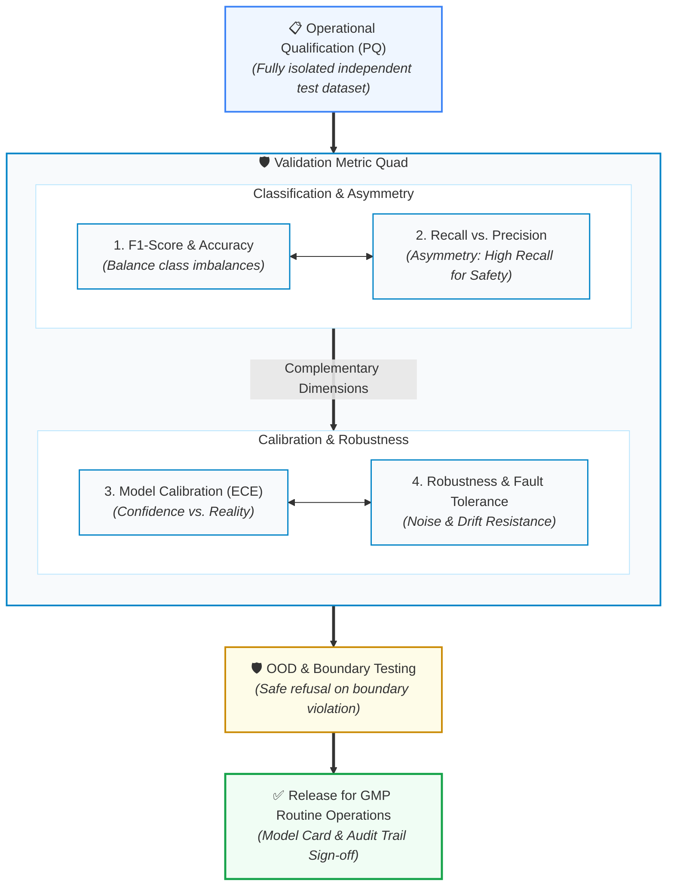

<!-- metadata source_file: docs/de/module_08_validation_performance_testing.md, sync_date: 2026-09-29 -->
# Module 08: Validation and Performance Testing

🌐 **[Deutsche Version](../de/module_08_validation_performance_testing.md)** &nbsp;|&nbsp; **[⬅ Module 07: AI Model Development and Training](module_07_model_development_training.md) &nbsp;|&nbsp; [🏠 Table of Contents](00_overview.md) &nbsp;|&nbsp; [Module 09: Explainability and Transparency ➔](module_09_explainability_transparency.md)**

---

## 🎯 Learning Objectives & Guiding Questions
1. **The CSV Validation Shift:** Why are classical deterministic Pass/Fail test scripts insufficient for machine learning models, and what does statistical AI validation look like?
2. **The "Validation Metric Quad":** Why does relying on a single "Accuracy" score cause failure during regulatory inspections, and which 4 mandatory metric dimensions are enforced by Annex 22?
3. **Asymmetric Error Costs:** Why does pharmaceutical GxP always prioritize *Recall* (Sensitivity) over *Precision* when trade-offs arise?
4. **Boundary Condition & OOD Testing:** How is model behavior evaluated under edge cases and Out-of-Distribution (OOD) conditions during Performance Qualification (PQ)?
5. **Audit-Proof Traceability:** How must the validation test report be structured so inspectors can drill down from aggregate metrics to individual raw test data points?

---

## 🧭 Visualization: The Annex 22 "Validation Metric Quad"

---

## 📌 Technical Summary (Key Takeaways)

### 1. Paradigm Shift: From Deterministic Scripts to Statistical Validation
In classical **Computer System Validation (CSV under Annex 11)**, deterministic test scripts were sufficient:
$$\text{Input } X \longrightarrow \text{Expected Output } Y \quad (\text{Pass / Fail})$$

AI systems, however, process multivariately and stochastically:
* The core compliance question is no longer just: *"Does the system execute the exact lines of code written?"*, but rather: **"Does the model maintain statistically stable, reliable, and compliant behavior across all representative and extreme operational states?"**
* **Lifecycle Mandate:** Validation under Annex 22 is not a one-time pre-go-live milestone, but a qualified state that must be continuously defended against performance degradation. Any modification to data sources, preprocessing pipelines, or model hyperparameters triggers formal revalidation obligations.

### 2. The Validation Metric Quad
An inspection report that presents only an overall hit rate (*e.g., Accuracy = 95%*) is considered **inadequate and non-compliant in GxP environments**. Given highly imbalanced pharmaceutical data (e.g., 99.8% good batches and 0.2% defective batches), a trivial model predicting "Good" for everything would achieve 99.8% accuracy—while being catastrophic for patient safety.

Annex 22 therefore mandates four complementary metric dimensions:
1. **F1-Score / Balanced Accuracy:** The harmonic mean of precision and recall, mathematically neutralizing severe class imbalances.
2. **Recall (Sensitivity) vs. Precision:**
   - **Asymmetric Error Costs:** In pharmaceutical manufacturing, a *False Negative* (releasing a contaminated or defective batch as "Good") poses a direct threat to patient life. A *False Positive* (flagging a good unit as suspicious) merely incurs extra manual inspection time.
   - **Pharma Rule:** Decision thresholds must be tuned with primary emphasis on **maximizing Recall** to guarantee the detection of safety incidents.
3. **Model Calibration (Expected Calibration Error - ECE, [Best Practice]):**
   - Assesses whether the model's output confidence score accurately mirrors its empirical probability of correctness.
   - An uncalibrated model that outputs 99% confidence when wrong lulls human operators into false trust (*Automation Bias*).
4. **Robustness:**
   - Evaluates system stability when sensor signals are noisy, measurements drop out, or environmental variables fluctuate within operating ranges.

### 3. Acceptance Criteria & No Decrease in Performance ([Draft §4.2, §4.3])
* **Pre-Approval by Process SMEs ([Draft §4.2]):** All acceptance criteria must be predefined and formally approved by qualified domain experts (*Process SMEs*) **prior to commencing acceptance testing**. Modifying or lowering criteria post-test after viewing results is unacceptable.
* **Acceptance Criteria at Least as High as Replaced Process ([Draft §4.3]):** Acceptance criteria for the model's performance should result in no decrease in performance compared to the process it replaces. Where the AI system may perform less well in certain areas, this must be compensated for by higher performance in other areas, and overall performance must not decrease.

### 4. Staff Independence & Test Data Safeguards ([Draft §6.1–§6.5])
Safeguarding test data against contamination or subconscious overfitting is a primary regulatory inspection focus:
* **Independent Test Data ([Draft §6.1]):** System testing must be conducted with data that are independent, i.e. not used during development, training, or internal model validation (*validation dataset*).
* **No Developer Access to Test Data ([Draft §6.2]):** Where test data were split from a larger dataset prior to training, personnel involved in development and training **must not have had access to the test data**.
* **Access Controls, Audit Trails & No Data Copies ([Draft §6.2]):** Test datasets must be protected by technical and/or procedural access controls and audit trails. **No copies of test data may exist outside the secure repository**.
* **Logging Test Data Usage ([Draft §6.3]):** Complete records must be kept indicating which test data were used, when testing took place, and the number of times test data were accessed.
* **Test Data from Physical Objects ([Draft §6.4]):** If test data are derived from physical objects (e.g. sample containers, vials, tablets), the physical objects used for testing must not have been previously used for training or internal validation of the model, unless the characteristics measured are independent.
* **Staff Independence & Four-Eyes Principle ([Draft §6.5]):** Effective controls must be implemented to prevent personnel with test data access from participating in the training or validation of the same model.
  - *Exception for Smaller Organizations ([Draft §6.5]):* Where complete organizational separation is not feasible, an individual with access to the test data may only participate in training/validation if working as a pair with a peer who had no test data access (Four-Eyes Principle / 4-Eyes Principle). Establishing completely separate organizational teams represents a recommended didactic structure ([Didaktik]).

### 5. Test Execution & Test Documentation ([Draft §7.1–§7.4])
* **Suitability for Intended Use & Generalisation ([Draft §7.1]):** Testing must ensure that the model is suitable for its intended use and is generalising well (i.e. performing satisfactorily on unseen data across the intended use envelope). This includes detecting potential overfitting or underfitting to the training data.
* **Approved Test Plan Involving Process SMEs ([Draft §7.2]):** Prior to testing, a formal test plan must be pre-specified and approved. It must include a summary of the intended use, pre-defined metrics and acceptance criteria, references to test data, a test script detailing execution steps, and the method for metric calculation. Process SMEs must be actively involved in plan development.
* **Deviation Management & Omissions ([Draft §7.3]):** Any deviations from the test plan, any failure to achieve acceptance criteria, and any omission of planned test data must be documented, investigated, and fully justified.
* **Retention of Test Documentation ([Draft §7.4]):** All test documentation must be retained together with the intended use description, test data characterisation, the test data itself, and physical test objects where applicable. Documentation on access controls and audit trail records must be retained similar to other GMP documentation.
* *Code Repositories & Traceability ([Best Practice: ISPE GAMP AI Guide]):* Maintaining all model and validation code under version control in secure repositories and assessing third-party libraries represent established industry best practices, though not explicitly regulated in the draft itself.

### 6. Confidence Score Logging & Threshold Setting ([Draft §9.1, §9.2])
* **Logging Confidence Scores During Testing ([Draft §9.1]):** When testing a model for predicting or classifying data, the system should, where applicable, log the model's confidence score for each prediction or classification result.
* **Appropriate Threshold Settings & Labeling as 'Undecided' ([Draft §9.2]):** Models used for prediction or classification should have an appropriate threshold setting to ensure predictions or classifications are only made when appropriate. If the confidence score is very low, consideration should be given to having the model label the result as 'undecided' rather than making potentially unreliable predictions or classifications.
* *Operator Training on Limitations & Overrides ([Draft §3.3] / [Best Practice]):* Where testing effort was reduced based on human oversight, operators must be trained in model limitations and monitored like manual operators ([Draft §3.3]). Targeted override training represents established industry good practice ([Best Practice / GxP Practice]).

### 7. Boundary Condition Testing & Out-of-Distribution (OOD) Protection
Validation must never be confined to "sunny-day" scenarios:
* **Fault Injection Testing:** During Performance Qualification (PQ), corrupted input records, sensor noise, and signal dropouts are deliberately introduced.
* **OOD Detection Logic:** The system must provably detect when an input vector falls outside its validated *Intended Use* domain (*Out-of-Distribution*).
* **Graceful Degradation:** Instead of making unfounded predictions in unknown territory, the model must safely refuse prediction (*Safe State*) and escalate control to qualified human personnel with an auditable alert.

### 8. Evidence Traceability & Drill-Down Capability
For health authority inspectors (EMA, FDA), structural traceability in validation documentation is paramount:
* Auditors must be able to drill down seamlessly from executive KPI summaries in the validation report, through the confusion matrix, to the **exact raw data records in the hold-out test set**.
* Without end-to-end provenance or if validation relies on undocumented ad-hoc scripts, the entire qualification claim is deemed compromised.

---

## 💡 Key Terminology & Concepts (Glossary)

- **Statistical AI Validation:** A validation paradigm qualifying models via multivariate, statistical evaluations on unseen hold-out data rather than rigid deterministic pass/fail steps.
- **Staff Independence:** The organizational separation between the AI development team and the qualification engineers/QA personnel executing formal validation.
- **Recall (Sensitivity):** The proportion of actual positive/defective events correctly flagged by the model ($\frac{TP}{TP + FN}$).
- **Precision:** The proportion of units predicted as defective that are truly defective ($\frac{TP}{TP + FP}$).
- **Expected Calibration Error (ECE):** A scalar measure assessing the gap between predicted confidence values and empirical accuracy.
- **Fault Injection Testing:** Deliberate introduction of faults (noise, null values, spikes) to qualify system resilience and failsafe behavior.
- **Graceful Degradation:** Controlled transition to a reduced operational or safe state when encountering anomalous or out-of-distribution inputs without unmonitored failure.

---

## 📋 GxP-Compliance Checklist: Validation & Testing

### Absolute Must-Haves:
- [ ] Were quantitative acceptance criteria for the entire **Metric Quad** (F1, Recall, Precision, ECE) formally approved prior to executing the test run?
- [ ] Was the model evaluated strictly on an authentic, previously **unseen hold-out test set**?
- [ ] Was formal qualification conducted by **organizationally independent personnel (Staff Independence)**?
- [ ] Has the OOD (*Out-of-Distribution*) detection logic been challenged with genuine boundary and fault-injection data?
- [ ] Were fault-injection tests documented proving safe fallback and handover (*Graceful Degradation*) to human experts?
- [ ] Is the validation report fully traceable with drill-down capability from summary metrics to individual raw data points?
- [ ] Is an approved revalidation strategy documented for drift triggers and pipeline updates?

### Inspection Red Flags:
- ❌ Validation report presenting only a global "Accuracy" metric without class breakdown.
- ❌ Acceptance thresholds defined or lowered after viewing test results.
- ❌ Model returning high-confidence predictions on extreme boundary or out-of-spec inputs.
- ❌ Test datasets re-used iteratively during development to guide tuning (*Data Leakage*).

---

🌐 **[Deutsche Version](../de/module_08_validation_performance_testing.md)** &nbsp;|&nbsp; **[⬅ Module 07: AI Model Development and Training](module_07_model_development_training.md) &nbsp;|&nbsp; [🏠 Table of Contents](00_overview.md) &nbsp;|&nbsp; [Module 09: Explainability and Transparency ➔](module_09_explainability_transparency.md)**

