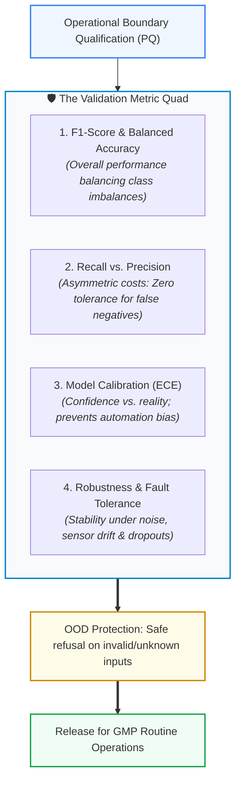

<!-- metadata source_file: docs/de/module_08_validation_performance_testing.md, sync_date: 2026-09-28 -->
# Module 08: Validation and Performance Testing

🌐 **[Deutsche Version](../de/module_08_validation_performance_testing.md)** &nbsp;|&nbsp; **[⬅ Module 07: AI Model Development and Training](module_07_model_development_training.md) &nbsp;|&nbsp; [🏠 Table of Contents](00_overview.md) &nbsp;|&nbsp; [Module 09: Explainability and Transparency ➔](module_09_explainability_transparency.md)**

---

## 🎯 Learning Objectives & Guiding Questions
1. **The CSV Validation Shift:** Why are classical deterministic Pass/Fail test scripts insufficient for machine learning models, and what does statistical AI validation look like?
2. **The "Validation Metric Quad":** Why does relying on a single "Accuracy" score cause failure during regulatory inspections, and which 4 mandatory metric dimensions are enforced by Annex 22?
3. **Asymmetric Error Costs:** Why does pharmaceutical GxP always prioritize *Recall* (Sensitivity) over *Precision* when trade-offs arise?
4. **Boundary Condition & OOD Testing:** How is model behavior evaluated under edge cases and Out-of-Distribution (OOD) conditions during Performance Qualification (PQ)?
5. **Audit-Proof Traceability:** How must the validation test report be structured so inspectors can drill down from aggregate metrics to individual raw test data points?

---

## 🧭 Visualization: The Annex 22 "Validation Metric Quad"

---

## 📌 Technical Summary (Key Takeaways)

### 1. Paradigm Shift: From Deterministic Scripts to Statistical Validation
In classical **Computer System Validation (CSV under Annex 11)**, deterministic test scripts were sufficient:
$$\text{Input } X \longrightarrow \text{Expected Output } Y \quad (\text{Pass / Fail})$$

AI systems, however, process multivariately and stochastically:
* The core compliance question is no longer just: *"Does the system execute the exact lines of code written?"*, but rather: **"Does the model maintain statistically stable, reliable, and compliant behavior across all representative and extreme operational states?"**
* **Lifecycle Mandate:** Validation under Annex 22 is not a one-time pre-go-live milestone, but a qualified state that must be continuously defended against performance degradation. Any modification to data sources, preprocessing pipelines, or model hyperparameters triggers formal revalidation obligations.

### 2. The Validation Metric Quad
An inspection report that presents only an overall hit rate (*e.g., Accuracy = 95%*) is considered **inadequate and non-compliant in GxP environments**. Given highly imbalanced pharmaceutical data (e.g., 99.8% good batches and 0.2% defective batches), a trivial model predicting "Good" for everything would achieve 99.8% accuracy—while being catastrophic for patient safety.

Annex 22 therefore mandates four complementary metric dimensions:
1. **F1-Score / Balanced Accuracy:** The harmonic mean of precision and recall, mathematically neutralizing severe class imbalances.
2. **Recall (Sensitivity) vs. Precision:**
   - **Asymmetric Error Costs:** In pharmaceutical manufacturing, a *False Negative* (releasing a contaminated or defective batch as "Good") poses a direct threat to patient life. A *False Positive* (flagging a good unit as suspicious) merely incurs extra manual inspection time.
   - **Pharma Rule:** Decision thresholds must be tuned with primary emphasis on **maximizing Recall** to guarantee the detection of safety incidents.
3. **Model Calibration (Expected Calibration Error - ECE):**
   - Assesses whether the model's output confidence score accurately mirrors its empirical probability of correctness.
   - *Risk:* An uncalibrated model that outputs 99% confidence when wrong lulls human operators into false trust (*Automation Bias*), provoking uncritical sign-offs.
4. **Robustness:**
   - Evaluates system stability when sensor signals are noisy, measurements drop out, or environmental variables fluctuate within operating ranges.

### 3. Pre-Sealing of Acceptance Criteria
* **No Moving Goalposts:** Quantitative acceptance criteria (*e.g., Recall $\ge 99.5\%$, Precision $\ge 90\%$, ECE $\le 0.05$*) must be **formally approved and sealed in the Validation Plan prior to running tests on the test dataset**.
* Post-hoc adjustment or loosening of acceptance criteria after viewing test performance represents a severe GMP violation.

### 4. Staff Independence & Blind Testing
A vital requirement emphasized in the **PIC/S and Annex 22 draft guidance** is strict organizational separation:
* **No Self-Auditing:** Mathematical data isolation is not enough. Personnel designing, conducting, and approving formal qualification tests (Validation Engineers / QA) must be **organizationally independent** from the data scientists who developed and trained the model.
* **Blind Testing:** Developers must not have pre-test visibility into the specific test dataset or curated edge-case collections, preventing subconscious confirmation bias or intentional hyperparameter tuning on the test set.

### 5. Boundary Condition Testing & Out-of-Distribution (OOD) Protection
Validation must never be confined to "sunny-day" scenarios:
* **Fault Injection Testing:** During Performance Qualification (PQ), corrupted input records, sensor noise, and signal dropouts are deliberately introduced.
* **OOD Detection Logic:** The system must provably detect when an input vector falls outside its validated *Intended Use* domain (*Out-of-Distribution*).
* **Graceful Degradation:** Instead of hallucinating or making unfounded predictions in unknown territory, the model must safely refuse prediction (*Safe State*) and escalate control to qualified human personnel with an auditable alert.

### 6. Evidence Traceability & Drill-Down Capability
For health authority inspectors (EMA, FDA), structural traceability in validation documentation is paramount:
* Auditors must be able to drill down seamlessly from executive KPI summaries in the validation report, through the confusion matrix, to the **exact raw data records in the hold-out test set**.
* Without end-to-end provenance or if validation relies on undocumented ad-hoc scripts, the entire qualification claim is deemed compromised.

---

## 💡 Key Terminology & Concepts (Glossary)

- **Statistical AI Validation:** A validation paradigm qualifying models via multivariate, statistical evaluations on unseen hold-out data rather than rigid deterministic pass/fail steps.
- **Staff Independence:** The organizational separation between the AI development team and the qualification engineers/QA personnel executing formal validation.
- **Recall (Sensitivity):** The proportion of actual positive/defective events correctly flagged by the model ($\frac{TP}{TP + FN}$).
- **Precision:** The proportion of units predicted as defective that are truly defective ($\frac{TP}{TP + FP}$).
- **Expected Calibration Error (ECE):** A scalar measure assessing the gap between predicted confidence values and empirical accuracy.
- **Fault Injection Testing:** Deliberate introduction of faults (noise, null values, spikes) to qualify system resilience and failsafe behavior.
- **Graceful Degradation:** Controlled transition to a reduced operational or safe state when encountering anomalous or out-of-distribution inputs without unmonitored failure.

---

## 📋 GxP-Compliance Checklist: Validation & Testing

### Absolute Must-Haves:
- [ ] Were quantitative acceptance criteria for the entire **Metric Quad** (F1, Recall, Precision, ECE) formally approved prior to executing the test run?
- [ ] Was the model evaluated strictly on an authentic, previously **unseen hold-out test set**?
- [ ] Was formal qualification conducted by **organizationally independent personnel (Staff Independence)**?
- [ ] Has the OOD (*Out-of-Distribution*) detection logic been challenged with genuine boundary and fault-injection data?
- [ ] Were fault-injection tests documented proving safe fallback and handover (*Graceful Degradation*) to human experts?
- [ ] Is the validation report fully traceable with drill-down capability from summary metrics to individual raw data points?
- [ ] Is an approved revalidation strategy documented for drift triggers and pipeline updates?

### Inspection Red Flags:
- ❌ Validation report presenting only a global "Accuracy" metric without class breakdown.
- ❌ Acceptance thresholds defined or lowered after viewing test results.
- ❌ Model returning high-confidence predictions on extreme boundary or out-of-spec inputs.
- ❌ Test datasets re-used iteratively during development to guide tuning (*Data Leakage*).

---

🌐 **[Deutsche Version](../de/module_08_validation_performance_testing.md)** &nbsp;|&nbsp; **[⬅ Module 07: AI Model Development and Training](module_07_model_development_training.md) &nbsp;|&nbsp; [🏠 Table of Contents](00_overview.md) &nbsp;|&nbsp; [Module 09: Explainability and Transparency ➔](module_09_explainability_transparency.md)**

