<!-- metadata source_file: docs/de/module_09_explainability_transparency.md, sync_date: 2026-09-28 -->
# Module 09: Explainability and Transparency

🌐 **[Deutsche Version](../de/module_09_explainability_transparency.md)** &nbsp;|&nbsp; **[⬅ Module 08: Validation and Performance Testing](module_08_validation_performance_testing.md) &nbsp;|&nbsp; [🏠 Table of Contents](00_overview.md) &nbsp;|&nbsp; [Module 10: Human Oversight / Human in the Loop ➔](module_10_human_oversight_hitl.md)**

---

## 🎯 Learning Objectives & Guiding Questions
1. **The Transparency Mandate:** Why is "The algorithm computed it this way" legally and regulatorily inadmissible during batch release or quality deviations?
2. **Interpretability vs. Explainability:** What distinguishes global understanding of a model's intrinsic logic from local reasoning behind an individual prediction?
3. **The Explainability Spectrum:** When are simple white-box models strictly preferred by regulators, and how do black-box models quadruple the validation burden?
4. **Post-Hoc Explanation Techniques (SHAP, LIME, Counterfactuals):** Which mathematical tools are suitable for GxP environments and what risks (instability, contradictions) must be mitigated?
5. **Audience-Centric Cognition:** How must explanations be tailored for line operators, qualification engineers, and regulatory health inspectors?

---

## 🧭 Visualization: The Explainability Spectrum in GxP

```mermaid
graph LR
    subgraph WhiteBox["⚪ White-Box Models"]
        direction TB
        W1["Linear Regression, Decision Trees"]
        W2["Inherently transparent & auditable"]
        W3["Low validation overhead"]
    end

    subgraph GrayBox["🔘 Gray-Box Models"]
        direction TB
        G1["Random Forests, Gradient Boosting"]
        G2["Post-hoc methods required"]
        G3["Moderate validation overhead"]
    end

    subgraph BlackBox["⚫ Black-Box Models"]
        direction TB
        B1["Deep Neural Networks, Complex Ensembles"]
        B2["Opaque: SHAP, LIME, Attention Maps"]
        B3["Significantly higher qualification overhead"]
    end

    WhiteBox -->|Increasing model complexity & explainability demand| GrayBox
    GrayBox --> BlackBox

    style WhiteBox fill:#f0fdf4,stroke:#16a34a,stroke-width:2px
    style GrayBox fill:#fefce8,stroke:#ca8a04,stroke-width:2px
    style BlackBox fill:#fef2f2,stroke:#ef4444,stroke-width:2px
```

---

## 📌 Technical Summary (Key Takeaways)

### 1. Explainability During Testing & Plausibility Review ([Draft §8.1, §8.2])
Draft EU GMP Annex 22 anchors explainability primarily as a **mandatory discipline during model testing and qualification**:
* **Explainability Methods During Testing ([Draft §8.1]):** If a model is not inherently explainable, methods to enhance explainability (e.g. feature attribution techniques such as SHAP or LIME, surrogate models, or local explanations) must be used during testing to make the model's decision-making process comprehensible.
* **Review of Features at Test Acceptance ([Draft §8.2]):** Formal acceptance of test results must include an explicit review of the features utilized by the model to verify that they are biologically, chemically, or physically plausible and relevant to the *Intended Use*.
* **Routine Operational Explanations ([Best Practice: ML Practice]):** Displaying SHAP values or heatmaps on every live production inference is a valuable industry best practice ([Best Practice]), though the draft itself centers requirements on testing and qualification sign-off.

### 2. Conceptual Clarification: Interpretability vs. Explainability
* **Interpretability (Global):** The inherent human comprehensibility of the entire model architecture and parameter logic (e.g., a shallow decision tree or linear regression model).
* **Explainability (Local / Post-hoc):** The ability to provide an intelligible explanation for a specific individual decision (e.g., an anomaly alert or batch deviation classification), identifying which input features drove that prediction.

### 3. Model Complexity & Regulatory Implications
* **Inherently Explainable Models ([Draft §8.1]):** Where simple, transparent models achieve comparable performance to complex black-box architectures, they significantly streamline qualification and audit defense ([Best Practice: ML Practice]).
* **Black-Box Qualification Overhead:** Deploying deep neural networks requires additional formal evidence under [Draft §8.1, §8.2] regarding feature plausibility and the validation of post-hoc explanatory methods.

### 4. Post-Hoc Explanation Methods & GxP Pitfalls
When complex architectures are indispensable, Annex 22 relies on post-hoc methods:
* **SHAP (Shapley Additive exPlanations):** Grounded in cooperative game theory. Computes each feature's fair additive contribution to the output. Considered the gold standard in pharma due to its mathematical consistency and efficiency properties.
* **LIME (Local Interpretable Model-agnostic Explanations):** Generates local linear surrogate approximations around the queried point.
  - *GxP Warning:* LIME is vulnerable to stochastic sampling instability. If identical inputs yield conflicting explanations across repeat queries, inspector and operator trust is instantly shattered.
* **Counterfactual Explanations:** Highly valuable for shop-floor operators. They define the minimal input change required to flip a decision:  
  *"The tablet was flagged as defective because compression force was 18.2 kN. Had compression force been below 17.5 kN, the batch would have passed."*
* **Attention Heatmaps (NLP/LLMs):** Highlight which tokens received focus. Critical caveat: *Attention is not causality*—it shows associative focus, not necessarily mechanistic cause.

> [!CAUTION]
> **Illustrative Operational Scenario (didactic case study, unverified):** A pharmaceutical manufacturer deployed global feature importance for predictive maintenance. After automated retraining runs, the top contributing features shifted erratically (e.g., pressure on Monday, temperature on Tuesday for identical mechanical wear). Operators refused to use the tool due to perceived arbitrariness. The system had to be rebuilt using stabilized permutation importance and completely re-qualified.

### 5. Audience-Centric Explanations (Cognitive Load Management)
Explanations must be structured across three distinct user personas:
1. **Line Operator:** Minimal cognitive overhead, strictly actionable (*Actionable Insights*—which machine setpoint requires physical adjustment?).
2. **Validation / QA Engineer:** Statistical depth, sensitivity curves, and proof of numeric stability for the explanation pipeline.
3. **Regulatory Inspector (EMA/FDA):** Methodological justification, drift-free evidence logs, and persistent explanation records archived in the Audit Trail.

---

## 💡 Key Terminology & Concepts (Glossary)

- **Explainability:** The methodological capability to convey the decisive factors behind a specific AI prediction to a qualified human in an understandable manner.
- **Interpretability:** The degree to which a human can grasp the complete internal mechanics and decision logic of an AI model a priori.
- **SHAP (Shapley Additive exPlanations):** A game-theoretic technique for consistently attributing output predictions to individual input features.
- **LIME:** A local perturbation-based surrogate approach; requires stringent stability controls in GMP settings.
- **Counterfactual Explanation:** An explanation indicating the minimal change in inputs necessary to achieve an alternative target outcome.
- **Black-Box Penalty:** The substantial additional documentation, verification, and monitoring overhead incurred when deploying opaque models in critical GxP workflows.

---

## 📋 GxP-Compliance Checklist: Explainability

### Absolute Must-Haves:
- [ ] Is the chosen model complexity (White vs. Gray vs. Black Box) justified in writing with respect to process criticality?
- [ ] Are intelligible local explanation records captured in the Audit Trail for every GxP-relevant inference?
- [ ] Has the explanation pipeline (e.g., SHAP implementation) been validated for numerical stability and reproducibility?
- [ ] Are shop-floor operator explanations clear, actionable, and free of unnecessary data science jargon?
- [ ] Were negative tests conducted to verify that explanation tools do not mask model failure modes?
- [ ] Does a formalized training curriculum exist teaching operators how to properly interpret explanations and confidence scores?

### Inspection Red Flags:
- ❌ Deployment of deep neural networks for critical release decisions without an active local explainability mechanism.
- ❌ Explanation tools generating contradictory feature rankings for identical test inputs across runs (*instability*).
- ❌ Documentation presented to inspectors consisting solely of raw code or weight vectors without domain causality.
- ❌ Operators incapable of articulating why a recommendation was made ("The AI simply suggested it").

---

🌐 **[Deutsche Version](../de/module_09_explainability_transparency.md)** &nbsp;|&nbsp; **[⬅ Module 08: Validation and Performance Testing](module_08_validation_performance_testing.md) &nbsp;|&nbsp; [🏠 Table of Contents](00_overview.md) &nbsp;|&nbsp; [Module 10: Human Oversight / Human in the Loop ➔](module_10_human_oversight_hitl.md)**

