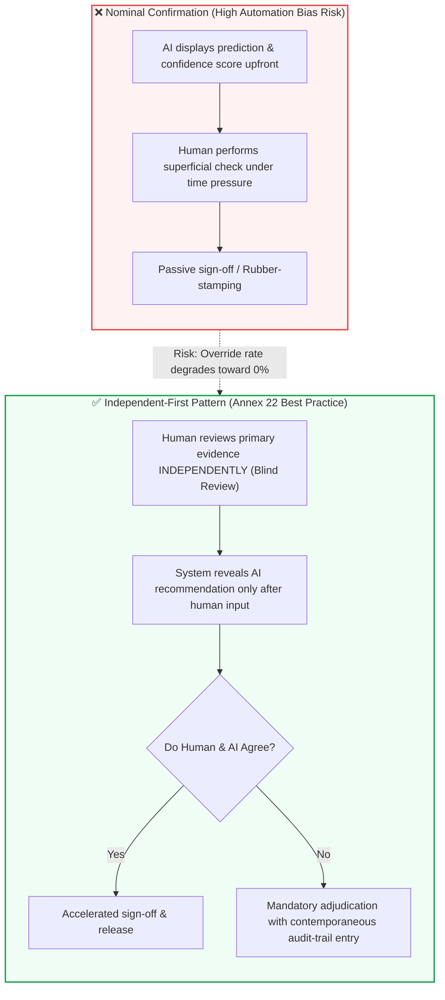

<!-- metadata source_file: docs/de/module_10_human_oversight_hitl.md, sync_date: 2026-09-28 -->
# Module 10: Human Oversight and Human-in-the-Loop (HITL)

🌐 **[Deutsche Version](../de/module_10_human_oversight_hitl.md)** &nbsp;|&nbsp; **[⬅ Module 09: Explainability and Transparency](module_09_explainability_transparency.md) &nbsp;|&nbsp; [🏠 Table of Contents](00_overview.md) &nbsp;|&nbsp; [Module 11: Lifecycle Management and Continuous Monitoring ➔](module_11_lifecycle_continuous_monitoring.md)**

---

## 🎯 Learning Objectives & Guiding Questions
1. **The Autonomy Paradox:** Why does increasing AI integration in GMP operations not reduce human accountability, but intensify the requirement for active human critical judgment?
2. **The 3 Oversight Tiers (HITL, HOTL, HOOL):** When is Human-in-the-Loop legally mandatory, and why is Human-out-of-the-Loop strictly prohibited for batch release?
3. **The Automation Bias Trap:** Why does human override frequency decay over time, and why do regulatory inspectors interpret a 0% override rate as systemic oversight failure?
4. **Workflow Design Countering Rubber-Stamping:** How does the vulnerable confirmation pattern (*Nominal Confirmation*) differ from the **Independent-First Pattern**?
5. **Inspection Proof for Effective Oversight:** Which metrics (dwell time, override statistics, model-specific competency logs) do inspectors demand to verify genuine oversight?

---

## 🧭 Visualization: Nominal Confirmation vs. Independent-First Review

---

## 📌 Technical Summary (Key Takeaways)

### 1. The Core Principle: Human Accountability & Decision Support
Under EU GMP Annex 22, the foundational tenet is established: **AI systems possess no legal accountability** (ultimate accountability for batch releases and GMP compliance strictly remains with the regulated pharmaceutical manufacturer under EU pharmaceutical law; under [Draft §2.2], the user must obtain and review documentation from third-party suppliers on their own responsibility).
* **No Blanket HITL Requirement for Fully Qualified Models:** The draft does not impose a blanket HITL requirement for thoroughly tested models (interpretation of §1, §3.3, §10.5 [Interpretation]). A fully qualified system (e.g., automated defect rejection in automated visual inspection) may operate autonomously within its qualified boundary.
* **Reduced Model Testing Entails Strict Operator Obligations ([Draft §3.3]):** When the AI system merely provides input to a human decision and the formal testing rigor of the model was reduced based on this final human decision, the role and responsibility of the human operator must be explicitly documented in the *Intended Use* ([Draft §3.3]).
* **Monitoring Comparable to Manual Processes ([Draft §3.3]):** In such cases, operator training and operational performance must be monitored in the same manner as for a purely manual process ([Draft §3.3]). Personnel must be trained in understanding model limitations and failure modes ([Draft §3.3] / [Best Practice]).
* **Confidence Thresholds & 'Undecided' Routing ([Draft §9.1, §9.2]):** Predictive or classification models must possess appropriate threshold settings; if the confidence score is very low, the model should label the result as 'undecided' ([Draft §9.2]). In such events, human review is immediately triggered to ensure a reliable outcome.
* **Review Records & Output Checking ([Draft §10.5]):** Records of operator reviews of system outputs must be maintained. Depending on application criticality and model testing depth, this may require formal checking of each individual output.
* **Decoupling from General Pharmaceutical Law:** Overall accountability of the marketing authorization holder and the Qualified Person (QP) derives from general EU pharmaceutical law; the Annex 22 draft provides specific technical expectations regarding the reliability of AI assistance.

### 2. The Three Oversight Tiers ([Didaktik])

> *Classification Note:* The division into HITL, HOTL, and HOOL is an established industry framework ([Didaktik]) that helps conceptualize control depth. The draft itself regulates human oversight functionally through §1, §3.3, and §10.5:

| Tier ([Didaktik]) | Designation | Typical Operational Context | Mechanism | GMP Regulatory Evaluation |
| :---: | :--- | :--- | :--- | :--- |
| **HITL** | **Human-in-the-Loop** | Reduced model test depth ([Draft §3.3, §10.5]) or GenAI ([Draft §1]) | Human reviews and confirms the output before an operational or data-altering action takes effect. | Required where model testing rigor was reduced or for non-critical GenAI. |
| **HOTL** | **Human-on-the-Loop** | Fully qualified process automation | Model executes processes within validated boundaries. Human monitors trends and intervenes upon deviations. | Permissible for qualified in-line automation (e.g., PAT), provided boundaries and monitoring are validated. |
| **HOOL** | **Human-out-of-the-Loop** | Autonomous systems lacking human oversight capability | Fully automated execution without oversight capability. | For critical GMP operations, incompatible with principles of Annex 11 and Annex 22 ([Draft §1; EudraLex overarching accountability]). |

### 3. The Automation Bias Trap (Creeping Decay of Oversight)
The most insidious threat in steady-state operations with human oversight is cognitive complacency:
* When a system performs reliably over weeks or months, operators naturally assume the AI is "always right."
* Vigilance declines (*Cognitive Complacency*), and personnel stop thoroughly scrutinizing warnings (*Perfunctory Review*).

> [!CAUTION]
> **Illustrative Operational Scenario (didactic case study, unverified):** A pharmaceutical facility introduced an AI system for automated deviation triage:
> - *Month 1:* Reviewers challenged and overrode the AI in **12% of cases** (*Healthy Challenge*).
> - *Month 3:* Override rate dropped to 5%.
> - *Month 6:* Override rate fell to **1.5%**.
> An internal QA audit revealed that the AI had not improved; rather, reviewers had stopped thoroughly reading primary reports. Several major deviations were misclassified as minor, requiring retrospective CAPA interventions.

**The Golden Inspector Rule:** An **override rate trending toward 0%** in complex evaluative tasks is not evidence of a flawless algorithm; it is **prima facie evidence of collapsed human oversight**.

### 4. Workflow Architecture Mitigating Automation Bias: The Independent-First Pattern ([Didaktik])
User interface (UI/UX) workflows must actively protect against cognitive complacency:
* **Anti-Pattern (Nominal Confirmation):** The interface highlights the AI recommendation ("Approve batch, confidence 98%") upfront. Reviewers subconsciously rubber-stamp the suggestion.
* **Best Practice (Independent-First Pattern, [Didaktik]):** The reviewer evaluates the dossier and **records their initial assessment before the AI's proposal is revealed**.
  - If both agree: Streamlined sign-off.
  - If they diverge: The system prompts documented adjudication (*Adjudication*).
* **Confidence-Based Escalation:** If model confidence dips below a pre-validated threshold, routine processing is blocked, automatically routing the dossier to a senior subject matter expert.

### 5. What Health Authority Inspectors Expect
During GMP audits, inspectors scrutinize the substantive nature of human oversight:
1. **Dwell Time per Review:** If 50-page batch records are approved within 4 seconds, oversight is fictitious. Operational throughput KPIs must not incentivize hasty approvals.
2. **Staff Qualification & Training ([Draft §3.3] / [Best Practice]):** Training records must prove that operators understand the specific limitations and failure modes of the AI model, as well as how and when to challenge and override the system (*Override*).
3. **Audit Trail of Overrides ([Draft §10.5]):** Records of overrides and output reviews must be contemporaneously recorded, justified, and retrievable.

---

## 💡 Key Terminology & Concepts (Glossary)

- **Human-in-the-Loop (HITL) ([Didaktik]):** Oversight architecture where algorithmic outputs require human review and sign-off before taking effect (mandatory under [Draft §3.3] if test rigor was reduced; under [Draft §1] for non-critical GenAI).
- **Human-on-the-Loop (HOTL) ([Didaktik]):** Oversight model where systems execute within pre-qualified boundaries while human operators retain supervisory override authority.
- **Automation Bias:** The cognitive tendency for human operators to defer uncritically to automated recommendations and disregard contradictory real-world indicators.
- **Independent-First Pattern ([Didaktik]):** An interaction paradigm requiring humans to formulate an independent judgment prior to viewing the algorithmic prediction.
- **Override Rate ([Didaktik]):** The statistical frequency with which human operators modify or reject AI recommendations; functions as a risk-based indicator of operator vigilance.
- **Adjudication ([Didaktik]):** The formalized, auditable justification workflow triggered when human judgment conflicts with an AI recommendation.

---

## 📋 GxP-Compliance Checklist: Human Oversight

### Absolute Must-Haves:
- [ ] Is operator responsibility formally anchored in the *Intended Use* where model testing rigor was reduced ([Draft §3.3])?
- [ ] Are operator training and operational performance monitored like manual processes ([Draft §3.3])?
- [ ] Has personnel been trained on how and when to override the AI system (*Override*, [Best Practice: GxP Practice])?
- [ ] Are records of operator reviews of system outputs maintained and retrievable ([Draft §10.5])?
- [ ] Does the workflow architecture effectively prevent uncritical rubber-stamping (*Automation Bias*)?
- [ ] Are system overrides and review discrepancies documented in compliant audit trails ([Draft §10.5])?

### Inspection Red Flags:
- ❌ Reduced model testing justified by human oversight without corresponding operator SOPs or training records ([Draft §3.3]).
- ❌ Personnel unable to explain model limitations and typical failure modes during an inspection ([Draft §3.3]).
- ❌ Persistent 0% override rates in complex judgment workflows accepted without plausibility verification.
- ❌ Operational throughput KPIs compelling operators into hurried, perfunctory reviews within seconds.

---

🌐 **[Deutsche Version](../de/module_10_human_oversight_hitl.md)** &nbsp;|&nbsp; **[⬅ Module 09: Explainability and Transparency](module_09_explainability_transparency.md) &nbsp;|&nbsp; [🏠 Table of Contents](00_overview.md) &nbsp;|&nbsp; [Module 11: Lifecycle Management and Continuous Monitoring ➔](module_11_lifecycle_continuous_monitoring.md)**

