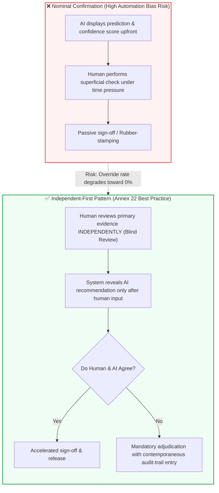

<!-- metadata source_file: docs/de/module_10_human_oversight_hitl.md, sync_date: 2026-09-28 -->
# Module 10: Human Oversight and Human-in-the-Loop (HITL)

🌐 **[Deutsche Version](../de/module_10_human_oversight_hitl.md)** &nbsp;|&nbsp; **[⬅ Module 09: Explainability and Transparency](module_09_explainability_transparency.md) &nbsp;|&nbsp; [🏠 Table of Contents](00_overview.md) &nbsp;|&nbsp; [Module 11: Lifecycle Management and Continuous Monitoring ➔](module_11_lifecycle_continuous_monitoring.md)**

---

## 🎯 Learning Objectives & Guiding Questions
1. **The Autonomy Paradox:** Why does increasing AI integration in GMP operations not reduce human accountability, but intensify the requirement for active human critical judgment?
2. **The 3 Oversight Tiers (HITL, HOTL, HOOL):** When is Human-in-the-Loop legally mandatory, and why is Human-out-of-the-Loop strictly prohibited for batch release?
3. **The Automation Bias Trap:** Why does human override frequency decay over time, and why do regulatory inspectors interpret a 0% override rate as systemic oversight failure?
4. **Workflow Design Countering Rubber-Stamping:** How does the vulnerable confirmation pattern (*Nominal Confirmation*) differ from the **Independent-First Pattern**?
5. **Inspection Proof for Effective Oversight:** Which metrics (dwell time, override statistics, model-specific competency logs) do inspectors demand to verify genuine oversight?

---

## 🧭 Visualization: Nominal Confirmation vs. Independent-First Review

---

## 📌 Technical Summary (Key Takeaways)

### 1. Core Principle: Zero Autonomy for Critical GMP Decisions
Under EU GMP Annex 22, the boundary is unequivocal: **AI systems possess no legal or regulatory pharmaceutical accountability.**
* Statutory responsibility for drug product quality and patient safety remains 100% with qualified pharmaceutical personnel (e.g., Qualified Person under Article 51 of Directive 2001/83/EC).
* **Perfunctory Oversight:** Having a qualified expert sit before a terminal simply clicking "Approve" upon suggestion does not constitute genuine human oversight. Regulators classify this as a major compliance deficiency.

### 2. The Three Oversight Tiers

| Tier | Designation | Risk Level | Mechanism | GMP Regulatory Applicability |
| :---: | :--- | :--- | :--- | :--- |
| **HITL** | **Human-in-the-Loop** | **High (Critical)** | A human must **review and explicitly confirm every individual AI output** before any operational or data-altering action occurs. | **Mandatory standard** for batch release, deviation classification, and OOS investigations. |
| **HOTL** | **Human-on-the-Loop** | **Moderate** | The model operates autonomously within narrow, pre-validated operational guardrails. A human monitors operations and can intervene or emergency-stop (*override*) at any time. | Permissible for adaptive process controls (e.g., bioreactor jacket temperature), provided guardrails are validated. |
| **HOOL** | **Human-out-of-the-Loop** | **Low / Non-GxP** | Fully automated execution without human intervention or review. | **Strictly prohibited** for any activity directly impacting product quality, safety, or GMP records. |

### 3. The Automation Bias Trap (Creeping Decay of Oversight)
The most insidious threat in steady-state operations is human cognitive fatigue:
* When a system performs reliably over weeks or months, operators naturally assume the AI is "always right."
* Vigilance declines (*Cognitive Complacency*), and personnel stop thoroughly scrutinizing warnings.

> [!CAUTION]
> **Industry Case Study:** A pharmaceutical facility introduced an AI system for automated deviation triage:
> - *Month 1:* Reviewers challenged and overrode the AI in **12% of cases** (*Healthy Challenge*).
> - *Month 3:* Override rate dropped to 5%.
> - *Month 6:* Override rate fell to **1.5%**.
> An internal QA audit revealed that the AI had not improved; rather, reviewers had stopped thoroughly reading primary reports. Several major deviations were misclassified as minor, requiring retrospective CAPA interventions.

**The Golden Inspector Rule:** An **override rate trending toward 0%** is not evidence of a flawless algorithm; it is **prima facie evidence of collapsed human oversight**.

### 4. Workflow Architecture Mitigating Automation Bias: The Independent-First Pattern
User interface (UI/UX) workflows must actively protect against cognitive complacency:
* **Anti-Pattern (Nominal Confirmation):** The interface highlights the AI recommendation ("Approve batch, confidence 98%") upfront. Reviewers subconsciously rubber-stamp the suggestion.
* **Best Practice (Independent-First Pattern):** The reviewer evaluates the batch record and **records their initial assessment before the AI's proposal is revealed**.
  - If both agree: Streamlined sign-off.
  - If they diverge: The system forces documented adjudication (*Contemporaneous Audit-Trail Justification*).
* **Confidence-Based Escalation:** If model confidence dips below a pre-validated threshold (e.g., < 95%), routine processing is blocked, automatically routing the dossier to a senior subject matter expert with diagnostic root-cause indicators.

### 5. What Health Authority Inspectors Expect
During GMP audits, inspectors scrutinize the substantive nature of human oversight:
1. **Dwell Time per Review:** If 50-page batch records are approved within 4 seconds, oversight is fictitious. Operational throughput KPIs must not incentivize hasty approvals.
2. **Model-Specific Qualification Records:** Training files must demonstrate that operators understand the **specific failure modes, biases, and operational limits of the exact deployed model**, not just generic AI concepts.
3. **Audit Trail of Overrides:** Every override event (or decision where an operator accepted a low-confidence prediction) must be contemporaneously recorded, justified, and readily queryable.

---

## 💡 Key Terminology & Concepts (Glossary)

- **Human-in-the-Loop (HITL):** An oversight architecture where every algorithmic decision requires proactive human review and authorization before taking effect.
- **Human-on-the-Loop (HOTL):** An oversight model where systems execute within pre-qualified boundaries while human operators retain real-time supervisory override authority.
- **Automation Bias:** The cognitive tendency for human operators to defer uncritically to automated recommendations and disregard contradictory real-world indicators.
- **Independent-First Pattern:** An interaction paradigm requiring humans to formulate an independent judgment prior to viewing the algorithmic prediction.
- **Override Rate:** The statistical frequency with which human operators modify or reject AI recommendations; functions as a key health indicator for genuine oversight.
- **Adjudication:** The formalized, auditable justification workflow triggered when human judgment conflicts with an AI recommendation.

---

## 📋 GxP-Compliance Checklist: Human Oversight

### Absolute Must-Haves:
- [ ] Is a mandatory **Human-in-the-Loop (HITL)** workflow established for all high-risk GxP functions?
- [ ] Do human reviewers possess unrestricted technical authority to override model suggestions (*Override Authority*)?
- [ ] Is the **monthly override rate systematically tracked** to detect emerging complacency or automation bias?
- [ ] Does the UI workflow protect against rubber-stamping via blind evaluation (*Independent-First*) or confidence gates?
- [ ] Are model-specific training records available proving operators understand known failure modes for this specific model?
- [ ] Does the audit trail log reviewer dwell time and contemporaneous narrative justifications for overrides?

### Inspection Red Flags:
- ❌ AI executing fully autonomous batch release or critical analytical disposition without qualified human sign-off (*HOOL*).
- ❌ Persistent 0% override rates celebrated by leadership as proof of "model perfection."
- ❌ Standard Operating Procedures (SOPs) incentivizing volume throughput over quality of review.
- ❌ Operators unable to explain typical model blind spots when questioned by inspectors.

---

🌐 **[Deutsche Version](../de/module_10_human_oversight_hitl.md)** &nbsp;|&nbsp; **[⬅ Module 09: Explainability and Transparency](module_09_explainability_transparency.md) &nbsp;|&nbsp; [🏠 Table of Contents](00_overview.md) &nbsp;|&nbsp; [Module 11: Lifecycle Management and Continuous Monitoring ➔](module_11_lifecycle_continuous_monitoring.md)**

