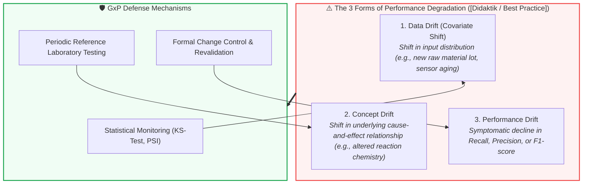

<!-- metadata source_file: docs/de/module_11_lifecycle_continuous_monitoring.md, sync_date: 2026-09-28 -->
# Module 11: Lifecycle Management and Continuous Monitoring

🌐 **[Deutsche Version](../de/module_11_lifecycle_continuous_monitoring.md)** &nbsp;|&nbsp; **[⬅ Module 10: Human Oversight / Human in the Loop](module_10_human_oversight_hitl.md) &nbsp;|&nbsp; [🏠 Table of Contents](00_overview.md) &nbsp;|&nbsp; [Module 12: Audit and Inspection Readiness ➔](module_12_audit_inspection_readiness.md)**

---

## 🎯 Learning Objectives & Guiding Questions
1. **The Illusion of Permanent Validation:** Why is go-live in machine learning systems not the finish line, but merely the start of ongoing validation maintenance?
2. **The 3 Drift Modalities ([Didaktik / Best Practice]):** How do *Data Drift*, *Concept Drift*, and *Performance Drift* differ, and why does Concept Drift pose the greatest existential threat to pharma manufacturing?
3. **Change Control & Re-Training:** Why does deploying updated model weights without formal revalidation trigger immediate forfeiture of qualified GMP status?
4. **Configuration Drift:** Why does informal manual tweaking of alarm thresholds at the shop floor constitute an unvalidated system deviation?
5. **Periodic Review & Retirement:** What macro-analyses does Annex 22 mandate during periodic evaluations, and how is controlled decommissioning executed?

---

## 🧭 Visualization: The 3 Dimensions of AI Drift

---

## 📌 Technical Summary (Key Takeaways)

### 1. The Illusion of Permanent Validation
Under classical Computer System Validation (CSV under Annex 11), a qualified system was assumed to stay validated indefinitely provided software code and server hardware remained untouched.
* **The AI Dilemma:** AI models age relative to their real-world operational environment (*The environment evolves, the model stays frozen in the past*).
* Sensor wear, changing raw material suppliers, natural bio-variability, and cleanroom microclimatic shifts cause progressive decoupling between training distributions and live shop-floor reality (*Silent Degradation*).
* Validation under Annex 22 is an **active, continuous lifecycle process**, intrinsically coupled to the site deviation and CAPA management system.

### 2. The Three Dimensions of AI Drift
Annex 22 and industry best practice delineate three distinct forms of performance deterioration:

| Drift Modality | Statutory / Industry Source | Pharma Manufacturing Example | Detection Methodology |
| :--- | :--- | :--- | :--- |
| **Input Drift (Input Sample Space)** | **[Draft §10.4]** | Systematic shift in input distributions. E.g., a temperature transmitter drifts by 0.3°C; an excipient supplier modifies raw material particle size distribution. | Univariate statistical tests per feature (e.g., Kolmogorov-Smirnov test, Population Stability Index - PSI; PSI > 0.2 indicates significant shift [Best Practice: ML Practice]) or multivariate distance metrics. |
| **Performance Monitoring** | **[Draft §10.3]** | Continuous tracking of model efficacy in production. E.g., increased false defect rates in tablet inspection; analysis of operator reviews ([Draft §10.5]). | Routine tracking of hit rates, confusion matrices, and qualified statistical sample verification. |
| **Concept Drift ([Best Practice: ML Practice])** | *Industry Expansion ([Best Practice])* | Shift in the underlying causal relationship between input features and target quality ($P(Y \mid X)$). E.g., new impeller geometry alters reaction kinetics while sensor readings appear normal. | Periodic comparison against verified physical laboratory reference assays (*Ground Truth Sampling*). |

> [!CAUTION]
> **Illustrative Operational Scenario (didactic case study, unverified):** A biologics manufacturer employed an AI model for predictive maintenance of bioreactor probe calibration. In month 1, an alternative supplier was contracted for raw cell culture nutrients. The new broth displayed subtle optical variations, triggering insidious drift. In month 4, two dissolved oxygen probes failed during active production runs because coarse alarm thresholds remained silent. The consequence: two batches dumped and a severe inspection deficiency letter.

### 3. Change Control & The Re-Training Lifecycle ([Draft §10.1])
Retraining an AI model with recent production data is not routine IT maintenance—it is a formal **Change Control process ([Draft §10.1])**:
* **The 4-Stage GxP Retraining Workflow:**
  1. **Trigger:** Expiration of a risk-based review interval or automated statistical drift alert ([Draft §10.3, §10.4]).
  2. **Controlled Retraining:** Offline model training conducted inside an isolated, version-controlled staging environment.
  3. **Formal Re-Qualification:** Rigorous statistical evaluation across a fresh, independent test dataset against pre-approved acceptance criteria ([Draft §4.2, §4.3, §6]).
  4. **Deployment & Release:** Formal sign-off by Quality Assurance (QA) followed by controlled production swap.
* **Prohibition of Uncontrolled Modifications ([Draft §10.1]):** Deploying retrained model parameters without formal Change Control and an executed qualification protocol represents a severe GMP violation.

### 4. Configuration Control: Protection Against Informal Adjustments ([Draft §10.2])
Operations teams frequently attempt to eliminate recurring alarms by manually adjusting decision thresholds directly on machine screens:
* **Regulatory Requirement ([Draft §10.2]):** A tested model must be placed under **configuration control** prior to routine operational use, and effective measures must be employed to detect unauthorized changes ([Draft §10.2]). Incorporating hyperparameters and threshold values follows recognized engineering standards ([Best Practice: ML Practice]).
* Every quantitative decision threshold forms an integral component of the qualified operating state. Unauthorized adjustments compromise configuration integrity.

### 5. Periodic Reviews & Controlled Decommissioning
* **Periodic Review ([Best Practice: ISPE GAMP]):** The interval for periodic system reviews should be **determined on a risk-based basis** (e.g., semi-annually or annually as established industry practice). Cumulative drift trends must be evaluated against the initial qualification baseline.
* **Validated Monitoring Infrastructure ([Best Practice: ISPE GAMP]):** Software pipelines calculating drift indices and raising alarms should be qualified under Annex 11 to prevent false alarms or undetected monitoring failures.
* **Controlled Decommissioning ([Best Practice: GxP Practice]):** Upon retirement, historical test documentation, test datasets, and qualification records must be retained similar to other GMP documentation ([Draft §7.4]); archiving code repositories across the operational lifecycle follows established GxP best practice ([Best Practice]).

---

## 💡 Key Terminology & Concepts (Glossary)

- **Input Drift ([Draft §10.4]):** Statistical divergence in input feature distributions over time without changes in target causality.
- **Performance Monitoring ([Draft §10.3]):** Ongoing tracking of operational accuracy, recall, and error rates during routine production.
- **Concept Drift ([Best Practice: ML Practice]):** Temporal shift in the underlying causal relationship between input features and target labels ($P(Y \mid X)$).
- **Population Stability Index (PSI):** A univariate statistical metric measuring divergence between operational feature distributions and baseline distributions (PSI > 0.2 indicating significant shift; [Best Practice: ML Practice]).
- **Configuration Control ([Draft §10.2]):** Technical and procedural discipline ensuring all parameters, thresholds, and software environments remain locked and audit-trailed.
- **Periodic Review:** Systematic, risk-based recurring evaluation of system performance against historical baselines.

---

## 📋 GxP-Compliance Checklist: Lifecycle & Monitoring

### Absolute Must-Haves:
- [ ] Is an automated monitoring framework active for input distributions ([Draft §10.4]) and model performance ([Draft §10.3])?
- [ ] Are statistical drift thresholds formally pre-defined and linked to site **Deviation and CAPA procedures**?
- [ ] Has the monitoring and alerting software pipeline been qualified under Annex 11 principles?
- [ ] Is model retraining governed by formal Change Control ([Draft §10.1]) and re-qualification protocols prior to release?
- [ ] Are decision thresholds maintained under strict **Configuration Control** ([Draft §10.2])?
- [ ] Are structured **Periodic Reviews** conducted at risk-based intervals comparing performance against the validation baseline?

### Inspection Red Flags:
- ❌ IT pushing updated model weights into production environments without QA involvement or revalidation protocols.
- ❌ Drift dashboards operating in isolated data science repositories disconnected from the pharmaceutical Quality Management System (QMS).
- ❌ Shop-floor operators adjusting decision boundaries directly on HMI screens to minimize nuisance alarms.
- ❌ Lack of a formal strategy for detecting *Concept Drift* (e.g., absence of recurring ground-truth physical lab assays).

---

🌐 **[Deutsche Version](../de/module_11_lifecycle_continuous_monitoring.md)** &nbsp;|&nbsp; **[⬅ Module 10: Human Oversight / Human in the Loop](module_10_human_oversight_hitl.md) &nbsp;|&nbsp; [🏠 Table of Contents](00_overview.md) &nbsp;|&nbsp; [Module 12: Audit and Inspection Readiness ➔](module_12_audit_inspection_readiness.md)**

