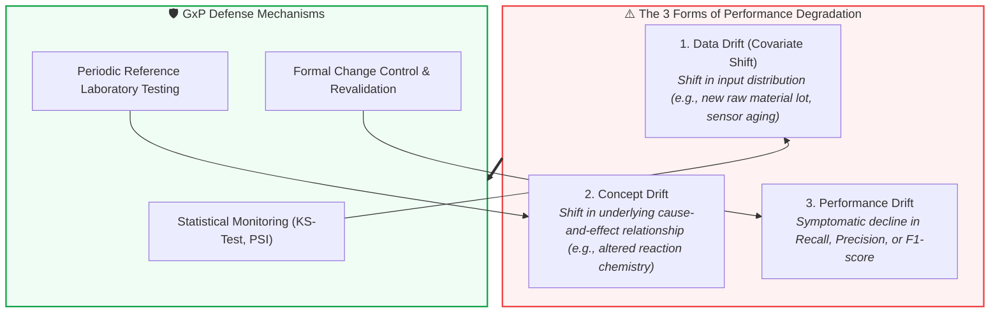

<!-- metadata source_file: docs/de/module_11_lifecycle_continuous_monitoring.md, sync_date: 2026-09-28 -->
# Module 11: Lifecycle Management and Continuous Monitoring

🌐 **[Deutsche Version](../de/module_11_lifecycle_continuous_monitoring.md)** &nbsp;|&nbsp; **[⬅ Module 10: Human Oversight / Human in the Loop](module_10_human_oversight_hitl.md) &nbsp;|&nbsp; [🏠 Table of Contents](00_overview.md) &nbsp;|&nbsp; [Module 12: Audit and Inspection Readiness ➔](module_12_audit_inspection_readiness.md)**

---

## 🎯 Learning Objectives & Guiding Questions
1. **The Illusion of Permanent Validation:** Why is go-live in machine learning systems not the finish line, but merely the start of ongoing validation maintenance?
2. **The 3 Drift Modalities:** How do *Data Drift*, *Concept Drift*, and *Performance Drift* differ, and why does Concept Drift pose the greatest existential threat to pharma manufacturing?
3. **Change Control & Re-Training:** Why does deploying updated model weights without formal revalidation trigger immediate forfeiture of qualified GMP status?
4. **Configuration Drift:** Why does informal manual tweaking of alarm thresholds at the shop floor constitute an unvalidated system deviation?
5. **Periodic Review & Retirement:** What macro-analyses does Annex 22 mandate during periodic evaluations, and how is controlled decommissioning executed?

---

## 🧭 Visualization: The 3 Dimensions of AI Drift

---

## 📌 Technical Summary (Key Takeaways)

### 1. The Illusion of Permanent Validation
Under classical Computer System Validation (CSV under Annex 11), a qualified system was assumed to stay validated indefinitely provided software code and server hardware remained untouched.
* **The AI Dilemma:** AI models age relative to their real-world operational environment (*The environment evolves, the model stays frozen in the past*).
* Sensor wear, changing raw material suppliers, natural bio-variability, and cleanroom microclimatic shifts cause progressive decoupling between training distributions and live shop-floor reality (*Silent Degradation*).
* Validation under Annex 22 is an **active, continuous lifecycle process**, intrinsically coupled to the site deviation and CAPA management system.

### 2. The Three Dimensions of AI Drift
Annex 22 delineates three distinct forms of performance deterioration:

| Drift Modality | Definition | Pharma Manufacturing Example | Detection Methodology |
| :--- | :--- | :--- | :--- |
| **Data Drift (Covariate Shift)** | The statistical distribution of input parameters ($P(X)$) shifts while the fundamental relationship to the output remains constant. | A temperature transmitter is recalibrated and measures systematically 0.3°C higher; an excipient vendor alters particle size distribution. | Multivariate statistical tests (e.g., Kolmogorov-Smirnov test, Population Stability Index - PSI). |
| **Concept Drift** | The foundational mathematical relationship between inputs and output targets ($P(Y \mid X)$) changes. Identical input values now lead to altered quality outcomes. | Modification of impeller geometry changes reaction kinetics. The model signals "optimal operating point," while product viscosity drops unobserved. | **Most dangerous drift:** Can only be caught through regular comparison against verified physical laboratory reference assays (*Ground Truth Sampling*). |
| **Performance Drift** | The measurable degradation in validation performance metrics (e.g., Recall dropping from 99.5% to 96%). | Increased false negative rates in automated visual vial inspection; spiking manual overrides by operators. | Real-time monitoring of confusion matrices and operator override rates (*Override Tracking*). |

> [!CAUTION]
> **Industry Case Study:** A biologics manufacturer employed an AI model for predictive maintenance of bioreactor probe calibration. In month 1, an alternative supplier was contracted for raw cell culture nutrients. The new broth displayed subtle optical variations, triggering insidious concept drift. In month 4, two dissolved oxygen probes failed during active production runs because coarse alarm thresholds remained silent. The consequence: two batches dumped and a severe inspection deficiency letter.

### 3. Change Control & The Re-Training Lifecycle
Retraining an AI model with recent production data is not routine IT maintenance—it is a **major pharmaceutical quality event**:
* **The 4-Stage GxP Retraining Workflow:**
  1. **Trigger:** Expiration of a validated calendar cadence or automated statistical drift alert.
  2. **Controlled Retraining:** Offline model training conducted inside an isolated, version-controlled staging environment.
  3. **Formal Revalidation:** Rigorous statistical evaluation across a fresh, unseen hold-out test dataset against the pre-approved *Metric Quad* (F1, Recall, Calibration, Robustness).
  4. **Deployment & Release:** Formal sign-off by Quality Assurance (QA) followed by controlled production swap.
* **The Prohibition of Shadow Patches:** Pushing newly trained model weights directly to live servers without an executed revalidation report leads to **instant loss of qualified GMP operational status**.

### 4. Configuration Drift: The Danger of Informal Adjustments
Operations teams frequently attempt to eliminate recurring alarms by manually adjusting decision thresholds or confidence cutoffs directly on machine screens:
* Every quantitative decision threshold forms an **integral component of the validated operating state**.
* Any ad-hoc adjustment without a formalized Change Control constitutes an illegal operating condition (*Operating an Unvalidated System*).

### 5. Periodic Reviews & Controlled Decommissioning
* **Periodic Review:** Critical GxP AI systems must undergo systematic reviews (e.g., semi-annually or annually). Cumulative drift trends must be evaluated against the original validation baseline.
* **Validated Monitoring Infrastructure:** Software pipelines responsible for calculating drift indices and raising alarms must themselves be **validated as computerized systems under Annex 11**. Unqualified monitoring scripts possess zero regulatory standing.
* **Controlled Retirement:** When retiring a model, historical model weights, training pipelines, and inference logs must be preserved in tamper-evident archives. QA must evaluate whether historical product disposition decisions remain valid under retrospective scrutiny.

---

## 💡 Key Terminology & Concepts (Glossary)

- **Data Drift (Covariate Shift):** Statistical divergence in input feature distributions ($P(X)$) over time without changes in target causality.
- **Concept Drift:** Temporal shift in the underlying causal relationship between input features and target labels ($P(Y \mid X)$).
- **Performance Drift:** Quantitative deterioration in predictive efficacy (Recall, Precision, Calibration) during routine operation.
- **Population Stability Index (PSI):** A statistical metric measuring the divergence between current operational feature distributions and baseline training distributions.
- **Configuration Drift:** The unauthorized, undocumented drift of parameters, thresholds, or filtering criteria away from the validated baseline.
- **Decommissioning / Retirement:** The formal, regulated retirement of an AI system ensuring long-term data preservation and retrospective risk assessment.

---

## 📋 GxP-Compliance Checklist: Lifecycle & Monitoring

### Absolute Must-Haves:
- [ ] Is an automated, continuous **drift monitoring framework** active for input distributions (Data Drift) and model accuracy (Performance Drift)?
- [ ] Are statistical drift thresholds formally pre-defined and directly connected to site **Deviation and CAPA procedures**?
- [ ] Has the monitoring and alerting software pipeline itself been **validated under Annex 11**?
- [ ] Is model retraining governed by mandatory, executed **formal revalidation protocols** prior to release?
- [ ] Are decision thresholds managed strictly under **formal Change Control**?
- [ ] Are structured **Periodic Reviews** conducted (e.g., semi-annually) comparing running performance against the validation baseline?

### Inspection Red Flags:
- ❌ IT pushing updated model weights into production environments without QA involvement or revalidation protocols.
- ❌ Drift dashboards operating in isolated data science repositories disconnected from the pharmaceutical Quality Management System (QMS).
- ❌ Shop-floor operators adjusting decision boundaries directly on HMI screens to minimize nuisance alarms.
- ❌ Lack of a formal strategy for detecting *Concept Drift* (e.g., absence of recurring ground-truth physical lab assays).

---

🌐 **[Deutsche Version](../de/module_11_lifecycle_continuous_monitoring.md)** &nbsp;|&nbsp; **[⬅ Module 10: Human Oversight / Human in the Loop](module_10_human_oversight_hitl.md) &nbsp;|&nbsp; [🏠 Table of Contents](00_overview.md) &nbsp;|&nbsp; [Module 12: Audit and Inspection Readiness ➔](module_12_audit_inspection_readiness.md)**

