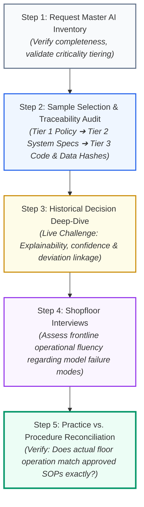

<!-- metadata source_file: docs/de/module_12_audit_inspection_readiness.md, sync_date: 2026-09-28 -->
# Module 12: Audit and Inspection Readiness

🌐 **[Deutsche Version](../de/module_12_audit_inspection_readiness.md)** &nbsp;|&nbsp; **[⬅ Module 11: Lifecycle Management and Continuous Monitoring](module_11_lifecycle_continuous_monitoring.md) &nbsp;|&nbsp; [🏠 Table of Contents](00_overview.md)**

---

## 🎯 Learning Objectives & Guiding Questions
1. **The Discipline Postulate:** Why can an organization never "cram at the last minute" for an Annex 22 regulatory health inspection?
2. **The 5-Step Inspection Pathway:** In what precise, methodical sequence do EMA, FDA, and national competent authority inspectors audit pharmaceutical AI systems?
3. **The Master AI Inventory:** Why is the inventory the first line of defense, and why does "Shadow AI" trigger immediate regulatory enforcement?
4. **Surviving the Audit Room:** How do technical teams defend a specific historical inference prediction professionally, and why is transparent admission of knowledge gaps superior to guessing?
5. **Cross-Functional Unity:** How do organizations prevent Data Science, IT, and QA from contradicting one another in front of auditors?

---

## 🧭 Visualization: The Regulatory 5-Step Inspection Pathway

---

## 📌 Technical Summary (Key Takeaways)

### 1. Foundational Law: Inspection Readiness is Daily Routine
Organizations cannot prepare for an Annex 22 inspection by scrambling to assemble binders two weeks prior:
* Attempting to reconstruct data provenance, random seeds, bias analyses, and drift indices after the fact is guaranteed to fail under scrutiny.
* True inspection readiness stems from **consistently executed engineering and QMS discipline** across every day of the system lifecycle.

### 2. Regulatory Deficiency Severity Grading
* **Critical Finding:** Immediate, unacceptable risk to patient safety, public health, or drug product quality (e.g., deploying an unvalidated, dynamically auto-retraining model for batch release). *Legal Outcome:* Immediate suspension or revocation of manufacturing authorization (*Suspension of Manufacturing Authorization*).
* **Major Finding:** Significant deviation from GMP requirements (e.g., shadow AI discovered in production, retraining without formal revalidation, unverified data lineage). *Legal Outcome:* Regulatory Warning Letter; mandatory 15-to-30 day deadline to submit a corrective remediation plan.
* **Minor Finding:** Isolated procedural or documentation weaknesses with no direct impact on product quality; remediated through routine site CAPA workflows.

### 3. The 3-Tier Documentation Hierarchy
Inspectors systematically drill from policy governance down to machine-level artifacts:
* **Tier 1 (Organizational Governance):** Corporate AI Quality Policy, Data Ethics Framework, SOPs for AI Validation, and Change Control.
* **Tier 2 (System-Specific Documentation):** *Master AI Inventory*, Intended Use Specification, User Requirements (URS), Validation Plan & Report (incorporating the *Metric Quad*), and Model Cards.
* **Tier 3 (Granular Technical Evidence):** Training dataset cryptographic hashes, Git repository commit hashes, MLOps orchestration runs (MLflow/Kubeflow), fixed random seeds, confusion matrices, calibration plots, and persistent inference audit trails.

### 4. The Master AI Inventory as the Primary Shield
An inspector's opening request during an AI audit is universally predictable: **"Provide your comprehensive Master AI Inventory."**
Every entry must contain:
1. Unique System Identifier and deployed version hash
2. Succinct statement of *Intended Use* and operational boundaries
3. Regulatory criticality classification (Annex 22 / Annex 11 tiering)
4. Designated Business and Technical System Owners (QA / IT / Operations)
5. Current validation and drift monitoring status

> [!CAUTION]
> **Industry Case Study: The Shadow AI Collapse:** An engineering team built an internal pilot tool to assist in pre-screening patient leaflet artwork. Because the utility was fast and accurate, operators silently embedded it into daily batch release verification for over six months—unbeknownst to QA. During a routine regulatory inspection, a technician casually praised the tool. Because the system was absent from the *Master AI Inventory*, no qualification protocols, validation records, or change tickets existed. The result: An immediate *Major Finding* for governance failure and an order to halt operations.

### 5. Surviving the Inspection Room
When auditors challenge a historical algorithmic prediction:
* **No Speculation:** Never improvise answers to project perceived confidence. Stating: *"That is a specific technical configuration parameter; let me retrieve the exact audit trail record and present the verified value"* demonstrates robust, professional governance. False speculation that is subsequently disproven fatally damages site credibility.
* **Managing Historical Model Errors:** Validated AI systems occasionally make erroneous predictions. If a model misclassified an instance in production, this is **not a GMP deficiency** provided the site demonstrates:
  1. The error was caught and stopped by the *Human-in-the-Loop* safeguard.
  2. The occurrence was logged as an official deviation.
  3. Appropriate CAPA investigation confirmed the failure mode was within expected statistical error bounds.
* **United Front (Interdisciplinary Alignment):** Data Science, Validation, IT, and Quality Assurance must undergo cross-functional **Mock Inspections**. If data scientists and QA managers argue or contradict each other over technical terminology in front of regulators, the audit trajectory deteriorates rapidly.

---

## 💡 Key Terminology & Concepts (Glossary)

- **Inspection Readiness:** A perpetual state of procedural, technical, and documentary preparedness enabling instant demonstration of GxP compliance to health authorities.
- **Master AI Inventory:** The centralized, legally binding directory detailing all deployed or trialed AI/ML assets across the enterprise, including scope and qualification status.
- **Shadow AI:** The informal, unauthorized operational deployment of AI models or scripts within GxP boundaries without QA approval or inventory registration.
- **Mock Inspection:** A realistic regulatory simulation conducted under audit conditions with external/internal inspectors to expose documentation gaps and communication weaknesses.
- **Drill-Down Capability:** The technical capability of teams and systems to navigate seamlessly from aggregate executive KPIs down to raw underlying records and code commits.
- **Portfolio-Wide CAPA:** The proactive remediation practice of applying lessons learned from a defect in one AI model across all other models operated enterprise-wide.

---

## 📋 GxP-Compliance Checklist: Inspection Readiness

### Absolute Must-Haves:
- [ ] Is a comprehensive, actively maintained **Master AI Inventory** available covering all active, trialed, and retired AI systems?
- [ ] Does every production model have a formally approved, standardized **Model Card**?
- [ ] Can low-level technical artifacts (Git commits, DVC data hashes, container images, seeds) be retrieved within minutes (*Fast Retrieval*)?
- [ ] Are interdisciplinary **Mock Inspections** conducted regularly with active participation from Data Science, IT, and QA?
- [ ] Has shop-floor personnel been trained on the specific operational boundaries and known blind spots of deployed models (*Shopfloor Fluency*)?
- [ ] Are historical algorithmic misclassifications linked to documented deviations and CAPAs?

### Inspection Red Flags:
- ❌ Discovery of "Shadow AI" utilities active in production without QA oversight or inventory registration.
- ❌ Documentation drift where operational practice diverges from approved SOPs.
- ❌ IT, Data Science, and QA offering contradictory definitions or explanations during inspector interviews.
- ❌ Technical teams unable to locate exact raw datasets or code versions corresponding to a specific past batch release.

---

🌐 **[Deutsche Version](../de/module_12_audit_inspection_readiness.md)** &nbsp;|&nbsp; **[⬅ Module 11: Lifecycle Management and Continuous Monitoring](module_11_lifecycle_continuous_monitoring.md) &nbsp;|&nbsp; [🏠 Table of Contents](00_overview.md)**

