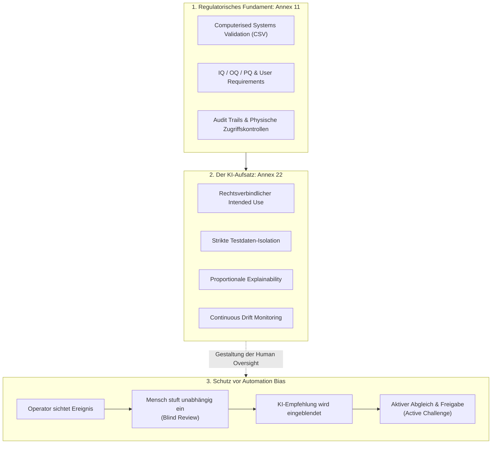

# Modul 02: Overview of Annex 22

**[⬅ Modul 01: Intro to AI in GxP](module_01_introduction_ai_gxp.md)** &nbsp;|&nbsp; **[🏠 Inhaltsverzeichnis](annex22_regulatory_framework.md)** &nbsp;|&nbsp; **[Modul 03: Scope and Applicability ➔](module_03_scope_applicability.md)**

---

## 🧭 Kernkonzept im Überblick: Koexistenz & Automation Bias Schutz

---

## 🎯 Lernziele & Leitfragen
1. **Warum wurde Annex 22 geschaffen und wie verhält er sich zu Annex 11?**
2. **Wie grenzt Annex 22 den GxP-Scope ab (direkte vs. indirekte Entscheidungen)?**
3. **Welche regulatorische Haltung nimmt Annex 22 gegenüber Static AI, Dynamic AI und Generative AI ein?**
4. **Was ist Automation Bias und wie muss Human Oversight gestaltet sein?**
5. **Wie sieht die 5-stufige Implementierungs-Roadmap für pharmazeutische Betriebe aus?**

---

## 📌 Fachliche Zusammenfassung (Key Takeaways)

### 1. Entstehung und Harmonisierung mit EU-Recht
- **Ausgangslage:** Traditionelle CSV (Computerised Systems Validation) testet Systeme, die exakt tun, was programmiert wurde. Lernende Algorithmen sprengten dieses Konzept.
- **Entwicklung:** EMA und PIC/S orientierten sich an der realen Machine-Learning-Literatur, um praxisgerechte und technisch machbare Anforderungen zu schaffen.
- **Harmonisierung:** Annex 22 ist so konzipiert, dass er nahtlos neben dem **EU AI Act**, der **DSGVO (GDPR)** und der **Medical Device Regulation (MDR)** steht, um regulatorische Widersprüche im EU-Binnenmarkt zu vermeiden.

### 2. Annex 11 vs. Annex 22 (Koexistenz statt Ersatz)
- **Annex 22 ersetzt Annex 11 NICHT!**
- **Annex 11 bleibt das Fundament:** IQ/OQ-Strukturen, Audit Trails, Zugriffskontrollen, deterministische Basisvalidierung bleiben unverändert unter Annex 11.
- **Annex 22 setzt oben auf:** Für lernende Algorithmen verlangt Annex 22 zwingend zusätzliche Disziplinen:
  - Verbindliche *Intended Use Specification*,
  - Strikt isolierte, unabhängige Testdatensätze (*Independent Test Sets*),
  - Risikoproportionale *Explainability*,
  - Kontinuierliches Lebenszyklus-Monitoring gegen *Model Drift*.

### 3. Was ist „In Scope“ und was ist „Out of Scope“?
- **In Scope (Reguliert):**
  - Direkte GMP-Entscheidungen: Automatische Chargenfreigabe (*Batch Release*), Prozesskontrolle.
  - Abweichungstriagierung (*Deviation Triage*).
  - Indirekte GMP-Entscheidungen: KI-gestützte Peak-Integration im Qualitätskontrolllabor (QC), KI-Bedarfsprognosen, die Produktverfügbarkeit oder Haltbarkeit beeinflussen.
- **Out of Scope (Nicht unter Annex 22):**
  - Reine Grundlagenforschung (*Discovery/Early Research* ohne GMP-Bezug),
  - Administrative HR-Systeme (z.B. CV-Screening),
  - Konventionelle, rein regelbasierte Algorithmen (bleiben rein unter Annex 11).

### 4. Das Modell-Trio: Static, Dynamic und Generative AI
- **Static AI (Vom Regulator stark favorisiert):**
  - Modellgewichte werden nach der Validierung eingefroren (*Frozen Weights*).
  - Deterministisches, reproduzierbares Verhalten über die gesamte Laufzeit. Änderungen nur über formales Change Control.
- **Dynamic AI (Stark reglementiert / Ausgeschlossen):**
  - Modelle, die im laufenden Betrieb aus Betriebsdaten kontinuierlich weiterlernen.
  - *Problem:* Jede Charge könnte de facto von einem leicht veränderten Modell verarbeitet werden. Für kritische GMP-Entscheidungen praktisch ausgeschlossen; nur mit extrem hohem Governance- und Überwachungsaufwand denkbar.
- **Generative AI & LLMs (Extreme Vorsicht):**
  - Anfällig für stochastische Variabilität und „Halluzinationen“ (*Confabulation*).
  - **Verboten für:** Kritische Entscheidungen wie Chargenfreigabe oder Spezifikationsfestlegungen.
  - **Erlaubt für:** Assistive Hilfstätigkeiten (Zusammenfassen langer Dokumente, Rohentwürfe für SOPs), sofern strenge menschliche Überprüfung und finale Freigabe durch qualifiziertes Personal erfolgen.

### 5. Das Phänomen „Automation Bias“ & Human Oversight
- **Fallbeispiel:** Ein QA-Team nutzte NLP zur Abweichungstriagierung. Prüfer klickten Vorschläge der KI nach kurzer Zeit nur noch blind ab (*Perfunctory Review* / Rubber-Stamping).
- **Lösung:** Neugestaltung des Workflows! Der Mensch muss die Abweichung **zuerst unabhängig einstufen**, bevor die KI-Empfehlung eingeblendet wird (*Active Challenge*).

### 6. Die 5-stufige Implementierungs-Roadmap
1. **Stage 1 (Governance):** Etablierung eines KI-Governance-Frameworks im bestehenden QMS.
2. **Stage 2 (Inventory):** Aufbau eines lebenden KI-Inventars mit Kritikalitätsklassifizierung.
3. **Stage 3 (Gap Triage):** Identifikation und Behebung von Validierungslücken bei Hochrisikosystemen.
4. **Stage 4 (Cross-Functional Literacy):** Abbau von Silos zwischen IT, Data Science und QA.
5. **Stage 5 (Lifecycle Discipline):** Verankerung von kontinuierlichem Drift-Monitoring und Change Control.

---

## 💡 Zentrale Fachbegriffe & Konzepte (Glossar)

| Begriff | Definition & Annex-22-Bedeutung |
| :--- | :--- |
| **Automation Bias** | Die menschliche Neigung, automatisierte Systemvorschläge unkritisch zu akzeptieren und manuelle Prüfungen zu vernachlässigen. |
| **Independent Test Data** | Validierungsdaten, die strikt vom Training isoliert waren (keine Data Leakage), um echte Generalisierbarkeit zu belegen. |
| **Model Drift** | Die langsame Entfremdung der Modellperformance von der ursprünglichen Validierungsgrundlage durch veränderte Realbedingungen. |
| **Perfunctory Review** | Oberflächliches „Checkbox-Abnicken“ von KI-Vorschlägen ohne inhaltliche Prüfung – aus Auditsicht nicht defensibel. |
| **AI Inventory** | Zentrales, audit-relevantes Verzeichnis aller im Unternehmen eingesetzten KI-Systeme inkl. Scope, Risikostufe und Status. |

---

## 📋 GxP-Compliance Checklist & Kontrollfragen

- [ ] Wurde geklärt, welche Systeme unter **Annex 11** (deterministisch) und welche zusätzlich unter **Annex 22** (lernend) fallen?
- [ ] Werden indirekte Einflüsse auf GMP-Aufzeichnungen (z.B. QC-Peak-Integration) im Scope berücksichtigt?
- [ ] Sind alle kritischen Produktionsmodelle als **statische Modelle (frozen weights)** aufgesetzt?
- [ ] Ist der Einsatz von **LLMs/GenAI** auf assistive, unkritische Aufgaben beschränkt?
- [ ] Verhindern die Arbeitsabläufe aktiv einen **Automation Bias** bei den Reviewern?
- [ ] Existiert ein offizielles, gepflegtes **AI-Inventar** für Audits?

---

**[⬅ Modul 01: Intro to AI in GxP](module_01_introduction_ai_gxp.md)** &nbsp;|&nbsp; **[🏠 Inhaltsverzeichnis](annex22_regulatory_framework.md)** &nbsp;|&nbsp; **[Modul 03: Scope and Applicability ➔](module_03_scope_applicability.md)**

