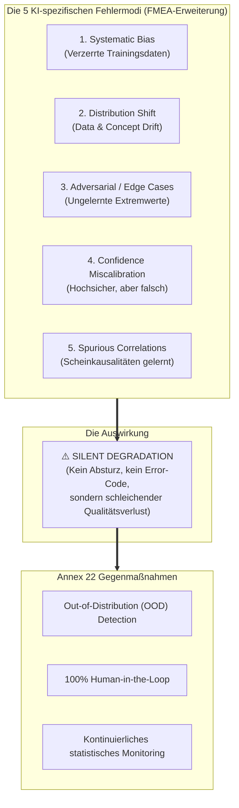

# Modul 04: Risk Based Approach to AI

**[⬅ Modul 03: Scope and Applicability](module_03_scope_applicability.md)** &nbsp;|&nbsp; **[🏠 Inhaltsverzeichnis](annex22_regulatory_framework.md)** &nbsp;|&nbsp; **[Modul 05: Intended Use and Model Definition ➔](module_05_intended_use_model_definition.md)**

---

## 🧭 Kernkonzept im Überblick: Die 5 KI-Fehlermodi & Silent Degradation

---

## 🎯 Lernziele & Leitfragen
1. **Warum ist eine „Gleichbehandlung aller KI-Systeme“ (*Flat Governance*) regulatorisch und operativ gefährlich?**
2. **Wie unterscheidet sich das Versagen von KI fundamental von traditioneller Software?**
3. **Welche 5 KI-spezifischen Fehlermodi müssen in der Risikoanalyse zwingend adressiert werden?**
4. **Wie wirkt sich die Reversibilität und die kumulative Wirkung auf die Risikoeinstufung aus?**
5. **Wie unterscheidet sich Human-in-the-Loop (HITL) von Human-on-the-Loop (HOTL)?**

---

## 📌 Fachliche Zusammenfassung (Key Takeaways)

### 1. Das Proportionalitätsgebot (*Proportionality Mandate*)
- **Die Gefahr flacher Governance:** Wer versucht, ein einfaches Backoffice-KI-Tool mit der gleichen bürokratischen Tiefe zu validieren wie ein System zur Chargenfreigabe, betreibt reines *Compliance Theater*.
- **Ressourcenallokation:** QA- und Validierungsressourcen sind begrenzt. Annex 22 fordert zwingend, dass Validierungstiefe, Monitoring-Frequenz und Kontrollintensität **linear mit dem Risiko für Patientensicherheit und Produktqualität skalieren**.

### 2. Wie KI versagt: Stille Degradierung statt Systemabsturz
- **Traditionelle Software:** Binäres Fehlermuster – Software stürzt ab, wirft einen Error-Code oder bricht den Prozess ab.
- **KI-Systeme:** Erleiden eine **schleichende, stille Leistungsverschlechterung (*Silent Degradation*)**. Das Modell stürzt nicht ab, sondern liefert weiterhin Antworten – oft sogar mit trügerisch hoher mathematischer Konfidenz (*Confidence Miscalibration*).

### 3. Die 5 KI-spezifischen Fehlermodi für FMEA / Risikobewertungen
Herkömmliche IT-Risikovorlagen reichen für Annex 22 nicht aus. Ein Inspektor erwartet die explizite Bewertung von:
1. **Systematic Bias:** Trainingsdaten spiegeln nicht alle realen Betriebszustände wider, was zu systematisch verzerrten Ausgaben führt.
2. **Distribution Shift:** Die reale Prozess- oder Datenverteilung weicht im Laufe der Zeit von den Trainingsdaten ab.
3. **Adversarial / Edge Inputs:** Ungewöhnliche, seltene Eingangskombinationen, für die das Modell keine Repräsentanz besitzt.
4. **Confidence Miscalibration:** Das Modell trifft eine völlig falsche Vorhersage, gibt aber eine Konfidenz von z.B. 99% an.
5. **Spurious Correlations:** Scheinzusammenhänge (z.B. Beleuchtung korreliert zufällig mit Fehlerrate), die das Modell als Kausalität gelernt hat, machen es im Realbetrieb extrem fragil.

### 4. Patientenauswirkung & der Hebel der Reversibilität
- **Direkter Einfluss:** Freigabe von nicht-spezifikationskonformen Arzneimitteln (höchste Kritikalität).
- **Kumulativer Einfluss:** Ein winziges Restrisiko bei einer Einzelentscheidung summiert sich bei tausenden automatisierten Entscheidungen pro Tag zu einem untragbaren Gesamtrisiko für Patienten.
- **Reversibilität als Hebel:**
  - *In-Process:* Ein Fehler in frühen Prozessschritten, der durch nachgelagerte Inprozesskontrollen sicher erkannt und korrigiert werden kann, erlaubt schlankere Kontrollmechanismen.
  - *Batch Release:* Eine falsche Chargenfreigabe ist nach Auslieferung praktisch **irreversibel**.
- **Out-of-Distribution (OOD) Detection:** Ein integrierter Sicherheitsmechanismus, bei dem die KI selbst erkennt: *„Diesen Datenpunkt kenne ich nicht – ich verweigere die Entscheidung und eskaliere an einen Menschen.“*

### 5. Skalierung der Governance: HITL vs. HOTL

| Dimension | High-Risk System | Moderate-Risk System |
| :--- | :--- | :--- |
| **Validierung** | Tiefgehende Adversarial-Tests, Randfallprüfungen, strikte Akzeptanzkriterien | Repräsentative Test-Sets, Fokus auf Hauptszenarien |
| **Monitoring** | Echtzeit-Monitoring mit statistischer Drift-Erkennung | Periodische Überprüfung (z.B. pro Charge oder wöchentlich) |
| **Menschliche Kontrolle** | **Human-in-the-Loop (HITL):** Jede einzelne Ausgabe wird vor Wirksamkeit von einem Menschen geprüft. | **Human-on-the-Loop (HOTL):** Mensch überwacht aggregierte Trends und greift bei Anomalien ein. |

### 6. Lehren aus realen Fallbeispielen
- **Bioreaktor-pH-Steuerung (Operational Atrophy):** Der manuelle Fallback-Regler existierte jahrelang nur auf dem Papier. Als QA dies prüfte, stellte sich heraus: Die Operatoren hatten verlernt, den Kessel manuell zu steuern! **Lösung:** Pflicht zu regelmäßigen manuellen Notfallübungen (*Fallback Drills*).
- **Abweichungs-Triage (Cascading Bias):** Eine fehlerhafte Ersteinstufung durch KI verfälscht die Ursachenanalyse und CAPA-Wirksamkeit der gesamten Qualitätsorganisation.
- **GenAI für Berichte (Cognitive Anchoring):** Eloquent formulierte KI-Texte verleiten Menschen dazu, dem Narrativ unkritisch zu glauben. **Lösung:** Automatisches Audit-Tracking von Korrekturen durch den Reviewer.

---

## 💡 Zentrale Fachbegriffe & Konzepte (Glossar)

| Begriff | Definition & Annex-22-Bedeutung |
| :--- | :--- |
| **Confidence Miscalibration** | Diskrepanz zwischen vorhergesagter Wahrscheinlichkeit des Modells und der tatsächlichen Richtigkeit. |
| **Out-of-Distribution (OOD)** | Datenpunkte, die außerhalb der mathematischen Verteilung der Trainingsdaten liegen. |
| **Spurious Correlation** | Statistisch messbare, aber inhaltlich bedeutungslose Koinzidenzen in den Trainingsdaten. |
| **Cognitive Anchoring** | Psychologische Fixierung eines menschlichen Prüfers auf einen vorformulierten KI-Lösungsvorschlag. |
| **Operational Atrophy** | Der schleichende Verlust manueller Fachkompetenz bei Bedienpersonal durch übermäßiges Vertrauen in Automatisierung. |

---

## 📋 GxP-Compliance Checklist & Kontrollfragen

- [ ] Wurden die 5 KI-spezifischen Fehlermodi in der Risikoanalyse nach ICH Q9 dokumentiert?
- [ ] Wurde das kumulative Risiko bei hochfrequenten Entscheidungen quantifiziert?
- [ ] Wurde geklärt, ob Fehlentscheidungen im weiteren Prozessverlauf reversibel sind?
- [ ] Besitzt das System eine Erkennung für ungelernte Randfälle (*OOD Detection*)?
- [ ] Werden manuelle Fallback-Szenarien regelmäßig in der Praxis geübt?
- [ ] Werden Reviewer gegen *Cognitive Anchoring* und *Automation Bias* geschult?

---

**[⬅ Modul 03: Scope and Applicability](module_03_scope_applicability.md)** &nbsp;|&nbsp; **[🏠 Inhaltsverzeichnis](annex22_regulatory_framework.md)** &nbsp;|&nbsp; **[Modul 05: Intended Use and Model Definition ➔](module_05_intended_use_model_definition.md)**

