# Modul 07: AI Model Development and Training

**[⬅ Modul 06: Data Governance and Data Quality](module_06_data_governance_quality.md) &nbsp;|&nbsp; [🏠 Inhaltsverzeichnis](00_overview.md) &nbsp;|&nbsp; [Modul 08: Validation and Performance Testing ➔](module_08_validation_performance_testing.md)**

---

## 🎯 Lernziele & Leitfragen
1. **Der Paradigmenwechsel:** Wie wandelt sich experimentelle Data Science (Geschwindigkeit, Benchmark-Jagd) in regulatorisch kontrolliertes GMP-Engineering?
2. **Die Reproduzierbarkeits-Pflicht:** Was bedeutet deterministische Rekonstruierbarkeit in stochastischen Lernverfahren und warum müssen Random Seeds und Library-Snapshots archiviert werden?
3. **MLOps als GxP-Infrastruktur:** Warum unterliegen Plattformen wie MLflow, SageMaker, Azure ML oder DVC der Validierungspflicht nach **EU GMP Annex 11**?
4. **Hyperparameter-Disziplin:** Warum ist das Bauchgefühl von Entwicklern kein Audit-Nachweis und weshalb dürfen Hyperparameter niemals auf dem Testdatensatz getunt werden?
5. **Model Calibration & Model Cards:** Warum führt eine unkalibrierte KI zu gefährlichem *Automation Bias* und wie standardisieren *Model Cards* den Inspektionsnachweis?

---

## 🧭 Visualisierung: Vom Ad-hoc-Experiment zum GxP-Modell

```mermaid
flowchart LR
    subgraph DataScience["❌ Konventionelle Data Science"]
        direction TB
        DS1["Fokus: Benchmark-Accuracy"]
        DS2["Ad-hoc Scripting & Jupyter"]
        DS3["Hyperparameter per Bauchgefühl"]
        DS4["Flüchtige Umgebungen"]
    end

    subgraph Annex22["✅ Annex 22 GMP Engineering"]
        direction TB
        G1["Fokus: Trustworthiness & Kalibrierung"]
        G2["Validierte MLOps Pipeline (Annex 11)"]
        G3["Systematische Hyperparameter-Suche"]
        G4["Reproduzierbar: Git + DVC + Fixed Seeds"]
        G5["Frozen Weights & Standardized Model Card"]
    end

    DataScience ==>|Paradigmenwechsel| Annex22

    style DataScience fill:#fef2f2,stroke:#ef4444,stroke-width:2px
    style Annex22 fill:#f0fdf4,stroke:#16a34a,stroke-width:2px
```

---

## 📌 Fachliche Zusammenfassung (Key Takeaways)

### 1. Der Paradigmenwechsel: Engineering Trust vs. Benchmark Speed
In der akademischen und kommerziellen Datenwissenschaft steht die maximale Vorhersagegenauigkeit (*Predictive Accuracy*) bei schneller Experimentiergeschwindigkeit im Vordergrund. 

Unter **EU GMP Annex 22** kollidiert dieser Ansatz frontal mit den pharmazeutischen Qualitätsprinzipien:
* **Entwicklungsdisziplin bestimmt Modellverhalten:** Nachgelagerte Validierungs- oder Monitoring-Mechanismen können ein Modell nicht heilen, das ohne saubere Ingenieursdisziplin trainiert wurde.
* **Zielgröße:** Optimiert wird nicht auf einen einmaligen Benchmark-Rekord, sondern auf **langfristige Zuverlässigkeit (Trustworthiness), Robustheit an Entscheidungsgrenzen und Audit-Fähigkeit**.
* Ein nachträgliches „Drüberstülpen“ von GxP-Disziplin über explorativen Entwicklungs-Code ist extrem teuer und scheitert in Inspektionen fast ausnahmslos.

### 2. Das Gebot der absoluten Reproduzierbarkeit (Reproducibility Mandate)
Die fundamentale Säule von Annex 22 ist die **deterministische Reproduzierbarkeit**:
> **Definition:** Bei exakt denselben Trainingsdaten, demselben Code und derselben Konfiguration muss exakt dasselbe Modell mit denselben Parametern (Gewichten) und Vorhersagen entstehen.

Tritt später im Routinebetrieb eine Qualitätsabweichung (*OOS/Deviation*) oder eine Kundenreklamation auf, muss das pharmazeutische Unternehmen in der Lage sein, die Entstehung des historischen Modells bitgenau zu rekonstruieren:
* **Code:** Festgehalten über unveränderliche Git-Commit-Hashes.
* **Daten:** Revisionssicher archiviert über Datenversionierungs-Tools (z.B. DVC-Hashes).
* **Laufzeitumgebung:** Gepinnt bis auf die Betriebssystem- und Sub-Library-Ebene (Container-Images wie Docker, `requirements.txt` mit festen Versionen).
* **Zufallssaatgüter (Random Seeds):** Da viele Optimierungs- und Initialisierungsalgorithmen pseudozufällig arbeiten, müssen alle **Random Seeds zwingend explizit im Code fixiert** und dokumentiert werden.

> [!CAUTION]
> **Praxisfall:** Ein Unternehmen konnte im Rahmen einer Reklamationsuntersuchung die Entscheidung eines Modells für eine bestimmte Charge nicht aufklären, da Software-Bibliotheken zwischenzeitlich aktualisiert worden waren und die Random Seeds nicht protokolliert wurden. Die Unfähigkeit, das Modell historisch nachzubauen, führte zu einer schweren behördlichen Mängelrüge (*Major Inspection Finding*).

### 3. MLOps-Plattformen als validierungspflichtige GxP-Infrastruktur
Data-Science-Teams nutzen heute standardmäßig Plattformen wie MLflow, Weights & Biases, DVC, AWS SageMaker oder Azure ML.
* **Regulatorische Konsequenz:** Werden diese Tools zur Entwicklung, Protokollierung oder Versionierung von Modellen genutzt, die pharmazeutische Entscheidungen beeinflussen, gelten sie als **Computerised Systems**.
* Sie unterliegen damit vollumfänglich der Qualifizierungs- und Validierungspflicht nach **EU GMP Annex 11** (Zugriffskontrollen, Audit Trails, Datensicherheit, Desaster Recovery).

### 4. Hyperparameter-Tuning & Die goldene Validierungsregel
Hyperparameter (z.B. Lernrate, Baumtiefe, Regularisierungsfaktoren, Epochenanzahl) steuern die mathematische Konvergenz des Modells:
* **Change Control Status:** Die final ausgewählten Hyperparameter sind fester Bestandteil der formalen Modell-Spezifikation. Nachträgliches Ändern ohne formalen Change-Control-Prozess ist ein GMP-Verstoß.
* **Die goldene Regel:** Hyperparameter dürfen **ausschließlich auf dem Validierungsdatensatz** optimiert werden – **niemals auf dem finalen Testdatensatz (Hold-out Test Set)**! Andernfalls „lernt das Modell die Prüfungsfragen der Abschlussprüfung“ (*Data Leakage*), was zu Scheinvalidierungen führt.
* **Dokumentierte Suchmethodik:** Ob Grid Search, Random Search oder Bayesian Optimization: Der Entwickler muss die gewählten Suchintervalle und die Abbruchkriterien schriftlich begründen. „Ich habe diesen Wert genommen, weil er sich richtig anfühlte“ wird von Inspektoren sofort verworfen.

### 5. Modellkalibrierung & Model Cards
* **Calibration vs. Accuracy:** Ein Modell kann zu 85% akkurat sein, aber bei Vorhersagen eine Konfidenz von 99,9% ausgeben. Diese **Überkonfidenz (Overconfidence)** ist im GMP-Umfeld lebensgefährlich, weil sie menschliche Prüfer dazu verleitet, fehlerhafte Vorhersagen ungeprüft durchzuwinken (*Automation Bias*). Modelle müssen daher kalibriert werden (z.B. via Platt Scaling oder Isotonic Regression).
* **Model Cards als Goldstandard:** Zur Standardisierung der Dokumentation fordert die Best Practice den Einsatz von **Model Cards**. Dieses standardisierte Dokument fasst zusammen:
  - *Intended Use* und autorisierte Einsatzgrenzen,
  - Trainingsdaten-Zusammensetzung und Version,
  - Performance- und Kalibrierungsmetriken,
  - Bekannte Limitierungen, systematische Schwächen und Out-of-Scope-Bedingungen.

---

## 💡 Zentrale Fachbegriffe & Konzepte (Glossar)

- **Reproducibility (Reproduzierbarkeit):** Die mathematische Fähigkeit, ein Modell unter identischen Eingangsbedingungen (Daten, Code, Seeds, Libraries) exakt identisch neu zu erschaffen.
- **Frozen Weights (Statische Modellgewichte):** Der nach Abschluss des Trainings eingefrorene Zustand der Modellparameter, der im GMP-Betrieb strikt unveränderlich bleibt.
- **Random Seed:** Ein numerischer Startwert für Pseudozufallszahlengeneratoren, der stochastische Berechnungen (z.B. Gewichtsinitialisierung, Mini-Batch-Shuffling) exakt wiederholbar macht.
- **Model Card:** Ein standardisiertes Dokumentationsartefakt (analog zu einem technischen Datenblatt), das Zweck, Leistung, Grenzen und Risiken eines KI-Modells für Inspektoren transparent macht.
- **Model Calibration (Modellkalibrierung):** Der Abgleich zwischen vorhergesagter Wahrscheinlichkeit (Konfidenz) und tatsächlicher Trefferquote (z.B. muss ein Ereignis mit 80% Konfidenz in 8 von 10 Fällen zutreffen).
- **Hyperparameter Optimization (HPO):** Systematischer, dokumentierter Prozess (z.B. Bayesian Optimization) zur Bestimmung der optimalen Modellkonfiguration ohne Verunreinigung des Testdatensatzes.

---

## 📋 GxP-Compliance Checklist: Model Development

### Absolute Must-Haves:
- [ ] Werden Code, Daten (Hash), Umgebung (Container) und **Random Seeds** für jeden Trainingslauf lückenlos versioniert?
- [ ] Sind genutzte MLOps-Plattformen (MLflow, Cloud ML Pipelines) als computergestützte Systeme nach **Annex 11 validiert**?
- [ ] Wurde das Hyperparameter-Tuning nachweislich strikt auf Validierungsdaten beschränkt und der Testdatensatz unberührt gelassen?
- [ ] Existiert ein schriftlicher Rationale-Bericht für den Suchraum und die Auswahl der finalen Hyperparameter?
- [ ] Wurde die statistische **Kalibrierung (Calibration Curve)** der Konfidenzscores verifiziert, um Overconfidence zu verhindern?
- [ ] Liegt für das Modell eine genehmigte, vollständige **Model Card** vor der Übernahme in die Validierungsphase vor?

### Rote Flaggen bei Inspektionen (Red Flags):
- ❌ Modellgewichte wurden in interaktiven Jupyter Notebooks erzeugt, ohne dass ein automatisierter, versionierter Pipeline-Lauf existiert.
- ❌ Keine Angabe oder Protokollierung von Random Seeds im Code („Ergebnis variiert bei jedem erneuten Ausführen minimal“).
- ❌ Hyperparameter wurden auf Basis des finalen Testdatensatzes angepasst, um die Kennzahlen für die Validierung zu schönen.
- ❌ Bibliotheken wurden ohne Versionsfixierung installiert (`pip install tensorflow` statt `tensorflow==2.15.0`).

---

**[⬅ Modul 06: Data Governance and Data Quality](module_06_data_governance_quality.md) &nbsp;|&nbsp; [🏠 Inhaltsverzeichnis](00_overview.md) &nbsp;|&nbsp; [Modul 08: Validation and Performance Testing ➔](module_08_validation_performance_testing.md)**

